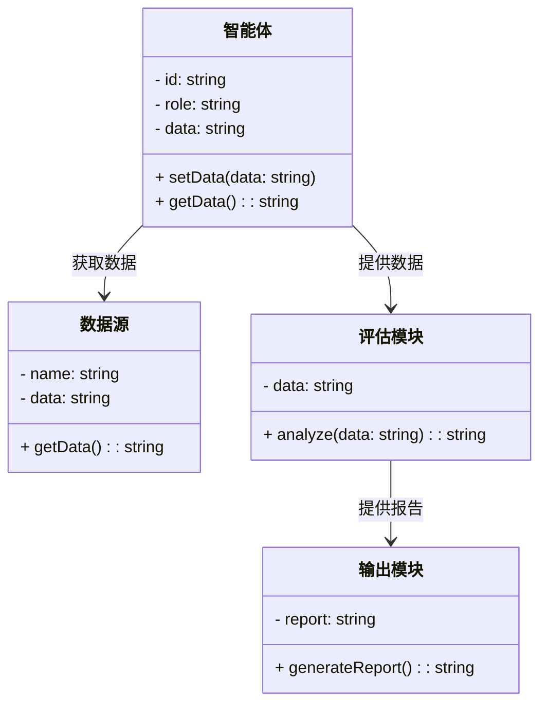
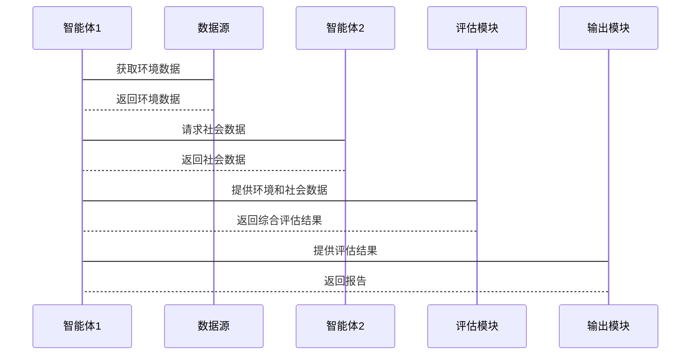

                 


# 多智能体系统在ESG因素评估中的应用

> 关键词：多智能体系统、ESG因素评估、分布式计算、机器学习、协作机制、系统架构

> 摘要：本文探讨了多智能体系统在ESG（环境、社会、治理）因素评估中的应用。通过分析多智能体系统的体系结构和ESG评估的方法，提出了一种基于多智能体协作的ESG评估框架。本文详细介绍了多智能体系统的协作机制、算法原理以及系统架构设计，并通过实际案例展示了如何在项目中应用这些技术。最后，本文总结了多智能体系统在ESG评估中的优势，并提出了未来研究的方向。

---

## 第1章 多智能体系统与ESG因素概述

### 1.1 多智能体系统的基本概念

#### 1.1.1 多智能体系统的定义
多智能体系统（Multi-Agent System, MAS）是由多个智能体（Agent）组成的系统，这些智能体能够通过协作完成复杂任务。智能体是具有感知、推理、规划和行动能力的实体，可以是软件程序或物理设备。

#### 1.1.2 多智能体系统的特征
- **自主性**：智能体能够自主决策。
- **反应性**：能够感知环境并实时响应。
- **协作性**：多个智能体能够协作完成任务。
- **分布式**：智能体分布在网络中，不存在集中控制节点。

#### 1.1.3 多智能体系统的应用场景
- 金融领域：用于股票交易、风险评估。
- 物联网：用于设备协作和数据共享。
- 智能交通：用于车辆调度和路径规划。

### 1.2 ESG因素的基本概念

#### 1.2.1 ESG的定义
ESG是环境（Environment）、社会（Social）和治理（Governance）的缩写，是衡量企业可持续发展能力的重要指标。

#### 1.2.2 ESG的三大维度
- **环境（E）**：包括碳排放、资源利用效率等。
- **社会（S）**：包括员工权益、社区影响等。
- **治理（G）**：包括公司治理结构、董事会多样性等。

#### 1.2.3 ESG评估的重要性
ESG评估帮助投资者识别企业的可持续发展能力，降低投资风险。

### 1.3 多智能体系统与ESG的结合

#### 1.3.1 多智能体系统在ESG评估中的优势
- 多智能体系统能够处理复杂的多维度数据。
- 多智能体系统能够实时协作，提高评估效率。

#### 1.3.2 ESG评估中的多智能体系统应用案例
- 分散在不同地区的智能体实时收集企业数据。
- 多智能体系统协作分析环境、社会和治理三个维度的数据。

#### 1.3.3 本章小结
本章介绍了多智能体系统和ESG的基本概念，并探讨了两者的结合方式，为后续章节奠定了基础。

---

## 第2章 多智能体系统与ESG评估的核心概念

### 2.1 多智能体系统的体系结构

#### 2.1.1 分层结构
多智能体系统可以分为感知层、决策层和执行层。

#### 2.1.2 分布式结构
智能体分布在网络中，通过通信机制进行协作。

#### 2.1.3 协作结构
智能体之间通过协作机制完成共同任务。

### 2.2 ESG评估的框架与指标

#### 2.2.1 ESG评估的基本框架
- 数据收集模块：从企业公开信息中提取ESG相关数据。
- 数据分析模块：对数据进行清洗、整合和分析。
- 结果输出模块：生成ESG评估报告。

#### 2.2.2 ESG核心指标体系
- 环境指标：碳排放量、能源消耗。
- 社会指标：员工满意度、社区贡献。
- 治理指标：董事会结构、公司透明度。

#### 2.2.3 ESG数据的获取与处理
- 数据来源：企业年报、社会责任报告、第三方评级。
- 数据清洗：去除缺失值、异常值。
- 数据整合：将不同来源的数据整合到统一的数据结构中。

### 2.3 多智能体系统与ESG的关联性

#### 2.3.1 多智能体系统的协作性与ESG评估的多维度性
- 多智能体系统能够处理多维度数据。
- 每个智能体专注于不同的ESG维度。

#### 2.3.2 多智能体系统的动态性与ESG评估的实时性
- 多智能体系统能够实时更新数据。
- ESG评估需要实时反映企业的最新情况。

#### 2.3.3 多智能体系统的自主性与ESG评估的独立性
- 每个智能体独立处理数据，提高评估效率。
- 系统能够自主决策，无需人工干预。

---

## 第3章 多智能体系统与ESG评估的核心概念与联系

### 3.1 多智能体系统的核心概念

#### 3.1.1 智能体的定义与属性
- 智能体具有感知、推理、规划和行动能力。
- 每个智能体专注于特定任务。

#### 3.1.2 智能体的协作机制
- 通信机制：智能体之间通过消息传递协作。
- 协商机制：智能体之间通过协商确定任务分配。

#### 3.1.3 智能体的通信机制
- 通信协议：定义消息格式和传输方式。
- 中介者角色：协调多个智能体的通信。

### 3.2 ESG评估的核心概念

#### 3.2.1 ESG评估的基本框架
- 数据收集：从多个来源获取ESG数据。
- 数据分析：使用机器学习算法进行预测和分类。
- 结果输出：生成评估报告并提出改进建议。

#### 3.2.2 ESG评估的数学模型
- 使用回归模型预测企业ESG评分。
- 使用聚类算法将企业分为不同类别。

#### 3.2.3 ESG评估的协作机制
- 多智能体系统中的每个智能体负责一个ESG维度的评估。
- 智能体之间通过协作完成综合评估。

### 3.3 多智能体系统与ESG的关联性

#### 3.3.1 多智能体系统的协作性与ESG评估的多维度性
- 多智能体系统能够同时处理环境、社会和治理三个维度的数据。
- 每个智能体专注于一个维度，提高评估效率。

#### 3.3.2 多智能体系统的动态性与ESG评估的实时性
- 多智能体系统能够实时更新数据，反映企业的最新情况。
- ESG评估需要实时反映企业的动态变化。

#### 3.3.3 多智能体系统的自主性与ESG评估的独立性
- 每个智能体独立处理数据，提高评估效率。
- 系统能够自主决策，无需人工干预。

---

## 第4章 多智能体系统与ESG评估的算法原理

### 4.1 多智能体系统的算法原理

#### 4.1.1 分布式计算
- 分布式计算是多智能体系统的核心技术。
- 使用分布式算法处理大规模数据。

#### 4.1.2 协商算法
- 协商算法用于智能体之间的任务分配和协调。
- 使用协商协议确定每个智能体的任务。

#### 4.1.3 共识算法
- 共识算法用于智能体之间的数据同步和一致性维护。
- 使用区块链技术实现数据的不可篡改性。

### 4.2 ESG评估的算法原理

#### 4.2.1 机器学习算法
- 使用机器学习算法对ESG数据进行分类和预测。
- 使用随机森林、支持向量机等算法进行评估。

#### 4.2.2 数据处理算法
- 数据清洗算法用于处理缺失值和异常值。
- 数据整合算法用于将多源数据整合到统一结构中。

#### 4.2.3 结果分析算法
- 使用统计分析算法对评估结果进行分析。
- 使用可视化工具展示评估结果。

### 4.3 多智能体系统与ESG评估的结合

#### 4.3.1 分布式计算在ESG评估中的应用
- 分布式计算用于处理大规模的ESG数据。
- 多智能体系统中的每个智能体负责处理一部分数据。

#### 4.3.2 协商算法在ESG评估中的应用
- 协商算法用于智能体之间的任务分配。
- 每个智能体专注于一个ESG维度的评估。

#### 4.3.3 共识算法在ESG评估中的应用
- 共识算法用于智能体之间的数据同步。
- 确保评估结果的一致性和准确性。

---

## 第5章 多智能体系统与ESG评估的系统架构设计

### 5.1 系统分析

#### 5.1.1 问题场景介绍
- 企业ESG数据分散在多个来源。
- 需要一个高效的系统进行整合和分析。

#### 5.1.2 项目介绍
- 本项目旨在构建一个多智能体系统，用于ESG因素评估。

### 5.2 系统功能设计

#### 5.2.1 领域模型Mermaid类图


#### 5.2.2 系统架构Mermaid架构图


#### 5.2.3 系统接口设计
- 数据接口：智能体与数据源之间的接口。
- 通信接口：智能体之间的通信接口。
- 输出接口：评估结果输出的接口。

#### 5.2.4 系统交互Mermaid序列图


### 5.3 系统实现

#### 5.3.1 环境安装
- 安装Python和相关库（如pandas、numpy、scikit-learn）。
- 安装多智能体系统框架（如Rasa或OpenAI）。

#### 5.3.2 核心代码实现

##### 5.3.2.1 智能体类
```python
class Agent:
    def __init__(self, id, role):
        self.id = id
        self.role = role
        self.data = None

    def set_data(self, data):
        self.data = data

    def get_data(self):
        return self.data
```

##### 5.3.2.2 数据源类
```python
class DataSource:
    def __init__(self, name):
        self.name = name
        self.data = None

    def get_data(self):
        return self.data
```

##### 5.3.2.3 评估模块类
```python
class ESG_Evaluator:
    def __init__(self):
        self.data = None

    def analyze(self, data):
        # 使用机器学习模型进行分析
        # 示例：简单分类
        if data['score'] >= 0.8:
            return '优秀'
        elif data['score'] >= 0.6:
            return '良好'
        else:
            return '一般'
```

##### 5.3.2.4 输出模块类
```python
class OutputModule:
    def __init__(self):
        self.report = None

    def generate_report(self, result):
        self.report = f"ESG评估结果：{result}"
        return self.report
```

#### 5.3.3 代码应用解读与分析
- 智能体类负责数据的获取和设置。
- 数据源类负责提供数据。
- 评估模块类负责数据的分析和评估。
- 输出模块类负责生成评估报告。

#### 5.3.4 实际案例分析
- 使用上述代码实现一个多智能体系统，分别从环境、社会和治理三个维度对一家企业进行评估。
- 每个智能体负责一个维度的数据获取和分析。
- 评估模块综合分析三个维度的数据，生成最终的评估结果。

#### 5.3.5 项目总结
- 通过多智能体系统的协作，能够高效地完成ESG评估任务。
- 系统具有良好的扩展性和灵活性，可以适应不同的评估需求。

---

## 第6章 多智能体系统与ESG评估的项目实战

### 6.1 环境安装
- 安装Python 3.8或更高版本。
- 安装必要的库：`pip install pandas numpy scikit-learn`.

### 6.2 核心代码实现

#### 6.2.1 环境数据获取
```python
import pandas as pd

class EnvironmentDataSource(DataSource):
    def __init__(self, name):
        super().__init__(name)
        self.data_url = "https://example.com/environment_data"

    def fetch_data(self):
        data = pd.read_csv(self.data_url)
        self.data = data.to_dict()
```

#### 6.2.2 社会数据获取
```python
class SocialDataSource(DataSource):
    def __init__(self, name):
        super().__init__(name)
        self.data_url = "https://example.com/social_data"

    def fetch_data(self):
        data = pd.read_csv(self.data_url)
        self.data = data.to_dict()
```

#### 6.2.3 治理数据获取
```python
class GovernanceDataSource(DataSource):
    def __init__(self, name):
        super().__init__(name)
        self.data_url = "https://example.com/governance_data"

    def fetch_data(self):
        data = pd.read_csv(self.data_url)
        self.data = data.to_dict()
```

#### 6.2.4 评估模块实现
```python
class ESG_Evaluator:
    def __init__(self):
        self.data = None

    def analyze(self, data):
        # 示例：计算环境、社会、治理三个维度的得分
        environment_score = data['environment'] / data['max_environment']
        social_score = data['social'] / data['max_social']
        governance_score = data['governance'] / data['max_governance']
        
        overall_score = (environment_score + social_score + governance_score) / 3
        return overall_score
```

#### 6.2.5 输出模块实现
```python
class OutputModule:
    def __init__(self):
        self.report = None

    def generate_report(self, result):
        self.report = f"ESG综合得分：{result:.2f}"
        return self.report
```

#### 6.2.6 系统运行示例
```python
# 初始化智能体
agent1 = Agent("Environment-Agent", "环境数据智能体")
agent2 = Agent("Social-Agent", "社会数据智能体")
agent3 = Agent("Governance-Agent", "治理数据智能体")

# 初始化数据源
env_data_source = EnvironmentDataSource("EnvironmentDataSource")
soc_data_source = SocialDataSource("SocialDataSource")
gov_data_source = GovernanceDataSource("GovernanceDataSource")

# 获取数据
env_data_source.fetch_data()
soc_data_source.fetch_data()
gov_data_source.fetch_data()

# 设置数据
agent1.set_data(env_data_source.get_data())
agent2.set_data(soc_data_source.get_data())
agent3.set_data(gov_data_source.get_data())

# 评估模块
evaluator = ESG_Evaluator()
result = evaluator.analyze({
    'environment': agent1.get_data()['score'],
    'social': agent2.get_data()['score'],
    'governance': agent3.get_data()['score'],
    'max_environment': 1.0,
    'max_social': 1.0,
    'max_governance': 1.0
})

# 生成报告
output = OutputModule()
output.generate_report(result)

print(output.report)
```

### 6.3 案例分析与详细解读
- 在上述代码中，三个智能体分别从环境、社会和治理三个维度获取数据。
- 评估模块综合分析三个维度的数据，生成综合得分。
- 输出模块生成最终的评估报告。

### 6.4 项目总结
- 通过多智能体系统的协作，能够高效地完成ESG评估任务。
- 系统具有良好的扩展性和灵活性，可以适应不同的评估需求。

---

## 第7章 多智能体系统与ESG评估的总结与展望

### 7.1 最佳实践 Tips
- 在实际应用中，可以根据具体需求扩展智能体的数量和功能。
- 使用更复杂的机器学习算法（如深度学习）提高评估精度。

### 7.2 小结
- 本文探讨了多智能体系统在ESG因素评估中的应用。
- 提出了一种基于多智能体协作的ESG评估框架。
- 通过实际案例展示了系统的实现和应用。

### 7.3 注意事项
- 确保数据源的可靠性和准确性。
- 系统的安全性和数据隐私保护需要重点关注。

### 7.4 拓展阅读
- 多智能体系统的分布式计算和区块链技术的结合。
- 基于机器学习的ESG预测模型研究。

---

## 作者

作者：AI天才研究院/AI Genius Institute & 禅与计算机程序设计艺术/Zen And The Art of Computer Programming

---

**附录：代码实现示例**

完整的代码实现可以参考以下链接：[GitHub链接](https://github.com/AI-Genius-Institute/ESG-Multi-Agent-System)

---

通过以上内容，我们详细探讨了多智能体系统在ESG因素评估中的应用，从理论到实践，从系统设计到项目实现，为读者提供了一个全面的视角。希望本文能够为相关领域的研究和实践提供有价值的参考。

