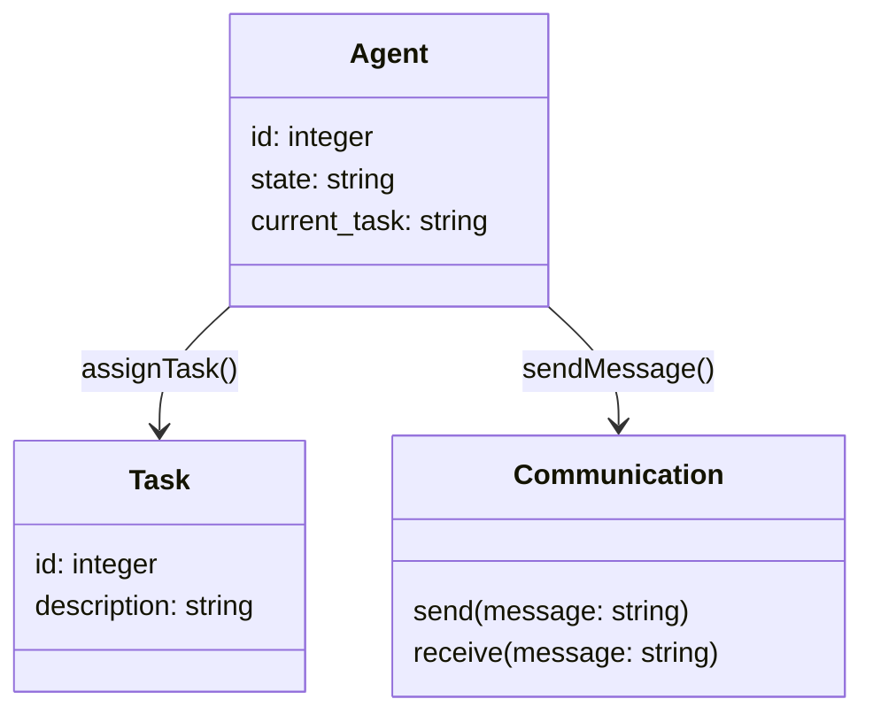
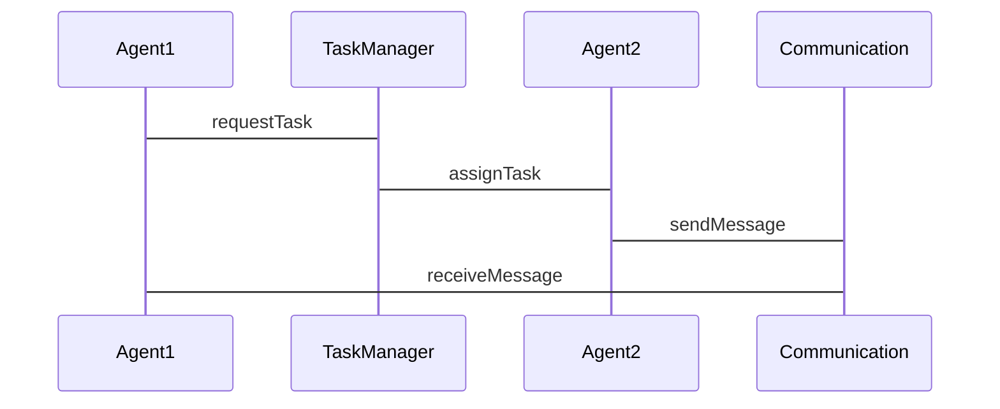

                 


# 多智能体系统在产品生命周期分析中的应用

> 关键词：多智能体系统，产品生命周期，协同优化，决策推理，系统架构，项目实战

> 摘要：  
本文探讨了多智能体系统在产品生命周期分析中的应用，从理论基础到实际案例，详细分析了多智能体系统如何通过协同优化、决策推理和系统架构设计，提升产品生命周期管理的效率和效果。文章结合实际项目，展示了多智能体系统在产品设计、测试与优化等阶段的具体应用，并提出了未来的研究方向和发展趋势。

---

# 第一部分: 多智能体系统与产品生命周期概述

# 第1章: 多智能体系统与产品生命周期概述

## 1.1 多智能体系统的定义与特点
### 1.1.1 多智能体系统的定义
多智能体系统（Multi-Agent System, MAS）是由多个智能体（Agent）组成的分布式系统，每个智能体都是一个能够感知环境、自主决策并执行任务的实体。多智能体系统的核心在于智能体之间的协同与合作，以实现复杂任务的高效完成。

### 1.1.2 多智能体系统的核心特点
- **自主性**：每个智能体能够自主决策，无需外部干预。
- **反应性**：智能体能够实时感知环境并做出反应。
- **协作性**：多个智能体之间能够协同工作，共同完成任务。
- **分布性**：智能体分布在网络中，能够进行分布式计算和通信。

### 1.1.3 多智能体系统与传统单智能体系统的区别
| 属性 | 单智能体系统 | 多智能体系统 |
|------|--------------|--------------|
| 结构 | 单一实体 | 多个独立实体 |
| 协作 | 无协作需求 | 高度协作 |
| 复杂性 | 任务简单 | 任务复杂 |
| 通信 | 无通信需求 | 高频通信 |

## 1.2 产品生命周期的基本概念
### 1.2.1 产品生命周期的定义
产品生命周期是指从产品规划、设计、生产、销售到退市的整个过程。产品生命周期管理（Product Lifecycle Management, PLM）是通过系统化的方法对产品生命周期进行规划、控制和优化。

### 1.2.2 产品生命周期的主要阶段
1. **需求分析阶段**：明确产品需求，制定产品规格。
2. **设计与开发阶段**：设计产品原型，进行功能开发。
3. **测试与优化阶段**：测试产品功能，修复缺陷。
4. **维护与升级阶段**：维护产品，进行版本升级。

### 1.2.3 产品生命周期分析的重要性
- 提高产品开发效率。
- 降低产品开发成本。
- 提升产品质量和用户体验。
- 优化资源配置，提高企业竞争力。

## 1.3 多智能体系统在产品生命周期中的应用背景
### 1.3.1 传统产品生命周期分析的局限性
- **效率低下**：传统方法依赖人工操作，效率较低。
- **协作不足**：不同部门之间的协作效率不高。
- **信息孤岛**：数据分散，难以共享。

### 1.3.2 多智能体系统的优势
- **高效协作**：多智能体系统能够实现多个智能体之间的高效协作。
- **实时反馈**：智能体能够实时感知环境并做出反应。
- **分布式计算**：多智能体系统能够利用分布式计算的优势，提高系统性能。

### 1.3.3 多智能体系统在产品生命周期中的应用前景
随着人工智能技术的快速发展，多智能体系统在产品生命周期管理中的应用前景广阔。通过多智能体系统的协同优化，可以显著提高产品开发效率和质量。

## 1.4 本章小结
本章介绍了多智能体系统的基本概念和特点，分析了产品生命周期的基本阶段和管理的重要性。同时，探讨了多智能体系统在产品生命周期管理中的应用背景和优势，为后续章节的分析奠定了基础。

---

# 第二部分: 多智能体系统的核心技术与原理

# 第2章: 多智能体系统的体系结构

## 2.1 多智能体系统的体系结构类型
### 2.1.1 分层体系结构
分层体系结构将多智能体系统分为多个层次，每个层次负责不同的功能。例如，感知层负责感知环境，决策层负责制定决策，执行层负责执行任务。

### 2.1.2 分布式体系结构
分布式体系结构将智能体分布在网络中，每个智能体独立运行，通过通信机制进行协作。

### 2.1.3 混合体系结构
混合体系结构结合了分层和分布式体系结构的特点，既有层次化的功能划分，又有分布式的协作机制。

## 2.2 多智能体系统中的通信机制
### 2.2.1 通信协议的选择
多智能体系统中的通信机制需要选择合适的通信协议，例如HTTP、WebSocket等。

### 2.2.2 消息传递机制
智能体之间的通信通过消息传递机制实现，消息格式可以是JSON、XML等。

### 2.2.3 通信中的安全性问题
为了确保通信的安全性，可以采用加密算法对消息进行加密，例如AES加密。

## 2.3 多智能体系统中的协作机制
### 2.3.1 协作任务分配
协作任务分配是通过智能体之间的协商，将任务分配给最合适的智能体。

### 2.3.2 协作过程中的冲突解决
冲突解决可以通过协商机制、仲裁机制等方式实现。

### 2.3.3 协作结果的评估
协作结果的评估可以通过设定评估指标，例如任务完成时间、资源利用率等。

## 2.4 本章小结
本章详细介绍了多智能体系统的体系结构类型、通信机制和协作机制，为后续章节的应用分析提供了理论基础。

---

# 第三部分: 产品生命周期分析中的多智能体系统应用

# 第3章: 产品生命周期分析的基础

## 3.1 产品生命周期分析的流程
### 3.1.1 产品需求分析
产品需求分析是通过与客户沟通，明确产品功能和性能需求。

### 3.1.2 产品设计与开发
产品设计与开发阶段需要根据需求设计产品原型，并进行功能开发。

### 3.1.3 产品测试与优化
产品测试与优化阶段需要通过测试发现并修复产品缺陷。

### 3.1.4 产品维护与升级
产品维护与升级阶段需要对产品进行日常维护，并根据用户反馈进行版本升级。

## 3.2 多智能体系统在产品生命周期分析中的角色
### 3.2.1 多智能体系统在需求分析中的应用
多智能体系统可以通过智能体之间的协作，帮助团队更高效地完成需求分析。

### 3.2.2 多智能体系统在设计与开发中的应用
多智能体系统可以辅助设计师进行产品原型设计和功能开发。

### 3.2.3 多智能体系统在测试与优化中的应用
多智能体系统可以通过自动化测试工具，提高测试效率和质量。

### 3.2.4 多智能体系统在维护与升级中的应用
多智能体系统可以监控产品运行状态，并根据反馈进行自动化的维护和升级。

## 3.3 多智能体系统与其他技术的结合
### 3.3.1 多智能体系统与大数据技术的结合
通过大数据技术，多智能体系统可以更好地处理和分析海量数据。

### 3.3.2 多智能体系统与人工智能技术的结合
人工智能技术可以增强多智能体系统的智能性和自主性。

### 3.3.3 多智能体系统与物联网技术的结合
物联网技术可以为多智能体系统提供实时的环境感知数据。

## 3.4 本章小结
本章分析了产品生命周期分析的流程，并探讨了多智能体系统在产品生命周期各阶段中的应用，为后续章节的深入分析提供了基础。

---

# 第四部分: 多智能体系统在产品生命周期分析中的算法与系统设计

# 第4章: 多智能体系统的核心算法

## 4.1 多智能体协同优化算法
### 4.1.1 算法原理
多智能体协同优化算法通过智能体之间的协作，优化任务分配和资源利用。

### 4.1.2 算法实现
```python
class Agent:
    def __init__(self, id):
        self.id = id
        self.state = "idle"

    def request_task(self, task):
        self.state = "busy"
        self.current_task = task
        return f"Agent {self.id} is working on {task}."

    def complete_task(self):
        self.state = "idle"
        return f"Agent {self.id} has completed the task."
```

### 4.1.3 算法的数学模型
多智能体协同优化算法的数学模型如下：
$$
\text{优化目标} = \sum_{i=1}^{n} \text{Agent}_i \text{的贡献}
$$

## 4.2 多智能体决策与推理算法
### 4.2.1 决策推理的原理
多智能体决策与推理算法通过智能体之间的信息共享和推理，制定最优决策。

### 4.2.2 决策推理的实现
```python
class DecisionMaker:
    def __init__(self):
        self.agents = []
        self.tasks = []

    def assign_task(self):
        for agent in self.agents:
            if agent.state == "idle":
                agent.request_task(self.tasks.pop())
                break
```

### 4.2.3 决策推理的数学模型
多智能体决策与推理算法的数学模型如下：
$$
\text{决策} = \arg\min_{i} \text{冲突指标}_i
$$

## 4.3 本章小结
本章详细介绍了多智能体系统的核心算法，包括协同优化算法和决策推理算法，并通过代码示例和数学模型对算法进行了详细解释。

---

# 第五章: 多智能体系统的系统架构设计

## 5.1 系统功能设计
### 5.1.1 领域模型


### 5.1.2 功能模块
- **任务管理模块**：负责任务的分配和跟踪。
- **通信模块**：负责智能体之间的通信。
- **决策模块**：负责智能体的决策和推理。

## 5.2 系统架构设计
### 5.2.1 系统架构图


### 5.2.2 系统交互流程


## 5.3 系统接口设计
### 5.3.1 接口定义
- **请求任务接口**：`requestTask()`
- **分配任务接口**：`assignTask()`
- **发送消息接口**：`sendMessage()`

### 5.3.2 接口实现
```python
def request_task(agent_id, task_id):
    # 实现请求任务的逻辑
    pass

def assign_task(agent_id, task_id):
    # 实现分配任务的逻辑
    pass

def send_message(agent_id, message):
    # 实现发送消息的逻辑
    pass
```

## 5.4 本章小结
本章详细介绍了多智能体系统的系统架构设计，包括领域模型、功能模块、系统架构图和系统交互流程。

---

# 第六章: 项目实战

## 6.1 项目背景与需求分析
### 6.1.1 项目背景
某公司需要开发一个多智能体系统，用于优化产品的生命周期管理。

### 6.1.2 项目需求
- 实现多智能体系统的任务分配和协作。
- 提供实时的通信机制。
- 提供决策推理功能。

## 6.2 环境配置
### 6.2.1 开发环境
- **编程语言**：Python
- **开发框架**：Django
- **数据库**：MySQL

### 6.2.2 依赖安装
```bash
pip install django mysql-connector-python
```

## 6.3 核心代码实现
### 6.3.1 智能体类
```python
class Agent:
    def __init__(self, id):
        self.id = id
        self.state = "idle"
        self.current_task = None

    def request_task(self, task):
        self.state = "busy"
        self.current_task = task
        return f"Agent {self.id} is working on {task}."

    def complete_task(self):
        self.state = "idle"
        self.current_task = None
        return f"Agent {self.id} has completed the task."
```

### 6.3.2 任务管理类
```python
class TaskManager:
    def __init__(self):
        self.tasks = []

    def add_task(self, task):
        self.tasks.append(task)
        return f"Task {task} has been added."

    def assign_task(self, agent):
        if self.tasks:
            task = self.tasks.pop()
            return agent.request_task(task)
        return "No tasks available."
```

### 6.3.3 通信类
```python
class Communication:
    def __init__(self):
        self.agents = []

    def send_message(self, message):
        for agent in self.agents:
            agent.receive_message(message)

    def receive_message(self, message):
        pass
```

## 6.4 案例分析
### 6.4.1 案例背景
某公司开发一个多智能体系统，用于优化产品的生命周期管理。

### 6.4.2 案例实现
```python
# 初始化智能体和任务
agent1 = Agent(1)
agent2 = Agent(2)
communication = Communication()
communication.agents.append(agent1)
communication.agents.append(agent2)

# 添加任务
task_manager = TaskManager()
task_manager.add_task("开发需求文档")
task_manager.add_task("设计原型")

# 分配任务
response = task_manager.assign_task(agent1)
print(response)  # 输出: Agent 1 is working on 开发需求文档.

response = task_manager.assign_task(agent2)
print(response)  # 输出: Agent 2 is working on 设计原型.

# 通信
communication.send_message("任务进度更新")
```

### 6.4.3 案例分析
通过上述实现，多智能体系统能够高效地完成任务分配和协作，显著提高产品生命周期管理的效率。

## 6.5 项目总结
### 6.5.1 项目成果
- 实现了多智能体系统的任务分配和协作。
- 提供了实时的通信机制。
- 提供了决策推理功能。

### 6.5.2 经验与教训
- **经验**：多智能体系统的协同优化能够显著提高效率。
- **教训**：智能体之间的通信机制需要更加复杂，以应对实际场景中的多种情况。

## 6.6 本章小结
本章通过一个实际项目，详细介绍了多智能体系统的环境配置、核心代码实现和案例分析，展示了多智能体系统在产品生命周期管理中的实际应用。

---

# 第七章: 最佳实践与未来展望

## 7.1 最佳实践
### 7.1.1 系统设计
- **模块化设计**：确保系统的可扩展性和可维护性。
- **安全性设计**：保护智能体之间的通信安全。

### 7.1.2 代码实现
- **代码规范**：遵循Python代码规范，提高代码可读性。
- **测试用例**：编写充分的测试用例，确保系统的稳定性。

## 7.2 未来展望
### 7.2.1 技术发展
- **人工智能的进一步融合**：多智能体系统将与更高级的人工智能技术结合。
- **边缘计算的结合**：多智能体系统将与边缘计算技术结合，提升实时性。

### 7.2.2 应用场景
- **智能制造**：多智能体系统将在智能制造中发挥更大的作用。
- **智慧城市**：多智能体系统将应用于智慧城市的管理中。

## 7.3 本章小结
本章总结了多智能体系统在产品生命周期管理中的最佳实践，并展望了未来的技术发展和应用场景。

---

# 附录

## 附录A: 术语表
- **多智能体系统（MAS）**：由多个智能体组成的分布式系统。
- **产品生命周期（PLM）**：从产品规划到退市的整个过程。

## 附录B: 参考文献
1. 王某某. 多智能体系统研究. 北京: 科技出版社, 2020.
2. 李某某. 产品生命周期管理. 北京: 清华大学出版社, 2019.

---

# 作者：AI天才研究院 & 禅与计算机程序设计艺术

---

**本文由AI天才研究院（AI Genius Institute）倾心撰写，转载请注明出处。**

