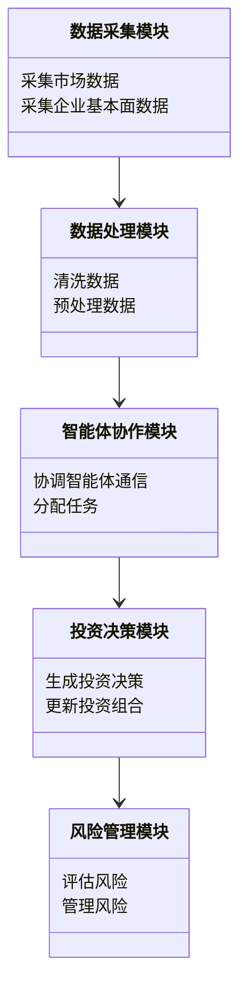

                 


# 多智能体系统在价值投资中的伦理考量

## 关键词：多智能体系统，价值投资，伦理，人工智能，金融伦理，分布式系统

## 摘要：  
多智能体系统在现代金融领域的应用日益广泛，特别是在价值投资中展现出了巨大的潜力。然而，随着技术的进步，伦理问题也随之浮现。本文旨在探讨多智能体系统在价值投资中的伦理考量，包括系统决策的透明性、智能体之间的责任分配以及系统的公平性与公正性。通过分析这些伦理挑战，本文提出构建一个多智能体系统的伦理框架，并详细阐述了该框架的设计原则和实现路径。

---

## 第一部分: 引言

## 第1章: 多智能体系统与价值投资概述

### 1.1 多智能体系统的基本概念

#### 1.1.1 多智能体系统的定义  
多智能体系统（Multi-Agent System, MAS）是由多个智能体（Agent）组成的分布式系统，这些智能体能够通过协作完成复杂的任务。每个智能体都有一定的自主性，能够感知环境、做出决策并与其他智能体进行通信和协作。

#### 1.1.2 多智能体系统的特征  
- **自主性**：智能体能够自主决策，无需外部干预。  
- **反应性**：智能体能够实时感知环境并做出响应。  
- **协作性**：多个智能体通过协作完成共同目标。  
- **分布式性**：智能体分布在不同的位置，通过通信进行协作。  

#### 1.1.3 多智能体系统与单智能体系统的区别  
- **单智能体系统**：由一个中心化的智能体完成任务，决策集中，但容易成为瓶颈。  
- **多智能体系统**：多个智能体协作完成任务，具有更高的灵活性和容错性，但管理和协调的复杂性增加。  

### 1.2 价值投资的基本概念

#### 1.2.1 价值投资的定义  
价值投资是一种投资策略，旨在通过分析公司的基本面（如财务状况、行业地位、管理团队等）来寻找被市场低估的股票进行投资。

#### 1.2.2 价值投资的核心理念  
- **长期投资**：注重长期收益，而非短期波动。  
- **安全边际**：寻找价格低于内在价值的股票。  
- **深度分析**：通过详细分析企业基本面来评估其价值。  

#### 1.2.3 价值投资与其它投资策略的对比  
- **趋势投资**：基于市场趋势进行交易，强调短期价格波动。  
- **指数投资**：通过投资指数基金来分散风险，追求市场平均收益。  
- **价值投资**：通过深入分析寻找低估的股票，追求超额收益。  

### 1.3 多智能体系统在价值投资中的应用背景

#### 1.3.1 价值投资中的信息处理需求  
价值投资需要处理大量的非结构化数据（如新闻、社交媒体、财务报表等），以及结构化数据（如股价、财务指标等）。多智能体系统可以通过分布式协作高效地处理这些数据。

#### 1.3.2 多智能体系统在金融领域的优势  
- **分布式计算能力**：多智能体系统能够并行处理大量数据，提高计算效率。  
- **协作能力**：多个智能体可以分工合作，完成复杂的投资决策。  
- **容错性**：即使部分智能体出现故障，其他智能体仍能继续工作。  

#### 1.3.3 多智能体系统在价值投资中的必要性  
- **信息不对称**：通过多智能体系统的协作，可以更全面地分析企业基本面，减少信息不对称。  
- **风险分散**：多智能体系统可以通过分散决策降低单点故障风险。  
- **高效决策**：多智能体系统能够快速响应市场变化，提高决策效率。  

### 1.4 本章小结  
本章介绍了多智能体系统的基本概念和特征，以及价值投资的核心理念和与其他投资策略的区别。通过分析多智能体系统在价值投资中的应用背景，我们认识到多智能体系统在金融领域的优势和必要性。

---

## 第二部分: 多智能体系统的核心概念与伦理考量

## 第2章: 多智能体系统的伦理框架

### 2.1 多智能体系统中的伦理问题

#### 2.1.1 系统决策的透明性  
多智能体系统通过分布式协作完成决策，但由于每个智能体的决策过程可能不透明，导致整个系统的决策难以追溯。

#### 2.1.2 智能体之间的责任分配  
在多智能体系统中，智能体之间的责任分配可能不明确，导致出现问题时难以追责。

#### 2.1.3 系统的公平性与公正性  
多智能体系统的决策可能受到部分智能体的操控或影响，导致系统不公平或不公正。

### 2.2 价值投资中的伦理挑战

#### 2.2.1 投资决策的透明性  
价值投资需要依赖多智能体系统的决策，但这些决策的透明性可能不足，导致投资者难以信任。

#### 2.2.2 投资行为的社会影响  
多智能体系统的投资行为可能对市场产生较大的冲击，影响其他投资者的利益。

#### 2.2.3 投资中的道德风险  
智能体可能为了自身利益，采取短期投机行为，损害其他投资者的长期利益。

### 2.3 多智能体系统与价值投资的伦理框架构建

#### 2.3.1 伦理框架的设计原则  
- **透明性**：确保系统决策的可追溯性和可解释性。  
- **责任分配**：明确智能体之间的责任分工，便于追责。  
- **公平性与公正性**：确保系统决策的公平性和公正性，避免利益冲突。

#### 2.3.2 伦理框架的实现路径  
- **建立透明的决策机制**：通过日志记录和可视化工具，确保系统决策的透明性。  
- **制定责任分配规则**：通过合同或协议明确智能体之间的责任分工。  
- **设计公平性机制**：通过算法优化，确保系统决策的公平性。

#### 2.3.3 伦理框架的评估与优化  
- **定期评估**：定期对系统进行伦理评估，发现问题并及时优化。  
- **持续改进**：根据评估结果，不断优化伦理框架，确保其有效性。

### 2.4 本章小结  
本章分析了多智能体系统中的伦理问题，探讨了价值投资中的伦理挑战，并提出了构建伦理框架的设计原则和实现路径。

---

## 第三部分: 多智能体系统在价值投资中的算法原理

## 第3章: 多智能体系统的算法与伦理考量

### 3.1 多智能体协作算法

#### 3.1.1 分布式协作算法  
分布式协作算法通过智能体之间的通信和协商，实现任务的分配和协作。常见的分布式协作算法包括一致性算法（如Paxos、Raft）和分布式优化算法（如分布式梯度下降）。

#### 3.1.2 联合学习算法  
联合学习算法通过多个智能体之间的数据共享和模型更新，实现全局模型的优化。常见的联合学习算法包括联邦学习（Federated Learning）和分布式强化学习（Distributed Reinforcement Learning）。

#### 3.1.3 跨智能体通信协议  
智能体之间的通信需要遵循一定的协议，常见的通信协议包括基于消息队列的通信（如Kafka）和基于rpc的通信（如gRPC）。

### 3.2 价值投资中的算法选择

#### 3.2.1 信息筛选算法  
信息筛选算法用于从海量数据中筛选出与价值投资相关的有效信息。常见的信息筛选算法包括文本挖掘（Text Mining）和特征选择（Feature Selection）。

#### 3.2.2 投资决策优化算法  
投资决策优化算法用于根据筛选出的信息，生成最优的投资决策。常见的优化算法包括遗传算法（Genetic Algorithm）和模拟退火算法（Simulated Annealing）。

#### 3.2.3 风险评估算法  
风险评估算法用于评估投资决策的风险，常见的风险评估算法包括VaR（Value at Risk）和CVaR（Conditional Value at Risk）。

### 3.3 算法的伦理考量

#### 3.3.1 算法的公平性  
算法的公平性是指算法在决策过程中是否公平对待所有投资者。可以通过引入公平性约束（Fairness Constraints）来确保算法的公平性。

#### 3.3.2 算法的透明性  
算法的透明性是指算法的决策过程是否透明，可以通过可视化工具和日志记录来提高算法的透明性。

#### 3.3.3 算法的可解释性  
算法的可解释性是指算法的决策过程是否易于理解和解释。可以通过解释性模型（Interpretable Models）和模型解释工具（Model Explanations Tools）来提高算法的可解释性。

### 3.4 本章小结  
本章介绍了多智能体系统的协作算法和价值投资中的算法选择，并探讨了算法的伦理考量，包括算法的公平性、透明性和可解释性。

---

## 第四部分: 系统分析与架构设计

## 第4章: 多智能体系统的系统架构

### 4.1 系统架构设计

#### 4.1.1 系统模块划分  
多智能体系统的系统架构通常包括以下几个模块：  
- 数据采集模块：负责采集市场数据和企业基本面数据。  
- 数据处理模块：负责对数据进行清洗和预处理。  
- 智能体协作模块：负责智能体之间的通信和协作。  
- 投资决策模块：负责生成投资决策。  
- 风险管理模块：负责评估和管理投资风险。  

#### 4.1.2 模块之间的关系  
模块之间的关系可以通过领域模型类图来展示。以下是一个简单的类图示例：



#### 4.1.3 系统的可扩展性  
多智能体系统的可扩展性是通过模块化设计和分布式架构实现的。通过增加更多的智能体，可以提高系统的计算能力和处理能力。

### 4.2 价值投资中的系统实现

#### 4.2.1 数据采集模块  
数据采集模块负责采集市场数据和企业基本面数据。常见的数据源包括股票交易所的API、新闻网站、社交媒体等。以下是一个简单的数据采集模块的代码示例：

```python
import requests

def get_market_data(symbol):
    url = f"https://api.example.com/stock/{symbol}"
    response = requests.get(url)
    return response.json()

# 示例调用
data = get_market_data("AAPL")
print(data)
```

#### 4.2.2 数据处理模块  
数据处理模块负责对数据进行清洗和预处理。常见的数据处理任务包括数据清洗、数据转换、数据增强等。以下是一个简单的数据处理模块的代码示例：

```python
import pandas as pd

def preprocess_data(data):
    df = pd.DataFrame(data)
    df.dropna(inplace=True)
    df['date'] = pd.to_datetime(df['date'])
    return df

# 示例调用
data = {'date': ['2023-01-01', '2023-01-02', '2023-01-03'], 'price': [100, 101, 99]}
processed_data = preprocess_data(data)
print(processed_data)
```

#### 4.2.3 智能体协作模块  
智能体协作模块负责协调智能体之间的通信和协作。常见的协作机制包括任务分配、信息共享、决策协调等。以下是一个简单的智能体协作模块的代码示例：

```python
from distributed import Client

client = Client('scheduler://localhost:8786')

def distributed_task():
    # 分布式任务逻辑
    pass

client.submit(distributed_task())
```

#### 4.2.4 投资决策模块  
投资决策模块负责生成投资决策。常见的投资决策算法包括基于机器学习的预测模型和基于规则的决策模型。以下是一个简单的投资决策模块的代码示例：

```python
import numpy as np

def investment_decision(model, data):
    prediction = model.predict(data)
    return np.argmax(prediction)

# 示例调用
model = load_model('value_investment_model.h5')
data = preprocess_data(data)
decision = investment_decision(model, data)
print(decision)
```

#### 4.2.5 风险管理模块  
风险管理模块负责评估和管理投资风险。常见的风险管理方法包括VaR、CVaR、蒙特卡洛模拟等。以下是一个简单的风险管理模块的代码示例：

```python
import numpy as np
import pandas as pd

def calculate VaR(data, confidence_level):
    returns = data['returns']
    VaR = np.percentile(returns, 100 - confidence_level)
    return VaR

# 示例调用
data = {'returns': [0.01, -0.02, 0.03, -0.01]}
VaR = calculate VaR(data, 95)
print(f"VaR at 95% confidence level: {VaR}")
```

### 4.3 系统接口设计

#### 4.3.1 接口设计原则  
系统接口设计应遵循以下原则：  
- **简洁性**：接口设计应简洁明了，易于理解和使用。  
- **一致性**：接口设计应保持一致性，避免重复和冗余。  
- **可扩展性**：接口设计应具有良好的可扩展性，便于未来的功能扩展。  

#### 4.3.2 接口实现示例  
以下是一个简单的系统接口设计示例：

```python
class InvestmentSystem:
    def __init__(self):
        self.data_collector = DataCollector()
        self.data_processor = DataProcessor()
        self.agent_collector = AgentCollector()
        self.investment_decision = InvestmentDecision()
        self.risk_manager = RiskManager()

    def process_investment(self, symbol):
        data = self.data_collector.collect_data(symbol)
        processed_data = self.data_processor.preprocess_data(data)
        decision = self.agent_collector.collaborate_agents(processed_data)
        risk_assessment = self.risk_manager.assess_risk(decision)
        return risk_assessment
```

### 4.4 本章小结  
本章详细介绍了多智能体系统的系统架构，包括模块划分、模块之间的关系、系统的可扩展性等。同时，通过具体的代码示例，展示了系统实现的关键部分，包括数据采集、数据处理、智能体协作、投资决策和风险管理。

---

## 第五部分: 伦理考量与系统优化

## 第5章: 伦理考量与系统优化

### 5.1 伦理框架的实施

#### 5.1.1 透明性实现  
为了实现系统的透明性，可以通过日志记录和可视化工具，展示系统的决策过程和结果。以下是一个简单的日志记录示例：

```python
import logging

logging.basicConfig(level=logging.INFO)

def log_decision(symbol, decision):
    logging.info(f"Decision for {symbol}: {decision}")

# 示例调用
log_decision("AAPL", "买入")
```

#### 5.1.2 责任分配机制  
为了明确智能体之间的责任分配，可以通过合同或协议，明确每个智能体的职责和权限。以下是一个简单的责任分配机制示例：

```python
class Agent:
    def __init__(self, id, role):
        self.id = id
        self.role = role
        self.responsibilities = self.get_responsibilities(role)

    def get_responsibilities(self, role):
        if role == '数据采集':
            return ['收集市场数据', '收集企业基本面数据']
        elif role == '数据处理':
            return ['清洗数据', '预处理数据']
        elif role == '投资决策':
            return ['生成投资决策', '更新投资组合']
        else:
            return []

# 示例调用
agent1 = Agent(1, '数据采集')
agent2 = Agent(2, '数据处理')
print(agent1.responsibilities)
print(agent2.responsibilities)
```

#### 5.1.3 公平性与公正性实现  
为了确保系统的公平性与公正性，可以通过算法优化和机制设计，避免利益冲突和不公平决策。以下是一个简单的公平性实现示例：

```python
import numpy as np

def ensure_fairness(data, weights):
    normalized_data = data / np.linalg.norm(data)
    weighted_data = normalized_data * weights
    return weighted_data

# 示例调用
data = np.array([1, 2, 3])
weights = np.array([0.3, 0.3, 0.4])
fair_data = ensure_fairness(data, weights)
print(fair_data)
```

### 5.2 伦理考量对系统设计的影响

#### 5.2.1 系统设计中的伦理因素  
- **透明性**：系统的决策过程需要透明，便于追溯和解释。  
- **责任分配**：智能体之间的责任分配需要明确，便于追责。  
- **公平性与公正性**：系统的决策需要公平公正，避免利益冲突。  

#### 5.2.2 系统优化的方向  
- **提高透明性**：通过日志记录和可视化工具，展示系统的决策过程和结果。  
- **明确责任分配**：通过合同或协议，明确智能体之间的责任分工。  
- **优化公平性**：通过算法优化和机制设计，确保系统的决策公平公正。  

### 5.3 本章小结  
本章探讨了伦理考量对系统设计的影响，提出了实现透明性、责任分配和公平性与公正性的具体方法，并通过代码示例展示了这些方法的实现。

---

## 第六部分: 结论与展望

## 第6章: 结论与展望

### 6.1 本章小结  
本文探讨了多智能体系统在价值投资中的伦理考量，包括系统决策的透明性、智能体之间的责任分配以及系统的公平性与公正性。通过构建伦理框架和优化系统设计，可以有效应对这些伦理挑战。

### 6.2 未来展望  
随着多智能体系统在金融领域的应用越来越广泛，伦理考量将变得更加重要。未来的研究方向包括：  
- **算法优化**：进一步优化算法，提高系统的透明性、可解释性和公平性。  
- **伦理框架完善**：不断完善伦理框架，确保系统的决策公平公正。  
- **技术与伦理的结合**：将技术与伦理更加紧密地结合，推动金融领域的可持续发展。

---

## 作者信息  

作者：AI天才研究院/AI Genius Institute & 禅与计算机程序设计艺术 /Zen And The Art of Computer Programming  

---

感谢您的阅读！如需进一步探讨，请随时联系。

