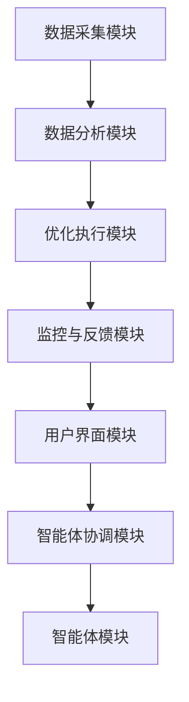
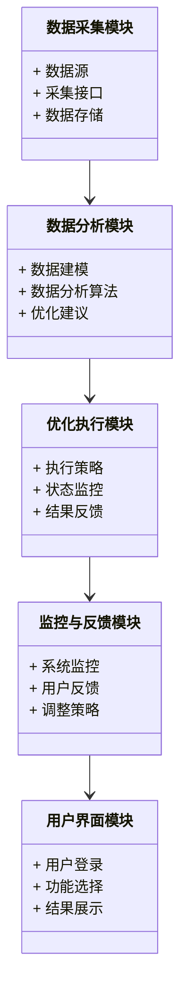

                 


# 多智能体系统在企业价值链分析中的应用

> **关键词**：多智能体系统、企业价值链、分布式计算、博弈论、数学建模、系统架构设计、优化算法

> **摘要**：本文深入探讨了多智能体系统在企业价值链分析中的应用，从基本概念、算法原理到系统设计和实际案例，详细阐述了多智能体系统如何助力企业优化价值链分析。文章结合理论与实践，为企业提供了一套系统化的解决方案，展示了多智能体系统在提升企业竞争力中的巨大潜力。

---

## 第一部分: 多智能体系统与企业价值链分析基础

### 第1章: 多智能体系统与企业价值链分析概述

#### 1.1 多智能体系统的定义与特点

- **多智能体系统的定义**：多智能体系统（Multi-Agent System, MAS）是由多个智能体组成的分布式系统，每个智能体都能自主决策并与其他智能体协作完成复杂任务。
- **多智能体系统的核心特点**：
  - 分布式计算：多个智能体协同工作，避免单点依赖。
  - 自主性：每个智能体都有独立的决策能力。
  - 社会性：智能体之间通过通信和协作完成目标。
  - 动态性：系统状态和环境动态变化，智能体需实时调整策略。

- **多智能体系统与传统单智能体系统的区别**：
  - 单智能体系统依赖中心化控制，而多智能体系统去中心化，每个智能体独立决策。
  - 多智能体系统适用于复杂环境，单智能体系统适用于简单任务。

#### 1.2 企业价值链分析的定义与方法

- **企业价值链的概念**：企业价值链是指从原材料采购、生产、销售到售后服务的整个流程中，各环节的价值创造过程。
- **企业价值链分析的主要方法**：
  - **成本法**：分析各环节的成本构成，找出成本浪费点。
  - **收益法**：评估各环节对整体收益的贡献，识别高收益环节。
  - **流程法**：通过流程优化，提高各环节的效率和协同性。

- **企业价值链分析的意义与价值**：
  - 优化资源配置，降低运营成本。
  - 提高各环节的协同效率，增强企业竞争力。
  - 通过数据分析，发现潜在问题，制定优化策略。

#### 1.3 多智能体系统在企业价值链分析中的应用背景

- **企业价值链分析的复杂性**：企业价值链涉及多个部门和环节，各环节之间存在复杂的依赖关系，传统方法难以全面优化。
- **多智能体系统的优势**：
  - 分布式计算能力：多智能体系统能够同时处理多个环节的数据，提高分析效率。
  - 自主决策能力：智能体能够根据实时数据自主调整策略，适应动态变化的环境。
  - 协作能力：智能体之间可以通过通信和协作，实现各环节的协同优化。

- **多智能体系统与企业价值链分析的结合**：
  - 每个智能体代表企业价值链中的一个环节，负责数据采集、分析和优化。
  - 智能体之间通过通信机制共享信息，实现整体优化。

---

## 第二部分: 多智能体系统的核心概念与原理

### 第2章: 多智能体系统的核心概念与原理

#### 2.1 多智能体系统的组成与结构

- **多智能体系统的组成要素**：
  - 智能体：负责执行具体任务的实体。
  - 通信机制：智能体之间进行信息交换的通道。
  - 协调机制：确保智能体之间协作的规则和协议。
  - 环境：智能体所处的外部环境，可能包括其他智能体和任务目标。

- **多智能体系统的层次结构**：
  - **物理层**：智能体的物理载体，如计算机、传感器等。
  - **逻辑层**：智能体的逻辑结构，包括决策模型和算法。
  - **通信层**：智能体之间的通信协议和数据交换格式。
  - **应用层**：智能体的具体应用，如企业价值链分析。

- **多智能体系统的通信机制**：
  - **直接通信**：智能体之间通过共享内存或数据库进行信息交换。
  - **间接通信**：智能体通过中间媒介（如消息队列）进行信息交换。
  - **发布-订阅模式**：智能体发布事件，其他智能体订阅并处理。

#### 2.2 多智能体系统的协调与协作

- **分布式计算与协调机制**：
  - 分布式计算：多个智能体协同完成任务，避免单点故障。
  - 协调机制：通过制定规则和协议，确保智能体之间的协作。

- **博弈论与决策优化**：
  - **纳什均衡**：所有智能体都采取最优策略，使得任何一方单方面改变策略都会导致自身利益受损。
  - **博弈树**：用于分析多个智能体之间的策略选择和可能结果。

- **多智能体系统的动态平衡**：
  - 系统在动态环境中保持稳定，各智能体的决策相互影响，但整体目标一致。

#### 2.3 多智能体系统的算法原理

- **分布式算法概述**：
  - 分布式算法：在分布式系统中，多个节点协作完成任务的算法。
  - 常见的分布式算法包括分布式一致性算法（如Paxos、Raft）和分布式搜索算法（如Dijkstra）。

- **多智能体系统中的博弈论模型**：
  - **竞争模型**：多个智能体竞争资源，寻找最优策略。
  - **合作模型**：智能体之间合作完成任务，共同优化目标。

- **多智能体系统的数学模型**：
  - **优化目标**：最大化整体收益或最小化整体成本。
  - **约束条件**：各环节的资源限制和时间约束。

---

## 第三部分: 企业价值链分析的数学模型与方法

### 第3章: 企业价值链分析的数学模型与方法

#### 3.1 企业价值链分析的数学模型

- **企业价值链的分解与建模**：
  - 将企业价值链分解为多个环节，每个环节建立数学模型。
  - 例如，采购环节的成本模型、生产环节的效率模型等。

- **企业价值链的优化模型**：
  - 建立优化目标函数，如最大化利润或最小化成本。
  - 考虑约束条件，如资源限制、时间限制等。

- **企业价值链的评价指标**：
  - 成本指标：单位成本、总成本等。
  - 效率指标：生产效率、周转率等。
  - 利润指标：利润率、投资回报率等。

#### 3.2 多智能体系统在企业价值链分析中的数学表达

- **多智能体系统中的决策变量**：
  - 每个智能体的决策变量，如采购量、生产量等。
  - 变量之间的关系，如供应商和生产部门的依赖关系。

- **多智能体系统的优化目标**：
  - 整体目标：如最大化企业利润。
  - 分阶段目标：如采购环节的最小化成本、生产环节的最大化效率。

- **多智能体系统的约束条件**：
  - 资源约束：如原材料供应、设备能力等。
  - 时间约束：如交货期、生产周期等。
  - 协作约束：如部门之间的依赖关系。

#### 3.3 企业价值链分析的算法实现

- **基于多智能体的分布式优化算法**：
  - **分布式优化算法**：如分布式梯度下降算法，用于多智能体系统的参数优化。
  - **博弈论算法**：如纳什均衡算法，用于多智能体系统的决策优化。

- **多智能体系统的收敛性分析**：
  - 研究算法的收敛性，确保系统能够达到稳定状态。
  - 通过数学证明，如Lyapunov函数，分析系统的稳定性。

---

## 第四部分: 系统分析与架构设计

### 第4章: 多智能体系统与企业价值链分析的系统架构设计

#### 4.1 系统架构概述

- **系统整体架构**：
  - 包括数据采集模块、智能体模块、通信模块和用户界面模块。
  - 数据采集模块负责收集企业价值链各环节的数据。
  - 智能体模块负责分析和优化各环节。
  - 通信模块负责智能体之间的信息交换。
  - 用户界面模块提供可视化界面，供用户查看分析结果。

- **系统功能模块划分**：
  - 数据采集模块：负责从数据库或外部系统获取数据。
  - 数据分析模块：对数据进行建模和分析，生成优化方案。
  - 优化执行模块：根据优化方案，指导各环节的执行。
  - 监控与反馈模块：监控系统运行状态，反馈优化结果。

- **系统可扩展性设计**：
  - 系统架构设计时，考虑模块的独立性和可扩展性。
  - 采用插件式设计，方便新增或修改功能模块。

#### 4.2 系统功能设计

- **企业价值链分析模块**：
  - 数据分析：对各环节的数据进行统计和分析。
  - 优化建议：基于数学模型，生成优化建议。
  - 可视化展示：以图表形式展示分析结果。

- **多智能体系统协调模块**：
  - 智能体管理：管理多个智能体，分配任务。
  - 通信管理：负责智能体之间的信息交换。
  - 协调优化：确保各智能体协作，达到整体优化目标。

- **用户交互界面模块**：
  - 用户登录：用户通过登录进入系统。
  - 功能选择：用户选择需要使用的功能模块。
  - 结果展示：以直观的形式展示分析结果。

#### 4.3 系统架构图（Mermaid）



#### 4.4 系统功能模块类图（Mermaid）



---

## 第五部分: 项目实战

### 第5章: 项目实战

#### 5.1 项目背景与目标

- **项目背景**：某制造企业希望优化其供应链管理，降低采购成本，提高生产效率。
- **项目目标**：通过多智能体系统，优化采购、生产、库存等环节，实现企业价值链的整体优化。

#### 5.2 环境配置与依赖安装

- **开发环境**：Python 3.8以上版本、Jupyter Notebook、PyCharm等。
- **依赖安装**：
  ```bash
  pip install numpy
  pip install matplotlib
  pip install networkx
  pip install scikit-learn
  ```

#### 5.3 核心代码实现

- **数据采集模块**：
  ```python
  import pandas as pd

  def collect_data():
      # 从数据库或外部文件读取数据
      data = pd.read_csv('supply_chain.csv')
      return data
  ```

- **数据分析模块**：
  ```python
  def analyze_data(data):
      # 数据分析与建模
      from sklearn.cluster import KMeans
      model = KMeans(n_clusters=3)
      model.fit(data)
      return model.labels_
  ```

- **优化执行模块**：
  ```python
  def optimize(data, labels):
      # 基于多智能体的优化算法
      from multi_agent_system import Agent
      agents = [Agent(role='procurement'), Agent(role='production'), Agent(role='inventory')]
      for agent in agents:
          agent.receive_data(data, labels)
          agent.execute_optimization()
      return agents[0].result
  ```

- **可视化与反馈模块**：
  ```python
  def visualize_results(results):
      import matplotlib.pyplot as plt
      plt.figure(figsize=(10, 6))
      plt.plot(results, label='Optimization Progress')
      plt.xlabel('Iteration')
      plt.ylabel('Cost')
      plt.legend()
      plt.show()
  ```

#### 5.4 项目总结与优化建议

- **项目总结**：
  - 成功实现了多智能体系统在企业价值链分析中的应用。
  - 系统能够实时采集数据，分析各环节的优化方案，并指导执行。

- **优化建议**：
  - 进一步优化通信机制，提高智能体之间的协作效率。
  - 引入机器学习算法，增强系统的自适应能力。
  - 增加实时监控功能，及时发现并解决问题。

---

## 第六部分: 最佳实践与总结

### 第6章: 最佳实践与总结

#### 6.1 最佳实践

- **系统设计**：
  - 采用模块化设计，确保系统的可扩展性和可维护性。
  - 使用标准化接口，方便不同模块之间的通信。

- **算法优化**：
  - 定期更新算法，引入新的优化方法，如强化学习。
  - 对算法进行性能测试，确保其在实际应用中的有效性。

- **数据管理**：
  - 建立数据治理机制，确保数据的准确性和完整性。
  - 采用数据备份和恢复策略，防止数据丢失。

#### 6.2 总结与展望

- **总结**：
  - 多智能体系统在企业价值链分析中的应用，显著提升了企业的运营效率和决策能力。
  - 通过系统的优化和算法的改进，企业能够更好地应对复杂的市场环境。

- **展望**：
  - 随着人工智能技术的发展，多智能体系统在企业价值链分析中的应用将更加广泛。
  - 结合大数据和区块链技术，未来的多智能体系统将更加智能化和可信化。

---

## 作者

**作者：AI天才研究院/AI Genius Institute & 禅与计算机程序设计艺术 /Zen And The Art of Computer Programming**

---

这篇技术博客文章详细阐述了多智能体系统在企业价值链分析中的应用，从理论到实践，结合了丰富的图表和代码示例，帮助读者全面理解并掌握相关知识。

