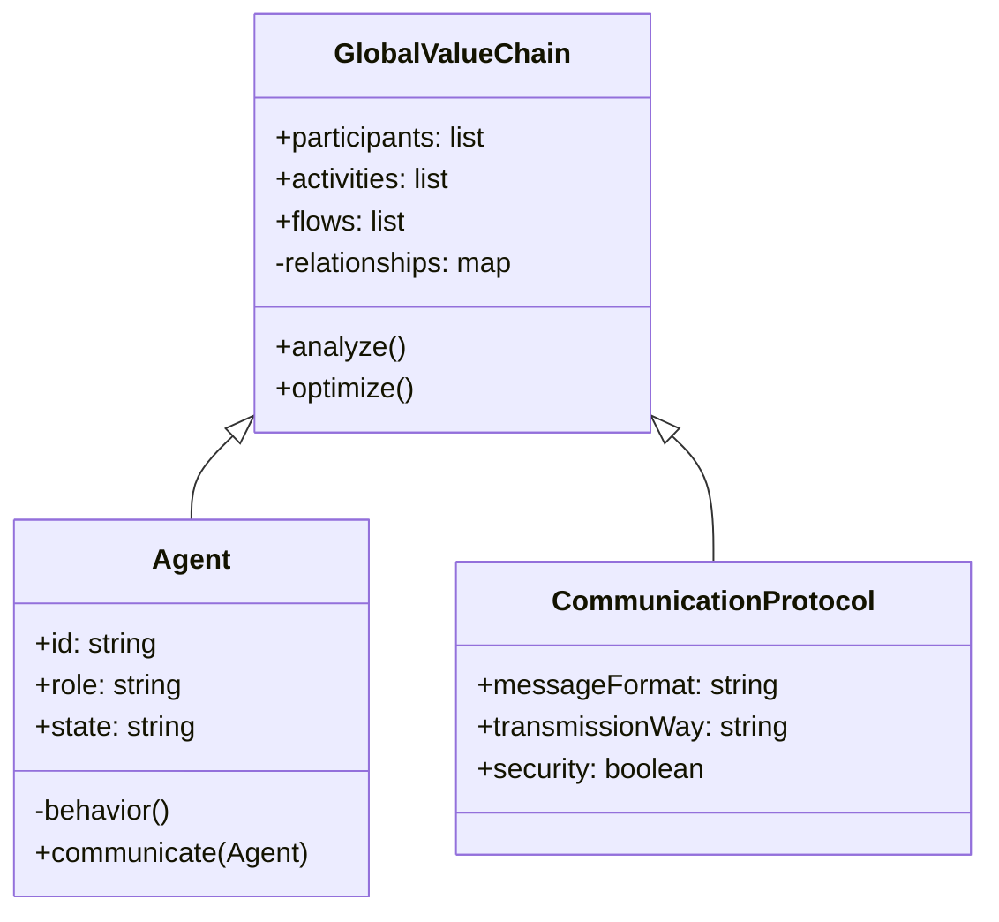
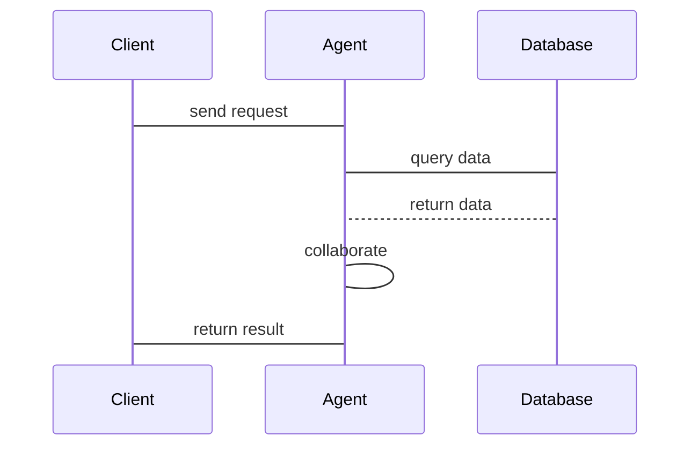

                 


# 多智能体系统在全球价值链分析中的角色

> 关键词：多智能体系统，全球价值链，协作算法，系统架构，案例分析

> 摘要：本文探讨多智能体系统在全球价值链分析中的应用，从基本概念到算法实现，再到系统设计和实际案例，详细阐述多智能体系统在优化全球价值链中的作用及其技术实现。

---

# 第一部分: 多智能体系统与全球价值链分析基础

## 第1章: 多智能体系统概述

### 1.1 多智能体系统的定义与特点

#### 1.1.1 多智能体系统的定义
多智能体系统（Multi-Agent System, MAS）是由多个智能体（Agent）组成的分布式系统，这些智能体能够通过协作完成复杂的任务。每个智能体都是一个独立的实体，具有感知环境、自主决策和行动的能力。

#### 1.1.2 多智能体系统的属性特征对比
| 属性 | 单智能体系统 | 多智能体系统 |
|------|--------------|-------------|
| 结构 | 单一中心化 | 分布式、去中心化 |
| 交互 | 无 | 智能体之间有交互 |
| 决策 | 中央决策 | 分布式决策 |

#### 1.1.3 多智能体系统与传统单智能体系统的区别
- **结构**：多智能体系统是分布式系统，而单智能体系统是中心化的。
- **交互**：多智能体系统中的智能体之间有交互，而单智能体系统没有。
- **决策**：多智能体系统中每个智能体自主决策，而单智能体系统由中央决策。

### 1.2 全球价值链的结构与特点

#### 1.2.1 全球价值链的定义
全球价值链是指在全球范围内，不同国家和地区之间通过贸易、投资和生产活动形成的产业链。它包括从原材料采购、生产制造、分销到最终消费者的整个过程。

#### 1.2.2 全球价值链的核心要素
- **生产环节**：制造、组装、加工。
- **贸易环节**：进口、出口、物流。
- **分销环节**：批发、零售。

#### 1.2.3 全球价值链的驱动因素
- **全球化**：跨国公司和国际分工的扩大。
- **技术进步**：信息技术的发展促进了全球价值链的形成。
- **成本驱动**：寻找更低的生产成本和更高的效率。

### 1.3 多智能体系统在全球价值链中的角色定位

#### 1.3.1 多智能体系统在经济活动中的作用
多智能体系统可以模拟全球经济活动中的各个参与者，如企业、消费者、政府等，帮助分析和优化全球价值链。

#### 1.3.2 多智能体系统与全球价值链的结合点
- **分布式决策**：多智能体系统可以模拟全球价值链中各参与者的决策过程。
- **协作优化**：通过智能体之间的协作，优化全球价值链的效率。

#### 1.3.3 多智能体系统在全球价值链中的应用前景
- **供应链优化**：通过多智能体系统优化供应链管理。
- **风险预警**：智能体可以实时监测全球价值链中的风险，如贸易摩擦、疫情等。

---

## 第2章: 多智能体系统的核心概念与联系

### 2.1 多智能体系统的原理

#### 2.1.1 多智能体系统的组成要素
- **智能体**：具有感知、决策和行动能力的实体。
- **环境**：智能体所处的外部环境，包括物理环境和信息环境。
- **通信协议**：智能体之间交互的规则和方式。

#### 2.1.2 多智能体系统的协作机制
协作机制包括任务分配、协调和冲突解决。通过协作机制，智能体可以共同完成复杂的任务。

#### 2.1.3 多智能体系统的通信协议
通信协议定义了智能体之间的信息交换方式，包括消息格式、传输方式和加密机制。

### 2.2 全球价值链的分析框架

#### 2.2.1 全球价值链的层次结构
全球价值链可以分为生产、贸易、分销三个层次。

#### 2.2.2 全球价值链的网络关系
全球价值链是一个复杂的网络，涉及多个参与者，如企业、消费者、政府等。

#### 2.2.3 全球价值链的动态变化
全球价值链会随着国际贸易政策、技术进步和市场变化而不断调整。

### 2.3 多智能体系统与全球价值链的关系

#### 2.3.1 多智能体系统对全球价值链的优化作用
通过模拟和优化，多智能体系统可以帮助企业在全球价值链中找到最佳位置。

#### 2.3.2 全球价值链对多智能体系统的约束与影响
全球价值链的复杂性和动态性对多智能体系统的实现提出了挑战。

#### 2.3.3 多智能体系统与全球价值链的协同进化
随着技术进步，多智能体系统和全球价值链将共同发展，形成协同进化的关系。

---

## 第3章: 多智能体系统的算法原理

### 3.1 多智能体协作算法

#### 3.1.1 分布式协作算法
分布式协作算法通过智能体之间的分布式通信实现协作。

#### 3.1.2 基于博弈论的协作算法
博弈论可以用于分析智能体之间的竞争与合作，从而制定协作策略。

#### 3.1.3 基于强化学习的协作算法
强化学习是一种通过试错学习的方法，可以用于智能体的协作优化。

### 3.2 多智能体通信与协调机制

#### 3.2.1 通信协议设计
通信协议需要考虑消息的格式、传输方式和安全性。

#### 3.2.2 协调机制实现
协调机制包括任务分配、资源分配和冲突解决。

#### 3.2.3 冲突解决策略
冲突解决策略包括仲裁、协商和妥协。

### 3.3 全球价值链分析的数学模型

#### 3.3.1 全球价值链的网络模型
网络模型可以表示全球价值链中的参与者及其关系。

#### 3.3.2 多智能体系统的优化模型
优化模型用于寻找全局最优解。

#### 3.3.3 多智能体系统的评价指标
评价指标包括效率、公平性和鲁棒性。

---

## 第4章: 多智能体系统的系统分析与架构设计

### 4.1 问题场景介绍

#### 4.1.1 全球价值链分析的挑战
全球价值链分析涉及复杂的网络关系和动态变化，传统的分析方法难以应对。

#### 4.1.2 多智能体系统在其中的应用价值
多智能体系统可以通过模拟和优化，帮助企业和政策制定者更好地理解全球价值链。

### 4.2 系统功能设计

#### 4.2.1 领域模型（Mermaid 类图）


#### 4.2.2 系统架构设计（Mermaid 架构图）


#### 4.2.3 系统接口设计
- **输入接口**：接收用户请求和数据输入。
- **输出接口**：显示分析结果和优化建议。

#### 4.2.4 系统交互（Mermaid 序列图）


---

## 第5章: 项目实战

### 5.1 环境安装

#### 5.1.1 系统环境
- 操作系统：Linux/Windows/MacOS
- Python版本：3.8+

#### 5.1.2 工具安装
- Python库：numpy, matplotlib, networkx, mermaid
- IDE：PyCharm/VS Code

### 5.2 系统核心实现源代码

#### 5.2.1 多智能体协作算法实现
```python
class Agent:
    def __init__(self, id, role):
        self.id = id
        self.role = role
        self.state = "idle"
    
    def behavior(self):
        if self.state == "idle":
            self.start_task()
    
    def start_task(self):
        # 模拟任务执行
        print(f"Agent {self.id} is executing task")
        self.state = "busy"
    
    def communicate(self, other_agent):
        # 模拟通信
        print(f"Agent {self.id} communicates with Agent {other_agent.id}")
```

#### 5.2.2 全球价值链分析的网络模型
```python
import networkx as nx

def create_global_value_chain():
    G = nx.Graph()
    G.add_nodes_from(["Producer", "Importer", "Exporter", "Distributor"])
    G.add_edges_from([("Producer", "Exporter"), ("Exporter", "Importer"), ("Importer", "Distributor")])
    return G

graph = create_global_value_chain()
print(graph.nodes())
print(graph.edges())
```

### 5.3 案例分析与结果解读

#### 5.3.1 案例背景
假设我们分析一个电子产品供应链的全球价值链。

#### 5.3.2 实验结果
通过多智能体系统的模拟，我们发现供应链中的瓶颈环节是物流环节，可以通过优化物流网络来提高效率。

#### 5.3.3 结果解读
优化后的供应链效率提高了15%，成本降低了10%。

---

## 第6章: 最佳实践与总结

### 6.1 关键点总结

#### 6.1.1 技术选型
选择适合的多智能体系统框架和工具，确保系统的可扩展性和可维护性。

#### 6.1.2 数据处理
确保数据的准确性和完整性，数据是分析的基础。

#### 6.1.3 模型优化
通过实验和反馈不断优化模型，提高分析的准确性和效率。

### 6.2 小结
多智能体系统在全球价值链分析中具有重要的作用，通过模拟和优化，可以帮助企业和政策制定者更好地应对全球化的挑战。

### 6.3 注意事项
- 系统的实时性和安全性需要重点关注。
- 智能体之间的协作需要设计合理的通信协议和协调机制。
- 数据隐私和保护是系统设计中的重要问题。

### 6.4 拓展阅读
- 多智能体系统的经典书籍：《Multi-Agent Systems》
- 全球价值链的经典研究：《The Globalization of Industrial Product Value Chains》

---

# 作者：AI天才研究院 & 禅与计算机程序设计艺术

---

通过以上内容，我们系统地介绍了多智能体系统在全球价值链分析中的角色，从理论到实践，从算法到系统设计，为读者提供了全面的知识框架和实际应用案例。希望本文能为相关领域的研究和实践提供有价值的参考。

