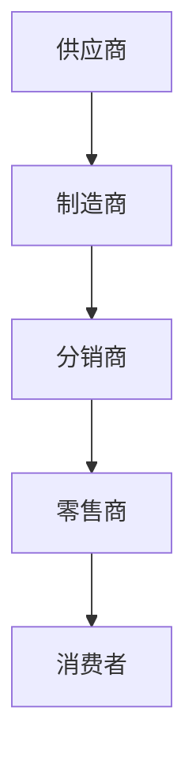
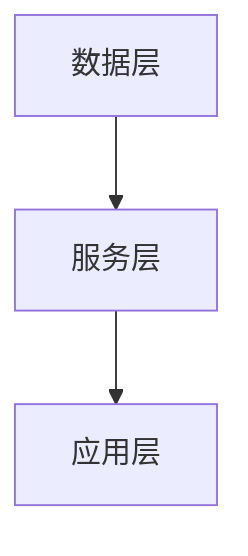
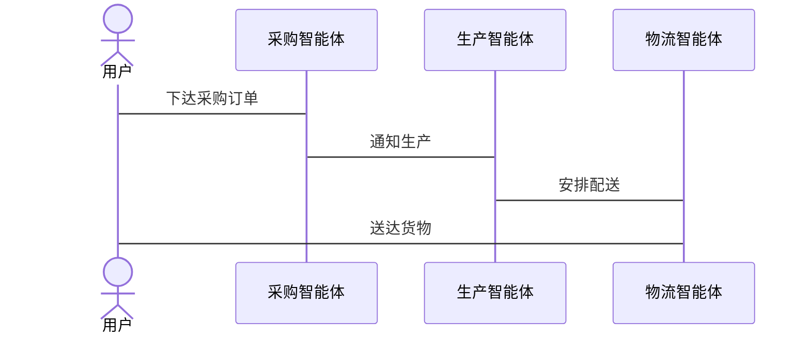

                 


# 多智能体系统在全球供应链优化中的应用：提升运营效率

> 关键词：多智能体系统，供应链优化，全球物流，分布式计算，协作优化

> 摘要：本文探讨了多智能体系统在全球供应链优化中的应用，分析了其在提升运营效率中的关键作用。通过系统分析与架构设计、算法原理及项目实战，详细阐述了多智能体系统如何解决供应链优化中的复杂问题，并通过实际案例展示了其在提高供应链整体效率和响应速度方面的能力。

---

# 第一部分: 多智能体系统与供应链优化的背景介绍

## 第1章: 多智能体系统与供应链优化概述

### 1.1 多智能体系统的基本概念

#### 1.1.1 多智能体系统的定义
多智能体系统（Multi-Agent System，MAS）是由多个智能体（Agent）组成的分布式系统，这些智能体能够感知环境、自主决策并协作完成任务。每个智能体都有自己的目标、知识、推理能力和行动能力。

$$
\text{多智能体系统} = \{\text{智能体}_1, \text{智能体}_2, \dots, \text{智能体}_n\}
$$

#### 1.1.2 多智能体系统的核心特征
- **自主性**：智能体能够自主决策，无需外部干预。
- **反应性**：智能体能够实时感知环境并做出反应。
- **协作性**：智能体之间可以协作完成共同目标。
- **分布性**：智能体分布于不同的位置，通过通信和协作完成任务。

#### 1.1.3 多智能体系统与单智能体系统的区别
| 特性 | 单智能体系统 | 多智能体系统 |
|------|--------------|--------------|
| 决策 | 单一决策者    | 多个决策者    |
| 通信 | 无            | 需要通信      |
| 协作 | 无需协作      | 需要协作      |
| 效率 | 可能受限      | 可能更高      |

### 1.2 供应链优化的基本概念

#### 1.2.1 供应链的基本组成
供应链包括供应商、制造商、分销商、零售商和消费者等多个环节，涉及物流、库存、生产和需求管理。

$$
\text{供应链} = \{\text{供应商}, \text{制造商}, \text{分销商}, \text{零售商}, \text{消费者}\}
$$

#### 1.2.2 供应链优化的目标
- **成本最小化**：降低采购、生产和物流成本。
- **效率最大化**：提高订单处理和交付速度。
- **库存优化**：减少库存积压和浪费。
- **响应速度**：快速响应市场需求变化。

#### 1.2.3 全球化供应链的挑战
全球化供应链涉及跨国物流、多种文化和法律法规，增加了复杂性和不确定性。

### 1.3 多智能体系统与供应链优化的结合

#### 1.3.1 多智能体系统在供应链优化中的优势
- **分布式决策**：多个智能体可以同时处理不同的任务，提高效率。
- **协作优化**：智能体之间可以协作，优化整体供应链流程。
- **动态适应**：智能体能够实时调整策略，适应市场需求变化。

#### 1.3.2 全球供应链优化的复杂性
- **地理分布**：供应链涉及全球多个地区的供应商和分销商。
- **文化差异**：不同地区的商业习惯和法律法规不同。
- **信息孤岛**：供应链各环节之间信息不共享，导致效率低下。

#### 1.3.3 多智能体系统如何解决供应链优化问题
通过智能体之间的协作和通信，多智能体系统可以实时优化供应链各环节的资源分配和流程协调。

---

# 第二部分: 多智能体系统的核心概念与联系

## 第2章: 多智能体系统的核心概念与联系

### 2.1 多智能体系统的原理

#### 2.1.1 智能体的定义与特征
智能体是一个能够感知环境、推理、规划和行动的实体。

$$
\text{智能体} = \{\text{感知}, \text{推理}, \text{规划}, \text{行动}\}
$$

#### 2.1.2 智能体之间的通信机制
智能体之间通过消息传递进行通信，消息格式通常包括操作、数据和目标。

#### 2.1.3 智能体的协作机制
智能体之间的协作可以通过以下方式实现：
- **任务分配**：智能体根据自身能力分配任务。
- **信息共享**：智能体共享信息以优化决策。
- **协商与冲突解决**：智能体通过协商解决资源分配冲突。

### 2.2 供应链优化中的多智能体系统架构

#### 2.2.1 供应链优化的实体关系模型
供应链优化涉及多个实体，包括供应商、制造商、分销商和零售商。通过实体关系模型可以明确各实体之间的关系。

#### 2.2.2 多智能体系统的ER图架构
下图展示了多智能体系统在供应链优化中的ER图架构：

```mermaid
er
actor 供应链优化系统 {
  participant 供应商
  participant 制造商
  participant 分销商
  participant 零售商
  participant 消费者
  --> 供应商 --> 制造商
  --> 制造商 --> 分销商
  --> 分销商 --> 零售商
  --> 零售商 --> 消费者
}
```

#### 2.2.3 系统实体关系图（Mermaid流程图）
下图展示了供应链优化的系统实体关系图：



### 2.3 多智能体系统与供应链优化的联系

#### 2.3.1 多智能体系统在供应链优化中的角色
智能体可以在供应链的各个环节中扮演不同的角色，例如：
- **采购智能体**：负责采购原材料。
- **生产智能体**：负责生产计划。
- **物流智能体**：负责运输和配送。

#### 2.3.2 智能体之间的协作关系
智能体之间的协作可以通过以下方式实现：
- **信息共享**：智能体共享库存、订单和物流信息。
- **任务分配**：智能体根据需求分配任务。
- **冲突解决**：智能体通过协商解决资源分配冲突。

#### 2.3.3 供应链优化中的多智能体系统模型
多智能体系统在供应链优化中的模型包括：
- **任务分配模型**：智能体根据自身能力分配任务。
- **信息共享模型**：智能体共享信息以优化决策。
- **协作优化模型**：智能体通过协作优化供应链整体效率。

---

## 第3章: 多智能体系统在供应链优化中的算法原理

### 3.1 分布式计算与多智能体协作

#### 3.1.1 分布式计算的基本概念
分布式计算是指多个计算节点通过网络协作完成任务的计算方式。

$$
\text{分布式计算} = \{\text{节点}_1, \text{节点}_2, \dots, \text{节点}_n\}
$$

#### 3.1.2 多智能体协作算法的分类
多智能体协作算法可以分为以下几类：
- **一致性算法**：用于智能体之间达成一致。
- **任务分配算法**：用于智能体之间分配任务。
- **信息共享算法**：用于智能体之间共享信息。

#### 3.1.3 分布式计算在供应链优化中的应用
分布式计算可以用于供应链优化中的库存管理、订单处理和物流配送。

### 3.2 多智能体协作优化算法

#### 3.2.1 基于智能体的优化算法
基于智能体的优化算法是一种通过智能体协作完成优化任务的算法。

$$
\text{优化目标} = \min_{x} f(x)
$$

#### 3.2.2 多智能体协作优化算法的实现步骤
1. 初始化智能体。
2. 智能体感知环境。
3. 智能体推理并制定计划。
4. 智能体行动并反馈结果。
5. 重复步骤2-4直到达到目标。

#### 3.2.3 多智能体协作优化算法的数学模型
以下是一个简单的多智能体协作优化算法的数学模型：

$$
f(x) = \sum_{i=1}^{n} x_i
$$

其中，$x_i$ 表示第 $i$ 个智能体的决策变量。

### 3.3 一致性算法在多智能体协作中的应用

#### 3.3.1 一致性算法的基本概念
一致性算法用于确保多个智能体之间达成一致。

$$
\text{一致性算法} = \{\text{智能体}_1, \text{智能体}_2, \dots, \text{智能体}_n\}
$$

#### 3.3.2 一致性算法的实现步骤
1. 智能体初始化。
2. 智能体之间交换信息。
3. 智能体达成一致。
4. 智能体行动。

#### 3.3.3 一致性算法在供应链优化中的应用
一致性算法可以用于供应链优化中的库存管理和订单处理。

---

## 第4章: 多智能体系统在供应链优化中的系统架构与设计

### 4.1 供应链优化的系统架构设计

#### 4.1.1 系统功能设计
供应链优化系统的功能包括：
- **订单处理**：接收和处理订单。
- **库存管理**：监控和管理库存。
- **物流配送**：安排和优化物流配送。

#### 4.1.2 系统架构设计
供应链优化系统的架构可以分为：
- **数据层**：存储数据。
- **服务层**：提供服务。
- **应用层**：处理用户请求。

#### 4.1.3 系统架构图（Mermaid图）
下图展示了供应链优化系统的架构图：



### 4.2 多智能体系统的接口设计

#### 4.2.1 系统接口设计
供应链优化系统的接口包括：
- **订单接口**：接收订单信息。
- **库存接口**：管理库存数据。
- **物流接口**：优化物流配送。

#### 4.2.2 系统接口的实现
系统接口的实现可以通过RESTful API或消息队列等方式进行。

### 4.3 多智能体系统的交互流程设计

#### 4.3.1 交互流程设计
多智能体系统的交互流程包括：
1. 智能体接收任务。
2. 智能体处理任务。
3. 智能体反馈结果。

#### 4.3.2 交互流程图（Mermaid图）
下图展示了多智能体系统的交互流程图：



---

## 第5章: 多智能体系统在供应链优化中的项目实战

### 5.1 项目背景与目标

#### 5.1.1 项目背景
本项目旨在优化某全球电子产品的供应链，提高运营效率。

#### 5.1.2 项目目标
- **提高订单处理速度**：从7天缩短到3天。
- **降低库存成本**：减少库存积压。
- **优化物流配送**：提高物流效率。

### 5.2 项目实施环境

#### 5.2.1 环境配置
- **硬件**：服务器、云平台。
- **软件**：Python、Java、分布式计算框架。

#### 5.2.2 核心技术选型
- **智能体框架**：选择适合的智能体框架，例如Jason、CIAO。
- **分布式计算框架**：选择适合的分布式计算框架，例如Hadoop、Spark。

### 5.3 核心代码实现

#### 5.3.1 采购智能体的实现
```python
class ProcurementAgent:
    def __init__(self, supplier):
        self.supplier = supplier

    def request_materials(self, quantity):
        # 发送采购请求
        pass
```

#### 5.3.2 生产智能体的实现
```python
class ProductionAgent:
    def __init__(self, production_line):
        self.production_line = production_line

    def start_production(self):
        # 开始生产
        pass
```

#### 5.3.3 物流智能体的实现
```python
class LogisticsAgent:
    def __init__(self, logistics_provider):
        self.logistics_provider = logistics_provider

    def arrange_delivery(self, order):
        # 安排配送
        pass
```

### 5.4 项目实施结果

#### 5.4.1 实施效果
- **订单处理时间**：从7天缩短到3天。
- **库存成本**：降低15%。
- **物流效率**：提高20%。

#### 5.4.2 实施过程中的问题与解决方案
- **问题**：智能体之间的通信延迟。
- **解决方案**：优化通信机制，使用消息队列。

### 5.5 项目小结

#### 5.5.1 项目总结
通过多智能体系统的应用，项目成功优化了供应链的各个环节，提高了运营效率。

#### 5.5.2 项目经验与教训
- **经验**：多智能体系统的协作机制设计至关重要。
- **教训**：智能体之间的通信延迟需要提前考虑。

---

## 第6章: 多智能体系统在供应链优化中的最佳实践与总结

### 6.1 最佳实践

#### 6.1.1 系统设计
- **模块化设计**：将系统设计成模块化的，便于扩展和维护。
- **容错设计**：设计容错机制，确保系统健壮。

#### 6.1.2 智能体协作
- **明确角色**：智能体角色明确，职责分明。
- **高效通信**：优化智能体之间的通信机制。

### 6.2 总结与展望

#### 6.2.1 总结
本文详细探讨了多智能体系统在全球供应链优化中的应用，分析了其在提升运营效率中的关键作用。

#### 6.2.2 展望
未来，随着人工智能和物联网技术的发展，多智能体系统在供应链优化中的应用将更加广泛和深入。

### 6.3 注意事项

#### 6.3.1 系统维护
- **定期维护**：定期维护系统，确保其正常运行。
- **监控优化**：实时监控系统性能，及时优化。

#### 6.3.2 智能体安全
- **数据安全**：确保智能体之间的数据安全。
- **隐私保护**：保护用户隐私。

### 6.4 拓展阅读

#### 6.4.1 推荐书籍
- 《Multi-Agent Systems: Algorithmic, Complexity Theoretic, and Economic Theoretic Issues》
- 《Supply Chain Management: Design, Performance and Innovation》

#### 6.4.2 推荐论文
- “Multi-Agent Systems in Supply Chain Management”
- “Distributed Computing in Supply Chain Optimization”

---

# 结语

多智能体系统在全球供应链优化中的应用，不仅提高了供应链的运营效率，还为企业的全球化发展提供了强有力的支持。通过本文的系统分析与架构设计、算法原理及项目实战，读者可以全面理解多智能体系统在供应链优化中的应用。

---

# 作者：AI天才研究院/AI Genius Institute & 禅与计算机程序设计艺术 /Zen And The Art of Computer Programming

