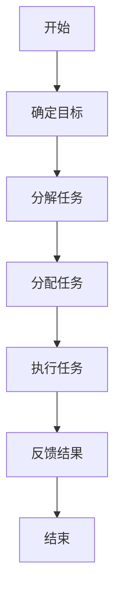
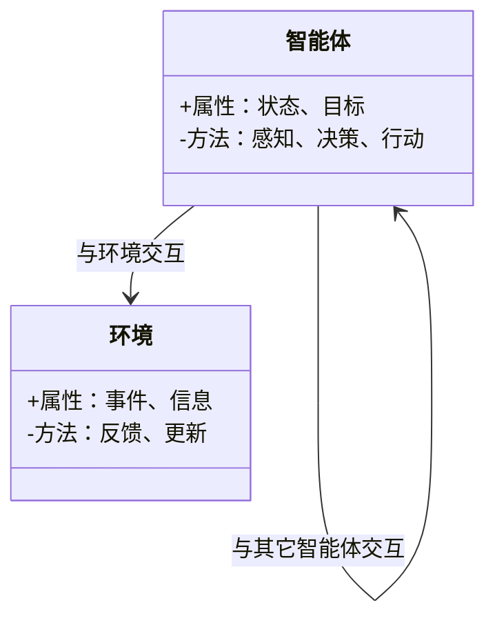
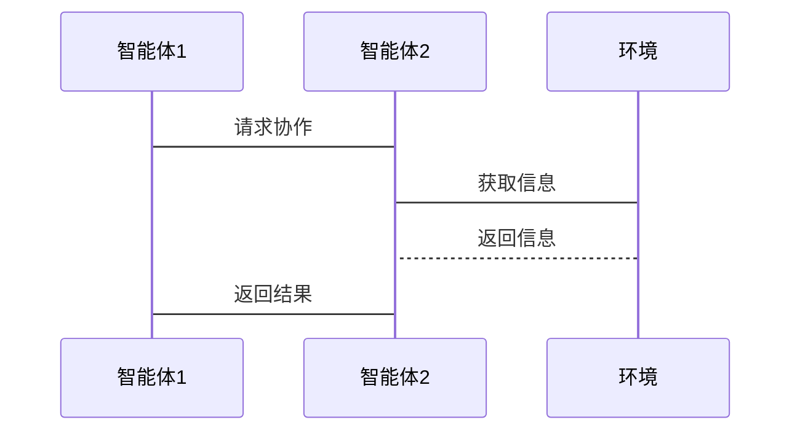

                 


# 多智能体系统在全球政治风险分析中的角色

> 关键词：多智能体系统、政治风险分析、智能体协作、博弈论、系统架构

> 摘要：多智能体系统（MAS）通过分布式计算和协作机制，为全球政治风险分析提供了新的视角。本文探讨了多智能体系统的核心概念、算法原理及其在政治风险分析中的应用，展示了如何通过智能体协作和博弈论模型，实现复杂政治风险的动态评估与预测。

---

# 第一部分：多智能体系统与全球政治风险分析的背景

## 第1章：多智能体系统的概念与特点

### 1.1 多智能体系统的定义与核心概念

#### 1.1.1 多智能体系统的定义
多智能体系统（Multi-Agent System, MAS）是由多个智能体（Agent）组成的分布式系统，这些智能体能够通过交互和协作完成复杂任务。智能体是具有感知、决策和行动能力的实体，能够独立工作并与其他智能体或环境进行交互。

#### 1.1.2 智能体的核心属性
智能体的核心属性包括：
- **自主性**：智能体能够自主决策和行动。
- **反应性**：能够感知环境并实时响应。
- **协作性**：能够与其他智能体协作完成任务。
- **社会性**：智能体之间的交互遵循特定的社会规范或协议。

#### 1.1.3 多智能体系统的分类
多智能体系统可以分为以下几类：
1. **结构化系统**：智能体之间的关系明确，任务分解清晰。
2. **非结构化系统**：智能体之间的关系动态且复杂，任务分解模糊。
3. **混合系统**：结合结构化和非结构化的特点。

### 1.2 全球政治风险分析的现状与挑战

#### 1.2.1 政治风险的定义与分类
政治风险是指由于政治因素（如政策变化、政局动荡等）对企业或个人造成的潜在损失。政治风险可以分为以下几类：
1. **国家风险**：涉及国家层面的政治不稳定。
2. **行业风险**：特定行业受到的政策影响。
3. **项目风险**：特定项目或投资的政治风险。

#### 1.2.2 全球政治风险分析的复杂性
全球政治风险分析的复杂性主要体现在以下几个方面：
- **多因素影响**：政治风险受经济、社会、文化等多种因素影响。
- **动态变化**：政治风险具有动态性，需要实时监控和分析。
- **信息不对称**：分析者往往无法获得全部信息。

#### 1.2.3 传统方法的局限性
传统方法在政治风险分析中的局限性包括：
- **信息处理能力有限**：传统方法难以处理大规模、多维度的数据。
- **分析效率低下**：传统方法依赖人工分析，效率较低。
- **动态适应性差**：传统方法难以实时应对政治风险的变化。

### 1.3 多智能体系统在政治风险分析中的潜力

#### 1.3.1 多智能体系统的分布式计算优势
多智能体系统的分布式计算优势使得其能够处理大规模、多维度的数据，并能够在复杂环境中进行实时分析。

#### 1.3.2 智能体协作在复杂场景中的应用
智能体协作能够帮助分析者更好地理解复杂的政治环境，并提供实时的决策支持。

#### 1.3.3 政治风险分析的多维度需求
政治风险分析需要多维度的视角，而多智能体系统能够通过协作和分布计算提供这种能力。

### 1.4 本章小结
本章介绍了多智能体系统的定义、核心概念及其分类，分析了全球政治风险分析的复杂性和传统方法的局限性，并探讨了多智能体系统在政治风险分析中的潜力。

---

## 第2章：多智能体系统的核心概念与联系

### 2.1 多智能体系统的原理

#### 2.1.1 智能体的行为模型
智能体的行为模型包括：
- **反应式模型**：基于当前感知做出反应。
- **规划式模型**：基于预先规划的策略进行行动。
- **混合式模型**：结合反应式和规划式的特点。

#### 2.1.2 智能体之间的交互机制
智能体之间的交互机制包括：
- **直接通信**：智能体之间直接交换信息。
- **间接通信**：通过中间媒介进行信息交换。
- **协调与协作**：智能体通过协调和协作完成共同任务。

#### 2.1.3 系统的动态演化
多智能体系统的动态演化包括：
- **智能体的生命周期**：从创建到销毁的全过程。
- **系统的自适应性**：系统能够根据环境变化自动调整。

### 2.2 多智能体系统的属性对比

#### 2.2.1 实体属性对比表格

| 属性 | 智能体 | 环境 |
|------|--------|------|
| 自主性 | 高     | 无   |
| 反应性 | 高     | 无   |
| 目标 | 有     | 无   |
| 通信 | 支持    | 无   |

#### 2.2.2 智能体间的关系分析
智能体间的关系可以分为：
- **竞争关系**：智能体之间争夺有限资源。
- **合作关系**：智能体之间协作完成任务。
- **中立关系**：智能体之间无直接互动。

### 2.3 实体关系图（ER图）

```mermaid
erDiagram
    actor 智能体
    actor 环境
    智能体 --> 环境 : 与环境交互
    智能体 --> 智能体 : 与其它智能体交互
```

### 2.4 本章小结
本章详细讲解了多智能体系统的原理、核心概念及其属性，并通过ER图展示了智能体之间的关系。

---

## 第3章：多智能体系统的算法原理

### 3.1 协调与合作机制

#### 3.1.1 分布式计算模型
分布式计算模型通过将任务分解到多个智能体，实现并行计算和协作。

#### 3.1.2 协作协议的设计
协作协议的设计需要考虑智能体之间的通信、协调和决策机制。

#### 3.1.3 冲突解决算法
冲突解决算法包括：
- **协商算法**：通过协商达成一致。
- **仲裁算法**：通过仲裁解决冲突。
- **妥协算法**：通过妥协解决冲突。

### 3.2 博弈论模型在智能体决策中的应用

#### 3.2.1 纳什均衡的概念
纳什均衡是指在博弈中，所有参与者的策略都是最优的，且无法通过单方面改变策略而获得更好的结果。

#### 3.2.2 博弈树的构建与分析
博弈树展示了所有可能的决策路径和结果。

#### 3.2.3 实际案例分析
例如，在国际政治中，两个国家的博弈可以用纳什均衡来分析。

### 3.3 算法流程图（Mermaid）



### 3.4 本章小结
本章介绍了多智能体系统的协调与合作机制，以及博弈论模型在智能体决策中的应用，并通过流程图展示了算法的运行过程。

---

## 第4章：多智能体系统的数学模型与公式

### 4.1 协作模型的数学表达

#### 4.1.1 协作收益函数
协作收益函数可以表示为：
$$ R = \sum_{i=1}^{n} R_i $$
其中，$R_i$ 是第i个智能体的收益。

#### 4.1.2 贡献分配模型
贡献分配模型可以表示为：
$$ C_i = \frac{R_i}{\sum_{j=1}^{n} R_j} \times T $$
其中，$T$ 是总贡献。

#### 4.1.3 约束条件
协作模型需要满足以下约束条件：
- **非负性**：$R_i \geq 0$
- **可加性**：$\sum_{i=1}^{n} R_i = T$

### 4.2 冲突解决模型的数学分析

#### 4.2.1 竞争模型的数学表达
竞争模型可以表示为：
$$ C_i = \frac{P_i}{\sum_{j=1}^{n} P_j} \times R $$
其中，$P_i$ 是第i个智能体的资源投入，$R$ 是总资源。

#### 4.2.2 谈判过程的数学建模
谈判过程可以表示为：
$$ x_i = \text{argmax} \{ U_i(x) \} $$
其中，$U_i(x)$ 是第i个智能体的效用函数。

#### 4.2.3 解决方案的优化算法
优化算法可以表示为：
$$ \min_{x} \sum_{i=1}^{n} (x_i - x)^2 $$
其中，$x$ 是优化变量。

### 4.3 本章小结
本章通过数学公式详细讲解了协作模型和冲突解决模型，并展示了如何通过优化算法解决问题。

---

## 第5章：多智能体系统的系统分析与架构设计

### 5.1 问题场景介绍

#### 5.1.1 政治风险分析的复杂场景
政治风险分析需要考虑多方面的因素，如经济、社会、文化等。

#### 5.1.2 多智能体系统的适用性分析
多智能体系统能够处理复杂场景中的多维度数据，并提供实时分析。

### 5.2 系统功能设计

#### 5.2.1 领域模型（Mermaid类图）



#### 5.2.2 功能模块划分
功能模块包括：
- **感知模块**：感知环境信息。
- **决策模块**：基于感知信息做出决策。
- **行动模块**：根据决策采取行动。

#### 5.2.3 模块之间的交互关系
模块之间的交互关系包括：
- 感知模块向决策模块提供信息。
- 决策模块向行动模块发出指令。
- 行动模块向感知模块反馈结果。

### 5.3 系统架构设计

#### 5.3.1 分层架构设计（Mermaid架构图）


#### 5.3.2 智能体的部署与管理
智能体的部署与管理需要考虑资源分配、通信机制等问题。

#### 5.3.3 系统的可扩展性分析
系统的可扩展性分析包括：
- **模块化设计**：便于新增智能体。
- **分布式计算**：支持大规模扩展。

### 5.4 系统接口设计

#### 5.4.1 智能体间接口定义
智能体间接口需要定义通信协议和数据格式。

#### 5.4.2 外部数据接口设计
外部数据接口需要与外部系统进行数据交换。

#### 5.4.3 用户接口设计
用户接口需要提供友好的人机交互界面。

### 5.5 系统交互流程（Mermaid序列图）



### 5.6 本章小结
本章通过系统分析与架构设计，展示了多智能体系统的整体结构和交互过程。

---

## 项目实战

### 5.7 环境安装
需要安装以下环境：
- Python
- Mermaid
- LaTeX

### 5.8 核心代码实现

```python
class Agent:
    def __init__(self, id):
        self.id = id
        self.state = None

    def感知(self, 环境):
        self.state = 环境.获取信息()

    def 决策(self):
        # 假设决策逻辑为简单判断
        if self.state == '风险':
            return '采取行动'
        else:
            return '不采取行动'

    def 行动(self, action):
        print(f'智能体 {self.id} 采取了行动：{action}')

def 环境():
    # 简单环境模拟
    return '风险'

# 实例化智能体
agent1 = Agent(1)
agent2 = Agent(2)

# 智能体感知环境
agent1.感知(环境())
agent2.感知(环境())

# 智能体决策
decision1 = agent1.决策()
decision2 = agent2.决策()

# 智能体行动
agent1.行动(decision1)
agent2.行动(decision2)
```

### 5.9 案例分析与详细讲解
通过上述代码实现的案例，展示了智能体如何感知环境、决策和行动。

### 5.10 项目小结
本章通过项目实战，展示了多智能体系统的实现过程和应用案例。

---

## 最佳实践 tips

- **数据质量**：确保数据的准确性和完整性。
- **算法优化**：根据实际需求优化算法。
- **系统维护**：定期维护和更新系统。

## 小结
本文详细介绍了多智能体系统在全球政治风险分析中的角色，从概念到算法，再到系统设计和项目实战，为读者提供了全面的视角。

## 注意事项
- 系统设计时需考虑智能体的自主性和协作性。
- 算法实现时需注意复杂度和可扩展性。

## 拓展阅读
- 《Multi-Agent Systems: Algorithmic, Complexity, and Synthesis》
- 《Game Theory and Political Theory》

---

作者：AI天才研究院/AI Genius Institute & 禅与计算机程序设计艺术 /Zen And The Art of Computer Programming

