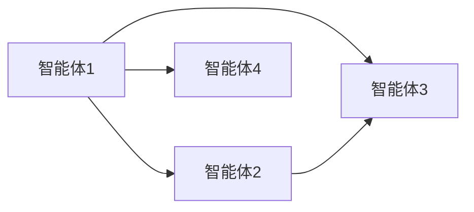
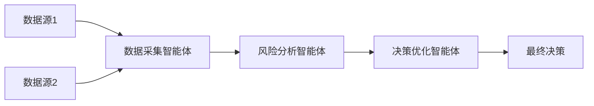

                 


# 多智能体系统在全球监管环境分析中的应用：跨国投资风险评估

> **关键词**：多智能体系统，监管环境分析，跨国投资，风险评估，分布式计算，博弈论

> **摘要**：  
> 随着全球化的深入发展，跨国投资面临的监管环境日益复杂。多智能体系统（Multi-Agent Systems, MAS）作为一种分布式计算范式，能够有效应对这种复杂性。本文系统地探讨了多智能体系统在跨国投资风险评估中的应用，从理论基础到算法实现，再到实际案例，全面分析了其在监管环境中的优势和挑战。通过多智能体系统的协调与协作，能够更高效地处理跨国投资中的复杂问题，为投资者提供更精准的风险评估和决策支持。

---

## 第1章: 多智能体系统概述

### 1.1 多智能体系统的定义与特点

#### 1.1.1 多智能体系统的定义
多智能体系统是由多个智能体（Agent）组成的分布式系统，每个智能体都是一个能够感知环境、自主决策并执行任务的实体。智能体可以是软件程序、机器人或其他分布式系统组件。

**特点**：
- **自主性**：智能体能够自主决策，无需外部干预。
- **反应性**：能够实时感知环境变化并做出反应。
- **协作性**：多个智能体可以协同工作，完成复杂任务。
- **分布式性**：智能体之间通过通信和协调实现分布式计算。

#### 1.1.2 多智能体系统的分类与特点
多智能体系统可以分为以下几类：
- **简单反射型智能体**：基于当前感知做出反应，适用于简单的任务。
- **基于模型的反射型智能体**：利用内部模型和知识进行决策。
- **目标驱动型智能体**：以特定目标为导向，优化行为以实现目标。
- **效用驱动型智能体**：通过最大化效用函数来优化决策。

#### 1.1.3 多智能体系统的优势与挑战
**优势**：
- 能够处理复杂的分布式问题。
- 通过协作提高整体效率。
- 具有良好的扩展性和适应性。

**挑战**：
- 智能体之间的通信和协调需要高效的算法支持。
- 系统的安全性和隐私保护问题。
- 处理动态环境中的不确定性。

---

### 1.2 全球监管环境分析的背景与意义

#### 1.2.1 全球化背景下的监管挑战
全球化使得跨国投资变得频繁，但也带来了复杂的监管环境。不同国家和地区有不同的法律法规和监管要求，这对投资者提出了更高的要求。

#### 1.2.2 跨国投资风险的复杂性
跨国投资面临的政治、经济、法律等多重风险，需要通过系统化的分析来评估和应对。

#### 1.2.3 多智能体系统在监管中的应用前景
多智能体系统能够通过分布式计算和协作，帮助投资者实时分析监管环境，优化投资决策。

---

## 第2章: 多智能体系统的核心概念与原理

### 2.1 多智能体系统的组成与结构

#### 2.1.1 智能体的定义与属性
智能体是一个具有以下属性的实体：
- **感知**：通过传感器或接口获取环境信息。
- **推理**：基于感知信息进行逻辑推理。
- **决策**：根据推理结果做出决策。
- **执行**：通过执行机构将决策转化为行动。

#### 2.1.2 多智能体系统的层次结构
多智能体系统通常分为以下层次：
- **物理层**：智能体的物理实体，如传感器和执行器。
- **逻辑层**：智能体的逻辑推理和决策机制。
- **通信层**：智能体之间的通信和信息交换。
- **应用层**：系统的具体应用场景和功能实现。

#### 2.1.3 智能体之间的关系与交互
智能体之间的关系可以是竞争、合作或中立。通过通信和协调，智能体可以实现协作。

**示例表格**：
| 关系类型 | 描述 | 示例 |
|----------|------|------|
| 合作     | 智能体协同完成任务 | 投资风险评估中的不同智能体分工合作 |
| 竞争     | 智能体争夺资源或目标 | 不同投资者争夺市场机会 |
| 中立     | 智能体之间无直接关系 | 独立分析不同地区的监管政策 |

**Mermaid图表**：


---

### 2.2 多智能体系统的通信与协调

#### 2.2.1 智能体间通信机制
智能体之间的通信可以通过消息传递、发布-订阅模型等方式实现。

**示例代码**：
```python
# 消息传递示例
class Message:
    def __init__(self, sender, content):
        self.sender = sender
        self.content = content

class Agent:
    def __init__(self, name):
        self.name = name

    def send_message(self, receiver, content):
        message = Message(self.name, content)
        receiver.receive(message)

    def receive(self, message):
        print(f"{self.name} 收到消息：{message.content}")
```

#### 2.2.2 协调算法与协议
常见的协调算法包括基于博弈论的算法和分布式协调算法。

**基于博弈论的算法**：
$$\text{纳什均衡} = \arg\max_{x} \min_{y} U(x,y)$$
其中，$U(x,y)$表示策略组合的效用函数。

**示例**：
假设两个智能体在选择投资地点时，选择不同的地点可以最大化各自的效用。

**Mermaid图表**：


---

## 第3章: 跨国投资风险评估的多智能体系统模型

### 3.1 跨国投资风险评估的复杂性

#### 3.1.1 跨国投资的主要风险因素
- 政治风险：政策变化、政局不稳等。
- 经济风险：经济波动、通货膨胀等。
- 法律风险：法律法规变化、税收政策等。
- 市场风险：市场需求波动、竞争加剧等。

#### 3.1.2 不同国家的监管差异
不同国家的法律法规、税收政策、行业标准等存在差异，增加了投资的复杂性。

#### 3.1.3 风险评估的动态性与不确定性
监管环境和市场情况会随时变化，需要动态评估和调整。

---

### 3.2 多智能体系统在风险评估中的应用

#### 3.2.1 智能体的分工与角色
- **数据采集智能体**：收集各国的监管政策和市场数据。
- **风险分析智能体**：基于数据进行风险评估。
- **决策优化智能体**：优化投资决策，降低风险。

#### 3.2.2 风险信息的收集与处理
智能体通过分布式数据源收集信息，并通过协作进行数据融合和分析。

**Mermaid图表**：


#### 3.2.3 风险评估的协同计算
通过多智能体系统的协作，实现对跨国投资风险的全面评估。

**数学模型**：
$$R = \sum_{i=1}^{n} w_i \cdot r_i$$
其中，$R$表示总风险，$w_i$表示风险因子的权重，$r_i$表示各风险因子的评估值。

---

## 第4章: 多智能体系统的算法原理

### 4.1 协调与协作算法

#### 4.1.1 基于博弈论的协调算法
博弈论是多智能体系统中协调的重要理论基础。通过分析智能体的策略和效用函数，可以实现最优决策。

**数学模型**：
$$\text{效用函数} = U(a_i, a_{-i})$$
其中，$a_i$表示智能体$i$的策略，$a_{-i}$表示其他智能体的策略。

**示例代码**：
```python
def nash_equilibrium(players, strategies):
    # 计算纳什均衡
    for player in players:
        for strategy in strategies:
            if is_best_response(player, strategy):
                return (player, strategy)
    return None
```

#### 4.1.2 分布式计算与并行处理
多智能体系统可以通过分布式计算和并行处理提高效率。

**示例代码**：
```python
import concurrent.futures

def process_data(data):
    # 数据处理逻辑
    return result

with concurrent.futures.ThreadPoolExecutor() as executor:
    futures = [executor.submit(process_data, d) for d in data]
    for future in concurrent.futures.as_completed(futures):
        print(future.result())
```

#### 4.1.3 自适应调整算法
通过自适应算法，智能体能够根据环境变化动态调整策略。

**数学模型**：
$$\text{自适应调整} = \alpha \cdot x_t + (1-\alpha) \cdot x_{t-1}$$
其中，$\alpha$是调整因子，$x_t$是当前状态，$x_{t-1}$是上一状态。

---

### 4.2 智能体间的通信与信息处理

#### 4.2.1 信息编码与解码
智能体之间通过编码和解码实现高效通信。

**示例代码**：
```python
def encode(message):
    return message.encode('utf-8')

def decode(bytes_data):
    return bytes_data.decode('utf-8')
```

#### 4.2.2 信息融合与决策
通过信息融合技术，智能体可以将多个来源的信息整合，做出更准确的决策。

**数学模型**：
$$\text{融合结果} = \sum_{i=1}^{n} w_i \cdot x_i$$
其中，$w_i$是信息源$i$的权重，$x_i$是信息源$i$的数据。

---

## 第5章: 全球监管环境分析的系统架构设计

### 5.1 系统功能设计

#### 5.1.1 系统功能模块
- **数据采集模块**：收集各国的监管政策和市场数据。
- **风险评估模块**：基于数据进行风险评估。
- **决策支持模块**：提供投资决策支持。

#### 5.1.2 系统功能流程


---

## 第6章: 项目实战

### 6.1 环境安装

#### 6.1.1 系统需求
- 操作系统：Windows/Mac/Linux
- Python：3.6+
- 依赖库：numpy, pandas, matplotlib

#### 6.1.2 安装步骤
```bash
pip install numpy pandas matplotlib
```

---

### 6.2 核心代码实现

#### 6.2.1 数据采集智能体
```python
class DataCollector:
    def __init__(self):
        self.data = {}

    def collect_data(self, country):
        # 模拟数据采集
        self.data[country] = {'policy': 'stable', 'market': 'high'}
        return self.data
```

#### 6.2.2 风险评估智能体
```python
class RiskAssessor:
    def assess(self, data):
        risk = 0
        for country in data:
            policy = data[country]['policy']
            market = data[country]['market']
            risk += self.calculate_risk(policy, market)
        return risk

    def calculate_risk(self, policy, market):
        # 简单的风险计算模型
        if policy == 'stable' and market == 'high':
            return 0.8
        elif policy == 'unstable' and market == 'low':
            return 0.2
        else:
            return 0.5
```

---

### 6.3 案例分析

#### 6.3.1 实际案例
假设我们要评估两个国家的投资风险，智能体通过协作完成数据采集和风险评估。

**示例代码**：
```python
collector = DataCollector()
collector.collect_data('CountryA')
collector.collect_data('CountryB')

assessor = RiskAssessor()
risk = assessor.assess(collector.data)
print(f"投资风险：{risk}")
```

---

## 第7章: 最佳实践与总结

### 7.1 总结
多智能体系统在跨国投资风险评估中的应用前景广阔，通过分布式计算和协作，能够有效应对复杂的监管环境。

### 7.2 小结
本文系统地探讨了多智能体系统在跨国投资风险评估中的应用，从理论到实践，全面分析了其优势和挑战。

### 7.3 注意事项
- 系统的安全性和隐私保护需要特别注意。
- 算法的实时性和效率需要优化。

### 7.4 拓展阅读
- 推荐书籍：《Multi-Agent Systems: Algorithmic, Complexity Theoretic, and Game Theoretic Foundations》
- 推荐文章：博弈论与分布式系统

---

**作者**：AI天才研究院 & 禅与计算机程序设计艺术

