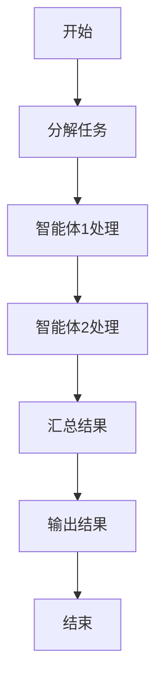
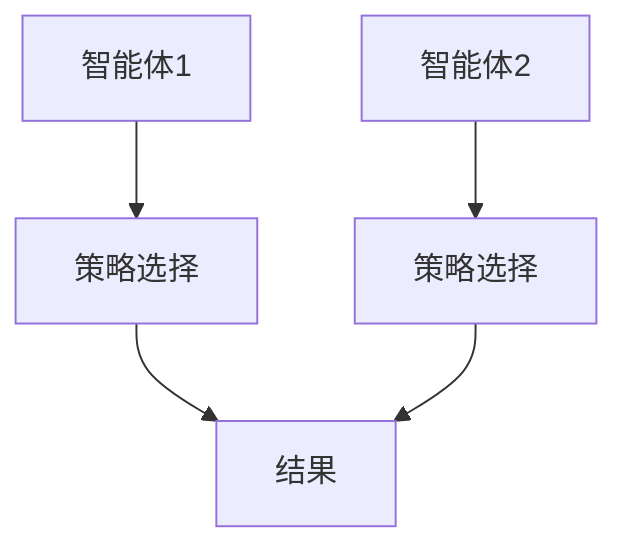
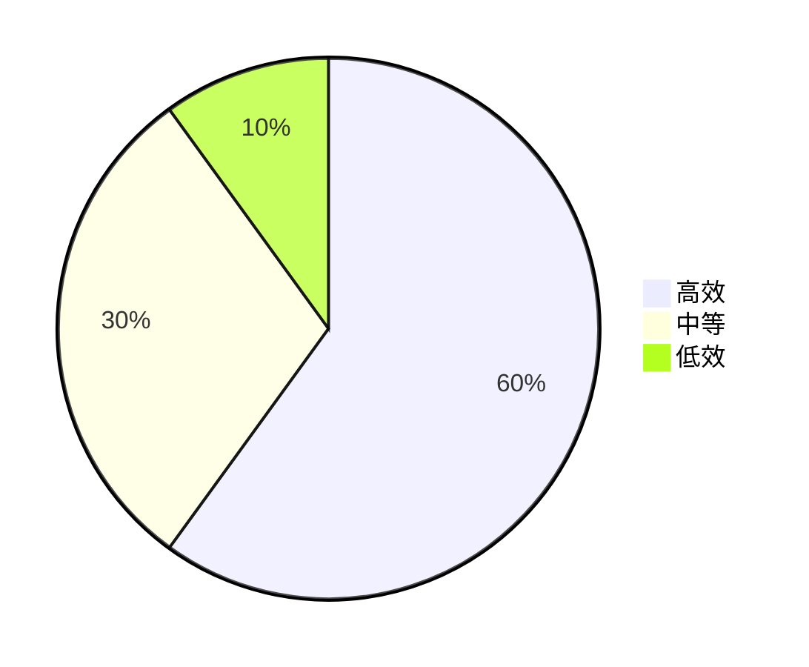

                 


# 多智能体系统在全球资源配置效率评估中的应用：寻找优质公司

## 关键词
多智能体系统, 资源配置效率, 优质公司评估, 分布式计算, 博弈论模型, 协同优化, 系统架构设计

## 摘要
本文探讨了多智能体系统（MAS）在全球资源配置效率评估中的应用，特别是如何利用MAS技术寻找优质公司。文章详细分析了MAS的核心概念、算法原理、系统架构设计，并通过实际案例展示了其在资源优化分配中的价值。通过分布式计算、博弈论模型和协同优化算法，本文为高效评估资源配置效率提供了新的思路，帮助企业识别和投资优质公司。

---

## 第一章：多智能体系统与资源配置效率评估

### 1.1 多智能体系统的基本概念
- **智能体的定义**：智能体是指具有感知环境、做出决策、执行动作能力的实体。
- **MAS的特征**：分布式、协作性、自主性、反应性。
- **MAS的核心要素**：智能体、环境、通信机制、协作协议。

### 1.2 全球资源配置效率评估的背景
- **资源配置的基本概念**：资源包括人力、资金、技术等，需合理分配以实现最大效益。
- **资源配置效率的衡量**：通过资源利用率、产出效率等指标评估。
- **挑战**：全球化背景下，资源分布不均、信息不对称、竞争加剧等问题亟待解决。

### 1.3 多智能体系统在资源配置中的应用
- **MAS的优势**：能够处理分布式决策、动态协作，适合复杂环境下的资源优化。
- **应用前景**：通过MAS技术，企业可以更高效地评估和优化资源配置，发现优质公司。

---

## 第二章：多智能体系统的核心概念与资源配置效率评估的关系

### 2.1 多智能体系统的原理
- **智能体的行为模式**：感知、决策、执行。
- **协作机制**：通过通信协议和协同算法实现智能体间的协作。

#### 图2-1：ER实体关系图
```mermaid
er
    %% ER图展示公司、资源、效率评估的关系
    entity 公司 (Company) {
        id: int
        名称 (Name): string
    }
    entity 资源 (Resource) {
        id: int
        类型 (Type): string
    }
    entity 效率评估 (Efficiency_Assessment) {
        id: int
        评分 (Score): int
        日期 (Date): date
    }
    Company -- 资源: 使用 (Uses)
    Company -- 效率评估: 生成 (Generates)
```

### 2.2 资源配置效率评估的核心要素
- **公司分析**：包括财务状况、市场表现、管理能力等。
- **资源分配**：优化资源分配，提高效率。
- **协同优化**：通过MAS实现资源的最优配置。

---

## 第三章：算法原理讲解

### 3.1 分布式计算算法
- **算法描述**：分布式计算将任务分解，各智能体协同完成。
- **流程图**：见图3-1。

#### 图3-1：分布式计算流程


- **Python代码实现**
```python
def distribute_compute(tasks):
    results = []
    for task in tasks:
        # 智能体处理任务
        result = process(task)
        results.append(result)
    return results

# 示例调用
tasks = [1, 2, 3, 4]
print(distribute_compute(tasks))
```

### 3.2 博弈论模型
- **纳什均衡**：各智能体策略稳定状态。
- **公式**：$$\text{纳什均衡} \iff \forall i, u_i(a_i, a_{-i}) \geq u_i(b_i, a_{-i})$$

#### 图3-2：博弈论模型


---

## 第四章：系统分析与架构设计

### 4.1 系统功能设计
- **需求分析**：评估资源配置效率，寻找优质公司。
- **功能模块**：数据采集、分析、评估、结果展示。

#### 图4-1：领域模型类图
```mermaid
classDiagram
    class 公司 (Company) {
        id: int
        name: string
        resources: list
    }
    class 资源 (Resource) {
        id: int
        type: string
        quantity: int
    }
    class 效率评估 (Efficiency_Assessment) {
        id: int
        score: int
        report: string
    }
    Company --> Resource: 使用
    Company --> Efficiency_Assessment: 生成
```

### 4.2 系统架构设计
- **分层架构**：数据层、业务逻辑层、表现层。
- **交互设计**：见图4-2。

#### 图4-2：系统架构


---

## 第五章：项目实战

### 5.1 环境配置与安装
- **工具安装**：Python、Jupyter、Mermaid、Django框架。

### 5.2 核心代码实现
```python
import numpy as np

def协同优化算法(公司列表):
    优化结果 = []
    for company in 公司列表:
        # 计算资源配置效率
        efficiency = 计算效率(company)
        优化结果.append(efficiency)
    return 优化结果

# 示例调用
companies = ['A', 'B', 'C']
print(协同优化算法(companies))
```

### 5.3 案例分析
- **案例背景**：跨国公司资源配置效率评估。
- **数据分析**：通过算法得出各公司的效率评分，筛选优质公司。

#### 图5-1：资源配置效率分析


---

## 第六章：最佳实践与注意事项

### 6.1 最佳实践
- **数据质量**：确保数据的准确性和完整性。
- **算法选择**：根据具体问题选择合适算法。
- **系统维护**：定期更新数据和算法模型。

### 6.2 注意事项
- **隐私保护**：处理敏感数据需遵守相关法规。
- **系统扩展性**：设计时考虑未来扩展需求。

---

## 第七章：结论与展望

### 7.1 结论
- 多智能体系统为资源配置效率评估提供了有效工具。
- 通过MAS技术，企业能够更精准地识别优质公司。

### 7.2 展望
- 深化MAS与AI的结合，提升评估精度。
- 开发更智能化的资源配置优化系统。

---

## 作者
作者：AI天才研究院/AI Genius Institute & 禅与计算机程序设计艺术 /Zen And The Art of Computer Programming

