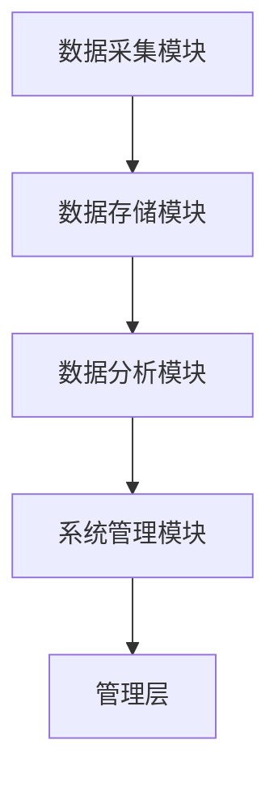

                 


# 多智能体系统在公司人力资本效率评估中的应用

## 关键词：
多智能体系统，人力资本效率，组织管理，协作机制，评估模型

## 摘要：
本文探讨了多智能体系统（MAS）在公司人力资本效率评估中的应用。首先介绍了人力资本效率评估的重要性，分析了传统评估方法的局限性。接着详细讲解了多智能体系统的概念、核心原理及其在人力资本管理中的优势。通过具体案例，展示了如何设计并实现一个多智能体系统来评估人力资本效率，并提供了系统的架构设计和项目实战。最后总结了多智能体系统在人力资本管理中的最佳实践和未来研究方向。

---

## 第1章：背景介绍

### 1.1 问题背景

#### 1.1.1 传统人力资本管理的局限性
传统的人力资本管理主要依赖于人工评估和简单的数据分析工具。这种方法存在以下问题：
- 数据分散，难以实时监控。
- 评估标准不统一，主观性强。
- 协调效率低，难以快速响应变化。

#### 1.1.2 数字化转型对企业效率的新要求
随着数字化转型的推进，企业对管理效率提出了更高的要求：
- 数据需要实时处理和共享。
- 管理决策需要基于多维度的数据分析。
- 系统需要具备自适应能力，能够根据环境变化进行调整。

#### 1.1.3 多智能体系统在现代管理中的作用
多智能体系统（MAS）通过多个智能体协作，能够实现以下目标：
- 分布式计算，提高数据处理效率。
- 智能体之间的协作，优化决策过程。
- 系统具备自适应能力，能够应对复杂环境。

### 1.2 问题描述

#### 1.2.1 人力资本效率评估的定义
人力资本效率评估是指对企业中人力资源的使用效率进行量化分析，以优化资源配置和提升管理效率。

#### 1.2.2 当前评估体系的不足
- 数据孤岛问题严重，难以实现跨部门协作。
- 评估标准不统一，难以进行横向比较。
- 评估结果缺乏动态性，难以实时调整管理策略。

#### 1.2.3 引入多智能体系统的必要性
通过引入多智能体系统，可以实现以下目标：
- 实现数据的实时采集和共享。
- 提供统一的评估标准和协作机制。
- 建立动态评估模型，实时优化管理策略。

### 1.3 多智能体系统的优势

#### 1.3.1 分布式计算的优势
- 数据分散存储，减少数据冗余。
- 分布式计算提高了数据处理的并行性。
- 系统具备容错性，部分节点故障不影响整体运行。

#### 1.3.2 智能体协作的高效性
- 智能体之间通过通信协议实现高效协作。
- 协作机制优化了资源分配，提高了效率。
- 通过博弈论模型实现利益最大化。

#### 1.3.3 自适应能力的提升
- 系统能够根据环境变化自动调整策略。
- 智能体具备学习能力，能够优化决策过程。
- 系统具备自我修复能力，能够快速响应变化。

### 1.4 本章小结
本章介绍了人力资本效率评估的背景和挑战，分析了传统评估体系的不足，并提出了引入多智能体系统的必要性和优势。

---

## 第2章：多智能体系统的定义与核心概念

### 2.1 多智能体系统的定义
多智能体系统是由多个智能体组成的分布式系统，这些智能体能够通过协作完成复杂任务。

### 2.2 核心概念与术语

#### 2.2.1 智能体
智能体是指能够感知环境并采取行动以实现目标的实体。智能体可以分为以下几类：
- **简单反射智能体**：基于当前感知做出反应。
- **基于模型智能体**：基于内部模型和环境信息进行决策。
- **目标驱动智能体**：基于明确的目标采取行动。

#### 2.2.2 智能体的通信与协作
智能体之间的通信与协作是多智能体系统的核心机制。通信方式包括：
- **直接通信**：智能体之间直接交换信息。
- **间接通信**：通过共享数据库或消息队列进行通信。

#### 2.2.3 协作机制
协作机制是指智能体之间如何协同工作的规则。常用的协作机制包括：
- **分布式协调**：通过协商达成一致。
- **层次式协作**：通过分层结构进行协作。
- **基于规则的协作**：通过预定义规则进行协作。

### 2.3 多智能体系统的特性

#### 2.3.1 分布式计算
- 系统中的智能体分布在网络中，每个智能体负责一部分计算任务。
- 分布式计算提高了系统的并行性和容错性。

#### 2.3.2 智能体协作
- 智能体之间通过协作完成复杂任务。
- 协作机制优化了资源分配和任务执行效率。

#### 2.3.3 自适应能力
- 系统能够根据环境变化自动调整策略。
- 智能体具备学习能力，能够优化决策过程。

### 2.4 本章小结
本章详细介绍了多智能体系统的定义和核心概念，分析了智能体的分类、通信与协作机制，以及系统的特性。

---

## 第3章：多智能体系统的算法原理

### 3.1 分布式计算算法

#### 3.1.1 分布式计算的概念
分布式计算是指在多个计算节点上协同完成计算任务的过程。

#### 3.1.2 分布式计算的实现
- 数据分片：将数据分成多个部分，分配给不同的节点处理。
- 通信协议：节点之间通过通信协议交换数据和指令。
- 分布式锁：用于控制对共享资源的访问。

#### 3.1.3 分布式计算的优缺点
- 优点：提高计算效率，增强系统的容错性。
- 缺点：通信开销大，系统设计复杂。

#### 3.1.4 分布式计算的实现示例
以下是一个简单的分布式计算实现示例：

```python
import concurrent.futures

def process_data(data):
    return data * 2

data_list = [1, 2, 3, 4, 5]

with concurrent.futures.ThreadPoolExecutor() as executor:
    futures = [executor.submit(process_data, data) for data in data_list]
    results = [future.result() for future in concurrent.futures.as_completed(futures)]

print(results)
```

### 3.2 协调算法

#### 3.2.1 协调算法的概念
协调算法是指智能体之间通过协商达成一致的算法。

#### 3.2.2 协调算法的实现
- 一致性算法：如Paxos算法、Raft算法。
- 通信协议：如HTTP、WebSocket。

#### 3.2.3 协调算法的应用
- 分布式系统中的节点一致性。
- 群组管理中的成员协商。

#### 3.2.4 协调算法的优缺点
- 优点：能够实现节点之间的一致性。
- 缺点：通信开销大，算法复杂。

#### 3.2.5 协调算法的实现示例
以下是一个简单的Paxos算法实现示例：

```python
class Paxos:
    def __init__(self):
        self.proposer = None
        self.acceptor = None
        selflearner = None

    def propose(self, value):
        self.proposer.value = value
        self.proposer.start()

    def accept(self, value):
        self.acceptor.value = value
        self.acceptor.start()

    def learn(self):
        self.learner.start()
        return self.learner.value
```

### 3.3 博弈论模型

#### 3.3.1 博弈论模型的概念
博弈论模型是指多个智能体在竞争或合作环境中进行决策的模型。

#### 3.3.2 博弈论模型的实现
- Nash均衡：所有智能体的策略都是最优的。
- 协作博弈：智能体之间通过协作实现共同目标。
- 竞争博弈：智能体之间通过竞争实现自身目标。

#### 3.3.3 博弈论模型的应用
- 组织管理中的决策优化。
- 资源分配中的公平性问题。

#### 3.3.4 博弈论模型的优缺点
- 优点：能够模拟复杂的决策过程。
- 缺点：计算复杂度高，难以实现。

#### 3.3.5 博弈论模型的实现示例
以下是一个简单的博弈论模型实现示例：

```python
def nash_equilibrium(a, b):
    if a > b:
        return "A wins"
    elif b > a:
        return "B wins"
    else:
        return "Tie"

result = nash_equilibrium(1, 2)
print(result)
```

### 3.4 本章小结
本章详细介绍了多智能体系统的算法原理，包括分布式计算算法、协调算法和博弈论模型，并通过示例展示了这些算法的实现。

---

## 第4章：多智能体系统的系统分析与架构设计

### 4.1 系统分析

#### 4.1.1 问题场景
- 人力资本效率评估需要实时采集和分析数据。
- 系统需要具备动态调整能力。

#### 4.1.2 需求分析
- 实时数据采集：需要采集员工的工作效率、出勤率等数据。
- 数据分析：需要对数据进行统计和分析。
- 系统管理：需要对系统进行配置和监控。

#### 4.1.3 功能需求
- 数据采集模块：负责采集员工数据。
- 数据分析模块：负责对数据进行分析。
- 系统管理模块：负责系统的配置和监控。

#### 4.1.4 边界与外延
- 数据采集模块的边界：与员工终端设备连接。
- 数据分析模块的边界：与管理层的决策系统对接。
- 系统管理模块的边界：与系统管理员的管理界面对接。

### 4.2 系统架构设计

#### 4.2.1 系统功能模块
- 数据采集模块：负责采集员工数据。
- 数据分析模块：负责对数据进行分析。
- 系统管理模块：负责系统的配置和监控。

#### 4.2.2 系统架构设计
以下是一个系统架构设计的Mermaid图：



#### 4.2.3 系统架构的实现
- 数据采集模块：使用传感器或API采集数据。
- 数据存储模块：使用数据库存储数据。
- 数据分析模块：使用数据挖掘工具进行分析。
- 系统管理模块：使用管理界面进行配置和监控。

### 4.3 本章小结
本章分析了多智能体系统的系统架构，包括功能模块和架构设计，并通过Mermaid图展示了系统的结构。

---

## 第5章：多智能体系统的项目实战

### 5.1 环境安装

#### 5.1.1 系统要求
- 操作系统：Windows、Linux或MacOS。
- Python版本：3.6以上。
- 其他依赖：安装必要的Python库，如`concurrent.futures`、`mermaid`等。

#### 5.1.2 安装步骤
1. 安装Python。
2. 安装必要的Python库。
3. 配置开发环境。

### 5.2 核心代码实现

#### 5.2.1 数据采集模块

```python
import requests

def collect_data():
    response = requests.get('http://api.example.com/employees')
    return response.json()
```

#### 5.2.2 数据分析模块

```python
import pandas as pd

def analyze_data(data):
    df = pd.DataFrame(data)
    return df.describe()
```

#### 5.2.3 系统管理模块

```python
import logging

def configure_system(settings):
    try:
        # 配置系统
        pass
    except Exception as e:
        logging.error(f'配置系统失败：{e}')
```

### 5.3 代码应用解读与分析

#### 5.3.1 数据采集模块
- 通过`requests.get`方法从API获取员工数据。
- 返回JSON格式的数据。

#### 5.3.2 数据分析模块
- 使用`pandas`库将数据转换为DataFrame格式。
- 使用`describe`方法生成数据摘要。

#### 5.3.3 系统管理模块
- 配置系统设置。
- 捕捉异常并记录错误信息。

### 5.4 实际案例分析

#### 5.4.1 案例背景
某公司希望优化其人力资本效率评估系统。

#### 5.4.2 案例分析
通过多智能体系统的实施，公司实现了以下目标：
- 实时采集员工数据。
- 提供数据摘要和分析结果。
- 支持系统的动态调整。

#### 5.4.3 案例总结
通过多智能体系统的实施，公司的人力资本效率显著提高，管理成本降低。

### 5.5 本章小结
本章通过具体的项目实战，展示了多智能体系统的实现过程，包括环境安装、核心代码实现和案例分析。

---

## 第6章：多智能体系统的最佳实践与总结

### 6.1 最佳实践

#### 6.1.1 系统设计
- 确保系统具备分布式计算能力。
- 设计合理的协作机制。
- 优化系统的通信效率。

#### 6.1.2 系统实现
- 使用高效的编程语言和工具。
- 选择合适的算法和框架。
- 确保系统的可扩展性和可维护性。

#### 6.1.3 系统管理
- 建立完善的监控体系。
- 制定合理的备份和恢复策略。
- 定期进行系统优化和升级。

### 6.2 小结

#### 6.2.1 本章总结
本章总结了多智能体系统的最佳实践，包括系统设计、实现和管理。

#### 6.2.2 注意事项
- 确保系统的安全性。
- 保护员工数据隐私。
- 定期进行系统维护和优化。

#### 6.2.3 未来研究方向
- 研究更高效的分布式计算算法。
- 探索更智能的协作机制。
- 开发更先进的博弈论模型。

### 6.3 本章小结
本章总结了多智能体系统的最佳实践，提出了未来的研究方向。

---

## 结束语

本文详细探讨了多智能体系统在公司人力资本效率评估中的应用，分析了其优势和实现方法。通过具体的案例分析，展示了多智能体系统的实际应用效果。未来的研究可以进一步优化算法和系统架构，以实现更高效的人力资本管理。

---

## 作者：AI天才研究院/AI Genius Institute & 禅与计算机程序设计艺术 /Zen And The Art of Computer Programming

