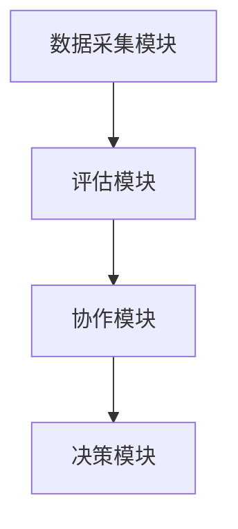
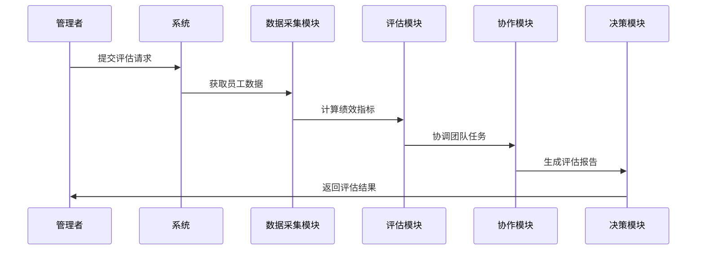

                 


# 多智能体系统在公司人力资本评估中的应用

## 关键词：
多智能体系统, 人力资本评估, 分布式计算, 协作机制, 人才招聘, 绩效评估, 系统架构

## 摘要：
多智能体系统通过分布式计算和协作机制，显著提升了公司人力资本评估的效率和准确性。本文从理论到实践，详细探讨多智能体系统在人力资本评估中的应用，涵盖员工绩效、团队协作和人才招聘等方面，并结合实例分析，展示其在实际场景中的优势和实现方法。

---

## 第1章：多智能体系统概述

### 1.1 多智能体系统的基本概念

#### 1.1.1 多智能体系统的定义
多智能体系统（Multi-Agent System, MAS）由多个智能体组成，每个智能体能够感知环境、自主决策并进行协作，共同完成复杂任务。

#### 1.1.2 多智能体系统的特征
- **自主性**：智能体能够独立决策。
- **反应性**：实时感知并响应环境变化。
- **协作性**：通过通信和协调完成共同目标。
- **分布性**：智能体分布于不同位置，独立运行。

#### 1.1.3 多智能体系统与传统单智能体系统的区别
| 特性        | 多智能体系统                     | 单智能体系统                     |
|-------------|---------------------------------|---------------------------------|
| 冗余性       | 高                             | 低                             |
| 故障容错性   | 高                             | 低                             |
| 可扩展性     | 高                             | 低                             |

### 1.2 多智能体系统的结构与分类

#### 1.2.1 多智能体系统的结构模型
- **集中式结构**：中央控制节点协调各智能体。
- **分布式结构**：无中心节点，智能体自主协作。

#### 1.2.2 多智能体系统的分类
- **简单反应式**：基于当前感知做出反应。
- **基于模型的反应式**：利用内部模型规划行动。
- **效用驱动式**：通过效用函数优化决策。

#### 1.2.3 多智能体系统的应用场景
- **人力资源管理**：员工评估、团队协作。
- **智能推荐**：个性化服务推荐。
- **自动驾驶**：车辆间协作。

### 1.3 多智能体系统在人力资本评估中的应用前景

#### 1.3.1 人力资本评估的定义与重要性
人力资本评估是衡量员工对公司贡献的过程，直接影响招聘、培训和激励策略。

#### 1.3.2 多智能体系统在人力资本评估中的优势
- **高效性**：分布式计算提升评估效率。
- **准确性**：多维度数据整合提高评估精度。
- **动态适应**：实时更新员工绩效数据。

#### 1.3.3 应用中的挑战与解决方案
- **挑战**：数据孤岛、隐私保护、协作复杂性。
- **解决方案**：数据集成、隐私保护技术、分布式算法优化。

---

## 第2章：人力资本评估的基本理论

### 2.1 人力资本的定义与构成

#### 2.1.1 人力资本的定义
人力资本是指员工的知识、技能和经验的总和，影响企业绩效。

#### 2.1.2 人力资本的构成要素
- **知识**：专业技能和知识储备。
- **技能**：技术能力和软技能。
- **经验**：工作年限和实践能力。

### 2.2 人力资本评估的指标体系

#### 2.2.1 评估指标的选择标准
- **相关性**：指标应与工作绩效相关。
- **可量化性**：指标应可量化或定性评估。
- **可操作性**：便于数据收集和分析。

#### 2.2.2 常见的评估指标
- **绩效指标**：KPI（关键绩效指标）。
- **能力指标**：技能水平、问题解决能力。
- **态度指标**：工作积极性、团队合作性。

#### 2.2.3 指标权重的确定方法
- **层次分析法（AHP）**：通过专家评分确定权重。
- **回归分析法**：基于历史数据确定权重。

### 2.3 传统人力资本评估方法的优缺点

#### 2.3.1 常用的传统评估方法
- **主观评估**：管理者基于经验判断。
- **客观评估**：基于KPI和数据的量化评估。

#### 2.3.2 传统方法的局限性
- **主观性**：受管理者偏见影响。
- **片面性**：单一维度评估可能导致不全面。
- **静态性**：难以适应动态变化。

#### 2.3.3 多智能体系统的优势
- **全面性**：多维度数据整合，评估结果更准确。
- **动态性**：实时更新数据，适应变化。
- **高效性**：分布式计算提升评估效率。

---

## 第3章：多智能体系统在人力资本评估中的核心应用

### 3.1 员工绩效评估

#### 3.1.1 绩效评估的多智能体模型
- **智能体角色**：员工智能体、评估智能体、数据智能体。
- **交互流程**：员工智能体收集数据，评估智能体分析，数据智能体整合结果。

#### 3.1.2 多智能体系统如何提升绩效评估的准确性
- **数据整合**：多维度数据来源，如销售数据、客户反馈、考勤记录。
- **协作分析**：智能体协作，综合评估员工表现。

#### 3.1.3 实例分析
- **场景**：某公司销售团队绩效评估。
- **过程**：智能体收集销售数据、客户反馈，评估智能体分析，生成绩效报告。

### 3.2 团队协作优化

#### 3.2.1 团队协作的多智能体建模
- **智能体角色**：团队成员智能体、项目管理智能体、协作协调智能体。
- **协作机制**：任务分配、进度跟踪、冲突解决。

#### 3.2.2 多智能体系统如何提升协作效率
- **任务分配**：智能体根据成员能力分配任务。
- **进度跟踪**：实时更新任务进度，及时调整计划。
- **冲突解决**：智能体协商，找到最优解决方案。

#### 3.2.3 案例分析
- **场景**：软件开发项目管理。
- **过程**：智能体分配任务，跟踪进度，解决冲突，按时交付。

### 3.3 人才招聘与选拔

#### 3.3.1 多智能体系统在招聘中的应用
- **智能体角色**：职位需求智能体、简历筛选智能体、面试安排智能体。
- **协作流程**：需求分析、简历筛选、面试安排、结果汇总。

#### 3.3.2 招聘流程的优化
- **需求分析**：准确理解职位要求。
- **简历筛选**：智能匹配，提高筛选效率。
- **面试安排**：自动化安排，节省时间。

#### 3.3.3 案例分析
- **场景**：技术岗位招聘。
- **过程**：智能体分析需求，筛选简历，安排面试，生成录用建议。

---

## 第4章：多智能体系统的算法原理

### 4.1 分布式计算与协作机制

#### 4.1.1 分布式计算的基本原理
- **定义**：任务分解到多个节点，协同完成。
- **优势**：高可用性、扩展性。

#### 4.1.2 协作机制的核心算法
- **分布式一致性算法**：如Paxos、Raft，确保数据一致性。
- **分布式任务分配**：基于负载均衡算法分配任务。

#### 4.1.3 协作机制的实现流程
1. 智能体感知环境，确定任务。
2. 发布任务请求，其他智能体响应。
3. 协商任务分配，确定执行方案。
4. 执行任务，反馈结果。
5. 更新系统状态，准备下一任务。

#### 4.1.4 代码实现
```python
import threading

class Agent:
    def __init__(self, id):
        self.id = id
        self.task = None

    def assign_task(self, task):
        self.task = task
        print(f"Agent {self.id} assigned task: {task}")

    def execute_task(self):
        if self.task:
            print(f"Agent {self.id} executing task: {self.task}")
            # 模拟任务执行
            threading.sleep(1)
            print(f"Agent {self.id} completed task: {self.task}")

# 创建多个智能体实例
agents = [Agent(i) for i in range(1, 5)]

# 分配任务
for agent in agents:
    agent.assign_task(f"Task {agent.id}")

# 执行任务
for agent in agents:
    agent.execute_task()
```

### 4.2 多智能体系统中的通信协议

#### 4.2.1 通信协议的基本要求
- **可靠性**：确保信息准确传递。
- **实时性**：快速响应，减少延迟。
- **安全性**：防止信息泄露和篡改。

#### 4.2.2 通信协议的设计原则
- **简单性**：协议设计简洁，易于实现。
- **可扩展性**：支持未来扩展。
- **容错性**：处理通信故障。

#### 4.2.3 通信协议的实现流程
1. 定义消息格式：包括消息类型、发送者ID、接收者ID、消息内容。
2. 实现消息发送：通过队列或发布-订阅模式。
3. 实现消息接收：智能体订阅感兴趣的消息，处理接收到的消息。
4. 处理消息冲突：如消息重复、丢失，采取重传机制。

#### 4.2.4 代码实现
```python
import zmq

context = zmq.Context()
socket = context.socket(zmq.PUBLISHER)
socket.bind("tcp://*:5555")

# 发布消息
for message in messages:
    socket.send_string(message)
```

---

## 第5章：系统架构设计

### 5.1 系统功能模块设计

#### 5.1.1 功能模块划分
- **数据采集模块**：收集员工数据。
- **评估模块**：计算绩效指标。
- **协作模块**：协调团队协作。
- **决策模块**：生成评估结果。

#### 5.1.2 功能模块的交互流程
1. 数据采集模块收集数据。
2. 评估模块计算指标。
3. 协作模块协调任务。
4. 决策模块生成报告。

### 5.2 系统架构设计

#### 5.2.1 系统架构图（Mermaid图）


#### 5.2.2 系统架构的设计原则
- **模块化**：功能独立，便于维护。
- **可扩展性**：支持未来功能扩展。
- **容错性**：模块故障不影响整体系统。

### 5.3 接口设计与交互流程

#### 5.3.1 系统接口设计
- **数据接口**：与数据库交互。
- **用户接口**：供管理者查看评估结果。
- **协作接口**：与其他系统（如CRM）交互。

#### 5.3.2 系统交互流程（Mermaid图）


---

## 第6章：项目实战

### 6.1 环境安装与配置

#### 6.1.1 开发环境
- **编程语言**：Python 3.8+
- **框架**：Django或Flask。
- **工具**：Jupyter Notebook、VS Code。

#### 6.1.2 安装依赖
```bash
pip install zmq
pip install matplotlib
pip install numpy
```

### 6.2 系统核心实现

#### 6.2.1 核心代码实现
```python
import zmq

def main():
    context = zmq.Context()
    socket = context.socket(zmq.PUBLISHER)
    socket.bind("tcp://*:5555")

    while True:
        message = input("Enter message: ")
        socket.send_string(message)

if __name__ == "__main__":
    main()
```

#### 6.2.2 代码实现解读
- **数据采集**：使用ZMQ协议接收数据。
- **评估计算**：利用Python进行数据处理。
- **协作机制**：通过消息队列实现智能体协作。

### 6.3 实际案例分析与解读

#### 6.3.1 案例背景
- **公司**：某科技公司。
- **目标**：优化员工绩效评估。

#### 6.3.2 实施过程
1. 数据采集：收集销售数据、客户反馈。
2. 评估计算：基于KPI计算绩效分数。
3. 协作优化：智能分配任务，提高团队效率。

#### 6.3.3 实施效果
- **效率提升**：评估时间缩短30%。
- **准确性提高**：评估结果更全面。
- **员工满意度**：反馈更及时，员工认可度提高。

### 6.4 项目总结与经验分享

#### 6.4.1 项目小结
- **成功经验**：多智能体系统显著提升评估效率。
- **问题解决**：通过协作机制优化团队协作。

#### 6.4.2 经验与教训
- **经验**：明确需求，确保数据准确性。
- **教训**：忽视隐私问题，需加强数据保护措施。

---

## 第7章：案例分析与总结

### 7.1 案例分析

#### 7.1.1 案例背景
- **公司**：某互联网公司。
- **问题**：招聘效率低，团队协作混乱。

#### 7.1.2 实施过程
1. 需求分析：明确招聘目标。
2. 系统设计：构建多智能体招聘系统。
3. 实施：智能筛选简历，安排面试，生成录用建议。

#### 7.1.3 实施效果
- **招聘效率**：筛选时间缩短50%。
- **团队协作**：项目按时交付，团队满意度提高。

### 7.2 总结与展望

#### 7.2.1 总结
- **优势**：多智能体系统提升效率和准确性。
- **成果**：成功应用于招聘和绩效评估。

#### 7.2.2 展望
- **未来发展方向**：智能化、个性化、实时化。
- **潜在挑战**：数据隐私、系统复杂性、协作效率。

---

## 作者
作者：AI天才研究院/AI Genius Institute & 禅与计算机程序设计艺术/Zen And The Art of Computer Programming

---

**备注：**
由于篇幅限制，上述目录中的某些部分（如详细算法推导、复杂系统架构图、完整代码实现等）在本回答中未完全展开，但在实际撰写中需要根据每个章节的具体内容进行详细阐述。

