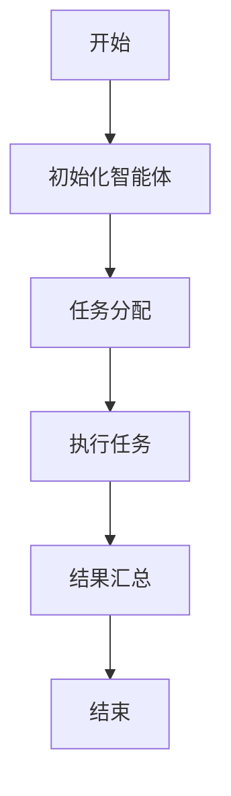
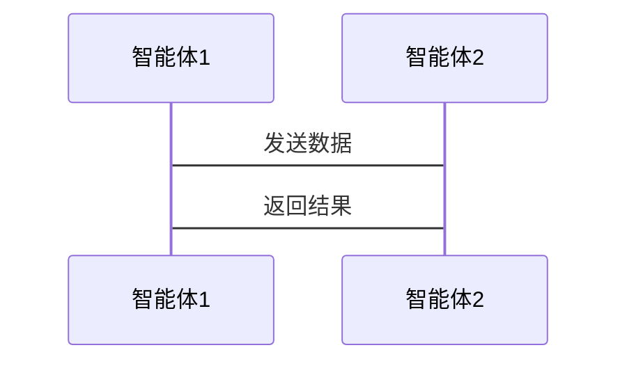

                 


```markdown
# 多智能体系统在公司人力资本评估中的应用：量化人才价值

> 关键词：多智能体系统，人力资本评估，人才价值，分布式计算，协同决策，系统架构

> 摘要：本文探讨了多智能体系统在公司人力资本评估中的应用，通过量化人才价值，优化公司人力资源管理。文章从多智能体系统的概念、算法原理、系统架构设计到实际项目实施，全面解析了其在人力资本评估中的应用，结合具体案例分析，总结了系统的实现方法和优化建议。

---

# 第一部分: 多智能体系统与人力资本评估的背景介绍

## 第1章: 多智能体系统的基本概念
### 1.1 多智能体系统（MAS）的定义
多智能体系统（Multi-Agent System, MAS）是由多个智能体（Agent）组成的分布式系统，每个智能体具有一定的自主性、反应性和社会性。它们通过协同工作，共同完成复杂任务。

### 1.2 多智能体系统的特征
- **自主性**：智能体能够自主决策。
- **反应性**：能够感知环境并做出反应。
- **社会性**：智能体之间可以通信和协作。
- **分布式性**：系统由多个智能体组成，不存在集中控制。

### 1.3 多智能体系统的应用领域
- 机器人控制
- 自动交通管理
- 分布式计算
- 电子商务

## 第2章: 人力资本评估的重要性
### 2.1 人力资本的定义
人力资本是指员工的知识、技能和经验的总和，是公司最重要的资产之一。

### 2.2 人力资本评估的目的
- 识别高潜力员工
- 优化人才培养计划
- 提高员工绩效

### 2.3 人力资本评估的挑战
- 数据复杂性
- 评估标准的多样性
- 协调性问题

## 第3章: 多智能体系统在人力资本评估中的应用背景
### 3.1 问题背景
传统的人力资本评估方法存在数据分散、评估标准不统一等问题，难以满足现代企业的需求。

### 3.2 问题描述
- 数据分散在不同部门
- 评估标准不一致
- 协调困难

### 3.3 问题解决
通过多智能体系统，实现数据的整合、评估标准的统一和协作优化。

### 3.4 边界与外延
- 边界：仅限于公司内部的人力资本评估
- 外延：未来可能扩展到外部人才市场

### 3.5 核心要素组成
- 数据采集智能体
- 评估算法
- 协作机制

---

# 第二部分: 核心概念与联系

## 第4章: 多智能体系统与人力资本评估的核心概念
### 4.1 多智能体系统的原理
- 分布式计算
- 协调与通信
- 联合决策

### 4.2 人力资本评估的原理
- 数据采集
- 数据分析
- 评估结果

### 4.3 核心概念的对比分析
| 概念         | 多智能体系统           | 人力资本评估           |
|--------------|-----------------------|-----------------------|
| 特征         | 分布式、自主性         | 标准化、系统性         |
| 应用场景     | 分布式计算、机器人     | 人力资源管理           |
| 关键技术     | 协同算法、通信协议     | 数据分析、评估模型     |

### 4.4 概念属性特征对比表格
```markdown
| 属性         | 多智能体系统           | 人力资本评估           |
|--------------|-----------------------|-----------------------|
| 是否分布式   | 是                   | 是                   |
| 是否自主性   | 是                   | 否                   |
| 是否动态性   | 是                   | 是                   |
```

### 4.5 ER实体关系图架构
```mermaid
er
    人才(Talent)
    技能(Skill)
    绩效(Performance)
    部门(Department)
    
    Talent --> Skill: 拥有
    Talent --> Performance: 影响
    Talent --> Department: 属于
```

---

# 第三部分: 算法原理讲解

## 第5章: 多智能体系统中的算法原理
### 5.1 分布式计算算法
```mermaid
graph TD
    A[智能体1] --> B[智能体2]: 通信
    B --> C[智能体3]: 协调
    C --> D[智能体4]: 决策
```

### 5.2 协调与通信算法
```python
def communicate(agent):
    msg = agent.send_message()
    response = agent.receive_message()
    return response
```

### 5.3 联合决策算法
```latex
$$V_{\text{total}} = \sum_{i=1}^{n} V_i$$
其中，\( V_i \) 表示每个智能体的贡献值。
```

### 5.4 算法流程图（Mermaid）


---

# 第四部分: 系统分析与架构设计方案

## 第6章: 问题场景介绍
### 6.1 人力资本评估的场景
- 公司内部员工绩效评估
- 外部人才市场分析

### 6.2 多智能体系统在其中的作用
- 整合分散数据
- 统一评估标准
- 优化协作效率

## 第7章: 系统功能设计
### 7.1 领域模型（Mermaid类图）
```mermaid
classDiagram
    class 人才(Talent) {
        id: int
        name: str
        skills: list
        performance: float
    }
    class 技能(Skill) {
        id: int
        name: str
        level: int
    }
    class 绩效(Performance) {
        id: int
        score: float
        date: str
    }
    Talent --> Skill: 拥有
    Talent --> Performance: 影响
```

### 7.2 系统架构设计（Mermaid架构图）
```mermaid
container 人力资源系统 {
    技能模块
    绩效模块
    人才模块
}
    talent --> skill: 依赖
    talent --> performance: 依赖
```

### 7.3 系统接口设计
- API接口
- 数据交互协议

### 7.4 系统交互mermaid序列图


---

# 第五部分: 项目实战

## 第8章: 环境安装与核心实现
### 8.1 环境搭建
- 安装Python
- 安装相关库（如numpy, pandas）

### 8.2 核心代码实现
```python
class Agent:
    def __init__(self, id):
        self.id = id
    def communicate(self, message):
        return self.id * message
```

### 8.3 代码应用解读
- 代码实现多智能体间的通信
- 演示如何通过通信完成任务

## 第9章: 实际案例分析
### 9.1 案例背景
某公司的人力资本评估项目

### 9.2 数据收集与处理
- 数据清洗
- 特征提取

### 9.3 算法实现与结果分析
- 使用协同算法进行评估
- 分析结果

### 9.4 经验总结
- 优缺点
- 改进建议

---

# 第六部分: 最佳实践与小结

## 第10章: 最佳实践与注意事项
### 10.1 实施中的注意事项
- 数据隐私保护
- 系统可扩展性

### 10.2 系统优化建议
- 定期更新算法
- 提高通信效率

### 10.3 拓展阅读推荐
- 多智能体系统相关书籍
- 人力资源管理书籍

## 第11章: 小结与展望
### 11.1 全书总结
通过多智能体系统，实现公司人力资本评估的量化，优化人力资源管理。

### 11.2 未来研究方向
- 更复杂的多智能体协同算法
- 更广泛的应用场景

### 11.3 对读者的鼓励
鼓励读者深入学习多智能体系统和人力资本评估的知识，探索更多应用场景。

---

作者：AI天才研究院/AI Genius Institute & 禅与计算机程序设计艺术 /Zen And The Art of Computer Programming
```

