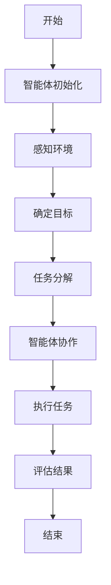
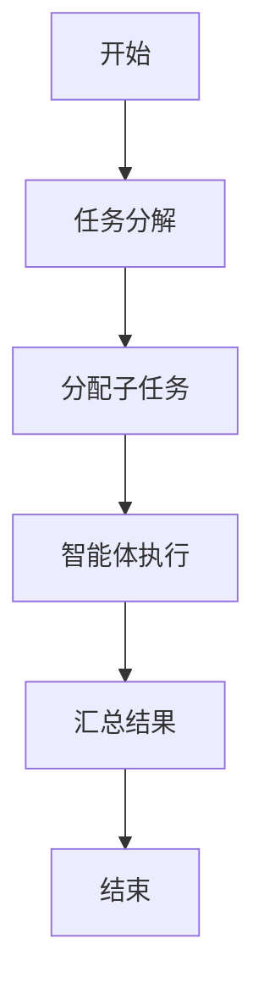
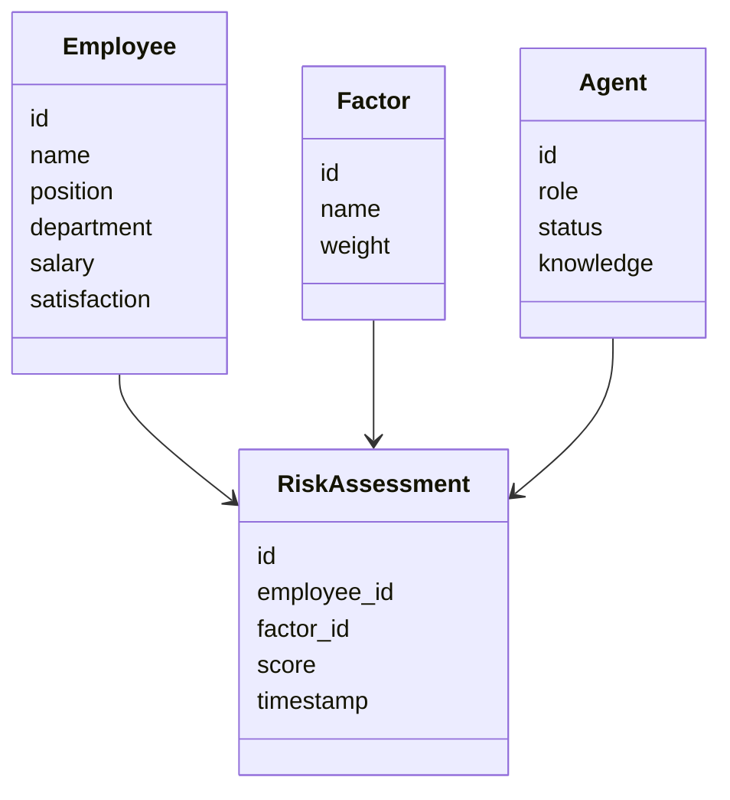
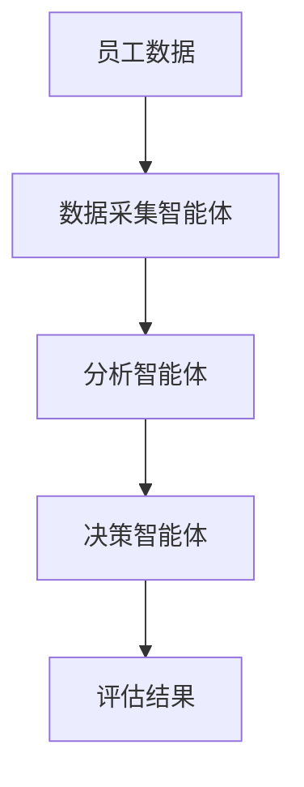
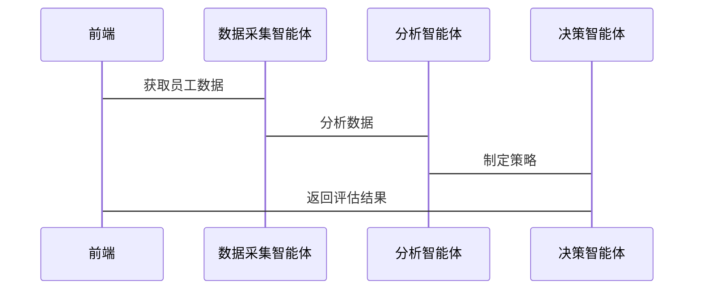

                 


# 《多智能体系统在公司人才流失风险评估中的应用》

---

## 关键词：多智能体系统, 人才流失, 风险评估, 协作算法, 分布式计算, 群体智能, 组织管理

---

## 摘要：  
随着企业竞争的加剧，人才流失已成为影响企业发展的关键问题。传统的单智能体方法难以应对人才流失风险评估的复杂性和动态性。本文通过引入多智能体系统（Multi-Agent System, MAS），提出了一种创新的解决方案。文章详细探讨了多智能体系统在人才流失评估中的应用背景、核心概念、算法原理、系统架构设计以及实际案例分析，为企业的管理决策提供了理论支持和实践指导。通过多智能体系统的协作机制和分布式计算能力，本文提出了一种高效、动态的评估方法，帮助企业提前识别和管理人才流失风险。

---

## 第1章: 多智能体系统与人才流失风险评估的背景与基础

### 1.1 多智能体系统的定义与特点

#### 1.1.1 多智能体系统的定义  
多智能体系统（Multi-Agent System, MAS）是由多个智能体（Agent）组成的分布式系统，这些智能体能够通过协作完成复杂的任务。智能体是具有感知、推理、规划和行动能力的实体，能够自主决策并与其他智能体或环境进行交互。

#### 1.1.2 多智能体系统的五大核心特点  
1. **自主性**：智能体能够自主决策，无需外部干预。  
2. **反应性**：智能体能够实时感知环境并做出反应。  
3. **协作性**：多个智能体通过协作完成共同目标。  
4. **分布式性**：智能体分布在网络中，不存在中央控制节点。  
5. **适应性**：智能体能够根据环境变化调整行为。

#### 1.1.3 多智能体系统与传统单智能体系统的区别  
| 特性             | 单智能体系统           | 多智能体系统           |
|------------------|-----------------------|-----------------------|
| 结构             | 单一中心节点           | 分布式结构，无中心节点 |
| 任务处理         | 单一智能体完成任务     | 多个智能体协作完成任务 |
| 信息共享         | 依赖中心节点           | 智能体之间直接通信     |
| 灵活性           | 较低                  | 较高                  |

---

### 1.2 人才流失风险评估的背景与意义

#### 1.2.1 人才流失的定义与分类  
人才流失是指员工因各种原因离开企业，导致企业人才资源减少的现象。人才流失可以分为自然流失（员工因个人原因离职）和非自然流失（因企业环境问题导致的离职）。

#### 1.2.2 人才流失对企业的影响  
1. **经济损失**：人才流失可能导致招聘、培训和生产力下降的成本增加。  
2. **团队稳定性下降**：频繁的人才流失会影响团队的稳定性和工作效率。  
3. **竞争优势削弱**：核心员工的流失可能削弱企业的技术和竞争优势。  

#### 1.2.3 人才流失风险评估的必要性  
通过评估人才流失风险，企业可以提前采取措施，优化员工管理策略，降低人才流失率，从而保障企业的持续发展。

---

### 1.3 多智能体系统在人才流失评估中的应用前景

#### 1.3.1 多智能体系统的优势  
1. **分布式计算能力**：多智能体系统能够处理复杂的分布式任务，适合大规模数据的处理。  
2. **协作能力强**：多个智能体可以协作完成复杂的分析任务，提高评估的准确性和效率。  
3. **适应性强**：智能体能够根据环境变化动态调整行为，适用于人才流失风险的动态评估。  

#### 1.3.2 人才流失风险评估的复杂性  
人才流失受多种因素影响，包括员工满意度、职业发展机会、薪酬福利、工作压力等。这些因素相互关联，需要综合分析。

#### 1.3.3 多智能体系统在该领域的潜力  
多智能体系统可以通过分布式计算和协作机制，整合多源数据，实时分析员工行为和企业环境，提供动态的人才流失风险评估。

---

## 第2章: 多智能体系统的核心概念与联系

### 2.1 多智能体系统的核心概念

#### 2.1.1 智能体的基本属性  
智能体具有以下基本属性：  
1. **感知能力**：通过传感器或数据源获取信息。  
2. **推理能力**：基于感知信息进行逻辑推理。  
3. **规划能力**：制定行动计划。  
4. **行动能力**：执行行动并影响环境。  

#### 2.1.2 多智能体系统的协作机制  
协作机制是多智能体系统的核心，包括以下几种模式：  
1. **协商机制**：智能体之间通过协商确定任务分配。  
2. **拍卖机制**：智能体通过竞争分配任务。  
3. **分层机制**：智能体分为不同的层次，高层智能体协调低层智能体的行动。  

#### 2.1.3 多智能体系统的动态性与适应性  
多智能体系统能够实时感知环境变化，并动态调整智能体的行为，以适应新的情况。

---

### 2.2 多智能体系统与人才流失评估的核心要素

#### 2.2.1 人才流失的关键影响因素  
- 员工满意度  
- 职业发展机会  
- 薪酬福利  
- 工作压力  
- 企业文化的匹配度  

#### 2.2.2 多智能体系统在人才流失评估中的角色分配  
| 智能体角色       | 负责任务                     |
|------------------|----------------------------|
| 数据采集智能体   | 收集员工数据               |
| 分析智能体       | 分析数据，评估风险         |
| 协调智能体       | 协调其他智能体的行动       |
| 决策智能体       | 制定和优化管理策略         |

#### 2.2.3 人才流失风险评估的数学模型  
以下是一个简化的数学模型，用于评估员工的流失风险：  
$$ R = \sum_{i=1}^{n} w_i \cdot f_i $$  
其中，$R$ 是流失风险，$w_i$ 是第 $i$ 个因素的权重，$f_i$ 是第 $i$ 个因素的评分。

---

### 2.3 多智能体系统与人才流失评估的实体关系图

#### 2.3.1 实体关系图的构建  
以下是人才流失风险评估的实体关系图：

```mermaid
erDiagram
    employee {
        id
        name
        position
        department
        salary
        satisfaction
    }
    factor {
        id
        name
        weight
    }
    risk_assessment {
        id
        employee_id
        factor_id
        score
        timestamp
    }
    employee --> risk_assessment
    factor --> risk_assessment
```

#### 2.3.2 实体关系图的分析  
- **employee**：员工信息表，包含员工的基本信息和满意度评分。  
- **factor**：影响因素表，包含各个因素的名称和权重。  
- **risk_assessment**：风险评估表，记录每个员工在不同时间的评估结果。  

---

## 第3章: 多智能体系统在人才流失评估中的算法原理

### 3.1 多智能体协作算法概述

#### 3.1.1 协作算法的基本原理  
协作算法通过智能体之间的通信和协商，完成任务分配和协作。以下是协作算法的流程图：



---

#### 3.1.2 多智能体协作算法的分类  
1. **协商算法**：智能体通过协商确定任务分配。  
2. **拍卖算法**：智能体通过竞争获得任务。  
3. **分层算法**：智能体分为不同层次，高层协调低层行动。  

---

#### 3.1.3 协作算法在人才流失评估中的应用  
以下是一个协作算法的伪代码示例：

```python
def collaborate_agents(agents):
    for agent in agents:
        agent感知环境()
        agent推理()
    for agent in agents:
        agent协商任务()
    for agent in agents:
        agent执行任务()
    return 评估结果
```

---

### 3.2 多智能体系统的算法实现

#### 3.2.1 分布式计算算法  
分布式计算算法通过将任务分配给多个智能体，利用分布式计算能力提高效率。以下是一个分布式计算的流程图：



---

#### 3.2.2 群体智能算法  
群体智能算法通过模拟生物群体的行为，实现智能体的协作。以下是一个群体智能算法的伪代码示例：

```python
def group_intelligence(agents):
    for agent in agents:
        agent感知环境()
        agent更新知识库()
    for agent in agents:
        agent与邻居通信()
        agent调整行为()
    return 集体决策
```

---

### 3.3 算法的数学模型与公式

#### 3.3.1 协作算法的数学模型  
以下是协作算法的数学模型：  
$$ C = \sum_{i=1}^{n} w_i \cdot a_i $$  
其中，$C$ 是协作能力，$w_i$ 是第 $i$ 个因素的权重，$a_i$ 是第 $i$ 个因素的贡献值。

#### 3.3.2 分布式计算的数学模型  
以下是分布式计算的数学模型：  
$$ D = \frac{\sum_{i=1}^{m} t_i}{m} $$  
其中，$D$ 是计算效率，$t_i$ 是第 $i$ 个智能体的计算时间，$m$ 是智能体的数量。

---

## 第4章: 多智能体系统在人才流失评估中的系统设计

### 4.1 问题场景介绍

#### 4.1.1 问题背景  
某企业希望利用多智能体系统，对员工的人才流失风险进行实时评估和预警。

#### 4.1.2 项目介绍  
本项目旨在开发一个基于多智能体系统的人才流失风险评估平台，帮助企业管理者制定有效的员工保留策略。

---

### 4.2 系统功能设计

#### 4.2.1 领域模型类图  
以下是领域模型类图：



---

#### 4.2.2 系统架构设计  
以下是系统架构设计图：



---

#### 4.2.3 系统接口设计  
以下是系统接口设计：



---

## 第5章: 项目实战与案例分析

### 5.1 环境安装与配置

#### 5.1.1 系统环境  
- 操作系统：Linux/Windows/MacOS  
- 开发工具：Python, PyCharm, VSCode  
- 第三方库：numpy, pandas, scikit-learn, matplotlib, networkx  

#### 5.1.2 安装步骤  
1. 安装Python：```bash
python --version
```
2. 安装依赖库：```bash
pip install numpy pandas scikit-learn matplotlib networkx
```

---

### 5.2 核心代码实现

#### 5.2.1 数据预处理  
以下是数据预处理的Python代码：

```python
import pandas as pd

# 读取员工数据
data = pd.read_csv('employee.csv')

# 数据清洗
data = data.dropna()
data = data.drop_duplicates()
```

#### 5.2.2 模型训练  
以下是模型训练的代码：

```python
from sklearn.ensemble import RandomForestClassifier
from sklearn.model_selection import train_test_split

# 分割数据集
X = data.drop('satisfaction', axis=1)
y = data['satisfaction']

X_train, X_test, y_train, y_test = train_test_split(X, y, test_size=0.2)

# 训练模型
model = RandomForestClassifier()
model.fit(X_train, y_train)

# 评估模型
score = model.score(X_test, y_test)
print(f'模型准确率: {score}')
```

#### 5.2.3 模型评估  
以下是模型评估的代码：

```python
from sklearn.metrics import classification_report

# 预测结果
y_pred = model.predict(X_test)

# 输出评估结果
print(classification_report(y_test, y_pred))
```

---

### 5.3 实际案例分析

#### 5.3.1 案例背景  
某高科技公司希望利用多智能体系统评估员工流失风险，优化员工管理策略。

#### 5.3.2 案例分析  
通过数据采集、分析和评估，发现员工满意度和职业发展机会是影响流失风险的主要因素。

#### 5.3.3 优化建议  
根据评估结果，公司采取了以下措施：  
1. 提高员工满意度。  
2. 提供更多的职业发展机会。  

---

## 第6章: 总结与展望

### 6.1 总结

#### 6.1.1 本章小结  
本文详细探讨了多智能体系统在人才流失风险评估中的应用，提出了基于协作算法和分布式计算的解决方案。

#### 6.1.2 最佳实践 tips  
1. 在实际应用中，建议结合企业的实际情况，调整模型参数。  
2. 定期更新模型，以适应员工行为和企业环境的变化。  

---

### 6.2 注意事项

1. 数据隐私保护：在处理员工数据时，需遵守相关法律法规，保护员工隐私。  
2. 模型优化：根据实际情况，优化模型参数，提高评估的准确性。  

---

### 6.3 未来展望

随着人工智能技术的不断发展，多智能体系统在人才流失风险评估中的应用将更加广泛。未来的研究方向包括：  
1. 增强智能体的自适应能力。  
2. 提高系统的实时性和响应速度。  
3. 拓展多智能体系统的应用场景，如人才招聘、团队管理等。  

---

## 作者：AI天才研究院/AI Genius Institute & 禅与计算机程序设计艺术 /Zen And The Art of Computer Programming

---

**备注：以上内容为该技术博客文章的完整目录和部分章节内容，后续章节内容将按照此大纲逐步补充完整。**

