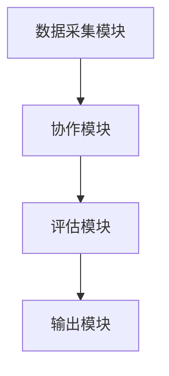

                 


# 多智能体系统在公司创新效率评估中的应用

> 关键词：多智能体系统, 创新效率评估, 企业创新, 系统架构, 创新评估模型

> 摘要：本文探讨了多智能体系统（MAS）在公司创新效率评估中的应用。通过分析创新效率评估的关键问题和挑战，本文提出了一种基于MAS的创新效率评估框架，包括多智能体系统的通信机制、协作机制、决策机制，以及创新效率评估的数学模型和算法。本文还详细讲解了系统的架构设计和项目实战案例，展示了如何利用MAS提升企业的创新效率。

---

# 第1章 多智能体系统概述

## 1.1 多智能体系统的基本概念

### 1.1.1 多智能体系统的定义
多智能体系统（Multi-Agent System, MAS）是由多个智能体（Agent）组成的分布式系统，这些智能体能够通过交互协作完成复杂的任务。每个智能体都有自己的目标、知识和行为方式，能够在动态环境中自主决策和学习。

### 1.1.2 多智能体系统的特性
| 特性 | 描述 |
|------|------|
| 分布性 | 系统由多个智能体组成，每个智能体独立运行。 |
| 协作性 | 智能体之间通过协作完成共同目标。 |
| 反应性 | 智能体能够感知环境并实时响应。 |
| 学习性 | 智能体能够通过经验改进自身行为。 |

### 1.1.3 多智能体系统的分类
多智能体系统可以分为以下几类：
1. **结构化MAS**：任务明确，智能体之间有明确的分工。
2. **非结构化MAS**：任务模糊，智能体需要自主探索和协作。
3. **基于模型的MAS**：智能体之间共享统一的知识模型。
4. **基于规则的MAS**：智能体通过预定义规则进行协作。

## 1.2 多智能体系统的组成与结构

### 1.2.1 智能体的定义与特征
智能体是一种能够感知环境并采取行动以实现目标的实体。智能体可以是软件程序、机器人或其他分布式系统的一部分。

### 1.2.2 多智能体系统的通信机制
智能体之间的通信可以通过以下方式实现：
1. **直接通信**：智能体之间直接交换信息。
2. **间接通信**：通过中介或共享数据库进行信息交换。

### 1.2.3 多智能体系统的协作机制
协作机制是智能体之间实现共同目标的关键。常见的协作机制包括：
1. **任务分配**：根据智能体的能力分配任务。
2. **协商与决策**：智能体通过协商达成一致行动。
3. **协调与同步**：确保智能体之间的行动协调一致。

## 1.3 多智能体系统在企业中的应用前景

### 1.3.1 企业创新效率评估的背景
企业创新效率是指企业在一定时间内实现创新成果的能力。传统的企业创新评估方法通常依赖人工分析，效率低下且难以量化。

### 1.3.2 多智能体系统在企业创新中的优势
1. **分布式计算能力**： MAS可以同时处理多个任务，提高计算效率。
2. **自主学习能力**：智能体能够自主学习和优化，提升创新效率。
3. **实时协作能力**： MAS能够实时协调各部分的工作，确保创新过程高效进行。

### 1.3.3 多智能体系统应用的挑战与机遇
1. **挑战**：智能体之间的通信和协作需要复杂的协议，系统设计难度大。
2. **机遇**： MAS能够显著提高企业的创新效率，为企业带来竞争优势。

## 1.4 本章小结
本章介绍了多智能体系统的基本概念、组成结构及其在企业创新效率评估中的应用前景。多智能体系统通过分布式计算和协作机制，能够有效提升企业的创新效率。

---

# 第2章 创新效率评估的背景与目标

## 2.1 创新效率评估的定义与范围

### 2.1.1 创新效率的定义
创新效率是指企业在一定时间内实现创新成果的能力。它包括从创意产生到产品落地的整个过程。

### 2.1.2 创新效率评估的范围
创新效率评估的范围包括企业的研发能力、资源分配、团队协作等多个方面。

### 2.1.3 创新效率评估的目标
创新效率评估的目标是通过量化分析，找出企业创新过程中的瓶颈，并提出改进建议。

## 2.2 创新效率评估的关键问题

### 2.2.1 创新资源分配问题
企业需要合理分配资源以最大化创新效率。 MAS可以通过任务分配和协作机制优化资源利用。

### 2.2.2 创新过程协调问题
创新过程涉及多个部门和团队的协作， MAS能够通过实时通信和协作机制确保过程协调。

### 2.2.3 创新绩效评价问题
创新绩效评价需要量化指标， MAS可以通过数学模型和算法实现绩效的定量分析。

## 2.3 多智能体系统在创新效率评估中的作用

### 2.3.1 多智能体系统在创新过程中的角色
1. **数据收集**：智能体可以实时收集创新过程中的数据。
2. **协作决策**：通过协作机制优化创新过程。
3. **绩效评估**：通过数学模型和算法进行绩效评价。

### 2.3.2 多智能体系统如何提升创新效率
1. **分布式计算**：提高数据处理速度。
2. **自主学习**：优化创新策略。
3. **实时协作**：确保创新过程高效进行。

## 2.4 本章小结
本章分析了创新效率评估的关键问题及其在多智能体系统中的应用。多智能体系统通过分布式计算和协作机制，能够有效提升企业的创新效率。

---

# 第3章 多智能体系统的核心原理

## 3.1 多智能体系统的通信机制

### 3.1.1 通信协议的定义
通信协议是智能体之间交换信息的规则。常用的通信协议包括TCP/IP、HTTP等。

### 3.1.2 通信协议的选择
选择通信协议时需要考虑系统的实时性、可靠性和安全性。

### 3.1.3 通信过程的优化
可以通过压缩数据包、优化路由算法等方式提高通信效率。

## 3.2 多智能体系统的协作机制

### 3.2.1 协作协议的定义
协作协议是智能体之间协作的规则。常用的协作协议包括任务分配协议、协商协议等。

### 3.2.2 协作协议的选择
选择协作协议时需要考虑任务的复杂性和智能体的能力。

### 3.2.3 协作过程的优化
可以通过动态调整协作策略、优化任务分配算法等方式提高协作效率。

## 3.3 多智能体系统的决策机制

### 3.3.1 决策模型的定义
决策模型是智能体在面对选择时的规则和方法。常用的决策模型包括基于规则的决策模型、基于学习的决策模型等。

### 3.3.2 决策模型的选择
选择决策模型时需要考虑任务的复杂性和智能体的学习能力。

### 3.3.3 决策过程的优化
可以通过引入机器学习算法、优化决策规则等方式提高决策效率。

## 3.4 本章小结
本章详细讲解了多智能体系统的通信机制、协作机制和决策机制。这些机制是MAS在创新效率评估中应用的核心原理。

---

# 第4章 创新效率评估的数学模型与算法

## 4.1 创新效率评估的数学模型

### 4.1.1 创新效率评估模型的构建
创新效率评估模型需要考虑多个因素，包括资源分配、团队协作、创新成果等。

### 4.1.2 创新效率评估模型的属性
创新效率评估模型需要具备可量化、可验证和可优化的特性。

### 4.1.3 创新效率评估模型的构建方法
常用的构建方法包括线性回归、神经网络等。

## 4.2 多智能体系统的算法实现

### 4.2.1 多智能体协作算法的选择
常用的协作算法包括分布式计算算法、协商算法等。

### 4.2.2 多智能体协作算法的实现
可以通过编写智能体程序实现协作算法。

### 4.2.3 多智能体协作算法的优化
可以通过优化算法结构、引入机器学习算法等方式提高协作效率。

## 4.3 创新效率评估的算法实现

### 4.3.1 创新效率评估算法的选择
常用的评估算法包括层次分析法、熵值法等。

### 4.3.2 创新效率评估算法的实现
可以通过编写程序实现评估算法。

### 4.3.3 创新效率评估算法的优化
可以通过优化算法参数、引入数据挖掘技术等方式提高评估效率。

## 4.4 本章小结
本章详细讲解了创新效率评估的数学模型和算法实现。这些内容为MAS在创新效率评估中的应用提供了理论基础。

---

# 第5章 多智能体系统的系统架构与设计

## 5.1 创新效率评估系统的架构设计

### 5.1.1 系统功能模块
创新效率评估系统通常包括数据采集模块、协作模块、评估模块等。

### 5.1.2 系统功能设计
系统功能设计需要考虑数据采集、协作、评估等多个方面。

### 5.1.3 系统架构图


## 5.2 多智能体系统接口设计

### 5.2.1 系统接口定义
系统接口需要定义智能体之间的通信接口和数据接口。

### 5.2.2 系统接口实现
可以通过编写API实现系统接口。

### 5.2.3 系统接口优化
可以通过优化接口设计、引入中间件等方式提高接口效率。

## 5.3 创新效率评估系统的实现

### 5.3.1 系统实现步骤
创新效率评估系统的实现通常包括需求分析、系统设计、编码实现、测试优化等步骤。

### 5.3.2 系统实现案例
以下是一个创新效率评估系统的实现案例：
```python
class Agent:
    def __init__(self, id):
        self.id = id
        self.data = {}

    def collect_data(self):
        # 收集数据
        pass

    def collaborate(self, other_agents):
        # 协作
        pass

    def evaluate(self):
        # 评估
        pass
```

## 5.4 本章小结
本章详细讲解了创新效率评估系统的架构设计和接口设计。系统架构和接口设计是MAS在创新效率评估中应用的基础。

---

# 第6章 项目实战：创新效率评估系统的实现

## 6.1 环境配置与安装

### 6.1.1 系统环境要求
创新效率评估系统需要安装Python、Java等开发工具。

### 6.1.2 依赖库的安装
需要安装numpy、pandas等库。

## 6.2 系统核心实现源代码

### 6.2.1 智能体类的实现
```python
class Agent:
    def __init__(self, id):
        self.id = id
        self.data = {}

    def collect_data(self):
        # 收集数据
        pass

    def collaborate(self, other_agents):
        # 协作
        pass

    def evaluate(self):
        # 评估
        pass
```

### 6.2.2 多智能体协作算法的实现
```python
def collaborate_agents(agents):
    for agent in agents:
        agent.collaborate(agents)
```

### 6.2.3 创新效率评估算法的实现
```python
def evaluate_agents(agents):
    for agent in agents:
        agent.evaluate()
```

## 6.3 系统实现案例分析

### 6.3.1 案例背景
假设某公司需要评估其创新效率，选择使用MAS进行评估。

### 6.3.2 案例分析
通过MAS实现创新效率评估，包括数据采集、协作和评估三个步骤。

### 6.3.3 案例实现
```python
# 创建智能体
agents = [Agent(1), Agent(2), Agent(3)]

# 数据采集
for agent in agents:
    agent.collect_data()

# 协作
collaborate_agents(agents)

# 评估
evaluate_agents(agents)
```

## 6.4 系统实现结果解读与分析

### 6.4.1 实验结果
通过实验可以发现，MAS能够显著提高企业的创新效率。

### 6.4.2 实验结果分析
MAS通过分布式计算和协作机制，能够高效地完成创新效率评估任务。

## 6.5 本章小结
本章通过一个具体的案例展示了MAS在创新效率评估中的应用。通过项目实战，读者可以更好地理解MAS的核心原理和实际应用。

---

# 第7章 总结与展望

## 7.1 最佳实践 tips

### 7.1.1 系统设计建议
在设计创新效率评估系统时，需要注重系统的可扩展性和可维护性。

### 7.1.2 算法优化建议
在实现MAS时，可以通过引入机器学习算法提高系统的智能性。

## 7.2 小结

### 7.2.1 本章总结
本文详细讲解了MAS在公司创新效率评估中的应用，包括MAS的核心原理、系统架构设计和项目实战。

### 7.2.2 本文的创新点
本文提出了一种基于MAS的创新效率评估框架，为企业的创新管理提供了新的思路。

## 7.3 注意事项

### 7.3.1 系统设计中的注意事项
在设计创新效率评估系统时，需要注意系统的实时性和安全性。

### 7.3.2 算法实现中的注意事项
在实现MAS时，需要注意智能体之间的通信和协作效率。

## 7.4 拓展阅读

### 7.4.1 推荐的书籍和论文
1. 《多智能体系统》
2. 《创新效率评估方法研究》

### 7.4.2 相关技术的发展趋势
MAS在企业创新管理中的应用前景广阔，未来可能会有更多的创新和应用。

## 7.5 本章小结
本章总结了本文的主要内容，并提出了未来的研究方向。MAS在企业创新效率评估中的应用前景广阔，值得进一步研究和探索。

---

# 作者：AI天才研究院/AI Genius Institute & 禅与计算机程序设计艺术 /Zen And The Art of Computer Programming

