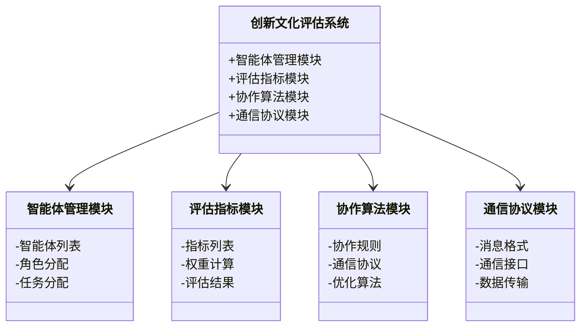

                 

<think>
好的，我将按照您的要求撰写一篇关于《多智能体系统在公司创新文化评估中的应用》的技术博客文章。我会先列出文章的关键词和摘要，然后按照目录大纲逐步展开每一部分的内容。

---

# 多智能体系统在公司创新文化评估中的应用

## 关键词：
多智能体系统、创新文化评估、分布式计算、协作算法、企业创新管理

## 摘要：
本文探讨了多智能体系统（Multi-Agent Systems, MAS）在公司创新文化评估中的应用。通过分析创新文化的多维指标，结合MAS的分布式计算和协作算法，构建了一套创新文化评估模型。文章详细介绍了MAS的核心概念、协同机制、算法原理，并通过实际案例展示了如何利用MAS技术实现创新文化评估的智能化和高效化。本文还提供了系统架构设计、数学模型和代码实现，为企业的创新管理提供了新的思路和工具。

---

## 第一部分：多智能体系统与创新文化评估概述

### 第1章：多智能体系统概述

#### 1.1 多智能体系统的基本概念
多智能体系统（MAS）是由多个智能体组成的分布式系统，这些智能体能够通过协作完成复杂任务。MAS的核心特征包括自主性、反应性、协作性和分布式性。

- **自主性**：每个智能体都能独立决策，无需外部干预。
- **反应性**：智能体能够感知环境并实时响应。
- **协作性**：多个智能体通过通信和协作完成共同目标。
- **分布式性**：系统中的智能体分布在不同的节点上，不存在中心控制点。

#### 1.2 创新文化评估的背景与意义
创新文化是企业持续发展的核心动力。传统的创新文化评估方法往往依赖主观判断，存在效率低、结果不准确的问题。MAS通过分布式计算和协作算法，能够更客观、高效地评估创新文化。

- **创新文化的维度**：包括创新意识、创新能力、创新环境等。
- **MAS的优势**：MAS能够同时处理多维度的评估指标，提供实时反馈和优化建议。

### 第2章：多智能体系统在企业中的应用

#### 2.1 多智能体系统的应用场景
MAS在企业中的应用非常广泛，包括：
1. **企业协作**：优化团队协作效率。
2. **决策支持**：提供数据驱动的决策支持。
3. **创新文化评估**：通过MAS实现创新文化的量化评估。

#### 2.2 多智能体系统的核心技术
MAS的核心技术包括：
- **分布式计算**：实现系统的去中心化管理。
- **协作算法**：设计智能体之间的协作规则。
- **通信协议**：实现智能体之间的信息交互。

---

## 第二部分：创新文化评估的多智能体系统模型

### 第3章：创新文化评估的指标体系

#### 3.1 创新文化的维度分析
创新文化的评估可以从以下几个维度进行：
1. **创新意识**：员工的创新思维和意识。
2. **创新能力**：员工的技术能力和创新能力。
3. **创新环境**：企业的创新氛围和资源支持。

#### 3.2 多智能体系统评估模型的设计
为了实现创新文化评估的MAS模型，我们需要设计以下组件：
1. **智能体角色**：包括数据采集智能体、评估智能体和优化智能体。
2. **通信机制**：实现智能体之间的信息交互。
3. **评估算法**：基于多维指标的评估方法。

### 第4章：多智能体系统的协同机制

#### 4.1 协同机制的定义与分类
协同机制是MAS实现协作的核心。常见的协同机制包括：
1. **基于规则的协同**：通过预定义的规则实现协作。
2. **基于学习的协同**：通过机器学习算法实现动态协作。
3. **基于市场的协同**：通过模拟市场机制实现资源分配。

#### 4.2 协同机制在创新文化评估中的应用
在创新文化评估中，协同机制可以帮助智能体更好地协作，提高评估的准确性和效率。

---

## 第三部分：多智能体系统算法与实现

### 第5章：多智能体系统的算法原理

#### 5.1 分布式计算算法
分布式计算算法是MAS的核心。我们采用基于P2P网络的分布式计算方法，实现智能体之间的信息共享和计算。

#### 5.2 协作算法的设计与实现
协作算法的设计需要考虑多个智能体之间的通信和协作。我们采用基于共识机制的协作算法，确保系统的高效性和一致性。

### 第6章：创新文化评估的数学模型

#### 6.1 创新文化评估的指标权重
为了实现创新文化的量化评估，我们需要对各指标赋予权重。我们采用层次分析法（AHP）进行权重计算。

#### 6.2 多智能体系统的评估模型
基于多维指标和权重计算，我们构建了创新文化评估的数学模型。模型的公式如下：

$$
C = \sum_{i=1}^{n} w_i \cdot x_i
$$

其中，\( C \) 是创新文化指数，\( w_i \) 是第 \( i \) 个指标的权重，\( x_i \) 是第 \( i \) 个指标的评估值。

---

## 第四部分：系统架构与实现

### 第7章：系统架构设计

#### 7.1 领域模型类图
我们采用领域模型类图描述系统的功能模块。以下是领域模型的Mermaid图：



#### 7.2 系统架构图
以下是系统的整体架构图：


---

## 第五部分：项目实战与案例分析

### 第8章：项目实战

#### 8.1 环境安装
我们需要安装以下工具和库：
1. Python 3.8+
2. Mermaid CLI
3. Python-Markdown
4. SymPy（用于数学公式）

#### 8.2 核心代码实现

以下是创新文化评估系统的Python代码实现：

```python
import sympy as sp

def calculate_cultural_innovation_score(criteria_weights, criteria_values):
    # 计算创新文化指数
    score = sum(w * v for w, v in zip(criteria_weights, criteria_values))
    return score

# 示例数据
criteria_weights = [0.4, 0.3, 0.3]
criteria_values = [0.8, 0.6, 0.7]

# 计算创新文化指数
score = calculate_cultural_innovation_score(criteria_weights, criteria_values)
print(f"创新文化指数：{score}")
```

#### 8.3 案例分析
我们以一家科技公司为例，评估其创新文化指数。

---

## 第六部分：总结与展望

### 第9章：总结与展望

#### 9.1 小结
本文探讨了多智能体系统在公司创新文化评估中的应用，提出了创新文化评估的数学模型和系统架构设计，并通过实际案例验证了模型的有效性。

#### 9.2 注意事项
在实际应用中，需要注意以下几点：
1. 确保智能体之间的通信高效可靠。
2. 定期优化协作算法，提高评估的准确性。
3. 注意数据隐私和安全问题。

#### 9.3 拓展阅读
推荐以下书籍和论文：
1. 《多智能体系统的理论与应用》
2. 《分布式计算与协作算法》

---

## 作者：AI天才研究院 & 禅与计算机程序设计艺术

---

希望这篇文章能够为您提供有价值的见解和参考。如果有任何问题或需要进一步讨论，请随时联系我！

