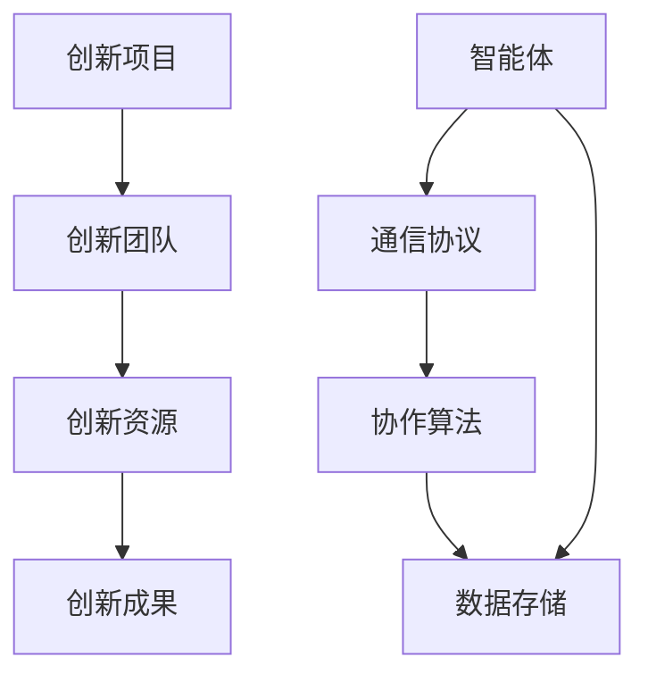
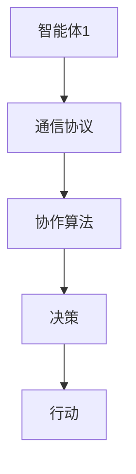

                 


# 多智能体系统在公司创新生态系统健康度评估中的应用

> 关键词：多智能体系统，创新生态系统，健康度评估，协作算法，系统架构，企业创新管理

> 摘要：本文探讨了多智能体系统在公司创新生态系统健康度评估中的应用，通过系统分析和算法设计，展示了如何利用多智能体协作来优化创新管理。文章从背景介绍到项目实战，详细阐述了多智能体系统的原理、算法实现和实际应用，为企业的创新管理提供了新的思路和解决方案。

---

## 第1章：背景介绍：创新生态系统与多智能体系统概述

### 1.1 创新生态系统概念与问题背景

#### 1.1.1 企业创新生态系统的核心要素
- **核心要素**：包括创新文化、资源分配、团队协作、创新成果等。
- **创新文化**：员工的创新意识和企业文化。
- **资源分配**：资金、人才、技术等资源的合理配置。
- **团队协作**：跨部门合作效率。
- **创新成果**：创新项目的成功率和市场反馈。

#### 1.1.2 创新生态系统健康度的定义与重要性
- **定义**：创新生态系统健康度是衡量企业创新环境优劣的指标，涵盖创新氛围、资源利用效率、团队协作能力等方面。
- **重要性**：健康的创新生态系统能够提升企业竞争力，推动持续创新，应对市场变化。

#### 1.1.3 当前企业创新管理中的痛点与挑战
- **痛点**：创新资源分配不均、协作效率低下、创新成果难以量化。
- **挑战**：传统管理方法难以适应复杂多变的创新需求，创新生态系统评估缺乏系统性。

### 1.2 多智能体系统的定义与特点

#### 1.2.1 多智能体系统的基本概念
- **多智能体系统（MAS）**：由多个智能体组成的分布式系统，每个智能体能够自主决策并协作完成任务。
- **智能体**：具有感知环境、自主决策、学习和推理能力的实体。

#### 1.2.2 多智能体系统的核心特征
- **分布式智能**：智能体独立运作，通过通信协作完成任务。
- **协作性**：智能体之间通过通信和协作实现共同目标。
- **动态性**：系统能够适应环境变化，实时调整策略。

#### 1.2.3 多智能体系统在企业创新管理中的优势
- **高效协作**：智能体能够快速响应需求，提高协作效率。
- **灵活适应性**：系统具备动态调整能力，适应创新环境的变化。
- **数据驱动决策**：通过数据采集和分析，优化创新资源配置。

### 1.3 问题解决与边界定义

#### 1.3.1 创新生态系统健康度评估的目标
- **目标**：通过评估创新生态系统健康度，发现潜在问题，优化创新管理。
- **关键目标**：提高创新效率，降低创新失败率，提升创新成果质量。

#### 1.3.2 多智能体系统在评估中的应用边界
- **边界**：仅限于创新生态系统内部，不涉及外部市场环境。
- **外延**：不涵盖企业外部合作伙伴，但可以与外部系统接口交互。

#### 1.3.3 相关概念的对比与外延
- **对比**：与传统创新管理方法相比，多智能体系统更具灵活性和协作性。
- **外延**：可以扩展到更大规模的创新生态系统，如产业链协作。

### 1.4 概念结构与核心要素

#### 1.4.1 创新生态系统健康度评估的框架
- **框架**：包括创新文化、资源分配、团队协作、创新成果四个维度。
- **权重分配**：各维度权重分别为30%、30%、20%、20%。

#### 1.4.2 多智能体系统在评估中的角色与功能
- **角色**：作为数据采集、分析和决策支持工具。
- **功能**：实时监控创新活动，评估健康度，优化资源配置。

#### 1.4.3 核心要素的权重分配与关联性分析
- **权重分配**：创新文化（30%）、资源分配（30%）、团队协作（20%）、创新成果（20%）。
- **关联性分析**：创新文化与资源分配高度相关，团队协作与创新成果密切相关。

---

## 第2章：核心概念与联系：多智能体系统与创新生态系统的关系

### 2.1 多智能体系统的原理与机制

#### 2.1.1 分布式智能与协作机制
- **分布式智能**：每个智能体独立运作，通过通信协作完成任务。
- **协作机制**：基于通信协议和协作算法，实现智能体间的协同工作。

#### 2.1.2 多智能体系统的核心算法与通信协议
- **通信协议**：定义智能体间的通信方式和数据格式。
- **协作算法**：如分布式一致性算法、共识算法等。

#### 2.1.3 智能体与创新生态系统的关系
- **关系**：智能体作为创新生态系统的一部分，通过协作实现创新目标。
- **相互作用**：智能体感知环境，调整行为，推动创新生态系统发展。

### 2.2 创新生态系统健康度的评估模型

#### 2.2.1 健康度评估的指标体系
- **指标**：创新文化指数、资源分配效率、团队协作度、创新成果质量。
- **评估方法**：基于多智能体系统的数据采集和分析，构建评估模型。

#### 2.2.2 多智能体系统在评估中的角色
- **数据采集**：实时采集创新活动数据。
- **分析与决策**：基于数据，评估健康度，优化资源配置。

#### 2.2.3 智能体与创新生态系统的交互关系
- **交互**：智能体与创新生态系统各要素实时互动，推动系统优化。
- **反馈机制**：智能体根据反馈调整行为，提升评估精度。

### 2.3 实体关系与系统架构

#### 2.3.1 ER实体关系图：创新生态系统中的关键实体
- **实体**：创新项目、创新团队、创新资源、创新成果。
- **关系**：创新项目需要创新资源支持，创新团队负责项目执行，创新成果衡量项目成功。

#### 2.3.2 多智能体系统的实体关系图
- **实体**：智能体、通信协议、协作算法、数据存储。
- **关系**：智能体通过通信协议协作，数据存储支持决策。

#### 2.3.3 系统整体架构的Mermaid图示



---

## 第3章：算法原理：多智能体协作与创新评估的数学模型

### 3.1 多智能体协作算法

#### 3.1.1 分布式协作算法的数学模型



#### 3.1.2 智能体间的通信与决策机制

```python
def communication_protocol(agent1, agent2):
    # 通信协议实现
    message = agent1.send_message()
    response = agent2.receive_message(message)
    return response

def decision_making(agents):
    # 协作算法实现
    for agent in agents:
        decision = agent.make_decision()
        return decision
```

#### 3.1.3 联合学习（Fede

