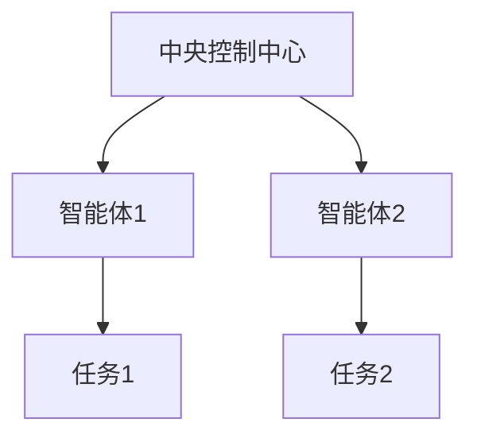
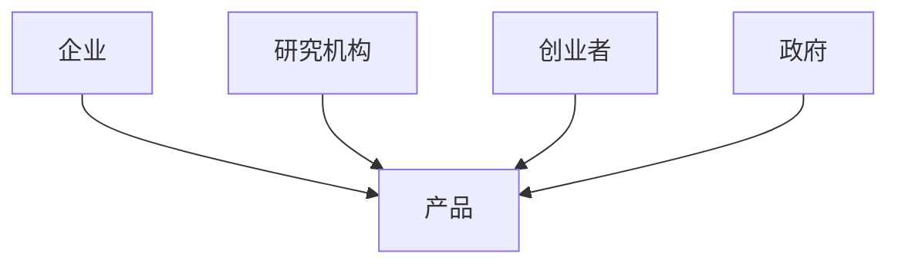
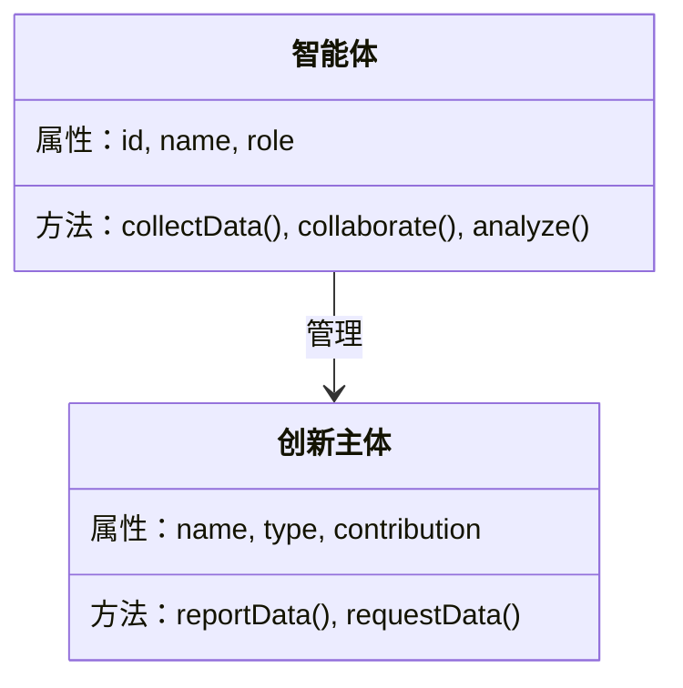
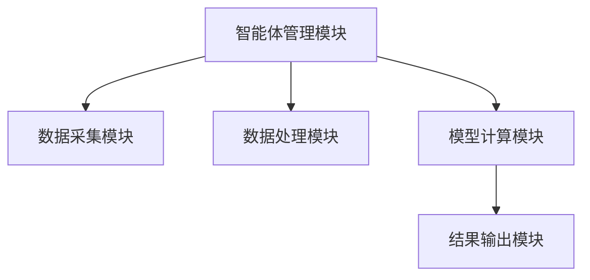
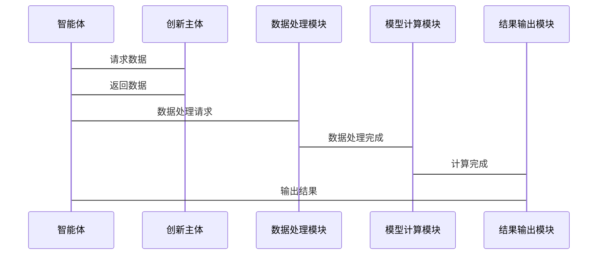

                 


# 多智能体系统在公司创新生态系统评估中的应用

## 关键词：多智能体系统，创新生态系统，评估模型，协作算法，系统架构

## 摘要：多智能体系统（Multi-Agent System, MAS）作为一种分布式计算范式，通过多个智能体的协作，能够有效地解决复杂问题。在公司创新生态系统评估中，多智能体系统可以模拟各个创新主体之间的互动关系，构建动态的评估模型，从而提供更加全面和精准的评估结果。本文将从多智能体系统的定义与特点出发，详细探讨其在公司创新生态系统评估中的应用，包括协作机制、算法原理、系统架构设计以及项目实战等，最终为公司创新管理提供新的思路和方法。

---

# 第1章: 多智能体系统概述

## 1.1 多智能体系统的定义与特点

### 1.1.1 多智能体系统的定义

多智能体系统（Multi-Agent System, MAS）是由多个智能体（Agent）组成的分布式系统，这些智能体能够通过协作完成特定任务。每个智能体都是一个独立的实体，具有自主性、反应性和社会性。

$$
\text{MAS} = \{ Agent_1, Agent_2, \dots, Agent_n \}
$$

### 1.1.2 多智能体系统的核心特点

| 特性 | 描述 |
|------|------|
| 分布式 | 智能体独立运行，不依赖中央控制 |
| 协作性 | 智能体通过协作完成共同目标 |
| 反应性 | 智能体能够感知环境并做出响应 |
| 多样性 | 智能体可以有不同的目标和行为模式 |

### 1.1.3 多智能体系统与传统单智能体系统的区别

| 比较维度 | 单智能体系统 | 多智能体系统 |
|----------|--------------|--------------|
| 系统复杂性 | 单一任务，简单逻辑 | 多任务，复杂逻辑 |
| 资源分配 | 集中式 | 分布式 |
| 效率 | 依赖单点性能 | 依赖协作效率 |

---

## 1.2 多智能体系统的组成与架构

### 1.2.1 多智能体系统的组成要素

- **智能体**：具有感知、决策和行动能力的实体。
- **环境**：智能体所处的物理或虚拟空间。
- **通信机制**：智能体之间的信息交换方式。
- **协作协议**：智能体协作的规则和策略。

### 1.2.2 多智能体系统的常见架构模式



### 1.2.3 多智能体系统中的通信与协调机制

- **直接通信**：智能体之间通过共享内存或消息传递进行通信。
- **间接通信**：通过中间媒介（如消息队列）进行通信。
- **协调机制**：利用仲裁器或协商协议解决冲突。

---

## 1.3 多智能体系统的应用领域

### 1.3.1 多智能体系统在分布式计算中的应用

- **分布式任务分配**：如云计算中的资源调度。
- **分布式问题求解**：如分布式数据库的查询优化。

### 1.3.2 多智能体系统在机器人协作中的应用

- **工业机器人协作**：多个机器人协同完成生产线上的任务。
- **服务机器人协作**：智能客服系统中的多机器人协作。

### 1.3.3 多智能体系统在经济与组织管理中的应用

- **经济模拟**：模拟市场行为，预测经济趋势。
- **组织管理**：优化企业内部资源分配和流程管理。

---

## 1.4 本章小结

多智能体系统通过分布式协作，能够高效解决复杂问题。其核心在于智能体之间的通信与协调机制。在公司创新生态系统评估中，多智能体系统可以模拟创新主体的互动，构建动态评估模型。

---

# 第2章: 公司创新生态系统概述

## 2.1 创新生态系统的基本概念

### 2.1.1 创新生态系统的定义

创新生态系统是一个由企业、研究机构、政府、创业者等多方参与者共同构成的系统，旨在推动创新和技术进步。

$$
\text{创新生态系统} = \{ 企业, 研究机构, 创业者, 政府 \}
$$

### 2.1.2 创新生态系统的核心要素

| 要素 | 描述 |
|------|------|
| 企业 | 创新主体，负责技术开发和产品商业化 |
| 研究机构 | 提供技术支持和创新资源 |
| 创创业者 | 提供创新动力和新想法 |
| 政府 | 提供政策支持和资金资助 |

### 2.1.3 创新生态系统的层次结构



---

## 2.2 创新生态系统评估的重要性

### 2.2.1 创新生态系统评估的目的

- **识别优势**：发现生态系统中的优势资源。
- **发现瓶颈**：找出制约创新的关键因素。
- **优化配置**：提高资源利用效率。

### 2.2.2 创新生态系统评估的指标体系

| 指标 | 描述 |
|------|------|
| 技术创新度 | 创新技术的数量和质量 |
| 创业活跃度 | 创业企业的数量和存活率 |
| 合作紧密度 | 创新主体之间的合作频率 |
| 政策支持力度 | 政府提供的政策和资金支持 |

### 2.2.3 创新生态系统评估的方法

- **定量分析**：基于数据的统计分析。
- **定性分析**：基于专家意见的评估。
- **混合方法**：结合定量和定性分析。

---

## 2.3 多智能体系统与创新生态系统的关系

### 2.3.1 多智能体系统在创新生态系统中的角色

- **模拟工具**：用于模拟创新主体的互动。
- **决策支持**：为创新策略提供数据支持。

### 2.3.2 多智能体系统如何支持创新生态系统评估

- **动态模拟**：实时模拟创新生态系统的动态变化。
- **协作优化**：优化创新主体之间的协作效率。

### 2.3.3 多智能体系统在创新生态系统中的优势

- **高效率**：通过分布式计算提高评估效率。
- **高精度**：通过精细的协作机制提高评估准确性。

---

## 2.4 本章小结

创新生态系统是一个复杂的系统，其评估需要多维度的分析。多智能体系统通过模拟和协作，能够为创新生态系统评估提供新的思路和方法。

---

# 第3章: 多智能体系统在公司创新生态系统评估中的核心概念

## 3.1 多智能体系统的协作机制

### 3.1.1 协作的基本概念

协作是指多个智能体为了共同目标而协同工作的过程。

$$
\text{协作} = \sum_{i=1}^{n} Agent_i \text{的合作行为}
$$

### 3.1.2 协作的实现方式

- **同步协作**：智能体按照固定顺序协作。
- **异步协作**：智能体可以并行协作。

### 3.1.3 协作中的通信与协调

- **通信**：智能体之间交换信息。
- **协调**：通过协商解决协作中的冲突。

---

## 3.2 创新生态系统评估的数学模型

### 3.2.1 创新生态系统评估的指标体系

| 指标 | 权重 | 计算公式 |
|------|------|----------|
| 技术创新度 | 0.4 | $IT = \sum_{i=1}^{n} \text{专利数量}_i \times \text{技术复杂度}_i$ |
| 创业活跃度 | 0.3 | $CE = \sum_{i=1}^{n} \text{创业企业数量}_i \times \text{存活率}_i$ |
| 合作紧密度 | 0.2 | $CC = \sum_{i=1}^{n} \text{合作项目数量}_i \times \text{合作深度}_i$ |
| 政策支持力度 | 0.1 | $PS = \sum_{i=1}^{n} \text{政策资金}_i \times \text{政策效果}_i$ |

### 3.2.2 创新生态系统评估的数学模型

$$
\text{创新指数} = 0.4 \times IT + 0.3 \times CE + 0.2 \times CC + 0.1 \times PS
$$

### 3.2.3 数学模型的构建与应用

- **构建过程**：根据指标权重和计算公式，构建数学模型。
- **应用过程**：通过输入具体数据，计算创新指数。

---

## 3.3 多智能体系统与创新生态系统评估的结合

### 3.3.1 多智能体系统在创新生态系统评估中的作用

- **数据采集**：智能体实时采集创新生态系统中的数据。
- **数据处理**：通过协作算法对数据进行处理和分析。
- **结果输出**：输出创新指数和评估报告。

### 3.3.2 多智能体系统如何优化创新生态系统评估

- **提高效率**：通过分布式计算提高数据处理速度。
- **提高精度**：通过精细的协作机制提高评估结果的准确性。

### 3.3.3 多智能体系统与创新生态系统评估的协同效应

- **协同创新**：通过协作机制促进创新主体的协同创新。
- **动态调整**：根据评估结果动态调整创新策略。

---

## 3.4 本章小结

多智能体系统通过协作机制和数学模型，能够有效地优化创新生态系统评估。其核心在于通过智能体的协作，实现数据的高效处理和分析。

---

# 第4章: 多智能体系统在公司创新生态系统评估中的算法原理

## 4.1 多智能体系统中的协作算法

### 4.1.1 协作算法的基本概念

协作算法是指智能体通过协作完成特定任务的算法。

$$
\text{协作算法} = \{ \text{任务分配}, \text{信息交换}, \text{决策制定 \}}
$$

### 4.1.2 常见的协作算法类型

- **基于规则的协作算法**：通过预定义规则进行协作。
- **基于市场的协作算法**：通过市场机制进行协作。
- **基于博弈论的协作算法**：通过博弈论模型进行协作。

### 4.1.3 协作算法的实现步骤

1. **任务分配**：根据智能体的能力分配任务。
2. **信息交换**：智能体之间交换相关信息。
3. **决策制定**：基于信息制定协作决策。

---

## 4.2 创新生态系统评估的算法实现

### 4.2.1 创新生态系统评估算法的输入与输出

- **输入**：创新主体的数据，如专利数量、创业企业数量等。
- **输出**：创新指数和评估报告。

### 4.2.2 创新生态系统评估算法的实现步骤

1. **数据采集**：通过智能体采集创新生态系统中的数据。
2. **数据处理**：对数据进行清洗和预处理。
3. **模型计算**：根据数学模型计算创新指数。
4. **结果输出**：输出创新指数和评估报告。

---

## 4.3 本章小结

多智能体系统中的协作算法是创新生态系统评估的核心。通过协作算法，可以实现数据的高效处理和分析，从而提高评估结果的准确性和效率。

---

# 第5章: 多智能体系统在公司创新生态系统评估中的系统分析与架构设计

## 5.1 项目介绍

### 5.1.1 项目背景

公司希望通过多智能体系统评估其创新生态系统，优化创新策略。

### 5.1.2 项目目标

- **构建创新生态系统评估模型**：通过多智能体系统模拟创新主体的互动。
- **优化创新策略**：根据评估结果优化公司创新策略。

### 5.1.3 项目范围

- **数据采集**：采集创新主体的数据。
- **模型构建**：构建创新生态系统评估模型。
- **结果输出**：输出创新指数和评估报告。

---

## 5.2 系统功能设计

### 5.2.1 领域模型



### 5.2.2 系统架构设计



### 5.2.3 系统接口设计

- **数据接口**：智能体与创新主体之间的数据交换接口。
- **模型接口**：模型计算模块与结果输出模块之间的接口。

### 5.2.4 系统交互设计



---

## 5.3 本章小结

系统架构设计是多智能体系统在创新生态系统评估中的关键。通过合理的架构设计，可以实现数据的高效处理和模型的高效计算。

---

# 第6章: 多智能体系统在公司创新生态系统评估中的项目实战

## 6.1 环境安装

### 6.1.1 系统环境

- 操作系统：Linux/Windows/MacOS
- 开发工具：Python/Java/Scala
- 依赖库：numpy, pandas, matplotlib

### 6.1.2 安装步骤

1. 安装Python：`python --version`
2. 安装依赖库：`pip install numpy pandas matplotlib`

---

## 6.2 系统核心实现源代码

### 6.2.1 智能体类实现

```python
class Agent:
    def __init__(self, id, role):
        self.id = id
        self.role = role
        self.data = {}
    
    def collectData(self):
        # 收集数据
        pass
    
    def collaborate(self):
        # 协作
        pass
    
    def analyze(self):
        # 分析
        pass
```

### 6.2.2 创新主体类实现

```python
class InnovationEntity:
    def __init__(self, name, type, contribution):
        self.name = name
        self.type = type
        self.contribution = contribution
    
    def reportData(self):
        # 返回数据
        pass
    
    def requestData(self):
        # 请求数据
        pass
```

### 6.2.3 数据处理模块实现

```python
import numpy as np
import pandas as pd

class DataProcessor:
    def __init__(self):
        self.data = pd.DataFrame()
    
    def process(self, raw_data):
        # 数据处理逻辑
        self.data = self.data.append(raw_data)
        return self.data
```

### 6.2.4 模型计算模块实现

```python
class ModelCalculator:
    def __init__(self):
        self.model = None
    
    def compute(self, data):
        # 模型计算逻辑
        self.model = self.model.fit(data)
        return self.model
```

---

## 6.3 代码应用解读与分析

- **智能体类**：用于管理创新主体的数据收集、协作和分析。
- **创新主体类**：用于表示创新生态系统中的各个主体。
- **数据处理模块**：用于对数据进行清洗和预处理。
- **模型计算模块**：用于构建创新指数的数学模型并进行计算。

---

## 6.4 实际案例分析

### 6.4.1 案例背景

某公司希望通过多智能体系统评估其创新生态系统，优化创新策略。

### 6.4.2 案例分析

1. **数据采集**：采集公司内部和外部创新主体的数据。
2. **数据处理**：对数据进行清洗和预处理。
3. **模型计算**：根据数学模型计算创新指数。
4. **结果输出**：输出创新指数和评估报告。

---

## 6.5 项目小结

通过实际案例分析，可以验证多智能体系统在创新生态系统评估中的有效性和可行性。

---

# 第7章: 多智能体系统在公司创新生态系统评估中的应用价值与挑战

## 7.1 应用价值

### 7.1.1 提高创新效率

多智能体系统通过协作机制，提高创新主体的协作效率。

### 7.1.2 优化创新策略

通过评估结果，优化公司的创新策略。

### 7.1.3 促进创新生态系统的可持续发展

通过动态评估，促进创新生态系统的可持续发展。

---

## 7.2 实际应用中的挑战

### 7.2.1 数据隐私问题

创新主体的数据可能涉及隐私问题。

### 7.2.2 智能体协作的复杂性

智能体之间的协作可能非常复杂，需要精细的协调机制。

### 7.2.3 系统的可扩展性

随着创新主体的增加，系统的可扩展性可能面临挑战。

---

## 7.3 解决方案

### 7.3.1 数据隐私保护

采用加密技术和数据脱敏技术，保护数据隐私。

### 7.3.2 简化协作流程

通过优化协作算法，简化协作流程。

### 7.3.3 提高系统的可扩展性

采用分布式架构和云计算技术，提高系统的可扩展性。

---

## 7.4 本章小结

多智能体系统在创新生态系统评估中的应用价值巨大，但也面临一些挑战。通过合理的解决方案，可以克服这些挑战，进一步发挥多智能体系统的优势。

---

# 第8章: 结论与展望

## 8.1 研究总结

多智能体系统通过协作机制和数学模型，能够有效地优化创新生态系统评估。其核心在于通过智能体的协作，实现数据的高效处理和分析。

## 8.2 未来展望

未来，随着人工智能和大数据技术的发展，多智能体系统在创新生态系统评估中的应用将更加广泛和深入。可能出现的新技术包括更智能的协作算法、更高效的系统架构设计等。

---

# 作者：AI天才研究院/AI Genius Institute & 禅与计算机程序设计艺术 /Zen And The Art of Computer Programming

---

通过以上内容，我们可以看到，多智能体系统在公司创新生态系统评估中的应用具有重要的理论和实践意义。通过合理的系统设计和算法实现，可以有效地优化创新策略，促进创新生态系统的可持续发展。

