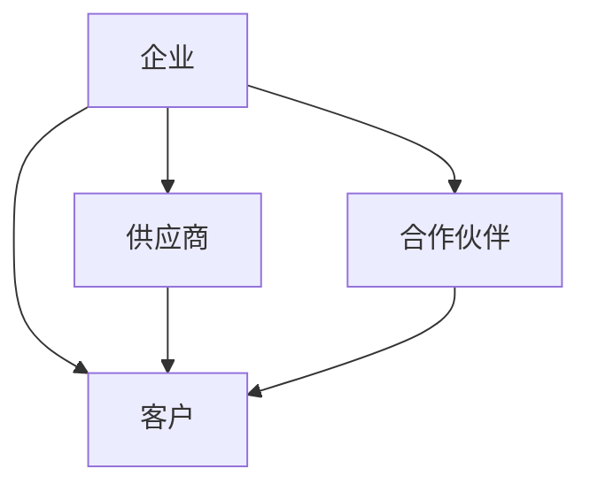
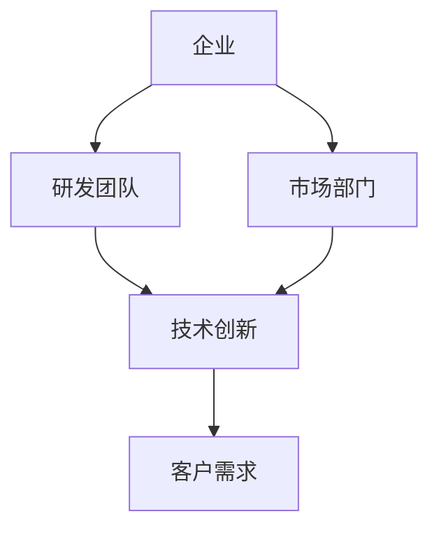
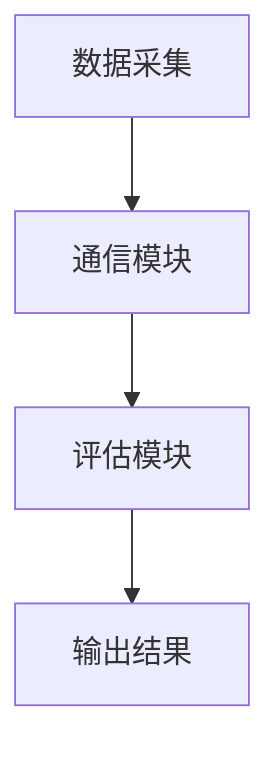
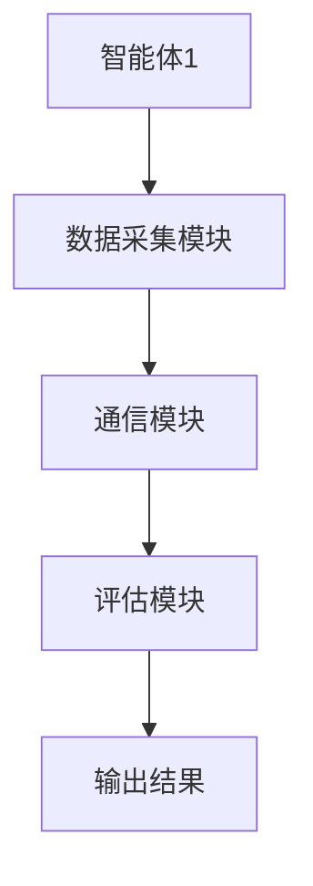
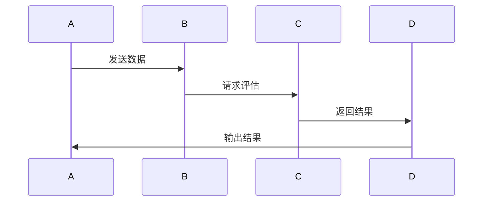

                 


# 多智能体系统在公司创新生态系统评估中的应用

> 关键词：多智能体系统、创新生态系统、评估模型、协作机制、数学建模

> 摘要：本文探讨了多智能体系统在公司创新生态系统评估中的应用，分析了MAS的基本原理及其在创新评估中的作用，通过数学建模和系统架构设计，展示了如何利用MAS优化创新过程，提升企业竞争力。

---

# 第1章 问题背景与研究意义

## 1.1 问题背景

### 1.1.1 创新生态系统的基本概念
创新生态系统是指由企业、供应商、合作伙伴、客户等多方参与者构成的协作网络，各部分协同创新，推动整体进步。它是企业保持竞争力的关键。

### 1.1.2 多智能体系统在创新生态系统中的作用
多智能体系统（MAS）由多个智能体组成，每个智能体能独立决策并协作完成任务。MAS具备分布式决策、自适应性和协作性，适合复杂系统的优化。

### 1.1.3 问题的提出与研究意义
随着市场竞争加剧，企业创新效率成为关键。传统评估方法难以实时捕捉动态变化，MAS的应用解决了这一问题，具有重要的研究价值。

## 1.2 问题描述

### 1.2.1 创新生态系统评估的核心问题
如何量化各参与者的贡献，识别瓶颈，优化资源配置。

### 1.2.2 多智能体系统在评估中的应用场景
通过MAS模拟各参与者的协作，实时评估创新过程中的效率和效果。

### 1.2.3 问题解决的必要性与可行性分析
必要性：动态环境中需要实时评估；可行性：MAS技术成熟，可应用于复杂系统。

## 1.3 问题解决框架

### 1.3.1 多智能体系统的核心理念
智能体具备主动性、反应性、协作性和学习能力， MAS强调去中心化协作。

### 1.3.2 创新生态系统评估的框架设计
构建 MAS 模型，模拟创新过程，分析评估结果。

### 1.3.3 多智能体系统与创新生态系统的关系
MAS模拟生态系统中各角色协作，评估整体创新效率。

## 1.4 边界与外延

### 1.4.1 创新生态系统评估的边界条件
仅考虑直接影响因素，如内部协作、外部资源获取。

### 1.4.2 多智能体系统应用的限制与扩展
 MAS应用于局部优化，可通过扩展处理更大系统。

### 1.4.3 相关概念的对比与区分
与单智能体系统对比，MAS适用于多方协作场景。

## 1.5 概念结构与核心要素

### 1.5.1 创新生态系统

Mermaid图展示创新生态系统的构成，包括企业、供应商、合作伙伴、客户等实体，明确各实体之间的关系。



---

# 第2章 多智能体系统的基本概念

## 2.1 多智能体系统的基本原理

### 2.1.1 多智能体系统的特点
- 分布式：去中心化决策
- 协作性：智能体间协作完成任务
- 动态性：能适应环境变化
- 学习性：具备学习能力

### 2.1.2 多智能体系统与单智能体系统的主要区别

| 特性          | 单智能体系统        | 多智能体系统        |
|---------------|---------------------|---------------------|
| 决策中心化    | 是                 | 否                 |
| 协作性        | 低                 | 高                 |
| 系统复杂性    | 简单               | 复杂               |
| 应用场景      | 简单任务           | 复杂任务           |

### 2.1.3 多智能体系统在企业中的应用案例
- 资源分配优化：智能体协作分配资源，提高效率。
- 供应链管理：优化物流路径，降低成本。

---

# 第3章 创新生态系统的核心要素

## 3.1 创新生态系统的主要构成

### 3.1.1 企业内部要素
- 研发团队：负责技术创新
- 市场部门：负责市场反馈

### 3.1.2 企业外部要素
- 供应商：提供原材料和技术支持
- 合作伙伴：提供协作资源
- 客户：提供需求反馈

## 3.2 创新生态系统中的关系分析

### 3.2.1 企业与供应商的关系
供应商提供原材料和技术支持，企业与供应商的合作影响技术创新的速度和质量。

### 3.2.2 企业与合作伙伴的关系
合作伙伴提供协作资源，共同开发新技术，提升创新能力。

### 3.2.3 企业与客户的关系
客户需求驱动技术创新方向，客户反馈促进产品优化。

## 3.3 创新生态系统模型构建

### 3.3.1 模型构建的原则
- 简化性：聚焦核心要素
- 可扩展性：便于后续优化
- 动态性：适应环境变化

### 3.3.2 创新生态系统模型的构建步骤

Mermaid图展示创新生态系统模型的构建过程。



---

# 第4章 多智能体系统在创新生态系统评估中的应用

## 4.1 多智能体系统评估的核心思想

### 4.1.1 智能体协作机制
智能体通过协作完成任务，提升整体效率。

### 4.1.2 评估指标体系
包括技术创新速度、资源利用率、协作效率等。

## 4.2 评估模型的构建

### 4.2.1 模型构建的数学表达

创新生态系统评估模型的数学表达式：

$$
E = \alpha \cdot T + \beta \cdot R + \gamma \cdot C
$$

其中，E为评估结果，T为技术创新速度，R为资源利用率，C为协作效率，α、β、γ为权重系数。

### 4.2.2 模型构建的步骤

1. 确定评估指标。
2. 确定各指标的权重。
3. 通过数据采集计算各指标值。
4. 综合各指标值计算评估结果。

---

# 第5章 创新生态系统评估的数学建模

## 5.1 创新生态系统评估模型的构建

### 5.1.1 模型的数学表达

创新生态系统评估模型：

$$
E = \sum_{i=1}^{n} w_i x_i
$$

其中，E为评估结果，w_i为各指标的权重，x_i为各指标的数值。

### 5.1.2 模型的参数设定

- 权重参数：根据经验或数据训练确定。
- 指标数值：通过数据采集获得。

## 5.2 算法设计与实现

### 5.2.1 算法设计

多智能体协作评估算法：

1. 初始化各智能体状态。
2. 各智能体执行任务，产生数据。
3. 智能体间通信，共享数据。
4. 综合数据，计算评估结果。

### 5.2.2 算法实现

Python代码实现：

```python
class Agent:
    def __init__(self, id):
        self.id = id
        self.data = 0

    def collect_data(self):
        # 模拟数据采集
        self.data = random.random()

    def send_data(self, target):
        target.data = self.data

# 初始化智能体
agents = [Agent(i) for i in range(5)]

# 算法实现
for agent in agents:
    agent.collect_data()

for i in range(len(agents)):
    agents[i].send_data(agents[(i+1)%len(agents)])

# 计算评估结果
total = sum(agent.data for agent in agents)
average = total / len(agents)
print(f"评估结果：{average}")
```

### 5.2.3 算法实现的解释

- 每个智能体收集数据并传递给下一个智能体。
- 最终计算所有智能体的平均数据作为评估结果。

---

# 第6章 系统分析与架构设计

## 6.1 系统功能设计

### 6.1.1 功能模块划分
- 数据采集模块：采集各智能体的数据。
- 通信模块：实现智能体间的通信。
- 评估模块：计算创新生态系统评估结果。

### 6.1.2 功能流程

Mermaid流程图展示系统功能流程。



## 6.2 系统架构设计

### 6.2.1 系统架构图

Mermaid架构图展示系统架构。



### 6.2.2 系统接口设计

- 数据采集接口：接收各智能体的数据。
- 通信接口：实现智能体间的通信。
- 评估接口：计算并输出评估结果。

## 6.3 系统交互设计

### 6.3.1 系统交互序列图

Mermaid序列图展示系统交互流程。



---

# 第7章 项目实战

## 7.1 环境安装

### 7.1.1 环境要求
- Python 3.8+
- Mermaid工具支持
- 数据库支持

### 7.1.2 安装依赖
安装必要的库，如numpy、pandas、matplotlib等。

## 7.2 系统核心实现

### 7.2.1 核心代码实现

```python
import random
import numpy as np

class Agent:
    def __init__(self, id):
        self.id = id
        self.data = 0

    def collect_data(self):
        self.data = random.random()

    def send_data(self, target):
        target.data = self.data

def evaluate_agents(agents):
    total = sum(agent.data for agent in agents)
    return total / len(agents)

# 初始化5个智能体
agents = [Agent(i) for i in range(5)]

# 数据采集
for agent in agents:
    agent.collect_data()

# 数据传递
for i in range(len(agents)):
    agents[i].send_data(agents[(i+1)%len(agents)])

# 评估并输出结果
result = evaluate_agents(agents)
print(f"评估结果：{result}")
```

### 7.2.2 代码解读与分析
- 每个智能体独立收集数据，然后传递给下一个智能体。
- 最后计算所有智能体的平均数据作为评估结果。

## 7.3 案例分析

### 7.3.1 案例背景
某科技公司希望通过MAS优化其创新过程。

### 7.3.2 案例实施步骤
1. 初始化智能体。
2. 数据采集。
3. 数据传递。
4. 计算评估结果。

### 7.3.3 案例结果分析
评估结果展示了各智能体的协作效率，帮助公司优化创新过程。

## 7.4 项目小结
通过MAS优化创新过程，提升了协作效率和创新能力。

---

# 第8章 总结与展望

## 8.1 总结

### 8.1.1 核心内容回顾
- 多智能体系统的概念与应用。
- 创新生态系统评估模型的构建。
- 项目实战的实施与结果分析。

### 8.1.2 本文研究的主要结论
MAS在创新生态系统评估中具有重要应用价值，能有效提升企业创新能力。

## 8.2 最佳实践 Tips

- 合理选择智能体数量和结构。
- 定期优化评估模型。
- 注意数据隐私和通信延迟问题。

## 8.3 未来研究方向

- 更复杂MAS结构的研究。
- 新型通信协议的应用。
- MAS与人工智能的深度融合。

---

作者：AI天才研究院 & 禅与计算机程序设计艺术

---

以上是《多智能体系统在公司创新生态系统评估中的应用》的完整目录大纲及详细内容。

