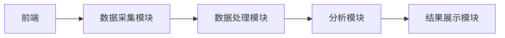

                 


# 多智能体系统在公司品牌价值量化中的应用

> **关键词**：多智能体系统，品牌价值，量化方法，系统架构，项目实战

> **摘要**：本文探讨了多智能体系统（MAS）在公司品牌价值量化中的应用，通过分析品牌价值的影响因素，提出基于MAS的信息收集、数据处理和决策优化方法，构建了一个系统的解决方案，并通过案例分析验证了其有效性。

---

## 第一章：引言

### 1.1 研究背景
品牌价值是衡量企业核心竞争力的重要指标，传统量化方法存在数据来源单一、分析维度有限等问题。多智能体系统通过分布式协作和自主决策，为品牌价值量化提供了新的思路。

### 1.2 研究意义
MAS能够整合多源数据，提升分析效率和准确性，为企业制定精准的品牌策略提供支持。

### 1.3 研究目标与内容
目标是构建MAS框架，用于品牌价值量化。内容包括理论分析、系统设计和案例实现。

### 1.4 本书结构
从基础理论到应用实践，系统介绍MAS在品牌价值量化中的应用。

---

## 第二章：多智能体系统基础

### 2.1 MAS的基本概念
智能体是具有感知和行动能力的实体，MAS由多个智能体组成，通过协作完成目标。

#### MAS的核心特征
- **分布式**：无中心节点，各智能体独立决策。
- **协作性**：通过通信完成任务。
- **自主性**：智能体自主决策。

### 2.2 MAS的体系结构
- **分布式架构**：去中心化，各智能体独立。
- **集中式架构**：有一个中心节点协调。
- **混合架构**：结合分布式和集中式。

### 2.3 MAS的关键技术
- **通信机制**：智能体之间通过消息传递。
- **协作算法**：如一致性算法、协商算法。
- **任务分配**：智能体根据能力分配任务。

---

## 第三章：品牌价值量化方法

### 3.1 品牌价值的定义
品牌价值是品牌在市场中的综合价值，影响因素包括知名度、美誉度、市场表现等。

### 3.2 品牌价值的影响因素
- **知名度**：品牌被认知的程度。
- **美誉度**：品牌的好坏评价。
- **市场表现**：销售额、市场份额。

### 3.3 传统量化方法的局限性
- 数据来源单一，分析维度有限。
- 难以捕捉实时市场动态。

### 3.4 现代量化方法的发展
- 数据驱动：利用大数据分析。
- 综合模型：多维度评估。

---

## 第四章：多智能体系统在品牌价值量化中的应用

### 4.1 信息收集
多智能体系统从社交媒体、新闻、电商平台等多源数据中收集信息。

#### 数据来源
- **社交媒体**：用户评论、点赞。
- **新闻网站**：品牌相关报道。
- **电商平台**：销售数据、用户评价。

### 4.2 数据处理
使用MAS中的智能体对数据进行清洗、特征提取和情感分析。

#### 数据清洗
去除噪音数据，如重复信息、无效评论。

#### 特征提取
提取关键词、情感倾向等特征。

#### 情感分析
使用自然语言处理技术判断情感极性。

### 4.3 决策优化
基于处理后的数据，MAS生成品牌价值评估报告，优化品牌策略。

#### 优化策略
- 提升品牌知名度。
- 改善品牌形象。
- 优化市场推广策略。

---

## 第五章：系统架构设计

### 5.1 系统总体架构
- **前端**：用户界面，展示分析结果。
- **后端**：智能体协作，处理数据。
- **数据库**：存储原始数据和分析结果。

#### 系统架构图


### 5.2 功能模块设计
- **数据采集模块**：收集多源数据。
- **数据处理模块**：清洗和特征提取。
- **分析模块**：情感分析和价值评估。
- **结果展示模块**：可视化报告。

### 5.3 数据流设计
数据从采集到处理，再到分析和展示，形成闭环。

---

## 第六章：项目实战

### 6.1 环境搭建
- **工具**：Python、Flask、TensorFlow。
- **数据源**：社交媒体API、新闻爬虫。

### 6.2 核心代码实现
#### 数据采集模块
```python
import requests

def get_social_media_data():
    # 示例代码，从社交媒体API获取数据
    response = requests.get('https://api.socialmedia.com/comments')
    return response.json()
```

#### 情感分析模块
```python
from tensorflow import keras

model = keras.models.load_model('sentiment_model.h5')
def predict_sentiment(text):
    return model.predict(text)
```

### 6.3 案例分析
以某品牌为例，分析其社交媒体数据，生成价值评估报告。

### 6.4 项目总结
MAS在品牌价值量化中表现出高效和精准的优势。

---

## 第七章：总结与展望

### 7.1 总结
MAS通过多源数据和协作智能体，提升了品牌价值量化的能力。

### 7.2 未来展望
- 智能体自适应能力的提升。
- 更广泛的数据源和分析维度。

---

## 作者信息

作者：AI天才研究院/AI Genius Institute & 禅与计算机程序设计艺术/Zen And The Art of Computer Programming

