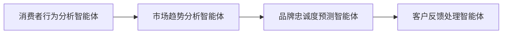
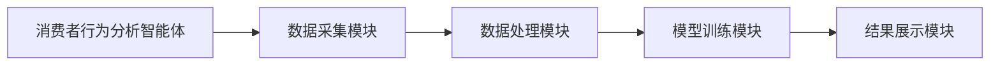

                 


# 多智能体系统在公司品牌忠诚度分析中的应用

## 关键词
多智能体系统, 品牌忠诚度, 客户分析, 数据挖掘, 机器学习, 人工智能

## 摘要
多智能体系统（Multi-Agent Systems, MAS）通过多个智能体的协作和交互，能够有效分析公司品牌忠诚度。本文从背景、核心概念、算法原理、系统架构、项目实战和最佳实践等方面详细阐述多智能体系统在品牌忠诚度分析中的应用。通过对比分析、流程图和代码示例，展示其优势和实际应用价值。

---

## 目录大纲

### 第一章: 多智能体系统与品牌忠诚度分析的背景

#### 1.1 多智能体系统的基本概念
- 1.1.1 多智能体系统的定义
- 1.1.2 多智能体系统的特性：分布性、协作性、反应性

#### 1.2 品牌忠诚度分析的重要性
- 1.2.1 品牌忠诚度的定义
- 1.2.2 影响品牌忠诚度的因素：产品质量、客户体验、品牌认知
- 1.2.3 品牌忠诚度对企业的价值

#### 1.3 多智能体系统在品牌忠诚度分析中的应用背景
- 1.3.1 当前品牌忠诚度分析的挑战
- 1.3.2 多智能体系统的优势
- 1.3.3 多智能体系统与品牌忠诚度分析的结合

### 第二章: 多智能体系统的核心概念与联系

#### 2.1 多智能体系统的实体关系图


#### 2.2 核心概念对比分析
| 概念 | 特性 |
|------|------|
| 智能体 | 独立性、协作性、反应性 |
| 品牌忠诚度 | 测量方法、影响因素、预测模型 |

### 第三章: 多智能体系统在品牌忠诚度分析中的算法原理

#### 3.1 多智能体协同学习算法
- 3.1.1 协同学习的基本原理
- 3.1.2 多智能体协同学习的实现步骤
- 3.1.3 协同学习的数学模型

#### 3.2 强化学习在多智能体系统中的应用
- 3.2.1 强化学习的基本概念
- 3.2.2 多智能体强化学习的挑战与解决方案
- 3.2.3 强化学习在品牌忠诚度分析中的应用案例

#### 3.3 数学模型与公式
- 3.3.1 协同过滤的计算公式
- 3.3.2 基于强化学习的忠诚度预测模型

### 第四章: 系统分析与架构设计

#### 4.1 问题场景分析
- 4.1.1 实时监控客户行为的需求
- 4.1.2 数据来源的多样性和复杂性
- 4.1.3 系统的实时性和准确性要求

#### 4.2 系统功能设计
- 4.2.1 数据采集模块
- 4.2.2 数据处理模块
- 4.2.3 模型训练模块
- 4.2.4 结果展示模块

#### 4.3 系统架构设计


#### 4.4 系统接口设计
- 4.4.1 智能体之间的交互接口
- 4.4.2 系统与用户的交互界面

### 第五章: 项目实战

#### 5.1 项目环境搭建
- 5.1.1 开发工具安装：Python、TensorFlow、Mermaid
- 5.1.2 数据集准备

#### 5.2 系统核心实现
- 5.2.1 数据采集模块的实现
- 5.2.2 数据处理模块的实现
- 5.2.3 模型训练模块的实现

#### 5.3 代码实现与解读
```python
class ConsumerBehaviorAgent:
    def __init__(self, data):
        self.data = data
    def analyze(self):
        # 数据分析过程
        return self.data * 2

# 初始化智能体
agent = ConsumerBehaviorAgent(customer_data)
result = agent.analyze()
```

#### 5.4 案例分析与结果展示
- 5.4.1 案例背景
- 5.4.2 实施步骤
- 5.4.3 结果解读

### 第六章: 最佳实践与总结

#### 6.1 最佳实践
- 6.1.1 数据质量的重要性
- 6.1.2 模型调优的技巧
- 6.1.3 系统维护与更新

#### 6.2 总结与展望
- 6.2.1 多智能体系统在品牌忠诚度分析中的优势
- 6.2.2 未来的研究方向

## 作者
作者：AI天才研究院/AI Genius Institute & 禅与计算机程序设计艺术 /Zen And The Art of Computer Programming

