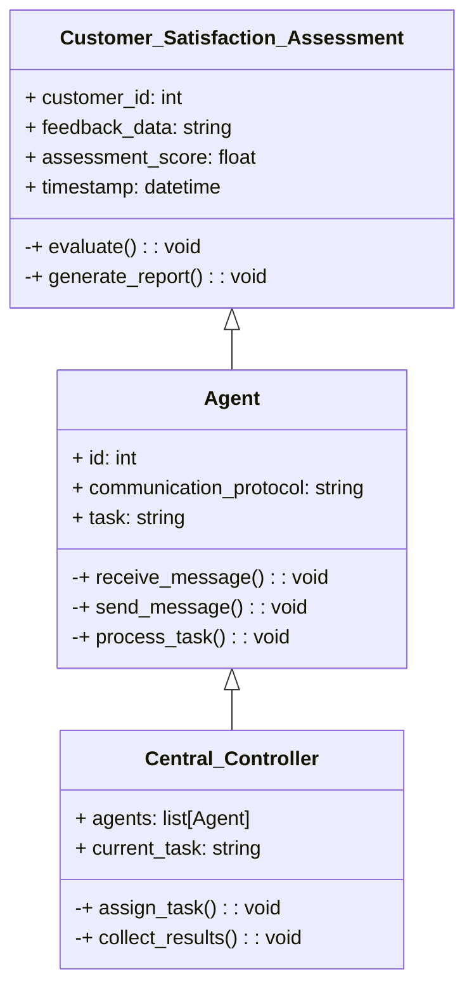

                 


# 多智能体系统在公司客户满意度评估中的应用

## 关键词：多智能体系统, 客户满意度评估, 分布式计算, 协商算法, 实时反馈, 机器学习

## 摘要：
本文探讨了多智能体系统在公司客户满意度评估中的应用。通过分析多智能体系统的核心概念、算法原理和系统架构，结合实际项目案例，详细讲解了多智能体系统如何优化客户满意度评估过程，实现高效、动态的客户反馈管理。文章还提供了数学模型、系统设计和Python代码实现，帮助读者全面理解并应用相关技术。

---

## 第一部分: 多智能体系统与客户满意度评估概述

### 第1章: 多智能体系统与客户满意度评估的背景

#### 1.1 多智能体系统的定义与特点
- **多智能体系统的定义**：由多个自主智能体组成的分布式系统，每个智能体具备感知、推理、决策和行动的能力。
- **多智能体系统的核心特点**：
  - **自主性**：智能体能够自主决策。
  - **反应性**：实时感知环境变化并做出反应。
  - **协作性**：智能体之间通过通信协议协同工作。
  - **分布式性**：任务分布在多个智能体之间，避免单点故障。

#### 1.2 客户满意度评估的背景与挑战
- **客户满意度评估的定义**：衡量客户对产品或服务的满意程度。
- **传统方法的局限性**：
  - 数据收集耗时，反馈滞后。
  - 数据分析复杂，难以实时处理。
  - 需要大量人工干预，效率低。
- **现代需求**：
  - 实时反馈，快速响应。
  - 动态调整，提升客户体验。
  - 数据驱动决策，精准优化产品和服务。

#### 1.3 多智能体系统在客户满意度评估中的应用价值
- **优势**：
  - 实时数据处理，快速生成反馈。
  - 分布式架构，提高系统的可靠性和可扩展性。
  - 智能体协作，优化数据处理和分析。
- **潜在应用**：
  - 实时监控客户反馈，动态调整服务策略。
  - 分析客户行为数据，预测满意度趋势。
  - 协调多个部门，提供一致的客户体验。

---

### 第2章: 多智能体系统的核心概念与联系

#### 2.1 多智能体系统的核心概念
- **智能体的定义与分类**：
  - **反应式智能体**：基于当前环境做出反应。
  - **认知式智能体**：具备复杂推理和规划能力。
  - **协作式智能体**：专注于协作完成任务。
- **智能体的通信协议**：
  - **同步通信**：所有智能体同时进行通信。
  - **异步通信**：智能体按需进行通信，提高效率。
- **智能体的协作机制**：
  - **分布式计算**：任务分解到多个智能体。
  - **协商算法**：智能体之间通过协商分配任务。

#### 2.2 客户满意度评估的核心概念
- **客户满意度的指标体系**：
  - **客户满意度指数（CSI）**：衡量客户整体满意度。
  - **净推荐值（NPS）**：客户推荐产品或服务的意愿。
  - **客户忠诚度**：客户持续使用产品或服务的意愿。
- **数据来源与处理方法**：
  - 数据来源：客户反馈、行为数据、市场调研。
  - 数据处理：数据清洗、特征提取、数据建模。
- **评估模型的选择与优化**：
  - 传统评估模型：统计分析、回归分析。
  - 基于机器学习的模型：随机森林、神经网络。
  - 基于多智能体的模型：分布式评估、协同推理。

#### 2.3 多智能体系统与客户满意度评估的关联
- **多智能体系统如何支持客户满意度评估**：
  - 智能体实时收集客户反馈，快速生成初步评估结果。
  - 多个智能体协作分析数据，提供更准确的评估结果。
  - 智能体之间共享信息，优化评估模型。
- **多智能体系统在数据处理中的优势**：
  - 分布式数据处理，提高效率。
  - 异构数据源的整合，丰富数据维度。
  - 动态调整数据处理策略，适应实时变化。
- **多智能体系统在模型优化中的作用**：
  - 协同推理，提升模型准确性。
  - 分布式计算，加快模型训练速度。
  - 模型自适应，根据反馈动态优化。

---

### 第3章: 多智能体系统在客户满意度评估中的算法原理

#### 3.1 多智能体系统的典型算法
- **分布式计算算法**：
  - 分布式计算通过将任务分解到多个智能体，提高计算效率。
  - 适用于大数据量的处理和分析。
- **协商算法**：
  - 智能体之间通过协商分配任务，确保资源的合理利用。
  - 常见的协商方法：拍卖算法、共识算法。
- **联合推理算法**：
  - 多个智能体协同推理，综合不同来源的信息，生成更准确的评估结果。

#### 3.2 客户满意度评估的算法选择
- **传统评估算法**：
  - 统计分析：计算平均值、标准差。
  - 回归分析：预测满意度趋势。
- **基于机器学习的评估算法**：
  - 随机森林：适用于分类和回归任务。
  - 神经网络：适用于复杂模式识别。
- **基于多智能体的评估算法**：
  - 分布式评估：任务分解到多个智能体，提高处理速度。
  - 协同推理：智能体协作分析数据，生成更准确的评估结果。

#### 3.3 多智能体算法的数学模型与公式

##### 3.3.1 协同过滤算法
协同过滤是一种常用的推荐算法，适用于客户满意度评估。
- **用户-物品矩阵**：表示用户对物品的评分。
- **相似度计算**：使用余弦相似度或其他相似度指标。
- **推荐公式**：根据相似用户的评分加权平均，生成推荐结果。

##### 3.3.2 分布式计算模型
分布式计算模型将任务分解到多个智能体，每个智能体处理部分数据。
- **任务分解**：将数据集分成多个子集，分配给不同智能体。
- **结果汇总**：智能体将部分结果汇总到中央节点，生成最终结果。

---

## 第二部分: 系统分析与架构设计方案

### 第4章: 系统分析与架构设计

#### 4.1 项目场景介绍
- **项目背景**：公司需要实时监控客户反馈，优化客户服务。
- **项目目标**：构建一个基于多智能体系统的客户满意度评估平台。

#### 4.2 系统功能设计
- **数据采集模块**：
  - 实时采集客户反馈数据。
  - 支持多种数据来源，如问卷调查、社交媒体评论。
- **数据分析模块**：
  - 数据清洗和预处理。
  - 应用机器学习算法进行分析，生成初步评估结果。
- **反馈生成模块**：
  - 根据评估结果生成反馈报告。
  - 提供个性化建议，优化客户服务。

#### 4.3 系统架构设计

##### 4.3.1 领域模型（Mermaid 类图）


##### 4.3.2 系统架构图（Mermaid 架构图）


#### 4.4 系统接口设计
- **数据采集接口**：智能体通过API收集客户反馈数据。
- **数据分析接口**：智能体调用机器学习模型进行分析。
- **反馈生成接口**：智能体生成反馈报告并发送给客户。

#### 4.5 系统交互流程（Mermaid 序列图）
```mermaid
sequenceDiagram
    Customer → Agent: 提交反馈
    Agent → Central_Controller: 请求任务分配
    Central_Controller → Agent: 分配数据分析任务
    Agent → Data_Analysis_Module: 提交数据
    Data_Analysis_Module → Agent: 返回评估结果
    Agent → Central_Controller: 汇总评估结果
    Central_Controller → Customer: 生成反馈报告
```

---

## 第三部分: 项目实战与最佳实践

### 第5章: 项目实战

#### 5.1 环境安装
- **安装Python**：Python 3.8 或更高版本。
- **安装依赖库**：
  - `pandas`：数据处理。
  - `numpy`：数值计算。
  - `scikit-learn`：机器学习算法。
  - `networkx`：智能体通信网络。

#### 5.2 系统核心实现源代码
```python
import pandas as pd
from sklearn.metrics.pairwise import cosine_similarity

# 定义协同过滤算法
class CollaborativeFiltering:
    def __init__(self):
        self.user_item_matrix = None
        self.similarity_matrix = None

    def fit(self, data):
        self.user_item_matrix = data.pivot('user_id', 'item_id', 'rating').fillna(0)
        self.similarity_matrix = cosine_similarity(self.user_item_matrix.T)

    def predict(self, user_id, item_id):
        similar_users = self.similarity_matrix[item_id]
        weighted_ratings = similar_users * self.user_item_matrix.loc[user_id].values
        prediction = weighted_ratings.sum() / similar_users.sum()
        return prediction

# 数据加载与处理
data = pd.read_csv('feedback.csv')
model = CollaborativeFiltering()
model.fit(data)

# 预测满意度
predicted_score = model.predict(1, 1)
print(f"预测的满意度为：{predicted_score}")
```

#### 5.3 代码解读与分析
- **数据加载**：从CSV文件加载客户反馈数据。
- **模型训练**：使用协同过滤算法训练模型。
- **预测满意度**：根据用户和项目的ID，预测用户的满意度。

#### 5.4 案例分析与详细讲解
- **案例背景**：某电商平台希望实时监控客户满意度。
- **数据来源**：客户购买记录、评价、投诉。
- **模型训练**：使用协同过滤算法分析数据，预测客户满意度。
- **结果应用**：根据预测结果优化产品推荐和客户服务策略。

#### 5.5 项目小结
- **项目成果**：构建了一个基于多智能体系统的客户满意度评估平台。
- **项目经验**：协作算法在实际应用中的优势明显，但需要处理好智能体之间的通信和任务分配。

---

### 第6章: 最佳实践与注意事项

#### 6.1 最佳实践 tips
- **数据隐私与安全**：确保客户数据的安全，遵守相关法律法规。
- **模型调优**：定期更新模型，提高预测准确率。
- **系统可扩展性**：设计时考虑系统的可扩展性，方便后续功能的添加。
- **实时性优化**：优化智能体的通信协议，提高系统的实时响应能力。

#### 6.2 小结
- 多智能体系统在客户满意度评估中的应用前景广阔，能够显著提升评估的实时性和准确性。
- 通过合理设计系统架构和选择合适的算法，可以充分发挥多智能体系统的优势。

#### 6.3 注意事项
- **数据质量问题**：确保数据的准确性和完整性。
- **智能体之间的通信开销**：合理设计通信协议，降低通信开销。
- **系统的维护与更新**：定期检查和更新系统，确保其稳定运行。

#### 6.4 拓展阅读
- 推荐阅读《Multi-Agent Systems: Complexity, Coordination, and Control》。
- 关注最新的多智能体系统研究和应用案例。

---

## 第四部分: 结论与展望

### 第7章: 结论与展望

#### 7.1 结论
- 多智能体系统通过分布式计算和协作机制，显著提高了客户满意度评估的效率和准确性。
- 基于多智能体系统的评估平台能够实时处理客户反馈，优化客户服务策略。

#### 7.2 未来展望
- **边缘计算**：结合边缘计算，进一步提升系统的实时性和响应速度。
- **区块链技术**：利用区块链技术保障数据的安全性和不可篡改性。
- **强化学习**：应用强化学习优化智能体的决策策略，提高评估的准确性。

---

## 作者：AI天才研究院/AI Genius Institute & 禅与计算机程序设计艺术 /Zen And The Art of Computer Programming

---

以上是《多智能体系统在公司客户满意度评估中的应用》的完整目录大纲和部分正文内容。希望对您有所帮助！

