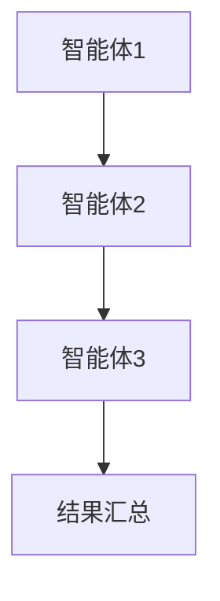
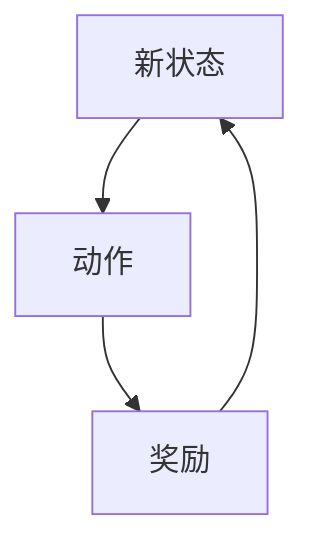

                 


# 多智能体系统在公司技术创新评估中的应用

> 关键词：多智能体系统，技术创新评估，分布式计算，协同学习，智能体协作

> 摘要：本文详细探讨了多智能体系统在公司技术创新评估中的应用。首先介绍了多智能体系统的概念和技术创新评估的背景，然后分析了多智能体系统在技术创新评估中的核心原理和实现技术，接着通过具体案例展示了多智能体系统在技术创新评估中的应用，最后总结了应用中的挑战与解决方案，并展望了未来的发展方向。

---

# 第1章: 多智能体系统与技术创新评估概述

## 1.1 多智能体系统的基本概念

### 1.1.1 多智能体系统的定义
多智能体系统（Multi-Agent System, MAS）是由多个智能体（Agent）组成的分布式系统，这些智能体通过协同工作完成特定任务。智能体是具有感知、决策和执行能力的实体，可以是软件程序、机器人或其他智能设备。

### 1.1.2 多智能体系统的特征
- **自主性**：智能体能够自主决策。
- **反应性**：智能体能够实时感知环境并做出反应。
- **协作性**：智能体之间可以协同完成任务。
- **分布性**：智能体是分布式的，不存在单一的控制中心。

### 1.1.3 多智能体系统与单智能体系统的区别
单智能体系统由一个中心化的智能体完成所有任务，而多智能体系统通过多个智能体的协作完成任务，具有更高的灵活性和容错性。

## 1.2 技术创新评估的基本概念

### 1.2.1 技术创新的定义
技术创新是指在技术、产品或服务方面进行的创新活动，目的是提高企业的竞争力。

### 1.2.2 技术创新评估的必要性
技术创新评估是企业制定技术创新战略的重要依据，能够帮助企业识别技术优势和短板，优化资源配置。

### 1.2.3 技术创新评估的指标体系
技术创新评估的指标包括技术领先性、市场适应性、技术可行性和经济收益性。

## 1.3 多智能体系统在技术创新评估中的应用前景

### 1.3.1 多智能体系统在技术创新评估中的优势
- **分布式计算能力**：多智能体系统能够处理大规模数据和复杂任务。
- **协作性**：多个智能体可以协同完成复杂的评估任务。
- **实时性**：多智能体系统能够实时感知和分析数据。

### 1.3.2 多智能体系统在技术创新评估中的挑战
- **数据隐私**：多智能体系统需要处理大量的敏感数据，数据隐私问题需要解决。
- **智能体协同**：如何保证多个智能体协同工作是技术难点。
- **计算复杂度**：多智能体系统的计算复杂度较高，需要优化算法。

### 1.3.3 多智能体系统在技术创新评估中的未来发展方向
- **智能化**：进一步提升智能体的自主性和智能性。
- **分布式计算**：优化分布式计算能力，提高系统的效率和性能。
- **安全性**：加强数据安全和系统安全，确保智能体协同的安全性。

---

# 第2章: 技术创新评估的理论基础

## 2.1 技术创新评估的理论框架

### 2.1.1 技术创新评估的层次结构
技术创新评估的层次结构包括技术创新的目标、技术创新的过程和技术创新的结果。

### 2.1.2 技术创新评估的关键维度
技术创新评估的关键维度包括技术性、经济性、社会性和环境性。

### 2.1.3 技术创新评估的数学模型
技术创新评估的数学模型可以表示为：
$$
\text{技术创新评估} = \sum_{i=1}^{n} w_i x_i
$$
其中，$w_i$ 是第 $i$ 个指标的权重，$x_i$ 是第 $i$ 个指标的值。

## 2.2 多智能体系统在技术创新评估中的理论基础

### 2.2.1 多智能体系统的协同理论
多智能体系统的协同理论包括任务分配、协调和协作机制。

### 2.2.2 多智能体系统的分布式计算理论
分布式计算理论是多智能体系统的核心理论，包括分布式任务分配、分布式计算和分布式通信。

### 2.2.3 多智能体系统的博弈论基础
博弈论是多智能体系统的重要理论基础，包括纳什均衡和博弈树等概念。

---

# 第3章: 多智能体系统的原理与实现

## 3.1 多智能体系统的体系结构

### 3.1.1 分布式体系结构
分布式体系结构是多智能体系统的典型结构，由多个智能体组成，每个智能体都有自己的任务和目标。

### 3.1.2 集中式体系结构
集中式体系结构由一个中心智能体协调其他智能体的工作。

### 3.1.3 混合式体系结构
混合式体系结构结合了分布式和集中式体系结构的优点，具有较高的灵活性和可扩展性。

## 3.2 多智能体系统的通信与协作

### 3.2.1 智能体间的通信协议
智能体间的通信协议包括基于消息的通信和基于服务的通信。

### 3.2.2 智能体间的协作机制
智能体间的协作机制包括任务分配、协调和同步。

### 3.2.3 智能体间的冲突解决
智能体间的冲突解决包括协商、仲裁和调解等方法。

## 3.3 多智能体系统的实现技术

### 3.3.1 多智能体系统的编程模型
多智能体系统的编程模型包括基于规则的编程和基于状态的编程。

### 3.3.2 多智能体系统的开发框架
多智能体系统的开发框架包括MAS、AgentSpeak和BDI模型。

### 3.3.3 多智能体系统的性能优化
多智能体系统的性能优化包括分布式计算优化、通信优化和任务分配优化。

---

# 第4章: 多智能体系统在技术创新评估中的应用

## 4.1 技术创新评估的需求分析

### 4.1.1 技术创新评估的核心需求
技术创新评估的核心需求包括技术创新的识别、评估和优化。

### 4.1.2 技术创新评估的业务流程
技术创新评估的业务流程包括数据收集、数据处理、评估分析和结果输出。

### 4.1.3 技术创新评估的系统架构
技术创新评估的系统架构包括数据采集层、数据处理层、评估分析层和用户界面层。

## 4.2 多智能体系统的技术创新评估实现

### 4.2.1 系统功能设计
系统功能设计包括数据采集、数据处理、评估分析和结果输出。

### 4.2.2 系统模块划分
系统模块划分包括数据采集模块、数据处理模块、评估分析模块和用户界面模块。

### 4.2.3 系统功能实现
系统功能实现包括基于多智能体的分布式计算、智能体间的协作和智能体间的通信。

---

# 第5章: 多智能体系统在技术创新评估中的算法实现

## 5.1 基于多智能体的评估算法

### 5.1.1 算法原理
基于多智能体的评估算法包括任务分配、协作计算和结果汇总。

### 5.1.2 算法流程图


### 5.1.3 算法实现
```python
class Agent:
    def __init__(self, id):
        self.id = id
        self.task = None
    def assign_task(self, task):
        self.task = task
    def execute_task(self):
        # 实现具体任务
        pass

class MAS:
    def __init__(self, agents):
        self.agents = agents
    def distribute_task(self, task):
        for agent in self.agents:
            agent.assign_task(task)
    def execute(self):
        for agent in self.agents:
            agent.execute_task()
```

## 5.2 基于强化学习的优化算法

### 5.2.1 算法原理
基于强化学习的优化算法通过智能体的学习和优化，提高评估的准确性和效率。

### 5.2.2 算法流程图


### 5.2.3 算法实现
```python
import numpy as np

class DQN:
    def __init__(self, state_space, action_space):
        self.state_space = state_space
        self.action_space = action_space
        self.q_table = np.zeros((state_space, action_space))
    def choose_action(self, state):
        if np.random.rand() < 0.9:
            action = np.argmax(self.q_table[state])
        else:
            action = np.random.randint(self.action_space)
        return action
    def learn(self, state, action, reward):
        self.q_table[state, action] += reward
```

---

# 第6章: 多智能体系统在技术创新评估中的项目实战

## 6.1 环境搭建

### 6.1.1 系统环境
系统环境包括硬件环境和软件环境。

### 6.1.2 数据准备
数据准备包括数据收集、数据清洗和数据预处理。

## 6.2 系统核心代码实现

### 6.2.1 系统架构设计
系统架构设计包括模块划分、接口设计和流程设计。

### 6.2.2 核心代码实现
```python
class TechnologyInnovationEvaluator:
    def __init__(self, agents):
        self.agents = agents
    def evaluate(self, technology):
        for agent in self.agents:
            agent.evaluate_task(technology)
    def get_result(self):
        results = []
        for agent in self.agents:
            results.append(agent.get_result())
        return results
```

## 6.3 系统测试与优化

### 6.3.1 系统测试
系统测试包括功能测试、性能测试和安全性测试。

### 6.3.2 系统优化
系统优化包括算法优化、资源优化和流程优化。

## 6.4 案例分析

### 6.4.1 案例背景
案例背景包括企业的技术创新需求和目标。

### 6.4.2 案例分析
案例分析包括数据收集、数据处理和评估分析。

### 6.4.3 案例总结
案例总结包括评估结果、优化建议和经验教训。

---

# 第7章: 多智能体系统在技术创新评估中的挑战与解决方案

## 7.1 应用中的挑战

### 7.1.1 数据隐私问题
数据隐私问题是多智能体系统在技术创新评估中的主要挑战之一。

### 7.1.2 智能体协同问题
智能体协同问题包括任务分配、协作和冲突解决。

### 7.1.3 系统安全性问题
系统安全性问题是多智能体系统在技术创新评估中的重要挑战。

## 7.2 解决方案

### 7.2.1 数据隐私保护
数据隐私保护包括数据加密、数据匿名化和数据访问控制。

### 7.2.2 智能体协同优化
智能体协同优化包括任务分配优化、协作机制优化和冲突解决优化。

### 7.2.3 系统安全性提升
系统安全性提升包括系统漏洞修复、入侵检测和安全防护。

---

# 第8章: 总结与展望

## 8.1 本章总结
本章总结了多智能体系统在技术创新评估中的应用，包括基本概念、理论基础、实现技术、实际应用和挑战与解决方案。

## 8.2 未来展望
未来展望包括多智能体系统的智能化、分布式计算的优化和系统安全性的提升。

## 8.3 最佳实践 tips
- **数据隐私**：加强数据隐私保护，确保系统的安全性。
- **智能体协同**：优化智能体协同机制，提高系统的效率。
- **系统安全性**：加强系统安全性，确保智能体协同的安全性。

---

# 作者：AI天才研究院 & 禅与计算机程序设计艺术

---

通过以上目录和内容，您可以开始撰写具体的章节内容，确保每个部分都有详细的解释和具体的代码示例。希望这能为您提供一个清晰的写作方向和框架。

