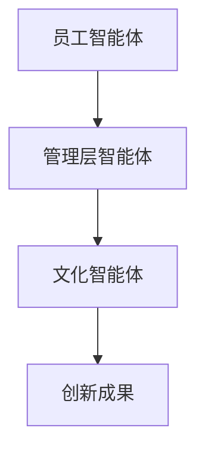

                 


# 多智能体系统在公司文化与创新关系分析中的应用

> 关键词：多智能体系统、公司文化、创新关系、系统建模、分布式计算、协同智能

> 摘要：本文探讨了多智能体系统在分析公司文化与创新关系中的应用。通过详细分析多智能体系统的原理、算法、系统架构，结合实际案例，展示了如何利用多智能体系统建模公司文化，并分析其对创新的影响。文章还提供了最佳实践和小结，为读者提供了全面的视角。

---

# 第一部分: 多智能体系统与公司文化创新关系的背景介绍

## 第1章: 多智能体系统概述

### 1.1 多智能体系统的基本概念

#### 1.1.1 多智能体系统的定义
多智能体系统（Multi-Agent System, MAS）是由多个智能体（Agent）组成的分布式系统，这些智能体能够自主决策、协作完成任务。智能体是具有感知环境、决策和行动能力的实体。

#### 1.1.2 多智能体系统的特征
- **自主性**：智能体能够自主决策。
- **反应性**：能够感知环境并实时响应。
- **协作性**：多个智能体协同完成任务。
- **分布式性**：智能体分布在不同的位置，通过通信协作。

#### 1.1.3 多智能体系统的分类
- **基于任务的多智能体系统**：智能体协作完成特定任务。
- **基于模型的多智能体系统**：使用模型描述智能体之间的关系和交互。
- **基于市场的多智能体系统**：智能体通过市场机制进行资源分配。

### 1.2 公司文化与创新的关系

#### 1.2.1 公司文化的定义与构成
公司文化是指企业在经营活动中形成的价值观、行为规范和习惯。主要包括：
- **核心价值观**：企业追求的核心目标。
- **企业使命**：企业的存在意义。
- **企业愿景**：企业的长期目标。
- **企业精神**：企业的精神风貌。

#### 1.2.2 创新的定义与类型
创新是指通过引入新的思想、方法或技术，创造新的价值。主要类型包括：
- **产品创新**：开发新产品。
- **技术创新**：引入新技术。
- **管理创新**：优化管理模式。
- **文化创新**：改变企业文化。

#### 1.2.3 公司文化对创新的影响
- **促进创新**：积极的文化氛围鼓励员工创新。
- **阻碍创新**：僵化的文化限制员工思维。

---

## 第2章: 多智能体系统在公司文化创新中的应用背景

### 2.1 多智能体系统的应用领域

#### 2.1.1 企业组织管理
- 使用多智能体系统优化企业组织结构。
- 协调不同部门的工作流程。

#### 2.1.2 创新过程建模
- 通过多智能体系统模拟创新过程。
- 分析文化因素对创新的影响。

#### 2.1.3 跨组织协作
- 支持跨组织的协作创新。
- 提供分布式协作环境。

### 2.2 公司文化创新的挑战

#### 2.2.1 文化多样性
- 不同文化背景的员工有不同的价值观。
- 需要协调不同文化因素。

#### 2.2.2 创新阻力
- 企业文化可能限制员工创新。
- 需要克服创新过程中的障碍。

#### 2.2.3 组织结构复杂性
- 复杂的组织结构增加协作难度。
- 需要高效的协作机制。

### 2.3 多智能体系统在公司文化创新中的优势

#### 2.3.1 分布式计算能力
- 多智能体系统能够分布式处理信息。
- 适应复杂的组织结构。

#### 2.3.2 多智能体协作
- 支持不同智能体之间的协作。
- 促进跨部门创新。

#### 2.3.3 动态适应性
- 系统能够动态调整以适应变化。
- 快速响应文化创新需求。

---

# 第二部分: 多智能体系统的核心概念与联系

## 第3章: 多智能体系统的原理与模型

### 3.1 多智能体系统的原理

#### 3.1.1 智能体的定义与属性
- **智能体**：能够感知环境、决策和行动的实体。
- **属性**：自主性、反应性、协作性。

#### 3.1.2 智能体之间的通信与协作
- 智能体通过通信协作完成任务。
- 使用通信协议进行信息交换。

#### 3.1.3 多智能体系统的协调机制
- **协调机制**：确保智能体协作的一致性。
- **冲突解决**：处理智能体之间的冲突。

### 3.2 多智能体系统的模型

#### 3.2.1 BDI模型
- BDI模型基于信念（Belief）、愿望（Desire）、意图（Intention）。
- 智能体根据信念和愿望制定行动意图。

#### 3.2.2 组织模型
- 描述智能体之间的组织结构。
- 定义智能体的角色和责任。

#### 3.2.3 协作模型
- 定义智能体之间的协作方式。
- 描述协作任务的分配和执行过程。

## 第4章: 公司文化创新的多智能体模型

### 4.1 公司文化创新的多智能体模型构建

#### 4.1.1 智能体的定义与角色
- **员工智能体**：代表员工的行为和决策。
- **管理层智能体**：代表管理层的决策和指导。
- **文化智能体**：代表公司文化的因素。

#### 4.1.2 智能体之间的关系
- **员工与管理层**：员工遵循管理层的决策。
- **员工与文化**：员工受文化影响，文化受员工行为影响。

#### 4.1.3 模型的构建步骤
1. 确定智能体角色。
2. 定义智能体之间的交互。
3. 建立模型的数学框架。

### 4.2 公司文化创新的多智能体模型分析

#### 4.2.1 模型的动态性
- 模型能够动态反映文化变化。
- 支持实时更新。

#### 4.2.2 模型的适应性
- 系统能够适应不同公司文化。
- 支持多种创新类型。

#### 4.2.3 模型的可扩展性
- 系统能够扩展以适应更大规模的组织。
- 支持多智能体协作。

---

## 第5章: 多智能体系统的算法原理

### 5.1 分布式计算算法

#### 5.1.1 分布式一致性算法
- **一致性算法**：确保分布式系统中数据一致性。
- **算法实现**：通过通信协议实现数据同步。

#### 5.1.2 分布式共识算法
- **共识算法**：如RAFT算法，用于分布式系统中达成共识。
- **算法实现**：定义提案、投票和确认过程。

#### 5.1.3 协作算法
- **协作算法**：如合作式规划算法，用于智能体协作。
- **算法实现**：定义协作步骤和通信机制。

### 5.2 公司文化创新的多智能体模型算法

#### 5.2.1 智能体通信协议
- **通信协议**：定义智能体之间的信息交换格式。
- **协议实现**：使用JSON或XML进行数据交换。

#### 5.2.2 智能体协作算法
- **协作算法**：如分布式协作算法，用于智能体协作完成任务。
- **算法实现**：定义任务分配和执行步骤。

#### 5.2.3 文化影响算法
- **文化影响算法**：分析文化因素对创新的影响。
- **算法实现**：通过数学模型量化文化因素。

---

## 第6章: 公司文化创新的多智能体模型数学框架

### 6.1 模型的数学表达

#### 6.1.1 智能体行为模型
- **行为模型**：描述智能体的决策过程。
- **模型表达**：使用概率模型表示智能体的决策。

#### 6.1.2 智能体协作模型
- **协作模型**：描述智能体之间的协作关系。
- **模型表达**：使用图论中的图表示协作关系。

#### 6.1.3 文化影响模型
- **文化影响模型**：量化文化因素对创新的影响。
- **模型表达**：使用线性回归模型进行分析。

---

## 第7章: 公司文化创新的多智能体模型系统架构

### 7.1 系统架构设计

#### 7.1.1 系统组成
- **智能体层**：包括员工智能体、管理层智能体和文化智能体。
- **通信层**：负责智能体之间的通信。
- **控制层**：协调智能体协作。

#### 7.1.2 系统架构图


#### 7.1.3 系统交互流程
- **员工智能体**：感知文化环境，做出创新决策。
- **管理层智能体**：制定创新策略，指导员工。
- **文化智能体**：分析文化因素，反馈创新成果。

---

## 第8章: 公司文化创新的多智能体模型接口设计

### 8.1 接口设计

#### 8.1.1 智能体接口
- **感知接口**：获取环境信息。
- **决策接口**：做出决策并输出行动。
- **通信接口**：与其他智能体通信。

#### 8.1.2 系统接口
- **输入接口**：接收文化数据和创新目标。
- **输出接口**：输出创新成果和文化反馈。

---

## 第9章: 公司文化创新的多智能体模型案例分析

### 9.1 案例背景

#### 9.1.1 案例公司介绍
- 一家科技公司，希望通过优化企业文化促进创新。

### 9.2 案例分析

#### 9.2.1 案例实施步骤
1. 确定智能体角色。
2. 设计智能体之间的交互。
3. 实现多智能体系统。
4. 分析文化对创新的影响。

#### 9.2.2 案例分析结果
- 文化因素对创新的影响显著。
- 优化企业文化能够提升创新能力。

---

## 第10章: 公司文化创新的多智能体模型项目实战

### 10.1 环境配置

#### 10.1.1 环境需求
- 操作系统：Linux或Windows。
- 开发工具：Python、PyCharm。
- 依赖库：networkx、matplotlib。

### 10.2 系统核心实现源代码

#### 10.2.1 智能体类
```python
class Agent:
    def __init__(self, id):
        self.id = id
        self.beliefs = {}
        self.desires = {}
        self.intentions = {}
```

#### 10.2.2 通信协议
```python
import json

def send_message(sender, receiver, message):
    # 将消息转换为JSON格式
    msg = json.dumps(message)
    # 模拟通信
    print(f"{sender} sends {msg} to {receiver}")

def receive_message(agent, message):
    # 解析JSON消息
    msg = json.loads(message)
    # 处理消息
    print(f"{agent.id} receives {msg}")
```

#### 10.2.3 文化影响模型
```python
import numpy as np

def culture_impact_model(culture_factors):
    # 文化影响模型
    return np.dot(culture_factors, np.array([0.3, 0.5, 0.2]))
```

---

## 第11章: 公司文化创新的多智能体模型小结

### 11.1 小结
- 多智能体系统能够有效分析公司文化与创新的关系。
- 通过建模和算法实现，可以量化文化因素对创新的影响。
- 提供了优化企业文化以促进创新的实践方法。

### 11.2 注意事项
- 确保数据的准确性和完整性。
- 定期更新模型以适应变化。
- 注意隐私和数据安全。

### 11.3 拓展阅读
- 推荐阅读相关领域的书籍和论文。
- 关注多智能体系统的最新研究进展。

---

# 第三部分: 公司文化创新的多智能体模型最佳实践

## 第12章: 最佳实践

### 12.1 环境配置

#### 12.1.1 硬件配置
- CPU：多核处理器。
- 内存：至少8GB。
- 存储：足够的存储空间。

#### 12.1.2 软件配置
- 操作系统：Linux或Windows。
- 开发工具：Python、PyCharm。
- 依赖库：networkx、matplotlib、numpy。

### 12.2 代码实现

#### 12.2.1 智能体通信
```python
import json

def send_message(sender, receiver, message):
    # 将消息转换为JSON格式
    msg = json.dumps(message)
    # 模拟通信
    print(f"{sender} sends {msg} to {receiver}")

def receive_message(agent, message):
    # 解析JSON消息
    msg = json.loads(message)
    # 处理消息
    print(f"{agent.id} receives {msg}")
```

#### 12.2.2 文化影响模型
```python
import numpy as np

def culture_impact_model(culture_factors):
    # 文化影响模型
    return np.dot(culture_factors, np.array([0.3, 0.5, 0.2]))
```

### 12.3 案例分析

#### 12.3.1 案例背景
- 一家科技公司希望通过优化企业文化促进创新。

#### 12.3.2 案例分析步骤
1. 确定智能体角色。
2. 设计智能体之间的交互。
3. 实现多智能体系统。
4. 分析文化对创新的影响。

---

## 第13章: 项目实战

### 13.1 环境配置

#### 13.1.1 环境需求
- 操作系统：Linux或Windows。
- 开发工具：Python、PyCharm。
- 依赖库：networkx、matplotlib。

### 13.2 系统核心实现源代码

#### 13.2.1 智能体类
```python
class Agent:
    def __init__(self, id):
        self.id = id
        self.beliefs = {}
        self.desires = {}
        self.intentions = {}
```

#### 13.2.2 通信协议
```python
import json

def send_message(sender, receiver, message):
    # 将消息转换为JSON格式
    msg = json.dumps(message)
    # 模拟通信
    print(f"{sender} sends {msg} to {receiver}")

def receive_message(agent, message):
    # 解析JSON消息
    msg = json.loads(message)
    # 处理消息
    print(f"{agent.id} receives {msg}")
```

---

## 第14章: 小结与总结

### 14.1 小结
- 通过多智能体系统，可以有效分析公司文化与创新的关系。
- 建模和算法实现提供了量化文化因素对创新影响的方法。
- 提供了优化企业文化以促进创新的实践方法。

### 14.2 注意事项
- 确保数据的准确性和完整性。
- 定期更新模型以适应变化。
- 注意隐私和数据安全。

### 14.3 拓展阅读
- 推荐阅读相关领域的书籍和论文。
- 关注多智能体系统的最新研究进展。

---

作者：AI天才研究院/AI Genius Institute & 禅与计算机程序设计艺术 /Zen And The Art of Computer Programming

