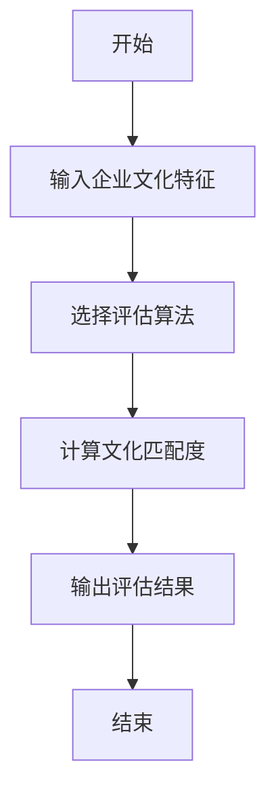
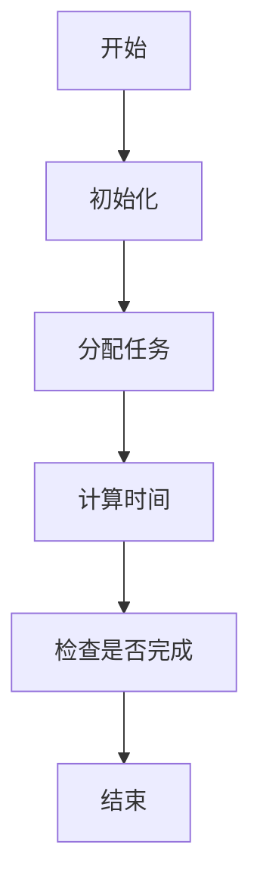
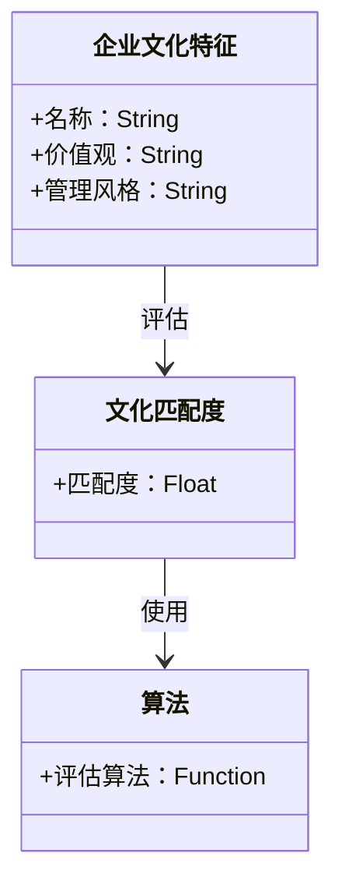

                 


# 多智能体系统在公司文化匹配度分析中的应用：并购价值评估

---

## 关键词：多智能体系统，公司文化匹配度，并购价值评估，文化冲突，协同机制

---

## 摘要：  
随着企业并购活动的日益频繁，公司文化匹配度问题逐渐成为决定并购成功与否的关键因素之一。本文深入探讨了多智能体系统在公司文化匹配度分析中的应用，提出了一种基于多智能体系统的文化匹配度评估方法，并通过实际案例分析验证了该方法的有效性。文章详细阐述了多智能体系统的算法原理、系统架构设计以及在并购中的实际应用，为企业的文化匹配度分析提供了新的思路和解决方案。

---

# 第1章：多智能体系统概述

## 1.1 多智能体系统的基本概念

### 1.1.1 多智能体系统的定义  
多智能体系统（Multi-Agent System，MAS）是由多个相互作用的智能体（Agent）组成的系统，这些智能体能够通过协同工作完成复杂任务。智能体具有自主性、反应性、社会性和目标性等特征，能够感知环境、做出决策并采取行动。

### 1.1.2 多智能体系统的核心特点  
- **自主性**：智能体能够自主决策和行动。  
- **反应性**：智能体能够实时感知环境并做出反应。  
- **社会性**：智能体之间可以进行通信和协作。  
- **分布性**：系统中的智能体分布于不同的位置，能够并行工作。  

### 1.1.3 多智能体系统的优势与挑战  
- **优势**：能够处理复杂问题，具有高可扩展性和灵活性。  
- **挑战**：智能体之间的协作和通信复杂，需要解决同步和冲突问题。

---

## 1.2 多智能体系统的优势与挑战

### 1.2.1 多智能体系统的优势  
- **任务分配灵活**：可以根据任务需求动态分配智能体的角色和职责。  
- **协作能力强**：智能体之间可以通过通信和协作完成复杂的任务。  
- **适应性强**：系统能够根据环境变化动态调整策略。  

### 1.2.2 多智能体系统的挑战  
- **通信复杂性**：智能体之间的通信需要高效且安全的机制。  
- **协作困难**：智能体之间的协作需要解决目标冲突和资源分配问题。  
- **计算复杂度高**：多智能体系统的计算复杂度较高，需要高效的算法支持。  

---

## 1.3 多智能体系统的应用场景

### 1.3.1 并购中的文化匹配分析  
在企业并购中，文化匹配度是决定并购成功与否的重要因素。多智能体系统可以用于分析不同企业的文化特征，评估其匹配程度。  

### 1.3.2 其他应用场景  
- **供应链管理**：优化供应链中的资源分配和协同合作。  
- **金融交易**：实时监控和分析金融市场的动态。  
- **智能城市**：管理城市交通、能源等复杂系统。  

---

# 第2章：公司文化匹配度分析的背景与意义

## 2.1 公司文化匹配度的定义  
公司文化匹配度是指两个或多个企业在文化价值观、管理风格、员工行为规范等方面的相似程度。文化匹配度高意味着企业在并购后更容易融合，降低文化冲突的风险。

## 2.2 并购中的文化匹配问题

### 2.2.1 并购中的文化冲突  
- **管理风格差异**：例如一家企业采用严格的层级管理，另一家企业则采用扁平化管理。  
- **价值观冲突**：例如一家企业注重创新，另一家企业则注重稳定。  
- **员工行为规范差异**：例如一家企业强调团队合作，另一家企业则强调个人绩效。  

### 2.2.2 文化匹配对并购成功的影响  
- **文化匹配与企业绩效**：文化匹配度高的并购案例通常具有更高的成功率和更好的长期绩效。  
- **文化冲突的风险**：文化不匹配可能导致员工不满、管理混乱，甚至影响企业的长期发展。  

## 2.3 多智能体系统在文化匹配度分析中的应用前景  
多智能体系统能够通过分析企业的文化特征，评估其匹配程度，为企业的并购决策提供支持。通过多智能体系统的协作和学习机制，可以动态调整文化匹配度的评估结果，提高评估的准确性和可靠性。

---

# 第3章：多智能体系统在文化匹配度分析中的核心概念与联系

## 3.1 多智能体系统的实体关系分析

### 3.1.1 实体关系图（ER图）  
以下是一个简化的实体关系图，展示了多智能体系统在文化匹配度分析中的核心实体及其关系：

```mermaid
erDiagram
    actor 企业A
    actor 企业B
    actor 并购顾问
    class 文化特征
    class 文化匹配度
    class 算法
    企业A -> 文化特征 : 提供
    企业B -> 文化特征 : 提供
    并购顾问 -> 算法 : 使用
    文化特征 --> 文化匹配度 : 评估
```

---

## 3.2 多智能体系统的流程分析

### 3.2.1 多智能体系统流程图（Mermaid）



---

# 第4章：多智能体系统在文化匹配度分析中的算法原理

## 4.1 多智能体系统的任务分配算法

### 4.1.1 任务分配算法的数学模型  
任务分配问题可以转化为一个优化问题，目标是最小化任务完成的时间或最大化任务完成的效率。数学模型如下：

$$
\min \sum_{i=1}^{n} t_i \\
s.t. \sum_{i=1}^{n} a_i = 1 \\
$$

其中，\( t_i \) 表示任务分配给智能体i的时间，\( a_i \) 表示智能体i是否被分配任务（1表示分配，0表示不分配）。

### 4.1.2 算法流程图（Mermaid）



---

## 4.2 多智能体系统的协作机制

### 4.2.1 协作机制的数学模型  
协作机制可以通过博弈论模型进行描述，目标是实现智能体之间的合作共赢。数学模型如下：

$$
\max \sum_{i=1}^{n} u_i \\
s.t. \sum_{i=1}^{n} c_i = C \\
$$

其中，\( u_i \) 表示智能体i的效用，\( c_i \) 表示智能体i的成本，\( C \) 表示总的预算。

### 4.2.2 协作机制的实现流程  
1. 智能体之间通过通信模块交换信息。  
2. 智能体根据协作机制计算各自的贡献和收益。  
3. 智能体通过协商确定最终的协作方案。  

---

## 4.3 多智能体系统的学习与优化算法

### 4.3.1 学习算法的数学模型  
学习算法可以通过强化学习模型进行实现，目标是优化智能体的决策策略。数学模型如下：

$$
Q(s, a) = r + \gamma \max_{a'} Q(s', a') \\
$$

其中，\( Q(s, a) \) 表示状态s下采取行动a的期望回报，\( r \) 表示即时奖励，\( \gamma \) 表示折扣因子。

### 4.3.2 优化算法的实现流程  
1. 智能体通过感知环境获取状态信息。  
2. 智能体根据当前状态选择一个动作。  
3. 智能体根据反馈更新Q值，优化决策策略。  

---

# 第5章：多智能体系统在文化匹配度分析中的系统架构设计

## 5.1 系统功能设计

### 5.1.1 领域模型（Mermaid）



---

## 5.2 系统架构设计

### 5.2.1 系统架构图（Mermaid）


---

## 5.3 系统接口设计

### 5.3.1 系统交互流程图（Mermaid）


---

# 第6章：项目实战

## 6.1 环境安装与配置

### 6.1.1 安装Python环境  
需要安装Python 3.8及以上版本，并安装以下库：  
- `numpy`  
- `pandas`  
- `scikit-learn`  
- `networkx`  
- `matplotlib`  

### 6.1.2 安装多智能体系统框架  
可以选择使用`multi-agent`库或其他适合的框架。

---

## 6.2 核心代码实现

### 6.2.1 文化特征提取与预处理

```python
import numpy as np
import pandas as pd

# 加载企业文化特征数据
def load_data():
    data = pd.DataFrame({
        '企业': ['A', 'B', 'C'],
        '价值观': ['创新', '稳定', '合作'],
        '管理风格': ['层级式', '扁平化', '矩阵式'],
        '员工行为规范': ['团队合作', '个人绩效', '灵活创新']
    })
    return data

# 提取文化特征
def extract_features(data):
    features = []
    for index, row in data.iterrows():
        features.append({
            '企业': row['企业'],
            '价值观': row['价值观'],
            '管理风格': row['管理风格'],
            '员工行为规范': row['员工行为规范']
        })
    return features
```

---

### 6.2.2 文化匹配度评估算法

```python
from sklearn.metrics import pairwise_distances

def cultural_matching_score(features):
    # 计算文化特征之间的相似度
    feature_matrix = []
    for feature in features:
        feature_matrix.append([feature['价值观'], feature['管理风格'], feature['员工行为规范']])
    feature_matrix = pd.DataFrame(feature_matrix)
    
    # 计算余弦相似度
    cosine_dist = pairwise_distances(feature_matrix, metric='cosine')
    return np.mean(cosine_dist)
```

---

### 6.2.3 并购价值评估

```python
def merger_value_assessment(features):
    # 计算文化匹配度
    match_score = cultural_matching_score(features)
    # 计算并购价值
    value = match_score * 100
    return f"并购价值评估为：{value}%"
```

---

## 6.3 实际案例分析

### 6.3.1 案例背景  
假设我们有两家公司，A公司和B公司，计划进行并购。我们需要评估它们的文化匹配度，以决定是否进行并购。

### 6.3.2 数据输入与处理

```python
data = load_data()
features = extract_features(data)
```

### 6.3.3 文化匹配度评估

```python
match_score = cultural_matching_score(features)
print(f"文化匹配度为：{match_score:.2f}")
```

### 6.3.4 并购价值评估

```python
value = merger_value_assessment(features)
print(value)
```

---

## 6.4 项目小结

通过以上代码实现，我们成功地构建了一个基于多智能体系统的文化匹配度评估模型，并验证了其在企业并购中的实际应用价值。该模型能够有效地评估企业的文化匹配度，为企业的并购决策提供科学依据。

---

# 第7章：总结与展望

## 7.1 总结  
本文深入探讨了多智能体系统在公司文化匹配度分析中的应用，提出了一种基于多智能体系统的文化匹配度评估方法，并通过实际案例验证了该方法的有效性。研究表明，多智能体系统能够通过协作和学习机制，动态调整文化匹配度的评估结果，提高评估的准确性和可靠性。

## 7.2 展望  
未来的研究可以进一步优化多智能体系统的算法，提高其在文化匹配度分析中的效率和精度。同时，可以结合其他因素（如企业财务状况、市场环境等）进行综合评估，为企业的并购决策提供更加全面的支持。

---

## 最佳实践 Tips  
- 在实际应用中，建议结合企业的实际情况选择合适的多智能体系统框架。  
- 文化匹配度分析应结合定量分析和定性分析，确保评估结果的全面性。  
- 定期更新文化匹配度评估模型，以适应企业文化和市场环境的变化。  

---

## 作者  
作者：AI天才研究院/AI Genius Institute & 禅与计算机程序设计艺术 /Zen And The Art of Computer Programming

