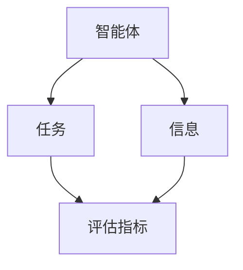
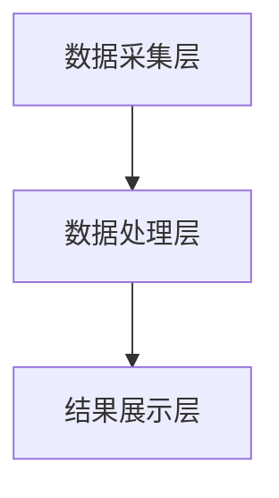

                 


# 多智能体系统在公司文化评估中的创新应用

> 关键词：多智能体系统，公司文化评估，创新应用，分布式计算，人工智能

> 摘要：本文探讨了多智能体系统（MAS）在公司文化评估中的创新应用。通过分析MAS的基本概念、算法原理和系统架构，结合实际案例，展示了如何利用MAS技术提升公司文化评估的准确性和全面性。

---

## 第1章 多智能体系统概述

### 1.1 多智能体系统的定义与特点
多智能体系统（Multi-Agent System, MAS）是由多个智能体组成的分布式系统，每个智能体能够自主感知环境、处理信息并做出决策。MAS的特点包括自主性、协作性、反应性和分布性。

### 1.2 公司文化评估的核心概念
公司文化评估是对企业内部文化氛围的分析，包括员工价值观、团队协作和企业精神等方面。传统评估方法存在主观性强、覆盖面有限的问题。

### 1.3 多智能体系统在公司文化评估中的应用背景
随着企业规模扩大，文化评估需求日益增长。MAS通过分布式计算和协作机制，提供了更高效和全面的评估方法。

---

## 第2章 多智能体系统的核心概念与联系

### 2.1 多智能体系统的原理
MAS通过智能体间的协作完成任务，每个智能体负责不同的数据处理和分析。

### 2.2 MAS与公司文化评估的关联
MAS能够处理多源数据，提供动态评估结果，帮助企业在复杂环境中优化文化管理。

### 2.3 ER实体关系图


---

## 第3章 多智能体系统在公司文化评估中的算法原理

### 3.1 分布式计算算法
MAS使用分布式计算算法，如一致性算法，确保各个智能体的决策一致。

### 3.2 数学模型
一致性算法公式：
$$ \text{一致性条件} = \max_{i} \{v_i\} $$

### 3.3 算法实现
```python
def multi_agent_consensus(agents):
    max_value = max(agent.value for agent in agents)
    return max_value
```

---

## 第4章 系统分析与架构设计

### 4.1 项目背景与目标
项目旨在利用MAS技术提升公司文化评估的效率和准确性。

### 4.2 系统功能设计
系统功能包括数据采集、分析和结果展示。

### 4.3 系统架构图


### 4.4 接口设计
智能体间通过API进行通信，确保数据共享和任务协调。

---

## 第5章 项目实战

### 5.1 环境安装
安装Python和必要的库，如TensorFlow和Docker。

### 5.2 核心代码实现
```python
class Agent:
    def __init__(self, id):
        self.id = id
        self.data = []

    def collect_data(self):
        # 收集数据
        pass

    def process_data(self):
        # 处理数据
        pass
```

### 5.3 案例分析
通过实际案例展示MAS在文化评估中的应用，分析评估结果并总结经验。

---

## 第6章 最佳实践

### 6.1 小结
MAS技术为公司文化评估提供了新的思路，通过分布式计算和协作机制，提升了评估的准确性和全面性。

### 6.2 注意事项
在实施MAS系统时，需注意数据隐私和智能体间的通信效率。

### 6.3 拓展阅读
建议进一步研究分布式系统和机器学习在文化评估中的应用。

---

## 作者：AI天才研究院 & 禅与计算机程序设计艺术

---

通过本文的详细介绍，读者可以系统地了解多智能体系统在公司文化评估中的创新应用，从理论到实践，为企业的文化管理提供新的技术手段。

