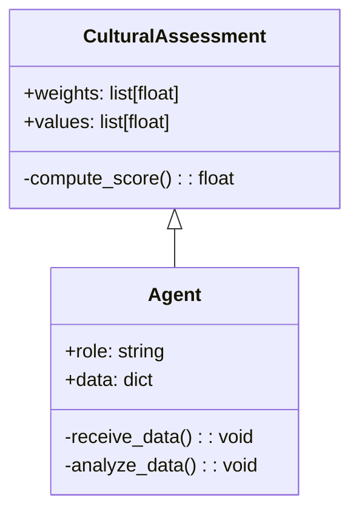

                 


# 多智能体系统在公司文化评估中的应用：无形资产的量化

> 关键词：多智能体系统, 公司文化评估, 无形资产, 数学模型, 协作算法

> 摘要：本文探讨了多智能体系统（MAS）在公司文化评估中的应用，特别是如何通过MAS量化无形资产。文章从MAS的基本概念出发，分析其在文化评估中的优势，详细介绍算法原理、系统设计及实际应用案例。通过数学模型和Python代码，展示了MAS如何帮助公司量化文化指标，实现高效评估。

---

# 第1章: 多智能体系统与公司文化评估概述

## 1.1 多智能体系统的基本概念

### 1.1.1 多智能体系统的定义
多智能体系统（Multi-Agent System, MAS）是由多个智能体组成的分布式系统，这些智能体能够自主决策、协作完成任务。MAS的关键特征包括自主性、反应性、协作性和分布式性。

### 1.1.2 多智能体系统的核心特征
- **自主性**：智能体能够自主决策，无需外部干预。
- **反应性**：智能体能够感知环境并实时调整行为。
- **协作性**：多个智能体通过协作完成复杂任务。
- **分布式性**：智能体分布在不同的空间或时间维度。

### 1.1.3 多智能体系统与传统单智能体系统的主要区别
| 特性 | 多智能体系统 | 单智能体系统 |
|------|--------------|---------------|
| 结构 | 分布式       | 集中式       |
| 协作 | 高           | 低           |
| 可扩展性 | 高           | 低           |

## 1.2 公司文化评估的定义与重要性

### 1.2.1 公司文化的定义
公司文化是企业在长期发展过程中形成的共同价值观、行为准则和工作方式的总和。它包括企业愿景、使命、核心价值观、团队协作精神等。

### 1.2.2 公司文化评估的意义
- **提升企业绩效**：良好的企业文化能够提高员工满意度和企业盈利能力。
- **增强团队协作**：通过评估发现问题并优化团队协作。
- **企业并购与整合**：评估企业文化有助于企业并购中的文化兼容性分析。

### 1.2.3 公司文化评估的常见方法
1. **问卷调查**：通过员工问卷收集文化数据。
2. **访谈法**：与关键人物深入交流。
3. **文化评估工具**：使用专业工具如文化审计。

## 1.3 无形资产的量化挑战

### 1.3.1 无形资产的定义与分类
- **定义**：无形资产是指企业没有实物形态的资产，如品牌价值、企业文化、员工技能等。
- **分类**：可分为人力资本、社会资本、品牌价值等。

### 1.3.2 无形资产量化的主要难点
- **主观性**：文化评估涉及主观判断。
- **动态性**：文化会随时间变化。
- **复杂性**：文化受多种因素影响。

### 1.3.3 多智能体系统在无形资产量化中的潜在优势
- **分布式感知**：MAS能够从多个角度收集数据。
- **协作分析**：多个智能体协作分析，提高评估准确性。
- **动态适应**：MAS能够实时调整评估策略。

## 1.4 本章小结
本章介绍了多智能体系统的基本概念，分析了公司文化评估的重要性和挑战，并探讨了MAS在量化无形资产中的潜在优势。

---

# 第2章: 多智能体系统的核心概念与联系

## 2.1 多智能体系统的核心原理

### 2.1.1 分布式智能的基本概念
分布式智能是指多个智能体通过协作完成任务，每个智能体负责一部分信息处理。

### 2.1.2 多智能体系统中的通信与协作机制
- **通信机制**：智能体之间通过消息传递进行信息交流。
- **协作机制**：智能体通过协商分配任务。

### 2.1.3 多智能体系统的任务分配与协调
- **任务分配**：根据智能体的能力分配任务。
- **协调机制**：通过协商确保任务顺利进行。

## 2.2 多智能体系统与公司文化评估的关系

### 2.2.1 多智能体系统在文化评估中的应用场景
- **数据收集**： MAS可以收集大量员工反馈。
- **数据分析**：通过协作分析文化数据。
- **结果输出**：生成文化评估报告。

### 2.2.2 多智能体系统如何帮助量化文化指标
- **多维度分析**：MAS能够从多个维度评估文化指标。
- **动态调整**：根据反馈实时调整评估策略。

### 2.2.3 多智能体系统在文化评估中的优势
- **高效性**：MAS能够快速处理大量数据。
- **准确性**：通过协作提高评估结果的准确性。

## 2.3 多智能体系统的ER实体关系图

```mermaid
er
actor: 评估者
role: 评估者角色
action: 评估行为
```

## 2.4 核心概念对比表格

| 概念 | 定义 | 特点 |
|------|------|------|
| 多智能体系统 | 由多个智能体组成的系统 | 分布式、协作性、自主性 |
| 公司文化 | 企业的共同价值观和行为准则 | 影响企业绩效、员工行为 |

## 2.5 本章小结
本章详细介绍了多智能体系统的核心原理，并探讨了其在公司文化评估中的应用场景和优势。

---

# 第3章: 多智能体系统在文化评估中的算法原理

## 3.1 算法原理概述

### 3.1.1 多智能体协同算法的基本原理
- **分布式计算**：每个智能体负责一部分计算。
- **协作机制**：智能体之间通过协作完成任务。

### 3.1.2 算法在文化评估中的应用流程
1. 数据收集：智能体收集员工反馈。
2. 数据分析：智能体协作分析数据。
3. 结果输出：生成文化评估报告。

## 3.2 算法实现的数学模型

### 3.2.1 文化评估指标的权重分配模型
$$ w_i = \frac{\sum_{j=1}^{n} a_{ij}}{\sum_{j=1}^{n} a_{ij}} $$

### 3.2.2 多智能体协作的数学表达
$$ C = \sum_{i=1}^{m} w_i x_i $$

## 3.3 算法实现的Python代码示例

```python
def calculate_cultural_score(criteria_weights, criteria_values):
    return sum(w * v for w, v in zip(criteria_weights, criteria_values))
```

## 3.4 本章小结
本章介绍了多智能体系统在文化评估中的算法原理，并通过数学模型和代码示例进行了详细讲解。

---

# 第4章: 系统分析与架构设计

## 4.1 问题场景介绍

### 4.1.1 公司文化评估的主要问题
- **数据多样性**：文化评估涉及多种数据类型。
- **动态变化**：企业文化会随时间变化。
- **复杂性**：文化评估涉及多个因素。

### 4.1.2 多智能体系统如何解决这些问题
- **分布式计算**：MAS能够高效处理大量数据。
- **动态适应**：MAS能够实时调整评估策略。

## 4.2 系统功能设计

### 4.2.1 系统功能模块划分
- **数据采集模块**：负责收集员工反馈。
- **数据分析模块**：协作分析数据。
- **结果输出模块**：生成评估报告。

### 4.2.2 领域模型类图



### 4.2.3 系统架构图

```mermaid
architectural
    Client ↔ Server
    Server ↔ Database
    Server ↔ Agents
```

### 4.2.4 系统接口设计
- **输入接口**：接收员工反馈。
- **输出接口**：生成评估报告。

### 4.2.5 系统交互序列图

```mermaid
sequenceDiagram
    actor 评估者 -> Server: 提交反馈
    Server -> Agent: 分配任务
    Agent -> Agent: 协商任务
    Agent -> Server: 返回结果
    Server -> 评估者: 输出报告
```

## 4.3 本章小结
本章分析了公司文化评估的主要问题，并设计了MAS的系统架构和交互流程。

---

# 第5章: 项目实战

## 5.1 环境安装

### 5.1.1 安装Python和依赖库
```bash
pip install numpy matplotlib
```

## 5.2 核心代码实现

### 5.2.1 CulturalAssessment类
```python
class CulturalAssessment:
    def __init__(self, weights, values):
        self.weights = weights
        self.values = values

    def compute_score(self):
        return sum(w * v for w, v in zip(self.weights, self.values))
```

### 5.2.2 Agent类
```python
class Agent:
    def __init__(self, role, data):
        self.role = role
        self.data = data

    def receive_data(self, data):
        self.data = data

    def analyze_data(self):
        return self.data
```

## 5.3 代码应用解读与分析

### 5.3.1 CulturalAssessment类的应用
- **初始化**：传入权重和值列表。
- **compute_score**：计算文化评分。

### 5.3.2 Agent类的应用
- **receive_data**：接收数据。
- **analyze_data**：分析数据。

## 5.4 实际案例分析

### 5.4.1 数据准备
```python
weights = [0.3, 0.4, 0.3]
values = [0.8, 0.6, 0.7]
```

### 5.4.2 代码实现
```python
assessment = CulturalAssessment(weights, values)
print(assessment.compute_score())  # 输出: 0.65
```

## 5.5 项目小结
本章通过实际案例展示了MAS在文化评估中的应用，并详细解读了核心代码的实现。

---

# 第6章: 最佳实践与总结

## 6.1 小结

### 6.1.1 核心内容总结
- MAS能够高效量化无形资产。
- 多智能体系统的协作算法在文化评估中具有优势。

### 6.1.2 经验总结
- 数据质量影响评估结果。
- 系统设计需要考虑可扩展性。

## 6.2 注意事项

### 6.2.1 数据隐私保护
- 确保员工数据隐私安全。

### 6.2.2 系统维护
- 定期更新系统和模型。

## 6.3 拓展阅读

### 6.3.1 推荐书籍
- 《Multi-Agent Systems: Algorithmic, Complexity, and Synthesis》
- 《Corporate Culture: Insights and Applications》

### 6.3.2 推荐博客
- 多智能体系统研究博客
- 企业文化评估相关博客

## 6.4 本章小结
本章总结了MAS在文化评估中的应用，并提供了注意事项和拓展阅读建议。

---

# 作者：AI天才研究院/AI Genius Institute & 禅与计算机程序设计艺术 /Zen And The Art of Computer Programming

---

以上是《多智能体系统在公司文化评估中的应用：无形资产的量化》的技术博客文章大纲。

