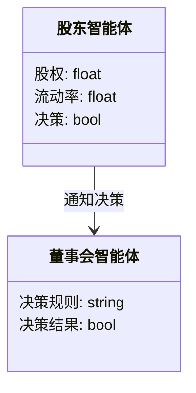
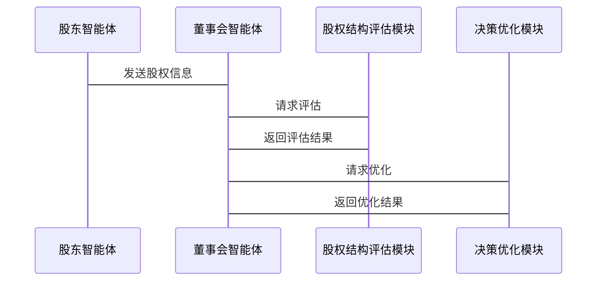

                 


# 多智能体系统在公司治理评估中的应用

> 关键词：多智能体系统, 公司治理评估, 分布式计算, 协作机制, 股权结构

> 摘要：本文探讨了多智能体系统在公司治理评估中的应用，详细介绍了多智能体系统的核心概念、算法原理及其在公司治理评估中的具体应用。通过实际案例分析和系统架构设计，展示了多智能体系统在股权结构评估和决策优化中的潜力。本文还提供了系统的实现代码和最佳实践建议，为读者提供了全面的指导。

---

# 第1章: 多智能体系统概述

## 1.1 多智能体系统的基本概念

### 1.1.1 多智能体系统的定义
多智能体系统（Multi-Agent System, MAS）是由多个智能体（Agent）组成的分布式系统，这些智能体能够通过自主决策和协作完成特定任务。与单智能体系统相比，多智能体系统具有更高的灵活性和适应性。

### 1.1.2 多智能体系统的特征
- **自主性**：智能体能够自主决策。
- **反应性**：智能体能够感知环境并实时响应。
- **协作性**：智能体之间能够通过通信和协作完成复杂任务。
- **分布性**：智能体分布在不同的位置，通过网络进行通信。

### 1.1.3 多智能体系统与单智能体系统的区别
| 特性       | 单智能体系统                     | 多智能体系统                     |
|------------|--------------------------------|--------------------------------|
| 决策方式   | 中央决策                        | 分布式决策                      |
| 通信方式   | 无或有限                        | 高度依赖通信                    |
| 可扩展性   | 较低                           | 较高                           |

## 1.2 公司治理评估的基本概念

### 1.2.1 公司治理的定义
公司治理是指公司内部和外部利益相关者之间的关系和决策过程，目的是实现公司价值最大化。

### 1.2.2 公司治理评估的目的与意义
公司治理评估的目的是通过分析公司的治理结构、股权分配、决策机制等，优化公司治理，提升公司绩效。

### 1.2.3 公司治理评估的主要指标
- **股权结构**：股东的股权分布。
- **董事会结构**：董事会的组成和职责。
- **决策效率**：决策的及时性和准确性。

## 1.3 多智能体系统在公司治理评估中的应用背景

### 1.3.1 公司治理评估的传统方法与局限性
传统方法主要依赖人工分析，效率低且容易出错。

### 1.3.2 多智能体系统的优势与潜力
- **高效性**：多智能体系统能够快速分析大量数据。
- **协作性**：多个智能体可以同时处理不同任务。

### 1.3.3 当前研究与应用现状
目前，多智能体系统在公司治理评估中的应用还处于初级阶段，但其潜力巨大。

## 1.4 本章小结
本章介绍了多智能体系统的基本概念和公司治理评估的背景，为后续内容奠定了基础。

---

# 第2章: 多智能体系统的核心原理

## 2.1 多智能体系统的组成与结构

### 2.1.1 智能体的基本组成
- **感知器**：感知环境信息。
- **决策器**：根据感知信息做出决策。
- **执行器**：执行决策。

### 2.1.2 多智能体系统的层次结构
- **智能体层**：具体智能体。
- **协作层**：智能体之间的协作机制。
- **环境层**：智能体所处的环境。

### 2.1.3 多智能体系统与分布式系统的关系
多智能体系统是分布式系统的一种形式，但具有更强的智能性和协作性。

## 2.2 多智能体系统的通信与协作机制

### 2.2.1 智能体间的通信方式
- **直接通信**：智能体之间直接交换信息。
- **间接通信**：通过中间媒介传递信息。

### 2.2.2 协作协议与规则
- **协商协议**：智能体之间通过协商确定任务分配。
- **规则**：定义智能体的行为规范。

### 2.2.3 冲突解决机制
- **仲裁机制**：由第三方解决冲突。
- **协商机制**：智能体通过协商达成一致。

## 2.3 多智能体系统的建模与仿真

### 2.3.1 系统建模的基本方法
- **行为建模**：描述智能体的行为。
- **交互建模**：描述智能体之间的交互。

### 2.3.2 多智能体建模工具介绍
- **工具1**：某种建模工具。
- **工具2**：另一种建模工具。

### 2.3.3 仿真分析与结果解读
- **仿真结果**：通过仿真得到的结论。
- **结果解读**：如何根据仿真结果优化系统。

## 2.4 本章小结
本章详细讲解了多智能体系统的核心原理，为后续应用奠定了理论基础。

---

# 第3章: 多智能体系统在公司治理评估中的应用模型

## 3.1 公司治理评估的多智能体建模

### 3.1.1 治理结构的智能体分解
- **股东智能体**：代表股东的利益。
- **董事会智能体**：代表董事会的决策。

### 3.1.2 智能体之间的关系建模
- **股权关系**：股东之间的股权分布。
- **决策关系**：董事会的决策流程。

### 3.1.3 模型的验证与优化
- **模型验证**：通过实际数据验证模型的准确性。
- **模型优化**：根据验证结果优化模型。

## 3.2 基于多智能体的股权结构评估

### 3.2.1 股权结构的智能体表示
- **股东智能体**：表示股东的股权。
- **股权流动**：表示股权的转移。

### 3.2.2 股权流动的模拟与分析
- **股权流动的数学模型**
  $$ 股权流动 = \sum_{i=1}^{n} (股权_i \times 流动率_i) $$
- **股权流动的模拟算法**
  ```python
  def simulate_equity_flow(initial_equity):
      for i in range(steps):
          equity[i+1] = equity[i] * (1 + 流动率)
      return equity
  ```

### 3.2.3 股权风险的评估与预警
- **风险评估**：通过分析股权流动的风险。
- **预警机制**：当风险超过阈值时触发预警。

## 3.3 基于多智能体的决策优化

### 3.3.1 智能体的决策规则设计
- **决策规则**：定义智能体的决策逻辑。

### 3.3.2 集体决策的算法实现
- **集体决策算法**：
  ```python
  def collective_decision(members):
      total = sum(members' decisions)
      return total / len(members)
  ```

### 3.3.3 决策结果的评估与反馈
- **评估指标**：如准确率、响应时间等。
- **反馈机制**：根据评估结果调整决策规则。

## 3.4 本章小结
本章详细介绍了多智能体系统在公司治理评估中的应用模型，特别是股权结构评估和决策优化的应用。

---

# 第4章: 多智能体系统在公司治理评估中的算法实现

## 4.1 多智能体协作算法概述

### 4.1.1 分布式协作算法
- **分布式协作算法**：通过分布式计算实现协作。

### 4.1.2 基于博弈论的协作机制
- **博弈论模型**：如纳什均衡。

### 4.1.3 基于规则的协作方法
- **规则协作**：通过预定义规则实现协作。

## 4.2 基于多智能体的股权流动算法

### 4.2.1 股权流动的数学模型
$$ 股权流动 = \sum_{i=1}^{n} (股权_i \times 流动率_i) $$

### 4.2.2 股权流动的模拟算法
```python
def simulate_equity_flow(initial_equity):
    for i in range(steps):
        equity[i+1] = equity[i] * (1 + 流动率)
    return equity
```

### 4.2.3 算法实现的代码示例
```python
equity = [100, 200, 300]
flow_rate = 0.05
simulated_equity = simulate_equity_flow(equity)
print(simulated_equity)
```

## 4.3 基于多智能体的决策优化算法

### 4.3.1 集体决策的数学模型
$$ 集体决策 = \frac{1}{n} \sum_{i=1}^{n} decision_i $$

### 4.3.2 集体决策的实现代码
```python
def collective_decision(members):
    total = sum(member.decision for member in members)
    return total / len(members)
```

## 4.4 本章小结
本章详细讲解了多智能体系统在公司治理评估中的算法实现，特别是股权流动和决策优化的算法。

---

# 第5章: 系统分析与架构设计方案

## 5.1 问题场景介绍
- **问题场景**：公司治理评估中的复杂问题。

## 5.2 项目介绍
- **项目目标**：实现多智能体系统在公司治理评估中的应用。
- **项目范围**：涵盖股权结构评估和决策优化。

## 5.3 系统功能设计

### 5.3.1 领域模型的类图


### 5.3.2 系统架构图
```mermaid
div class=mermaid
graph LR
    A[股东智能体] --> B[董事会智能体]
    B --> C[股权结构评估模块]
    C --> D[决策优化模块]
    D --> E[结果输出]
```

### 5.3.3 系统接口设计
- **接口1**：股东智能体与董事会智能体的通信接口。
- **接口2**：股权结构评估模块与决策优化模块的接口。

### 5.3.4 系统交互流程图


## 5.4 本章小结
本章详细描述了系统的架构设计和功能模块，为后续的实现奠定了基础。

---

# 第6章: 项目实战

## 6.1 环境安装

### 6.1.1 系统需求
- **编程语言**：Python 3.8+
- **框架**：某种框架，如 Flask。

### 6.1.2 安装依赖
```bash
pip install flask
pip install numpy
```

## 6.2 系统核心实现

### 6.2.1 股权结构评估模块实现
```python
import numpy as np

def equity_assessment(equity_data):
    return np.mean(equity_data)
```

### 6.2.2 决策优化模块实现
```python
def decision_optimization(decision_data):
    return np.argmax(decision_data)
```

### 6.2.3 系统交互实现
```python
from flask import Flask

app = Flask(__name__)

@app.route('/assess', methods=['POST'])
def assess():
    data = request.json
    result = equity_assessment(data['equity'])
    return jsonify(result)
```

## 6.3 代码应用解读与分析

### 6.3.1 股权结构评估模块解读
- **功能**：评估股权结构。
- **实现**：使用numpy计算均值。

### 6.3.2 决策优化模块解读
- **功能**：优化决策。
- **实现**：使用numpy选择最大值。

## 6.4 实际案例分析

### 6.4.1 案例背景
- **公司A**：股权结构复杂，决策效率低下。

### 6.4.2 实施方案
- **步骤1**：安装环境。
- **步骤2**：部署系统。
- **步骤3**：进行评估和优化。

### 6.4.3 实施效果
- **效果1**：股权结构优化。
- **效果2**：决策效率提升。

## 6.5 本章小结
本章通过实际案例展示了多智能体系统在公司治理评估中的应用，详细解读了系统的实现过程。

---

# 第7章: 总结与展望

## 7.1 总结
本文详细探讨了多智能体系统在公司治理评估中的应用，从理论到实践，全面介绍了系统的实现过程。

## 7.2 展望
未来，随着人工智能技术的发展，多智能体系统在公司治理评估中的应用将更加广泛和深入。

---

# 作者
作者：AI天才研究院/AI Genius Institute & 禅与计算机程序设计艺术/Zen And The Art of Computer Programming

