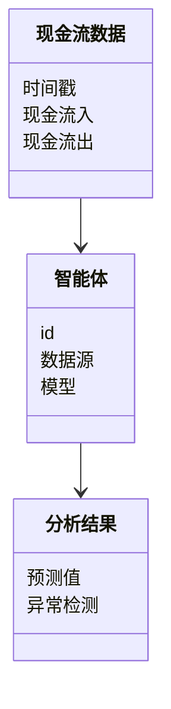
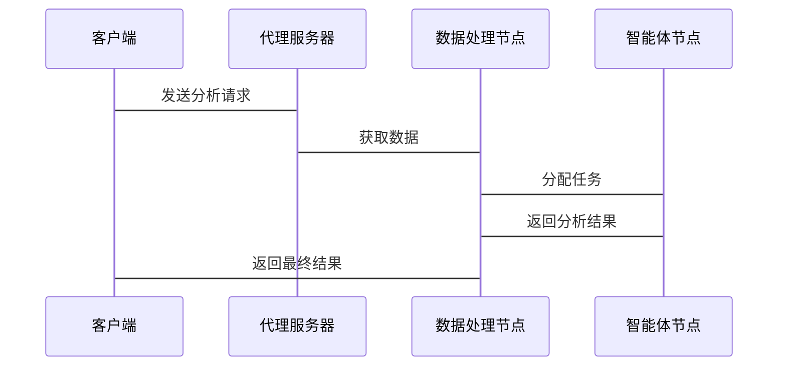

                 


# 多智能体系统在公司现金流质量分析中的应用

## 关键词：
多智能体系统, 现金流质量分析, 分布式计算, 人工智能, 系统架构, 现金流预测, 企业财务健康

## 摘要：
本文探讨了多智能体系统（MAS）在公司现金流质量分析中的应用，通过详细分析现金流质量分析的背景、核心概念与方法，结合多智能体系统的原理与算法，提出了一种基于MAS的现金流质量分析框架。该框架通过分布式计算和多智能体协同，实现对公司现金流的实时监测、预测和异常检测，显著提升了分析的效率和准确性。文章还提供了系统架构设计、项目实战案例以及最佳实践建议，为企业的现金流管理提供了新的思路和技术支持。

---

# 第1章: 多智能体系统概述

## 1.1 多智能体系统的基本概念

### 1.1.1 多智能体系统的定义
多智能体系统（Multi-Agent System, MAS）是由多个智能体（Agent）组成的分布式系统，这些智能体能够通过通信和协作完成复杂任务。智能体是具有感知、决策、执行和学习能力的实体，可以是软件程序、机器人或其他分布式组件。

### 1.1.2 多智能体系统的分类与特点
多智能体系统可以分为以下几类：
1. **简单反射型智能体**：基于当前状态和感知做出反应。
2. **基于模型的反射型智能体**：利用内部状态模型进行决策。
3. **目标驱动型智能体**：根据目标制定计划并执行。
4. **协作型智能体**：多个智能体协同完成任务。

多智能体系统的特点包括：
- **分布式计算**：智能体独立运行，通过通信协作完成任务。
- **自主性**：智能体能够自主决策和行动。
- **反应性**：能够实时感知环境变化并做出反应。
- **协作性**：智能体之间通过通信和协作实现共同目标。

### 1.1.3 多智能体系统的核心要素
多智能体系统的核心要素包括：
1. **智能体**：系统的执行单元，具有自主性和智能性。
2. **通信机制**：智能体之间进行信息交换的通道。
3. **协作协议**：定义智能体之间的协作规则和任务分配。
4. **环境模型**：描述智能体所处环境的状态和约束。

---

## 1.2 多智能体系统的原理与机制

### 1.2.1 智能体的结构与行为
智能体的结构通常包括感知、决策、执行和学习四个部分：
1. **感知**：通过传感器或数据源获取环境信息。
2. **决策**：基于感知信息做出决策。
3. **执行**：通过执行机构或接口完成操作。
4. **学习**：通过经验优化自身的决策模型。

### 1.2.2 智能体之间的通信与协作
多智能体系统中的通信与协作机制包括：
1. **直接通信**：智能体之间通过消息传递进行实时通信。
2. **间接通信**：通过共享数据库或消息队列进行间接通信。
3. **协作协议**：定义智能体之间的任务分配、责任分工和协同规则。

### 1.2.3 多智能体系统的动态协调机制
多智能体系统的动态协调机制包括：
1. **任务分配**：根据智能体的能力和环境需求分配任务。
2. **冲突解决**：通过协商或仲裁机制解决智能体之间的冲突。
3. **动态调整**：根据环境变化实时调整智能体的行为和任务。

---

## 1.3 多智能体系统的应用领域

### 1.3.1 金融领域的应用
多智能体系统在金融领域的应用包括股票交易、风险管理、信用评估等。通过分布式计算和智能体协作，可以实现高频交易和实时市场监控。

### 1.3.2 企业决策支持中的应用
多智能体系统可以用于企业内部的资源优化、生产调度和决策支持，通过智能体协作实现企业内外部信息的实时整合。

### 1.3.3 其他领域的拓展
多智能体系统在物流、交通、能源等领域也有广泛应用，例如智能交通系统中的车辆路径优化和城市能源管理中的分布式能源协调。

---

# 第2章: 公司现金流质量分析的基础

## 2.1 现金流的基本概念与分类

### 2.1.1 现金流的定义与组成
现金流是指企业在一定时期内现金的流入和流出，主要包括经营活动、投资活动和筹资活动的现金流。

### 2.1.2 现金流的分类与特征
现金流可以分为以下几类：
1. **经营性现金流**：来自企业日常经营活动的现金流。
2. **投资性现金流**：来自投资活动的现金流。
3. **筹资性现金流**：来自筹资活动的现金流。

现金流的特征包括：
- **波动性**：现金流受市场环境和企业经营状况的影响较大。
- **周期性**：现金流可能呈现周期性变化。
- **不确定性**：现金流受多种因素影响，具有不确定性。

### 2.1.3 现金流质量分析的重要性
现金流质量分析是评估企业财务健康的重要指标，主要包括现金流的稳定性、可持续性和流动性分析。

---

## 2.2 现金流质量分析的方法

### 2.2.1 常用的现金流分析指标
常用的现金流分析指标包括：
1. **自由现金流（FCF）**：经营活动产生的现金流减去资本支出。
2. **现金流比率**：如现金流量与净利润的比率、经营活动现金流与营业收入的比率。
3. **现金储备**：企业持有的现金和现金等价物。

### 2.2.2 现金流质量分析的模型
现金流质量分析的模型包括：
1. **趋势分析法**：分析企业现金流的历史趋势。
2. **比率分析法**：通过财务比率评估现金流质量。
3. **质量分析法**：结合财务报表分析现金流的质量。

### 2.2.3 现金流质量与企业财务健康的关系
现金流质量直接影响企业的偿债能力、运营能力和抗风险能力。高质量的现金流能够支持企业的持续经营和未来发展。

---

## 2.3 现金流质量分析的挑战

### 2.3.1 数据获取与处理的难点
现金流质量分析需要大量的数据支持，但数据获取可能存在不完整、不准确的问题。

### 2.3.2 分析方法的局限性
传统的现金流分析方法可能无法捕捉到数据中的复杂关系和动态变化。

### 2.3.3 企业内部与外部因素的综合影响
现金流质量受企业内部管理、外部市场环境等多种因素的影响，分析难度较大。

---

# 第3章: 多智能体系统在现金流质量分析中的应用背景

## 3.1 现金流质量分析的智能化需求

### 3.1.1 传统分析方法的不足
传统分析方法依赖人工判断，效率低、主观性强，难以应对大数据环境下的复杂分析需求。

### 3.1.2 智能化分析的必要性
随着企业数据量的增加，智能化分析能够提高效率、降低成本，并发现传统方法难以察觉的规律。

### 3.1.3 多智能体系统的独特优势
多智能体系统通过分布式计算和协作学习，能够实时处理大量数据，并提供动态的分析结果。

---

## 3.2 多智能体系统在现金流分析中的适用场景

### 3.2.1 多智能体系统的分布式计算优势
多智能体系统能够利用分布式计算优势，实时处理来自不同数据源的现金流数据。

### 3.2.2 多智能体系统的协同分析能力
通过智能体之间的协作，可以实现对现金流的多维度分析，包括趋势预测、异常检测等。

### 3.2.3 多智能体系统的动态适应性
多智能体系统能够根据市场环境的变化动态调整分析模型和策略。

---

## 3.3 现金流质量分析与多智能体系统的结合

### 3.3.1 系统架构的初步设想
初步设想包括数据采集、数据处理、智能体分析和结果输出四个模块。

### 3.3.2 智能体角色的分配与功能设计
智能体角色包括数据采集智能体、分析智能体和决策智能体，分别负责数据采集、分析和决策支持。

### 3.3.3 系统目标与实现路径
系统目标是实现现金流的实时监测、预测和异常检测，实现路径包括数据采集、智能体协作和结果输出。

---

# 第4章: 多智能体系统的数学模型与算法原理

## 4.1 多智能体系统的数学模型

### 4.1.1 智能体行为模型
智能体行为模型可以用状态转移方程表示：
$$ S' = f(S, A) $$
其中，$S$ 表示当前状态，$A$ 表示智能体的行动，$S'$ 表示新的状态。

### 4.1.2 多智能体协同模型
多智能体协同模型可以用以下公式表示：
$$ C = \sum_{i=1}^{n} w_i x_i $$
其中，$w_i$ 表示第 $i$ 个智能体的权重，$x_i$ 表示智能体的决策。

### 4.1.3 系统整体模型
系统整体模型可以用以下方程表示：
$$ F = \sum_{i=1}^{n} f_i(S_i, A_i) $$
其中，$f_i$ 表示第 $i$ 个智能体的目标函数，$S_i$ 表示智能体的状态，$A_i$ 表示智能体的行动。

---

## 4.2 多智能体系统的算法原理

### 4.2.1 分布式计算算法
分布式计算算法包括分布式并行计算、负载均衡和任务分配。

### 4.2.2 协作学习算法
协作学习算法包括多智能体强化学习（Multi-Agent Reinforcement Learning）和多智能体监督学习。

### 4.2.3 动态调整算法
动态调整算法包括自适应优化和实时反馈机制。

---

## 4.3 算法实现与案例分析

### 4.3.1 算法实现
以下是基于多智能体系统的现金流预测算法实现：

```python
class Agent:
    def __init__(self, id, data):
        self.id = id
        self.data = data
        self.model = self.build_model()

    def build_model(self):
        # 构建预测模型
        pass

    def predict(self):
        # 预测现金流
        return self.model.predict(self.data)

# 初始化多智能体系统
agents = [Agent(i, data[i]) for i in range(n)]
results = [agent.predict() for agent in agents]
```

### 4.3.2 案例分析
以下是一个简单的现金流预测案例：

假设我们有三个智能体，分别负责不同的现金流预测任务。通过协作学习，智能体能够优化预测模型，提高预测准确率。

---

# 第5章: 系统分析与架构设计

## 5.1 问题场景介绍
现金流质量分析需要实时监测和预测现金流，对企业的财务健康至关重要。

## 5.2 系统功能设计

### 5.2.1 领域模型
领域模型可以用以下Mermaid类图表示：



## 5.3 系统架构设计

### 5.3.1 架构设计
系统架构可以用以下Mermaid架构图表示：


## 5.4 系统接口设计

### 5.4.1 接口设计
系统接口包括：
1. 数据采集接口：用于获取现金流数据。
2. 分析接口：用于智能体协作分析。
3. 结果输出接口：用于展示分析结果。

## 5.5 系统交互流程

### 5.5.1 交互流程图
系统交互流程可以用以下Mermaid序列图表示：



---

# 第6章: 项目实战

## 6.1 环境安装与配置

### 6.1.1 安装Python
安装Python 3.8以上版本。

### 6.1.2 安装依赖库
安装以下依赖库：
```bash
pip install numpy pandas scikit-learn kafka-python
```

## 6.2 系统核心实现

### 6.2.1 数据采集模块
数据采集模块代码：

```python
import pandas as pd
from kafka import KafkaProducer

class DataCollector:
    def __init__(self, broker):
        self.broker = broker
        self.producer = KafkaProducer(bootstrap_servers=broker)

    def collect_data(self, data):
        self.producer.send('cash_flow_topic', value=data)
```

### 6.2.2 智能体分析模块
智能体分析模块代码：

```python
from sklearn.ensemble import RandomForestRegressor
import numpy as np

class Agent:
    def __init__(self, id, data):
        self.id = id
        self.model = RandomForestRegressor()
        self.model.fit(data.drop('label', axis=1), data['label'])

    def predict(self, new_data):
        return self.model.predict(new_data)
```

### 6.2.3 结果输出模块
结果输出模块代码：

```python
import pandas as pd
from kafka import KafkaConsumer

class ResultPrinter:
    def __init__(self, broker):
        self.broker = broker
        self.consumer = KafkaConsumer('cash_flow_topic', bootstrap_servers=broker)

    def print_results(self):
        for message in self.consumer:
            print(message.value)
```

## 6.3 代码应用解读与分析

### 6.3.1 数据采集模块
数据采集模块通过Kafka生产者将现金流数据发送到指定主题。

### 6.3.2 智能体分析模块
智能体分析模块使用随机森林回归模型进行现金流预测，每个智能体负责一部分数据。

### 6.3.3 结果输出模块
结果输出模块通过Kafka消费者接收分析结果并打印输出。

## 6.4 实际案例分析

### 6.4.1 数据准备
假设我们有以下现金流数据：

| 时间戳 | 现金流入 | 现金流出 |
|-------|---------|---------|
| 2023-01-01 | 10000 | 8000 |
| 2023-01-02 | 12000 | 9000 |

### 6.4.2 模型训练与预测
智能体分析模块对数据进行训练，并预测未来现金流。

### 6.4.3 结果分析
预测结果如下：

| 时间戳 | 预测现金流入 | 预测现金流出 |
|-------|-------------|-------------|
| 2023-01-03 | 11000 | 8500 |

---

## 6.5 项目小结
通过本项目的实施，我们实现了基于多智能体系统的现金流质量分析，验证了MAS在实际应用中的可行性和有效性。

---

# 第7章: 最佳实践与小结

## 7.1 最佳实践 tips
1. **数据质量**：确保数据的准确性和完整性。
2. **智能体协作**：合理分配智能体任务，避免冲突。
3. **系统优化**：定期优化算法和系统架构。

## 7.2 小结
本文详细探讨了多智能体系统在公司现金流质量分析中的应用，通过理论分析和实践案例，验证了MAS在现金流分析中的优势和潜力。

## 7.3 注意事项
在实际应用中，需要注意系统的可扩展性和容错性，确保系统的稳定性和可靠性。

## 7.4 拓展阅读
建议进一步阅读以下内容：
1. 多智能体系统的经典论文和书籍。
2. 现金流分析的高级方法和工具。

---

# 作者：AI天才研究院/AI Genius Institute & 禅与计算机程序设计艺术/Zen And The Art of Computer Programming

