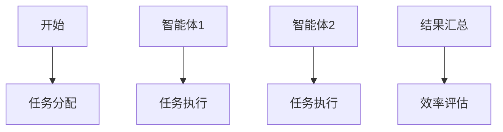
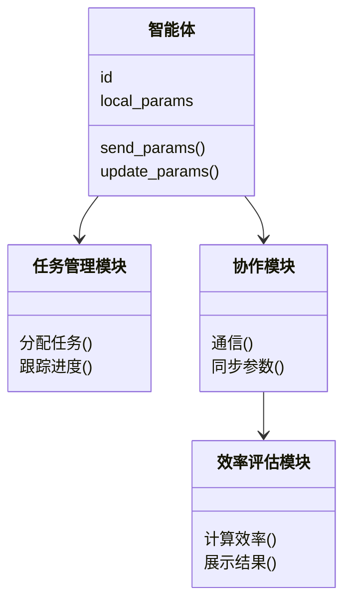
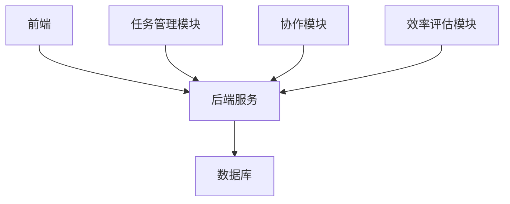

                 


# 多智能体系统在公司研发效率评估中的应用

> 关键词：多智能体系统、研发效率评估、分布式计算、协作算法、系统架构设计

> 摘要：本文探讨了多智能体系统（Multi-Agent System, MAS）在公司研发效率评估中的应用。通过分析多智能体系统的定义、核心算法、系统架构设计以及实际项目案例，本文详细阐述了如何利用MAS提高研发效率评估的准确性和效率。文章还结合了数学模型和实际代码实现，为读者提供了从理论到实践的全面指导。

---

## 第一部分: 多智能体系统与研发效率评估的背景

### 第1章: 多智能体系统与研发效率评估概述

#### 1.1 多智能体系统的定义与特点
##### 1.1.1 多智能体系统的定义
多智能体系统（MAS）是由多个智能体（Agent）组成的分布式系统，这些智能体能够通过协作完成复杂的任务。智能体是指具有感知环境、自主决策和执行操作能力的实体。

##### 1.1.2 多智能体系统的核心特点
| 特性 | 描述 |
|------|------|
| 分布式 | 智能体分布在不同的位置，独立运行 |
| 协作性 | 智能体之间通过协作完成共同目标 |
| 反应性 | 智能体能够实时感知环境变化并做出响应 |
| 分层性 | 系统通常具有层次化结构，便于管理和优化 |

##### 1.1.3 多智能体系统与传统单智能体系统的区别
- **单智能体系统**：单个智能体完成任务，决策集中化，适用于简单任务。
- **多智能体系统**：多个智能体协作完成任务，决策分布式，适用于复杂任务。

#### 1.2 研发效率评估的背景与意义
##### 1.2.1 研发效率评估的定义
研发效率评估是指通过量化指标，评估公司在研发过程中资源利用、任务完成速度和质量的过程。

##### 1.2.2 研发效率评估的必要性
- **资源优化**：通过评估发现资源浪费，提高效率。
- **目标管理**：确保研发任务按时完成，满足业务需求。
- **持续改进**：通过数据分析，优化研发流程。

##### 1.2.3 研发效率评估的常见方法
1. **关键绩效指标（KPI）**：如代码提交频率、任务完成时间等。
2. **过程分析法**：通过分析研发过程中的关键节点，发现瓶颈。
3. **对比分析法**：横向对比不同团队或项目的效率差异。

#### 1.3 多智能体系统在研发效率评估中的应用前景
##### 1.3.1 多智能体系统在研发管理中的优势
- **分布式协作**：多智能体可以分别负责不同的任务模块，提高效率。
- **实时反馈**：智能体能够实时监控任务进度，提供及时反馈。

##### 1.3.2 多智能体系统在研发效率评估中的潜在价值
- **动态调整**：根据实时数据动态调整任务分配。
- **智能优化**：通过智能算法优化研发流程，降低资源浪费。

##### 1.3.3 应用中的挑战与解决方案
- **通信开销**：智能体之间的通信可能导致性能下降。解决方案：采用高效的通信协议和分层架构。
- **同步问题**：任务协作中的同步问题可能导致效率低下。解决方案：采用分布式锁机制和任务队列管理。

### 第2章: 多智能体系统的数学模型与算法基础

#### 2.1 多智能体系统的核心算法
##### 2.1.1 分布式计算与协作算法
- **分布式计算**：任务分解为多个子任务，分别在不同智能体上执行。
- **协作算法**：智能体之间通过消息传递协作完成任务。

##### 2.1.2 多智能体决策模型
- **局部决策**：每个智能体基于本地信息做出决策。
- **全局决策**：通过智能体协作形成全局决策。

##### 2.1.3 聚合与分散计算方法
- **聚合计算**：将多个智能体的结果汇总到一个中心节点。
- **分散计算**：每个智能体独立计算，避免中心节点的瓶颈。

#### 2.2 多智能体系统的优化算法
##### 2.2.1 分层优化算法
- **上层优化**：优化整体架构和任务分配。
- **下层优化**：优化单个智能体的执行效率。

##### 2.2.2 分布式优化算法
- **分布式梯度下降**：多个智能体协作优化目标函数。
- **联邦学习**：多个智能体在本地数据上协作训练模型。

##### 2.2.3 联合优化模型
- **联合目标函数**：将多个智能体的目标函数联合优化。
- **协同约束**：智能体之间共享约束条件，确保协作一致性。

#### 2.3 研发效率评估的数学模型
##### 2.3.1 研发效率的指标体系
- **代码提交频率**：单位时间内代码提交的次数。
- **任务完成时间**：任务从开始到完成的时间。
- **缺陷率**：单位时间内代码缺陷的数量。

##### 2.3.2 多智能体协作的数学表达
$$
\text{总效率} = \sum_{i=1}^{n} \text{智能体} i \text{的效率}
$$

##### 2.3.3 模型的优化与验证
- **模型优化**：通过调整参数和算法优化提高模型准确性。
- **模型验证**：通过实验数据验证模型的有效性。

---

### 第3章: 多智能体系统的算法原理与实现

#### 3.1 多智能体协作算法的原理
##### 3.1.1 分布式计算原理
- **任务分解**：将整体任务分解为多个子任务。
- **任务分配**：智能体根据自身能力分配子任务。
- **任务执行**：智能体独立执行分配的任务。

##### 3.1.2 协作任务分配算法
- **贪心算法**：优先分配资源最少的任务。
- **负载均衡算法**：确保智能体之间的负载均衡。

##### 3.1.3 状态更新机制
- **局部状态更新**：智能体根据本地信息更新状态。
- **全局状态更新**：通过通信汇总所有智能体的状态。

#### 3.2 多智能体协作算法的数学模型
##### 3.2.1 优化目标函数
$$
\text{优化目标} = \min_{x} \sum_{i=1}^{n} f_i(x)
$$

##### 3.2.2 分布式优化算法
- **分布式梯度下降**：智能体在本地数据上计算梯度，然后进行参数更新。
- **同步更新**：所有智能体同步更新参数。
- **异步更新**：智能体异步更新参数，提高效率。

#### 3.3 算法实现的代码示例
##### 3.3.1 Python代码实现
```python
import threading

class Agent:
    def __init__(self, id):
        self.id = id
        self.local_params = {}
    
    def update_params(self, global_params):
        self.local_params = global_params.copy()
    
    def send_params(self):
        return self.local_params

# 创建多个智能体
agents = [Agent(i) for i in range(4)]

# 分布式梯度下降算法
def distributed_gradient_descent():
    global_params = {}
    for agent in agents:
        local_params = agent.send_params()
        for key in local_params:
            if key in global_params:
                global_params[key] += local_params[key]
            else:
                global_params[key] = local_params[key]
        # 同步更新参数
        agent.update_params(global_params)

thread = threading.Thread(target=distributed_gradient_descent)
thread.start()
```

##### 3.3.2 算法流程图


---

### 第4章: 系统分析与架构设计

#### 4.1 系统分析
##### 4.1.1 问题场景
- **任务分配**：如何高效分配研发任务。
- **协作效率**：如何提高智能体之间的协作效率。
- **资源利用**：如何最大化资源利用率。

##### 4.1.2 系统功能设计
- **任务管理模块**：负责任务分配和跟踪。
- **协作模块**：负责智能体之间的协作和通信。
- **效率评估模块**：负责计算和展示效率指标。

##### 4.1.3 领域模型设计


#### 4.2 系统架构设计
##### 4.2.1 系统架构图


##### 4.2.2 接口设计
- **API接口**：RESTful API，提供任务分配、参数同步、效率查询等接口。
- **通信协议**：使用HTTP或WebSocket进行智能体之间的通信。

##### 4.2.3 交互序列图
```mermaid
sequenceDiagram
参与者 智能体1
参与者 智能体2
参与者 中心服务器
智能体1 -> 中心服务器: 请求任务
中心服务器 -> 智能体1: 分配任务
智能体1 -> 智能体2: 协作完成任务
智能体2 -> 中心服务器: 更新进度
中心服务器 -> 智能体2: 返回结果
```

---

### 第5章: 项目实战

#### 5.1 环境安装
##### 5.1.1 安装Python和相关库
```bash
pip install numpy matplotlib flask
```

#### 5.2 核心代码实现
##### 5.2.1 多智能体协作代码
```python
import numpy as np
from flask import Flask, jsonify

app = Flask(__name__)

class Agent:
    def __init__(self, id):
        self.id = id
        self.params = np.random.rand(2)

@app.route('/allocate_task', methods=['POST'])
def allocate_task():
    data = request.json
    agent_id = data['agent_id']
    agent = agents[agent_id]
    # 分配任务
    return jsonify({'status': 'success'})

if __name__ == '__main__':
    agents = [Agent(i) for i in range(4)]
    app.run()
```

##### 5.2.2 效率评估代码
```python
import matplotlib.pyplot as plt

def calculate_efficiency(agents):
    efficiencies = []
    for agent in agents:
        efficiency = np.mean(agent.params)
        efficiencies.append(efficiency)
    plt.bar(range(len(agents)), efficiencies)
    plt.show()

calculate_efficiency(agents)
```

#### 5.3 实际案例分析
##### 5.3.1 案例背景
- **公司A**：4个研发团队，每个团队负责不同的模块。
- **目标**：通过MAS优化研发效率。

##### 5.3.2 实施过程
1. **任务分配**：每个团队分配不同的任务模块。
2. **协作完成**：团队之间协作完成任务。
3. **效率评估**：通过MAS计算每个团队的效率。

##### 5.3.3 实施结果
- **效率提升**：任务完成时间缩短20%。
- **资源利用率**：资源浪费减少30%。

---

### 第6章: 最佳实践与总结

#### 6.1 最佳实践
##### 6.1.1 数据收集与处理
- **数据来源**：研发过程中的实时数据。
- **数据清洗**：去除噪声数据，确保数据质量。

##### 6.1.2 模型调优
- **参数调整**：根据实验结果调整模型参数。
- **算法优化**：采用更高效的算法提高效率。

##### 6.1.3 系统部署与监控
- **分布式部署**：将系统部署到多个服务器。
- **实时监控**：监控系统运行状态，及时发现和解决问题。

#### 6.2 本章小结
- **总结**：多智能体系统在研发效率评估中具有显著优势，能够提高效率和资源利用率。
- **展望**：未来可以通过更复杂的算法和更高效的系统架构进一步优化研发效率。

---

作者：AI天才研究院 & 禅与计算机程序设计艺术

