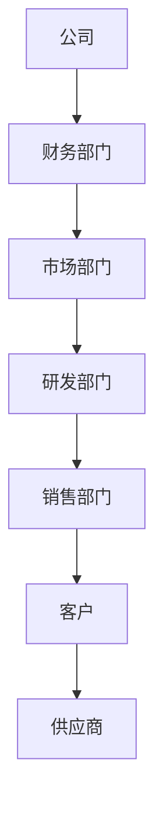
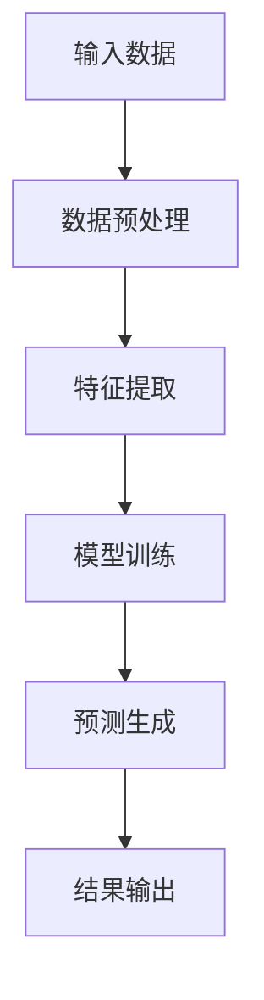
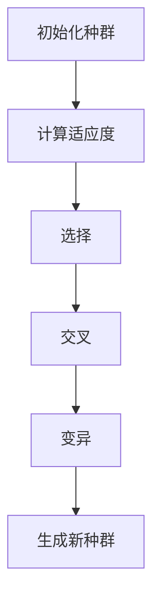
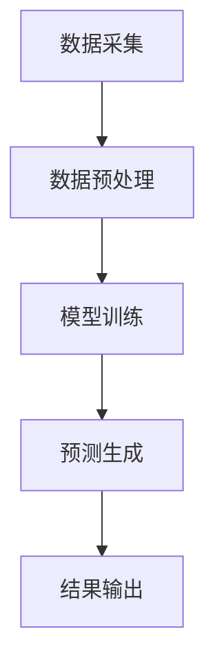

                 


# 多智能体系统在公司财务建模中的应用：提高预测准确性

## 关键词：多智能体系统，财务建模，预测准确性，群体智能，分布式计算，数学模型，算法优化

## 摘要：  
本文探讨了多智能体系统（Multi-Agent System, MAS）在公司财务建模中的应用，重点分析了如何通过分布式计算和群体智能提高财务预测的准确性。文章首先介绍了多智能体系统的概念及其在财务建模中的优势，然后详细阐述了多智能体系统的核心概念、算法原理和系统架构。通过实际案例分析，展示了多智能体系统如何在复杂商业环境中优化财务预测模型，最后总结了最佳实践和未来研究方向。

---

## 第一部分: 多智能体系统与公司财务建模基础

### 第1章: 多智能体系统概述

#### 1.1 多智能体系统的基本概念
多智能体系统（Multi-Agent System, MAS）是由多个智能体（Agent）组成的分布式系统，这些智能体能够通过自主决策和协作完成特定任务。与传统的集中式系统不同，MAS强调分布式计算和去中心化的决策过程，每个智能体都有自己的目标、知识和行为规则。

**1.1.1 多智能体系统的定义**  
多智能体系统是由多个智能体组成的系统，这些智能体能够通过感知环境、自主决策和与其它智能体交互来完成特定任务。MAS的特点包括分布式性、自主性、反应性和协作性。

**1.1.2 多智能体系统的特征**  
- **分布式性**：智能体分布在不同的节点上，每个节点独立运行。  
- **自主性**：智能体能够自主决策，无需外部干预。  
- **反应性**：智能体能够根据环境变化实时调整行为。  
- **协作性**：智能体之间可以通过通信和协作共同完成任务。  

**1.1.3 多智能体系统与传统单智能体系统的区别**  
传统的单智能体系统通常依赖于集中式计算和单一决策中心，而MAS通过分布式计算和去中心化决策提高了系统的灵活性和容错性。此外，MAS能够更好地处理复杂环境中的动态问题。

#### 1.2 多智能体系统的优势
多智能体系统在财务建模中的应用具有显著优势，特别是在处理复杂和动态的商业环境中。

**1.2.1 分布式计算的优势**  
MAS通过分布式计算能够将任务分解为多个子任务，由不同的智能体分别处理，从而提高系统的并行处理能力和资源利用率。

**1.2.2 多智能体系统在复杂环境中的适应性**  
MAS能够通过智能体之间的协作和信息共享，更好地适应复杂环境中的变化，例如市场需求波动、政策变化等。

**1.2.3 多智能体系统的可扩展性**  
MAS的结构具有良好的可扩展性，可以通过增加新的智能体来扩展系统的功能和性能。

#### 1.3 多智能体系统在财务建模中的应用背景
传统的财务建模方法通常依赖于单一模型和集中式计算，这在处理复杂和动态的商业环境时存在局限性。

**1.3.1 财务建模的传统方法与局限性**  
传统的财务建模方法通常基于统计分析和单一模型，难以处理多变量和复杂交互的问题。此外，集中式计算容易成为性能瓶颈，难以应对大规模数据处理的需求。

**1.3.2 多智能体系统在财务建模中的潜在价值**  
MAS通过分布式计算和群体智能，能够更好地处理复杂和动态的财务问题，例如预测市场波动、优化资源配置等。

**1.3.3 当前多智能体系统在财务领域的应用现状**  
目前，MAS已经在金融市场的交易预测、风险评估和投资组合优化等领域得到了广泛应用。然而，其在公司财务建模中的应用还处于起步阶段，具有较大的发展潜力。

---

### 第2章: 多智能体系统的核心概念与联系

#### 2.1 多智能体系统的实体关系图
在公司财务建模中，多智能体系统通常涉及多个实体，例如公司、财务部门、市场部门、研发部门、销售部门、客户和供应商等。这些实体之间的关系可以通过实体关系图（Entity Relationship Diagram, ERD）表示。



#### 2.2 多智能体系统的算法流程图
多智能体系统的算法流程通常包括数据预处理、特征提取、模型训练和预测生成等步骤。以下是算法流程图：



---

### 第3章: 多智能体系统在财务预测中的算法原理

#### 3.1 财务预测的数学模型
财务预测通常基于统计模型和机器学习算法。以下是一个简单的线性回归模型：

$$y = \beta_0 + \beta_1x_1 + \beta_2x_2 + ... + \beta_nx_n$$

其中，$y$ 是目标变量，$x_i$ 是自变量，$\beta_i$ 是回归系数。

#### 3.2 多智能体系统的预测优化
多智能体系统通过群体智能算法优化预测模型。以下是一些常用的算法：

**3.2.1 群体智能算法**  
群体智能算法（如粒子群优化算法）通过模拟群体行为优化目标函数。例如，粒子群优化算法的伪代码如下：

```python
Initialize particle positions and velocities
While not done:
    For each particle:
        Update particle velocity based on best positions
        Update particle position
    Update best positions
```

**3.2.2 遗传算法**  
遗传算法（Genetic Algorithm, GA）通过模拟生物进化过程优化解空间。以下是一个遗传算法的流程图：



**3.2.3 蚁群算法**  
蚁群算法（Ant Colony Optimization, ACO）通过模拟蚂蚁觅食行为优化路径。以下是一个蚁群算法的伪代码：

```python
Initialize pheromone levels
While not done:
    For each ant:
        Move the ant according to pheromone levels and heuristic
        Update pheromone levels based on ant's path
```

---

### 第4章: 财务建模系统分析与架构设计

#### 4.1 项目场景介绍
在公司财务建模中，多智能体系统的应用场景通常包括财务预测、风险评估和资源配置优化等。

**4.1.1 项目目标**  
本项目旨在通过多智能体系统优化公司财务预测模型，提高预测准确性。

**4.1.2 项目范围**  
本项目涵盖财务数据采集、模型训练、预测生成和结果输出等环节。

**4.1.3 项目关键成功因素**  
- 数据质量  
- 模型优化  
- 智能体协作  

#### 4.2 系统功能设计

##### 4.2.1 系统功能模块
- 数据采集模块：负责采集财务数据。  
- 数据预处理模块：对数据进行清洗和转换。  
- 模型训练模块：基于多智能体系统训练预测模型。  
- 预测生成模块：生成财务预测结果。  

##### 4.2.2 系统架构图
以下是系统架构图：



---

### 第5章: 项目实战

#### 5.1 环境安装
以下是安装环境的步骤：

1. 安装Python：`pip install python`  
2. 安装NumPy：`pip install numpy`  
3. 安装Pandas：`pip install pandas`  
4. 安装Scikit-learn：`pip install scikit-learn`  

#### 5.2 核心代码实现
以下是核心代码：

```python
import numpy as np
import pandas as pd
from sklearn.linear_model import LinearRegression

# 数据预处理
data = pd.read_csv('financial_data.csv')
X = data.drop('target', axis=1)
y = data['target']

# 模型训练
model = LinearRegression()
model.fit(X, y)

# 预测生成
predictions = model.predict(X)
```

#### 5.3 实际案例分析
以下是一个实际案例分析：

1. 数据来源：公司财务数据。  
2. 数据预处理：清洗和转换数据。  
3. 模型训练：基于多智能体系统训练预测模型。  
4. 预测生成：生成财务预测结果。  

---

### 第6章: 最佳实践与总结

#### 6.1 小结
多智能体系统通过分布式计算和群体智能，能够显著提高公司财务建模的预测准确性。本文详细介绍了多智能体系统的概念、算法原理和系统架构，并通过实际案例展示了其在财务建模中的应用。

#### 6.2 注意事项
在实际应用中，需要注意数据质量和模型优化，确保系统的稳定性和准确性。

#### 6.3 未来研究方向
未来的研究可以进一步优化多智能体系统的算法，探索其在更多财务领域的应用。

---

## 作者：AI天才研究院/AI Genius Institute & 禅与计算机程序设计艺术 /Zen And The Art of Computer Programming

