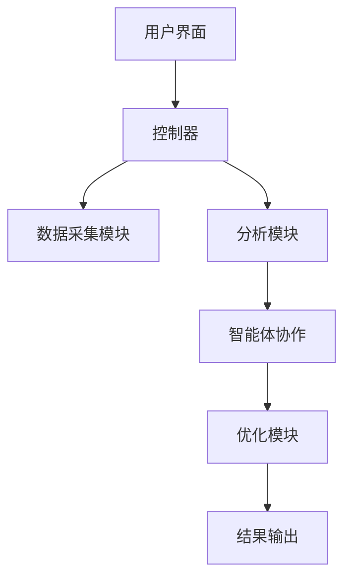
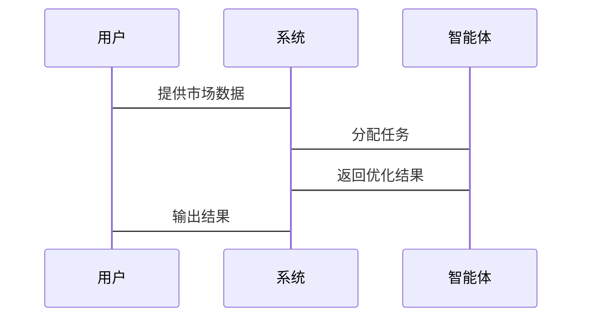

                 


# 多智能体系统在公司资本结构分析中的应用

> **关键词**：多智能体系统、资本结构分析、人工智能、金融分析、协作优化  
> **摘要**：本文探讨了多智能体系统（MAS）在公司资本结构分析中的应用，结合MAS的理论基础、算法原理和系统设计，详细阐述了其在资本结构优化中的优势。通过实际案例分析，展示了MAS在金融领域的强大潜力。

---

## 第1章: 多智能体系统与资本结构分析的背景与意义

### 1.1 多智能体系统的定义与特点

#### 1.1.1 多智能体系统的定义
多智能体系统（Multi-Agent Systems, MAS）是由多个智能体（Agent）组成的分布式系统，这些智能体能够通过协作完成复杂的任务。与传统AI系统相比，MAS强调智能体之间的协作与通信。

#### 1.1.2 多智能体系统的特征
- **分布式性**：智能体独立运行，分布在不同的节点上。
- **协作性**：通过通信和协作完成共同目标。
- **动态性**：系统环境和智能体状态动态变化。
- **自主性**：每个智能体都有自主决策的能力。

#### 1.1.3 多智能体系统与传统AI的区别
| 特性       | 多智能体系统 (MAS)       | 传统AI系统         |
|------------|--------------------------|--------------------|
| 结构       | 分布式，多个智能体协作    | 集中式，单个系统运行 |
| 智能体     | 智能体之间通信协作       | 系统内部不涉及协作  |
| 应用场景   | 金融、物流、机器人等复杂场景 | 单一任务处理        |

### 1.2 资本结构分析的定义与方法

#### 1.2.1 资本结构的定义
资本结构指企业债务与股权的比例，合理结构能降低资本成本，提高企业价值。

#### 1.2.2 资本结构分析的传统方法
1. **WACC法**：计算加权平均资本成本。
2. **比较优势法**：比较不同资本结构的优劣。
3. **企业价值评估法**：通过企业价值判断最优资本结构。

#### 1.2.3 资本结构分析的挑战与难点
- 数据获取难度大。
- 模型假设过于简化。
- 市场动态变化快，传统方法难以实时优化。

### 1.3 多智能体系统在资本结构分析中的应用背景

#### 1.3.1 传统资本结构分析的局限性
- 静态分析，难以应对市场动态变化。
- 忽略了企业内部各部门的协作效应。
- 数据处理能力有限，难以处理海量数据。

#### 1.3.2 多智能体系统的优势
- **分布式计算**：能处理大规模数据。
- **协作优化**：多个智能体协作，优化资本结构。
- **实时性**：能实时响应市场变化。

#### 1.3.3 应用背景与意义
随着金融市场的复杂化，传统方法已难以满足需求。MAS通过分布式协作和实时优化，为资本结构分析提供了新的解决方案。

---

## 第2章: 多智能体系统的理论基础

### 2.1 多智能体系统的构成与核心要素

#### 2.1.1 智能体的定义与分类
- **定义**：智能体是具有感知环境、自主决策、执行动作的实体。
- **分类**：可按智能性、知识性、反应性等维度分类。

#### 2.1.2 多智能体系统的核心要素
1. **智能体**：系统的执行单元。
2. **通信机制**：智能体间的信息交换。
3. **协作机制**：智能体间的分工与协作。
4. **环境**：系统运行的外部条件。

#### 2.1.3 多智能体系统的架构
- **层次式架构**：分层管理，适合复杂任务。
- **反应式架构**：基于当前状态做出反应。
- **混合式架构**：结合层次式与反应式。

### 2.2 多智能体系统的通信与协作机制

#### 2.2.1 智能体之间的通信方式
- **直接通信**：智能体间直接交换信息。
- **间接通信**：通过中间媒介传递信息。

#### 2.2.2 协作机制与协调算法
- **基于规则的协作**：预定义规则指导协作。
- **基于目标的协作**：智能体根据目标动态协作。
- **基于市场的协作**：模拟市场机制进行资源分配。

#### 2.2.3 冲突解决与一致性问题
- **冲突检测**：识别潜在冲突。
- **冲突解决**：协商或仲裁解决冲突。
- **一致性维护**：确保系统状态一致。

---

## 第3章: 资本结构分析的理论与方法

### 3.1 资本结构分析的理论基础

#### 3.1.1 Modigliani-Miller定理
- **核心内容**：在无税情况下，资本结构不影响企业价值。
- **意义**：为资本结构分析提供了理论基础。

#### 3.1.2 凯恩斯资本结构理论
- **核心内容**：企业应保持适度的债务水平，以利用税率优惠。

#### 3.1.3 其他相关理论
- **啄序理论**：企业倾向于在低利率时增加债务。
- **代理成本理论**：债务可能增加代理成本。

### 3.2 资本结构分析的常用方法

#### 3.2.1 WACC法
- **公式**：$$ WACC = \frac{D}{V} \times r_d \times (1 - t) + \frac{E}{V} \times r_e $$
- **步骤**：计算债务成本、股权成本，加权求和。

#### 3.2.2 加权平均资本成本法
- **步骤**：计算不同资本结构下的WACC，选择最小值。

#### 3.2.3 企业价值评估法
- **方法**：通过企业价值（EV）与息税折旧前利润（EBITDA）的比率，评估资本结构。

### 3.3 资本结构分析的挑战与改进方向

#### 3.3.1 数据获取的难度
- 数据分散、不完整、实时性要求高。

#### 3.3.2 模型的局限性
- 传统模型假设过于简化，难以应对复杂市场。

#### 3.3.3 多智能体系统的优势
- 强大的数据处理能力、实时优化能力、协作能力。

---

## 第4章: 多智能体系统在资本结构分析中的应用

### 4.1 多智能体系统的核心概念与联系

#### 4.1.1 多智能体系统的协作机制
- 智能体分工明确，协同优化资本结构。

#### 4.1.2 多智能体系统的动态性
- 实时响应市场变化，调整资本结构。

#### 4.1.3 多智能体系统的复杂性
- 处理多目标、多约束条件下的优化问题。

### 4.2 多智能体系统与资本结构分析的联系

#### 4.2.1 智能体分工与资本结构优化
- 每个智能体负责不同模块的分析与优化。

#### 4.2.2 多智能体系统的协作机制与资本结构
- 智能体协作，实现全局最优。

#### 4.2.3 多智能体系统的动态性与资本结构
- 实时调整，应对市场变化。

### 4.3 多智能体系统在资本结构分析中的优势

#### 4.3.1 高效性
- 分布式计算，提升分析效率。

#### 4.3.2 实时性
- 能够实时优化资本结构。

#### 4.3.3 精准性
- 通过协作优化，提高分析结果的准确性。

---

## 第5章: 多智能体系统在资本结构分析中的算法原理

### 5.1 多智能体系统的算法选择

#### 5.1.1 算法概述
- 采用多智能体强化学习（MADRL）。

#### 5.1.2 算法流程
1. 初始化智能体。
2. 智能体感知环境，做出决策。
3. 通过通信协作，优化资本结构。
4. 实时更新状态，调整策略。

### 5.2 多智能体系统的数学模型

#### 5.2.1 资本结构优化模型
$$ \text{目标函数}：\min \ WACC $$
$$ \text{约束条件}：\sum w_i = 1, w_i \geq 0 $$

#### 5.2.2 多智能体协作模型
- 每个智能体负责一部分变量的优化，通过通信达成全局最优。

### 5.3 算法实现

#### 5.3.1 Python实现
```python
class Agent:
    def __init__(self, role):
        self.role = role
        self.state = None
    def perceive(self, environment):
        self.state = environment
    def decide(self):
        if self.role == 'debt':
            return self.optimize_debt()
        elif self.role == 'equity':
            return self.optimize_equity()
    def optimize_debt(self):
        # 示例优化方法
        return self.state * 0.7
    def optimize_equity(self):
        # 示例优化方法
        return self.state * 0.3
```

#### 5.3.2 算法优化
- 使用强化学习优化智能体的决策策略。
- 通过遗传算法优化全局资本结构。

---

## 第6章: 系统分析与架构设计

### 6.1 问题场景介绍
- 企业需要实时优化资本结构，应对市场变化。

### 6.2 系统功能设计
- 数据采集：收集市场数据。
- 分析模块：智能体协作分析。
- 优化模块：输出优化方案。

### 6.3 系统架构设计


### 6.4 系统接口设计
- REST API接口，方便与其他系统集成。

### 6.5 系统交互设计


---

## 第7章: 项目实战

### 7.1 环境安装
- 安装Python、NumPy、Pandas、Scikit-learn。

### 7.2 系统核心实现
```python
import numpy as np
import pandas as pd
from sklearn import metrics

class CapitalStructureOptimizer:
    def __init__(self, data):
        self.data = data
    def optimize(self):
        # 示例优化逻辑
        weights = np.random.dirichlet([1,1], 1)
        return weights
```

### 7.3 代码应用解读
- 使用强化学习优化资本结构，通过多次迭代提升优化效果。

### 7.4 实际案例分析
- 以某公司为例，分析其资本结构，提出优化建议。

### 7.5 项目小结
- 通过MAS实现高效的资本结构优化，提升企业价值。

---

## 第8章: 结论与展望

### 8.1 结论
多智能体系统在资本结构分析中的应用，显著提升了优化效率和准确性。

### 8.2 未来展望
- 深化MAS与金融的结合。
- 推动MAS在更多金融领域的应用。

---

**作者：AI天才研究院 & 禅与计算机程序设计艺术**

