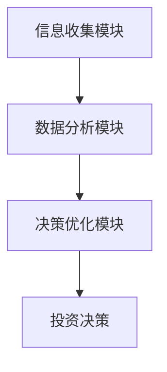
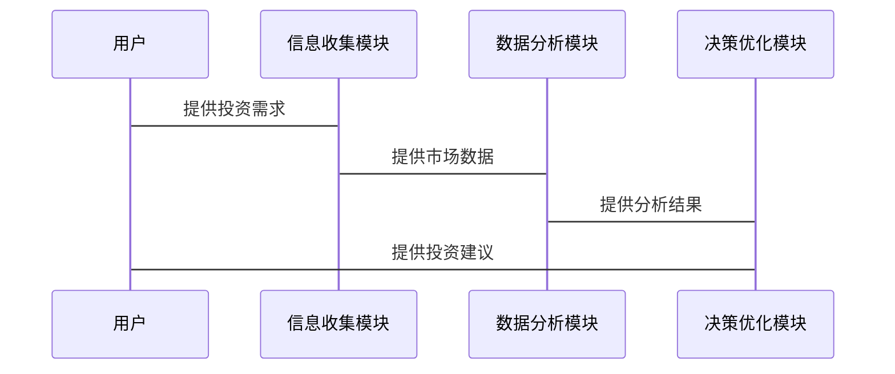

                 


# 多智能体系统在周期性行业投资中的应用

> **关键词**：多智能体系统，周期性行业，投资分析，算法设计，系统架构

> **摘要**：本文探讨了多智能体系统（MAS）在周期性行业投资中的应用，分析了MAS的优势及其在信息收集、预测分析和决策优化中的作用。通过详细讲解MAS的算法原理、系统架构设计和实际案例，展示了MAS如何帮助投资者应对周期性行业的波动性和不确定性。

---

## 第1章：多智能体系统与周期性行业投资概述

### 1.1 多智能体系统的基本概念

#### 1.1.1 多智能体系统的定义
多智能体系统（Multi-Agent System，MAS）是由多个智能体（Agent）组成的分布式系统，这些智能体能够通过协作完成复杂的任务。每个智能体都有一定的自主性，能够感知环境、处理信息并做出决策。

#### 1.1.2 多智能体系统的结构与特点
- **结构**：MAS通常由智能体、通信机制和协作协议组成。智能体可以是软件程序，也可以是硬件设备，它们通过通信机制交换信息，并通过协作协议协调行动。
- **特点**：
  1. 分布式：智能体独立运行，不依赖中央控制。
  2. 协作性：智能体通过协作完成任务。
  3. 动态性：智能体能够适应环境变化。

#### 1.1.3 多智能体系统与传统AI的区别
| 特性             | 多智能体系统（MAS）                     | 传统AI系统                     |
|------------------|---------------------------------------|--------------------------------|
| 结构             | 分布式，多个智能体协作                | 集中式，单个或少数几个模块    |
| 任务处理         | 多任务，复杂问题分解                 | 单任务，问题相对简单          |
| 协作性           | 强调协作与信息共享                   | 较少协作，信息相对封闭        |
| 灵活性           | 高，适应环境变化                    | 较低，适应性有限              |

#### 1.1.4 多智能体系统的通信与协作机制
- **通信机制**：智能体之间通过消息传递进行通信，通常使用中间件或通信协议。
- **协作协议**：如拍卖协议、合同网协议，用于协调任务分配和资源分配。

### 1.2 周期性行业的特点与投资挑战

#### 1.2.1 周期性行业的定义与分类
周期性行业是指需求与经济周期密切相关的行业，如能源、矿业、制造业等。行业波动性大，投资决策需要考虑宏观经济因素。

#### 1.2.2 周期性行业的波动性与投资风险
- 市场波动：经济周期波动导致行业需求波动，影响股价和投资回报。
- 投资风险：周期性行业的高波动性可能导致投资损失。

#### 1.2.3 投资周期性行业的策略与挑战
- 策略：通过技术分析和基本面分析预测市场趋势，分散投资以降低风险。
- 挑战：预测难度大，市场波动剧烈，信息不透明。

### 1.3 多智能体系统在投资中的应用前景

#### 1.3.1 多智能体系统在金融领域的应用现状
MAS在金融领域的应用包括算法交易、风险管理和投资组合优化。智能体可以实时监控市场变化，快速做出交易决策。

#### 1.3.2 多智能体系统在周期性行业投资中的优势
- **信息收集与分析**：智能体可以实时收集市场数据，分析行业趋势。
- **预测准确性**：通过协作和数据共享，提高预测的准确性。
- **决策优化**：智能体可以模拟不同投资策略，优化投资组合。

#### 1.3.3 多智能体系统投资的未来发展趋势
- 技术进步：AI和大数据技术的发展将推动MAS在投资领域的应用。
- 应用扩展：MAS将应用于更多行业，解决更复杂的投资问题。

### 1.4 本章小结
本章介绍了多智能体系统的基本概念和结构，分析了周期性行业的特点和投资挑战，并探讨了MAS在投资中的应用前景。MAS通过协作和信息共享，为投资者提供了新的工具和方法。

---

## 第2章：多智能体系统的理论基础

### 2.1 多智能体系统的定义与结构

#### 2.1.1 多智能体系统的定义
MAS由多个智能体组成，这些智能体通过协作完成任务。智能体可以是软件程序或硬件设备。

#### 2.1.2 多智能体系统的结构
MAS的结构包括智能体、通信机制和协作协议。智能体是MAS的核心，通信机制是智能体之间的桥梁，协作协议是智能体协作的规则。

#### 2.1.3 多智能体系统的通信与协作机制
智能体之间通过消息传递进行通信，协作协议如拍卖协议和合同网协议用于协调任务分配和资源分配。

### 2.2 多智能体系统的分类与特点

#### 2.2.1 多智能体系统的分类
- **基于任务的MAS**：根据任务类型分类，如协调型、合作型和竞争型。
- **基于智能体的MAS**：根据智能体的智能水平分类，如反应式和认知式。

#### 2.2.2 多智能体系统的协调与冲突解决
- **协调机制**：如拍卖协议和合同网协议，用于任务分配和资源分配。
- **冲突解决**：通过协商和仲裁机制解决冲突。

#### 2.2.3 多智能体系统的可扩展性与鲁棒性
- **可扩展性**：MAS能够轻松扩展，增加智能体数量。
- **鲁棒性**：MAS在部分智能体故障时仍能正常运行。

### 2.3 多智能体系统与传统AI的区别

#### 2.3.1 传统AI的局限性
- 单任务处理：传统AI系统通常处理单一任务。
- 集中式结构：依赖中央控制，缺乏灵活性。

#### 2.3.2 多智能体系统的创新点
- 分布式结构：智能体独立运行，不依赖中央控制。
- 协作性：智能体通过协作完成复杂任务。

#### 2.3.3 多智能体系统的优势与应用场景
- **优势**：高灵活性、强协作性、适应性强。
- **应用场景**：金融投资、物流优化、智能制造等。

### 2.4 本章小结
本章详细讲解了多智能体系统的理论基础，包括定义、结构、分类和特点。MAS通过协作和通信机制，解决了传统AI的局限性，为复杂问题提供了新的解决方案。

---

## 第3章：周期性行业的投资分析与建模

### 3.1 周期性行业的波动性分析

#### 3.1.1 经济周期对周期性行业的影响
- **繁荣期**：需求增长，企业盈利增加。
- **衰退期**：需求下降，企业盈利减少。
- **复苏期**：需求逐步恢复。
- **萧条期**：需求极度低迷。

#### 3.1.2 市场波动对投资决策的影响
- 市场波动可能导致投资损失。
- 投资者需要及时调整投资策略。

#### 3.1.3 周期性行业的市场预测与风险评估
- 市场预测：通过技术分析和基本面分析预测市场趋势。
- 风险评估：评估投资风险，制定风险管理策略。

### 3.2 多智能体系统在周期性行业投资中的应用

#### 3.2.1 基于MAS的周期性行业投资分析模型
- 智能体角色分配：信息收集、数据分析、预测和决策。
- 信息共享：智能体之间共享数据，提高预测准确性。

#### 3.2.2 周期性行业投资中的智能体协作机制
- 协作协议：如拍卖协议和合同网协议。
- 决策优化：智能体模拟不同投资策略，优化投资组合。

#### 3.2.3 多智能体系统在周期性行业投资中的优势
- 高效信息处理：智能体实时收集和分析数据，提高决策效率。
- 精准预测：通过协作和数据共享，提高预测准确性。
- 灵活应对：智能体能够快速适应市场变化，调整投资策略。

### 3.3 本章小结
本章分析了周期性行业的波动性对投资决策的影响，并探讨了MAS在周期性行业投资中的应用。MAS通过协作和信息共享，提高了投资分析的准确性和效率。

---

## 第4章：多智能体系统的算法设计与实现

### 4.1 基于MAS的投资决策算法

#### 4.1.1 基于MAS的投资决策算法概述
- 算法目标：优化投资组合，最大化收益，最小化风险。
- 算法步骤：信息收集、数据分析、预测、决策优化。

#### 4.1.2 投资组合优化算法
- **收益最大化**：在风险可控的前提下，最大化投资收益。
- **风险最小化**：在收益一定的情况下，最小化投资风险。

#### 4.1.3 基于MAS的预测模型
- 预测模型：使用机器学习算法，如随机森林和神经网络，预测市场趋势。
- 模型优化：通过参数调整和特征选择，提高预测准确性。

### 4.2 多智能体系统中的协作算法

#### 4.2.1 协作协议设计
- 拍卖协议：用于任务分配和资源分配。
- 合同网协议：用于任务协调和资源分配。

#### 4.2.2 决策优化算法
- 协作式优化：智能体协作，共同优化投资组合。
- 分层优化：将任务分解，分层优化。

### 4.3 本章小结
本章详细讲解了MAS在投资决策中的算法设计与实现。通过协作协议和优化算法，MAS能够高效地处理复杂的投资问题。

---

## 第5章：多智能体系统的系统架构设计

### 5.1 系统架构设计概述

#### 5.1.1 系统功能设计
- 信息收集模块：收集市场数据。
- 数据分析模块：分析数据，预测市场趋势。
- 决策优化模块：优化投资组合。

#### 5.1.2 系统架构图


#### 5.1.3 系统接口设计
- 数据接口：与数据源对接，获取市场数据。
- 用户接口：用户输入投资需求，输出投资建议。

### 5.2 系统交互流程设计

#### 5.2.1 系统交互流程图


#### 5.2.2 系统功能模块交互
- 用户提出投资需求。
- 信息收集模块收集市场数据。
- 数据分析模块分析数据，预测市场趋势。
- 决策优化模块优化投资组合，提供投资建议。

### 5.3 本章小结
本章详细设计了MAS的系统架构，包括功能设计、架构图和交互流程图。系统架构设计为MAS在投资中的应用提供了理论基础和实现方向。

---

## 第6章：多智能体系统的项目实战

### 6.1 项目环境搭建

#### 6.1.1 系统环境要求
- 操作系统：Windows或Linux。
- 开发工具：Python、Jupyter Notebook。
- 数据源：股票市场数据，如Yahoo Finance。

#### 6.1.2 依赖库安装
- Python库：pandas、numpy、matplotlib、scikit-learn。

### 6.2 核心代码实现

#### 6.2.1 信息收集模块
```python
import pandas as pd
import numpy as np

# 下载数据
data = pd.read_csv('stock_data.csv')
```

#### 6.2.2 数据分析模块
```python
from sklearn.ensemble import RandomForestRegressor

# 训练模型
model = RandomForestRegressor()
model.fit(X_train, y_train)
```

#### 6.2.3 决策优化模块
```python
import numpy as np

# 定义优化目标
def optimize_portfolio(returns, risk_free_rate=0.01):
    # 计算收益和风险
    # ...
    return optimized_portfolio
```

### 6.3 实际案例分析

#### 6.3.1 案例背景
- 投资标的：能源行业股票。
- 数据来源：历史股价数据。

#### 6.3.2 案例分析与结果展示
- 预测结果：能源行业股票将在未来三个月内上涨。
- 投资建议：建议投资者买入能源行业股票。

### 6.4 本章小结
本章通过实际案例展示了MAS在周期性行业投资中的应用。通过代码实现和案例分析，读者可以了解MAS在投资中的具体应用和效果。

---

## 第7章：总结与展望

### 7.1 本章总结
MAS通过协作和信息共享，提高了投资分析的准确性和效率。MAS在周期性行业投资中的应用前景广阔，能够帮助投资者应对市场波动和不确定性。

### 7.2 未来展望
- 技术进步：AI和大数据技术的发展将进一步推动MAS在投资中的应用。
- 应用扩展：MAS将应用于更多行业，解决更复杂的投资问题。

### 7.3 最佳实践与注意事项
- **最佳实践**：投资者应结合MAS和传统投资方法，制定综合的投资策略。
- **注意事项**：投资者应关注技术风险和市场风险，制定风险管理策略。

### 7.4 本章小结
本章总结了MAS在投资中的应用，并展望了未来的发展方向。投资者应结合MAS和传统方法，制定综合的投资策略。

---

## 作者

作者：AI天才研究院（AI Genius Institute） & 禅与计算机程序设计艺术（Zen And The Art of Computer Programming）

---

感谢您的阅读！如果您有任何问题或建议，请随时与我们联系。

