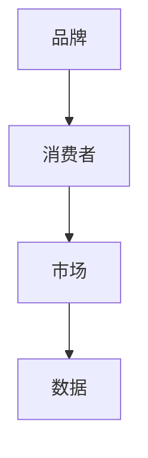
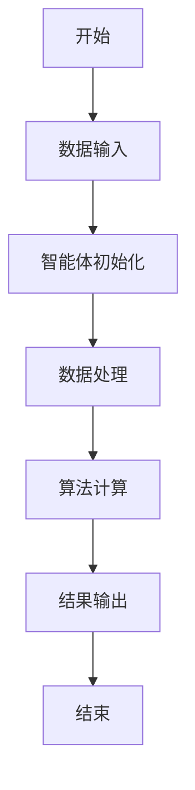
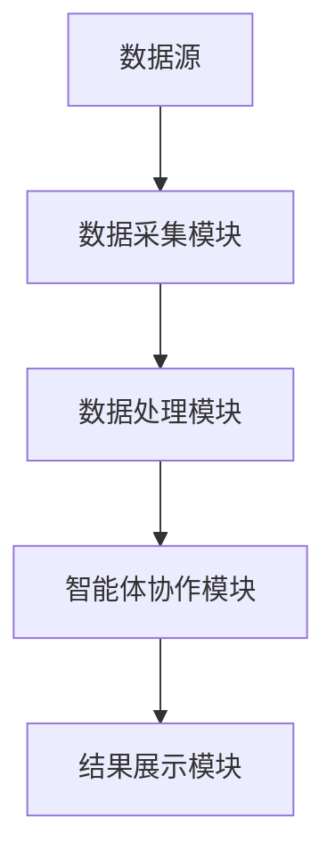
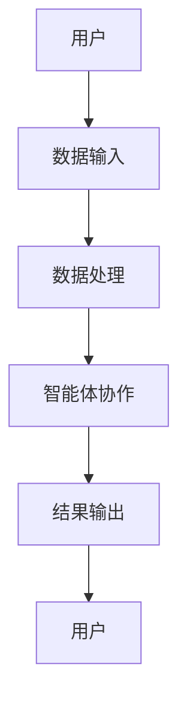

                 


# 多智能体系统在品牌价值评估中的应用：量化无形资产

> 关键词：多智能体系统，品牌价值，无形资产，量化评估，人工智能算法，系统架构设计，分布式计算

> 摘要：本文探讨了多智能体系统在品牌价值评估中的应用，通过分析其核心算法、系统架构设计以及实际案例，展示了如何利用分布式计算和协同智能来量化品牌这一无形资产，帮助企业做出更明智的决策。

---

## 正文

### 第一部分：多智能体系统与品牌价值评估的背景介绍

#### 第1章：多智能体系统的概念与特点

##### 1.1 多智能体系统的定义
多智能体系统（Multi-Agent System，MAS）是由多个相互作用的智能体（Agent）组成的分布式系统，每个智能体都具有一定的自主性、反应性和协作性。这些智能体通过通信和协调，共同完成复杂任务。

##### 1.2 多智能体系统的核心特点
- **自主性**：每个智能体能够独立决策和行动。
- **反应性**：智能体能够感知环境并做出实时反应。
- **协作性**：多个智能体通过通信和协作完成共同目标。
- **分布式性**：系统由多个分散的智能体组成，不存在集中控制节点。

##### 1.3 多智能体系统与传统评估方法的区别
传统的品牌价值评估方法通常依赖于静态数据和单一模型，而多智能体系统通过分布式计算和实时数据处理，能够更动态、全面地评估品牌价值。

#### 第2章：品牌价值评估的现状与挑战

##### 2.1 品牌价值的传统评估方法
- **财务指标法**：基于财务数据（如销售额、利润）评估品牌价值。
- **市场法**：通过市场交易数据和对标分析评估品牌价值。
- **品牌强度法**：结合品牌知名度、美誉度等指标评估品牌价值。

##### 2.2 传统方法的局限性
- **静态性**：传统方法难以捕捉品牌价值的动态变化。
- **片面性**：仅依赖单一数据源或模型，结果不够全面。
- **计算复杂性**：难以处理海量数据和复杂关系。

##### 2.3 品牌价值评估的复杂性与动态性
品牌价值受市场环境、消费者行为、竞争对手策略等多种因素影响，具有高度动态性和不确定性。传统方法难以满足实时、动态评估的需求。

---

### 第二部分：多智能体系统的核心概念与联系

#### 第3章：多智能体系统的结构与功能

##### 3.1 多智能体系统的结构
- **智能体**：系统的基本单元，具有感知、决策和执行能力。
- **通信机制**：智能体之间通过通信协议交换信息。
- **协作机制**：智能体通过协作完成共同目标。
- **环境**：智能体所处的外部环境，包括数据源、目标和约束条件。

##### 3.2 多智能体系统的功能
- **数据采集**：智能体从环境中获取数据。
- **数据处理**：对数据进行分析和处理。
- **决策与协作**：智能体基于数据做出决策，并与其他智能体协作。
- **结果输出**：系统输出最终的评估结果。

#### 第4章：品牌价值评估中的多智能体系统模型

##### 4.1 实体关系分析
品牌价值评估涉及多个实体，包括消费者、市场、竞争对手、品牌本身等。通过绘制实体关系图（ER图），可以清晰地展示各实体之间的关系。



##### 4.2 多智能体系统与品牌价值评估的对比分析
| 方法        | 优点                         | 缺点                         |
|-------------|------------------------------|-------------------------------|
| 传统评估法   | 数据来源单一，计算简单       | 静态性高，结果片面           |
| 多智能体系统 | 动态性高，结果全面           | 实施复杂，需要分布式计算能力 |

##### 4.3 多智能体系统的优势
- **动态性**：能够实时捕捉市场变化和消费者行为。
- **全面性**：通过多智能体协作，整合多种数据源，提高评估的准确性。
- **可扩展性**：系统可以根据需要扩展，适应不同的评估场景。

---

### 第三部分：多智能体系统在品牌价值评估中的算法原理

#### 第5章：多智能体系统的核心算法

##### 5.1 分布式计算算法
分布式计算算法是多智能体系统的核心，通过将任务分解到多个智能体，实现并行计算和协作。

##### 5.2 聚类分析算法
聚类分析算法用于将品牌数据分成不同的类别，帮助识别品牌之间的相似性和差异性。

##### 5.3 智能体协同算法
智能体协同算法通过智能体之间的通信和协作，实现复杂任务的协同完成。

#### 第6章：算法流程图



#### 第7章：数学模型与公式

##### 7.1 品牌价值评估公式
$$ V = \sum_{i=1}^{n} w_i x_i $$
其中，\( V \) 表示品牌价值，\( w_i \) 表示第 \( i \) 个指标的权重，\( x_i \) 表示第 \( i \) 个指标的值。

##### 7.2 权重计算公式
$$ w_i = \frac{x_i}{\sum_{j=1}^{n} x_j} $$

---

### 第四部分：系统分析与架构设计

#### 第8章：问题场景介绍
品牌价值评估需要考虑市场环境、消费者行为、竞争对手策略等多种因素。多智能体系统能够实时捕捉这些因素的变化，提供动态评估结果。

#### 第9章：系统功能设计

##### 9.1 功能模块
- 数据采集模块：从多个数据源获取品牌相关数据。
- 数据处理模块：对数据进行清洗、转换和分析。
- 智能体协作模块：通过智能体协作完成品牌价值评估。
- 结果展示模块：将评估结果以可视化方式展示。

##### 9.2 系统架构设计



#### 第10章：接口与交互设计

##### 10.1 接口设计
- 数据采集接口：用于获取品牌相关数据。
- 智能体通信接口：用于智能体之间的通信和协作。
- 结果展示接口：用于输出评估结果。

##### 10.2 交互设计



---

### 第五部分：项目实战

#### 第11章：环境安装与核心代码实现

##### 11.1 环境安装
需要安装Python、Mermaid、Django等工具。

##### 11.2 核心代码实现

```python
class Agent:
    def __init__(self, id):
        self.id = id
        self.data = None
        self.result = None

    def receive_data(self, data):
        self.data = data

    def process_data(self):
        # 数据处理逻辑
        self.result = self.data * 2

    def send_result(self):
        return self.result

# 初始化智能体
agents = [Agent(1), Agent(2), Agent(3)]

# 数据分发
for agent in agents:
    agent.receive_data(10)

# 数据处理
for agent in agents:
    agent.process_data()

# 结果汇总
total = sum(agent.send_result() for agent in agents)
print(total)
```

#### 第12章：代码应用解读与分析
通过上述代码，可以实现多智能体系统的数据分发、处理和结果汇总。每个智能体独立处理数据，最终通过协作得到整体结果。

#### 第13章：实际案例分析

##### 13.1 案例背景
以某电商平台的品牌价值评估为例，利用多智能体系统分析品牌知名度、用户满意度等指标。

##### 13.2 案例分析
通过智能体协作，实时捕捉市场动态和消费者行为，评估品牌价值。

---

### 第六部分：总结与展望

#### 第14章：总结
多智能体系统通过分布式计算和智能体协作，能够实时、动态地评估品牌价值，帮助企业在复杂市场环境中做出更明智的决策。

#### 第15章：展望
未来，随着人工智能和大数据技术的不断发展，多智能体系统在品牌价值评估中的应用将更加广泛和深入。

---

### 作者：AI天才研究院 & 禅与计算机程序设计艺术

