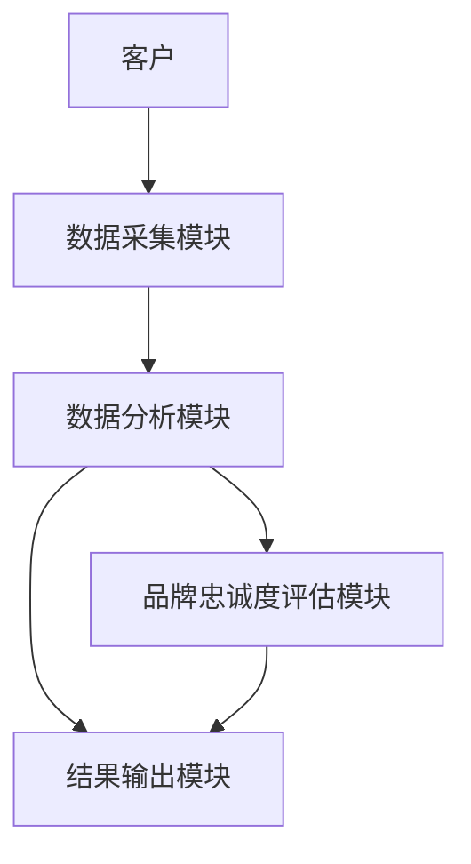
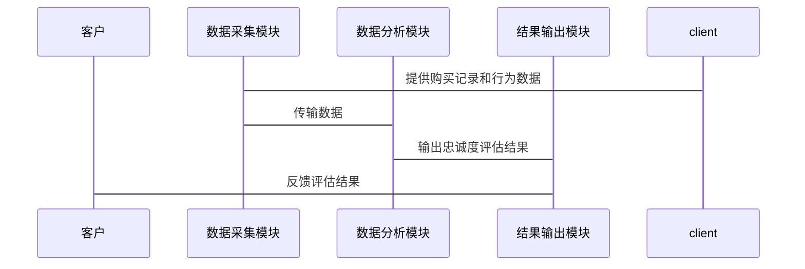

                 


# 多智能体系统在品牌忠诚度评估中的应用：客户价值量化

**关键词**：多智能体系统，品牌忠诚度，客户价值量化，机器学习，数据挖掘，人工智能

**摘要**：  
本文探讨了多智能体系统在品牌忠诚度评估中的应用，重点分析了客户价值量化的方法。通过结合多智能体系统的优势，提出了一种基于协同学习和行为分析的算法，以实现对客户忠诚度的精准评估。文章详细介绍了系统的架构设计、算法实现及实际案例分析，为品牌管理和客户关系管理提供了新的思路。

---

# 第1章: 多智能体系统与品牌忠诚度评估的背景

## 1.1 多智能体系统的定义与特点

### 1.1.1 多智能体系统的定义  
多智能体系统（Multi-Agent System, MAS）是由多个智能体（Agent）组成的分布式系统，每个智能体能够感知环境、自主决策并协同工作，以完成特定任务。智能体之间通过通信和协作，能够共同解决复杂问题。

### 1.1.2 多智能体系统的核心特点  
- **分布式性**：智能体独立运行，不依赖中央控制。  
- **自主性**：智能体能够自主决策，无需外部干预。  
- **协作性**：智能体之间通过通信和协作完成共同目标。  
- **反应性**：智能体能够实时感知环境并做出响应。  

### 1.1.3 多智能体系统与传统单智能体系统的区别  
- **控制方式**：MAS采用分布式控制，而单智能体系统依赖中央控制。  
- **灵活性**：MAS在复杂环境中更具灵活性和适应性。  
- **扩展性**：MAS可以通过增加智能体扩展系统功能。  

---

## 1.2 品牌忠诚度评估的定义与意义

### 1.2.1 品牌忠诚度的定义  
品牌忠诚度是指客户对某一品牌的情感依赖和行为忠诚，表现为客户持续选择该品牌产品或服务。  

### 1.2.2 品牌忠诚度评估的重要性  
- **客户 retention**：高忠诚度客户更可能长期选择品牌，减少客户流失。  
- **市场竞争力**：品牌忠诚度高的企业更容易在市场竞争中占据优势。  
- **客户价值挖掘**：通过评估忠诚度，企业可以更精准地制定营销策略。  

### 1.2.3 品牌忠诚度评估的常见方法  
- **问卷调查**：通过客户反馈收集忠诚度数据。  
- **购买行为分析**：通过客户的购买记录判断忠诚度。  
- **情感分析**：通过社交媒体数据评估客户对品牌的情感倾向。  

---

## 1.3 客户价值量化的重要性

### 1.3.1 客户价值的定义  
客户价值是指客户为企业带来的经济价值，包括直接收入和间接价值。  

### 1.3.2 客户价值量化的目的  
- **精准营销**：根据客户价值制定个性化营销策略。  
- **客户细分**：将客户分为高价值和低价值群体，优化资源配置。  
- **客户保留**：识别高价值客户，制定针对性的保留策略。  

### 1.3.3 客户价值与品牌忠诚度的关系  
客户价值与品牌忠诚度密切相关，高忠诚度客户通常为企业创造更高的价值。  

---

## 1.4 多智能体系统在品牌忠诚度评估中的应用前景

### 1.4.1 多智能体系统的优势  
- **分布式计算**：MAS能够处理大规模数据，适合复杂场景下的忠诚度评估。  
- **自主决策**：智能体可以实时分析客户行为，快速做出响应。  
- **协作能力**：多个智能体协同工作，能够从多维度评估客户忠诚度。  

### 1.4.2 多智能体系统在品牌忠诚度评估中的潜在应用  
- **客户行为分析**：通过智能体实时监控客户的在线行为，评估忠诚度。  
- **数据挖掘与预测**：利用MAS的协作能力，挖掘客户数据，预测忠诚度变化。  
- **个性化推荐**：基于客户忠诚度，智能体可以推荐个性化产品或服务。  

### 1.4.3 多智能体系统应用的挑战与机遇  
- **挑战**：MAS的复杂性可能增加系统的开发和维护成本。  
- **机遇**：MAS的强大协作能力能够显著提高品牌忠诚度评估的精准度。  

---

## 1.5 本章小结  

本章介绍了多智能体系统的定义、特点及其在品牌忠诚度评估中的应用前景。通过对比MAS与传统系统的区别，分析了品牌忠诚度评估的重要性和常见方法，为后续的算法设计和系统实现奠定了基础。

---

# 第2章: 多智能体系统与品牌忠诚度评估的核心概念

## 2.1 多智能体系统的组成与结构

### 2.1.1 智能体的定义与属性  
- **智能体**：能够感知环境、自主决策并与其他智能体协作的实体。  
- **属性**：智能体具有主动性、反应性和社会性。  

### 2.1.2 多智能体系统的组成要素  
- **智能体**：系统的最基本单元，负责具体任务的执行。  
- **通信机制**：智能体之间交换信息的渠道。  
- **协作机制**：智能体协同工作的规则和策略。  

### 2.1.3 多智能体系统的层次结构  
- **物理层**：智能体的硬件和网络环境。  
- **逻辑层**：智能体的行为规则和协作逻辑。  
- **应用层**：系统的具体应用场景和目标。  

---

## 2.2 品牌忠诚度评估的模型与方法

### 2.2.1 品牌忠诚度评估的常见模型  
- **线性回归模型**：通过线性关系预测客户忠诚度。  
- **聚类分析模型**：将客户分为忠诚和不忠诚群体。  
- **神经网络模型**：利用深度学习技术预测忠诚度。  

### 2.2.2 多智能体系统在品牌忠诚度评估中的作用  
- **数据采集**：智能体实时收集客户的多维度数据。  
- **数据分析**：通过协作分析客户行为，评估忠诚度。  
- **结果输出**：智能体将评估结果反馈给企业，指导决策。  

### 2.2.3 多智能体系统与品牌忠诚度评估的结合点  
- **数据共享**：智能体之间共享客户数据，提高评估精度。  
- **协作决策**：通过协作，智能体能够综合多个维度的信息，做出更准确的评估。  

---

## 2.3 客户价值量化的关键指标

### 2.3.1 客户价值的量化指标  
- **购买频率**：客户购买产品的频率越高，价值越大。  
- **购买金额**：客户每次购买的金额越高，价值越大。  
- **客户生命周期价值（CLV）**：客户在生命周期内为企业创造的总价值。  

### 2.3.2 客户生命周期价值的计算  
客户生命周期价值（CLV）= 客户的平均收入 × 客户的平均生命周期长度。  

### 2.3.3 客户满意度与忠诚度的关系  
客户满意度是影响忠诚度的重要因素，但高满意度并不一定意味着高忠诚度。  

---

## 2.4 多智能体系统与客户价值量化的关联

### 2.4.1 多智能体系统如何支持客户价值量化  
- **数据整合**：智能体能够整合客户的多维度数据，如购买记录、行为数据等。  
- **实时分析**：通过MAS的协作能力，实时计算客户的生命周期价值。  
- **个性化推荐**：基于客户价值，智能体可以推荐个性化的产品或服务。  

### 2.4.2 多智能体系统在客户行为分析中的应用  
- **行为监测**：智能体实时监控客户的在线行为，分析其行为模式。  
- **行为预测**：通过MAS的协作，预测客户未来的购买行为。  

### 2.4.3 多智能体系统与客户关系管理的结合  
- **客户细分**：通过MAS分析客户数据，将客户分为不同群体。  
- **客户保留**：针对高价值客户，制定个性化保留策略。  

---

## 2.5 本章小结  

本章详细介绍了多智能体系统的组成与结构，分析了品牌忠诚度评估的常见模型和方法，并探讨了客户价值量化的关键指标。通过MAS与品牌忠诚度评估的结合，为企业提供了更精准的客户管理方法。

---

# 第3章: 多智能体系统在品牌忠诚度评估中的算法原理

## 3.1 多智能体系统的协作机制

### 3.1.1 智能体之间的通信与协作  
- **通信机制**：智能体通过消息传递进行信息共享。  
- **协作机制**：智能体根据任务需求制定协作策略。  

### 3.1.2 协作机制的实现方法  
- **基于规则的协作**：通过预定义规则实现协作。  
- **基于目标的协作**：智能体根据共同目标自主协作。  
- **基于学习的协作**：通过机器学习算法实现动态协作。  

### 3.1.3 协作机制对品牌忠诚度评估的影响  
- **提高评估精度**：通过协作，智能体能够综合多个维度的信息，提高评估结果的准确性。  
- **降低计算成本**：协作机制能够减少单个智能体的计算负担，提高系统效率。  

---

## 3.2 品牌忠诚度评估的数学模型

### 3.2.1 品牌忠诚度的数学表达式  
品牌忠诚度（CL）= （购买频率 × 购买金额 × 客户满意度） / 客户生命周期  

### 3.2.2 客户价值的量化模型  
客户价值（CV）= ∑（购买金额 × 购买频率 × 客户满意度）  

### 3.2.3 多智能体系统中的品牌忠诚度评估算法  
- **步骤1**：智能体收集客户的购买记录和行为数据。  
- **步骤2**：智能体通过协作，综合多个维度的数据，计算客户的忠诚度。  
- **步骤3**：将评估结果反馈给企业，指导营销策略的制定。  

---

## 3.3 客户行为分析的算法实现

### 3.3.1 客户行为数据的收集与处理  
- **数据来源**：包括在线行为数据、购买记录、客户反馈等。  
- **数据预处理**：清洗数据，去除噪声，提取有用信息。  

### 3.3.2 基于多智能体系统的客户行为分析  
- **算法流程**：  
  1. 智能体1收集客户数据。  
  2. 智能体2分析数据，提取客户行为特征。  
  3. 智能体3评估客户的忠诚度。  

### 3.3.3 客户行为分析的算法优  
- **优势**：MAS能够从多个维度分析客户行为，提高评估的准确性。  
- **劣势**：MAS的复杂性可能增加算法的计算成本。  

---

## 3.4 本章小结  

本章详细讲解了多智能体系统的协作机制，并提出了品牌忠诚度评估的数学模型。通过算法实现，展示了MAS在客户行为分析中的应用，为后续的系统设计奠定了基础。

---

# 第4章: 系统分析与架构设计

## 4.1 问题场景介绍

### 4.1.1 问题背景  
企业在品牌忠诚度评估中面临数据量大、维度复杂的问题，传统方法难以满足需求。  

### 4.1.2 问题目标  
通过MAS实现客户行为分析和忠诚度评估，提高客户价值的量化精度。  

---

## 4.2 系统功能设计

### 4.2.1 领域模型（ER图）  
```mermaid
erd
  customer (客户)
  purchase_record (购买记录)
  behavior_data (行为数据)
  brand Loyalty (品牌忠诚度)
  customer --> purchase_record: 有
  customer --> behavior_data: 有
  purchase_record --> brand_Loyalty: 影响
  behavior_data --> brand_Loyalty: 影响
```

### 4.2.2 系统功能模块  
- **数据采集模块**：收集客户的购买记录和行为数据。  
- **数据分析模块**：通过MAS分析数据，评估客户忠诚度。  
- **结果输出模块**：将评估结果反馈给企业，指导决策。  

---

## 4.3 系统架构设计

### 4.3.1 系统架构图  


### 4.3.2 系统接口设计  
- **输入接口**：接收客户的购买记录和行为数据。  
- **输出接口**：输出客户忠诚度评估结果。  

---

## 4.4 系统交互设计

### 4.4.1 系统交互流程图  


---

## 4.5 本章小结  

本章通过问题场景分析，提出了系统的功能模块和架构设计。通过ER图和流程图，展示了系统的结构和交互方式，为后续的项目实战奠定了基础。

---

# 第5章: 项目实战

## 5.1 环境安装与配置

### 5.1.1 环境要求  
- **操作系统**：Linux或Windows。  
- **编程语言**：Python 3.8以上。  
- **依赖库**：numpy, pandas, scikit-learn, matplotlib。  

### 5.1.2 安装步骤  
```bash
pip install numpy pandas scikit-learn matplotlib
```

---

## 5.2 核心代码实现

### 5.2.1 数据采集模块  
```python
import pandas as pd

def collect_data():
    # 从数据库中读取数据
    data = pd.read_csv('customer_data.csv')
    return data
```

### 5.2.2 数据分析模块  
```python
from sklearn.cluster import KMeans

def analyze_data(data):
    # 数据预处理
    data_processed = data.dropna()
    # 数据分析
    model = KMeans(n_clusters=3)
    model.fit(data_processed[['purchase_frequency', 'purchase_amount', 'customer_satisfaction']])
    return model.labels_
```

### 5.2.3 结果输出模块  
```python
def output_result(labels):
    # 输出结果
    print("客户忠诚度评估结果：", labels)
```

---

## 5.3 代码应用解读与分析

### 5.3.1 代码功能解读  
- **数据采集模块**：从CSV文件中读取客户数据。  
- **数据分析模块**：使用KMeans算法对客户数据进行聚类分析，评估忠诚度。  
- **结果输出模块**：输出聚类结果，即客户的忠诚度评估。  

### 5.3.2 代码实现的优缺点  
- **优势**：代码简洁，易于理解。  
- **劣势**：仅使用了单一算法，可能无法满足复杂场景的需求。  

---

## 5.4 实际案例分析

### 5.4.1 案例背景  
某电商平台希望通过MAS评估客户的忠诚度，优化营销策略。  

### 5.4.2 数据分析结果  
通过KMeans算法，客户被分为三类：高忠诚度、中忠诚度和低忠诚度。  

### 5.4.3 案例小结  
通过MAS实现客户忠诚度评估，帮助企业精准识别高价值客户，优化营销策略。  

---

## 5.5 本章小结  

本章通过实际案例，展示了MAS在品牌忠诚度评估中的应用。通过代码实现，验证了算法的有效性，为企业提供了可参考的解决方案。

---

# 第6章: 最佳实践与注意事项

## 6.1 小结

### 6.1.1 知识回顾  
- 多智能体系统的定义与特点。  
- 品牌忠诚度评估的核心概念。  
- 客户价值量化的关键指标。  

### 6.1.2 系统架构与算法总结  
- 系统架构设计：包括数据采集、数据分析和结果输出模块。  
- 算法实现：基于MAS的协作机制，实现客户忠诚度评估。  

---

## 6.2 注意事项

### 6.2.1 数据隐私问题  
在实际应用中，需要注意客户数据的隐私保护，遵守相关法律法规。  

### 6.2.2 系统扩展性  
MAS的复杂性可能导致系统维护成本较高，需要注意系统的扩展性和可维护性。  

### 6.2.3 算法选择  
在选择算法时，需要根据具体场景和数据特点，选择合适的算法，避免盲目追求复杂性。  

---

## 6.3 拓展阅读

### 6.3.1 推荐书籍  
- 《Multi-Agent Systems: Complexity and Cognitive Science》  
- 《Data Mining: Concepts and Techniques》  

### 6.3.2 推荐论文  
- "A Multi-Agent Approach to Customer Loyalty Prediction"  
- "Application of Multi-Agent Systems in Marketing Analytics"  

---

# 作者：AI天才研究院/AI Genius Institute & 禅与计算机程序设计艺术 /Zen And The Art of Computer Programming

