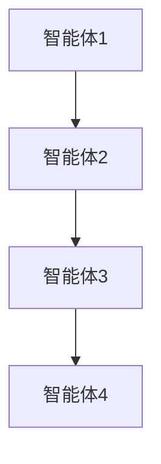

                 


# 多智能体系统在商业模式分析中的创新应用

## 关键词：多智能体系统，商业模式分析，人工智能，协作机制，系统架构设计

## 摘要：  
本文探讨了多智能体系统在商业模式分析中的创新应用。首先，文章介绍了多智能体系统的定义、特点及其在商业模式分析中的独特优势。接着，详细阐述了商业模式分析的基本概念和常见类型，以及多智能体系统在其中的具体应用场景。随后，深入分析了多智能体系统的核心原理，包括智能体结构、通信机制和协作模型。文章还详细讲解了多智能体系统的算法实现，包括分布式计算算法和协作算法，并通过数学公式和图表进一步阐述了其工作原理。最后，通过一个实际案例，展示了多智能体系统在商业模式分析中的具体应用过程，并总结了本文的主要内容和对未来研究的展望。

---

# 第一部分：多智能体系统与商业模式分析基础

## 第1章：多智能体系统概述

### 1.1 多智能体系统的基本概念
#### 1.1.1 多智能体系统的定义
多智能体系统（Multi-Agent Systems, MAS）是由多个智能体（Agent）组成的分布式系统，这些智能体能够通过协作完成复杂任务。智能体是具有感知、决策和执行能力的实体，可以是软件程序或物理设备。

#### 1.1.2 多智能体系统的特征
- **自主性**：智能体能够自主决策。
- **反应性**：智能体能够根据环境变化实时调整行为。
- **协作性**：多个智能体能够通过通信和协作完成任务。
- **分布性**：智能体是分布式的，不存在集中控制点。

#### 1.1.3 多智能体系统与其他相关概念的对比
| 概念 | 定义 | 特点 |
|------|------|------|
| 智能体 | 具有感知、决策和执行能力的实体 | 自主性、反应性 |
| 分布式系统 | 由多个独立节点组成的系统 | 无单点控制 |
| 并行计算 | 多个处理器同时执行任务 | 强调计算效率 |

### 1.2 多智能体系统在商业模式分析中的作用
#### 1.2.1 商业模式分析的基本概念
商业模式是企业实现价值创造和分配的方式，常见的商业模式包括订阅模式、广告模式和销售模式。

#### 1.2.2 多智能体系统在商业模式分析中的优势
- **实时性**：多智能体系统能够实时分析市场动态。
- **分布式决策**：多个智能体能够分别处理不同方面的问题。
- **灵活性**：系统可以根据环境变化快速调整。

#### 1.2.3 多智能体系统与传统商业模式分析方法的对比
| 方法 | 优点 | 缺点 |
|------|------|------|
| 传统方法 | 简单易懂 | 响应速度慢，缺乏灵活性 |
| 多智能体系统 | 实时性强，灵活性高 | 实施成本高，复杂性大 |

---

## 第2章：商业模式分析基础

### 2.1 商业模式的基本构成
#### 2.1.1 商业模式的核心要素
- **价值主张**：企业如何满足客户需求。
- **客户关系**：企业与客户之间的互动方式。
- **渠道**：产品或服务的销售渠道。
- **成本结构**：企业的主要成本来源。
- **收入来源**：企业的收入来源。

#### 2.1.2 商业模式的常见类型
- **订阅模式**：用户按月支付费用，如软件即服务（SaaS）。
- **广告模式**：通过广告获得收入，如社交媒体平台。
- **销售模式**：通过直接销售产品获得收入。

#### 2.1.3 商业模式分析的方法
- **SWOT分析**：分析企业的优势、劣势、机会和威胁。
- **PEST分析**：分析政治、经济、社会和技术环境。

### 2.2 多智能体系统在商业模式分析中的应用场景
#### 2.2.1 多智能体系统在市场预测中的应用
智能体可以通过分析市场数据，预测市场趋势，帮助企业制定更好的市场策略。

#### 2.2.2 多智能体系统在竞争分析中的应用
智能体可以实时监控竞争对手的动态，帮助企业制定竞争策略。

#### 2.2.3 多智能体系统在战略制定中的应用
智能体可以协助企业制定战略计划，优化资源配置，提高效率。

---

## 第3章：多智能体系统的核心原理

### 3.1 多智能体系统的结构与功能
#### 3.1.1 智能体的定义与分类
- **定义**：智能体是具有感知、决策和执行能力的实体。
- **分类**：可以分为简单反射型智能体、基于模型的反射型智能体、目标驱动型智能体和效用驱动型智能体。

#### 3.1.2 多智能体系统的层次结构
- **个体层**：智能体的个体行为。
- **协作层**：智能体之间的协作。
- **系统层**：系统的整体行为。

#### 3.1.3 多智能体系统的通信机制
智能体之间的通信可以通过消息传递或共享数据库实现。

### 3.2 多智能体系统的协作机制
#### 3.2.1 协作的基本概念
协作是指多个智能体共同完成任务的过程。

#### 3.2.2 基于博弈论的协作模型
博弈论可以用于分析智能体之间的协作关系，例如纳什均衡。

#### 3.2.3 基于规则的协作模型
智能体可以根据预定义的规则进行协作。

### 3.3 多智能体系统的建模与仿真
#### 3.3.1 多智能体系统的建模方法
- **基于状态的建模**：描述智能体的状态和行为。
- **基于规则的建模**：定义智能体的行为规则。

#### 3.3.2 多智能体系统的仿真工具
- **工具**：如Repast、NetLogo等。

#### 3.3.3 多智能体系统仿真案例
通过仿真可以分析智能体在不同情况下的行为。

---

## 第4章：多智能体系统的算法与实现

### 4.1 多智能体系统的算法基础
#### 4.1.1 分布式计算算法
- **分布式计算**：任务分布在多个节点上执行。

#### 4.1.2 协作算法
- **协作算法**：用于智能体之间的协作。

#### 4.1.3 通信协议
- **通信协议**：定义智能体之间的通信规则。

### 4.2 多智能体系统的实现步骤
#### 4.2.1 系统需求分析
- **需求分析**：明确系统需要实现的功能。

#### 4.2.2 系统设计
- **系统架构设计**：设计系统的整体架构。
- **功能模块设计**：设计系统的功能模块。

#### 4.2.3 系统实现
- **代码实现**：编写系统的代码。
- **测试与优化**：测试系统的功能，并进行优化。

---

## 第5章：多智能体系统的数学模型与公式

### 5.1 多智能体系统的数学模型
#### 5.1.1 协作模型
$$ C = \sum_{i=1}^{n} c_i $$
其中，\( C \) 表示协作成本，\( c_i \) 表示第 \( i \) 个智能体的协作成本。

#### 5.1.2 竞争模型
$$ R = \sum_{i=1}^{n} r_i $$
其中，\( R \) 表示竞争收益，\( r_i \) 表示第 \( i \) 个智能体的竞争收益。

---

## 第6章：多智能体系统的系统架构设计

### 6.1 系统架构设计
#### 6.1.1 系统架构图
使用Mermaid图展示系统的架构：



#### 6.1.2 功能模块设计
- **感知模块**：负责感知环境信息。
- **决策模块**：负责制定决策。
- **执行模块**：负责执行决策。

#### 6.1.3 系统接口设计
- **输入接口**：接收外部输入。
- **输出接口**：输出系统结果。

---

## 第7章：多智能体系统的项目实战

### 7.1 环境配置
- **工具**：安装Python、NumPy、Matplotlib等工具。

### 7.2 系统核心实现源代码
```python
class Agent:
    def __init__(self, id):
        self.id = id
        self.state = 'idle'

    def perceive(self, environment):
        # 根据环境感知状态
        pass

    def decide(self):
        # 根据状态做出决策
        pass

    def act(self):
        # 执行决策
        pass

# 多智能体系统的初始化
agents = [Agent(i) for i in range(4)]
```

### 7.3 代码应用解读与分析
- **Agent类**：定义智能体的基本结构。
- **初始化**：创建多个智能体实例。

### 7.4 实际案例分析
通过案例分析展示多智能体系统在商业模式分析中的应用。

---

## 第8章：总结与展望

### 8.1 本文总结
本文详细介绍了多智能体系统在商业模式分析中的创新应用，涵盖了系统的基本概念、核心原理和具体实现。

### 8.2 未来研究方向
- **智能体的自适应能力**：研究智能体如何更好地适应环境变化。
- **多智能体系统的安全性**：研究系统如何防范安全风险。

### 8.3 最佳实践 Tips
- **选择合适的工具**：根据需求选择适合的多智能体系统工具。
- **注重系统的可扩展性**：设计时考虑系统的可扩展性。

---

## 作者：AI天才研究院/AI Genius Institute & 禅与计算机程序设计艺术 /Zen And The Art of Computer Programming

