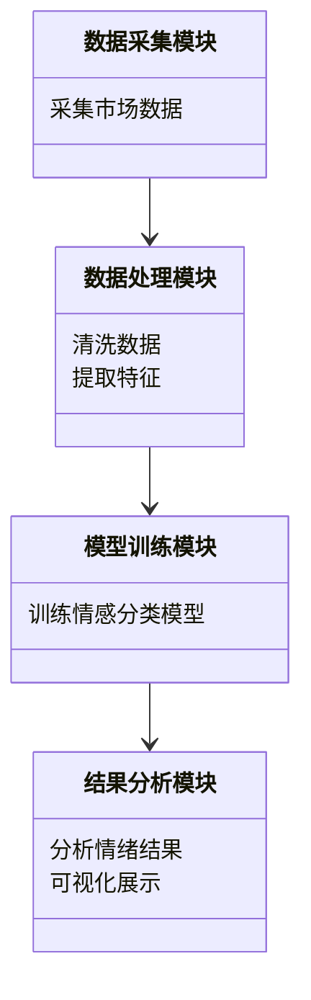
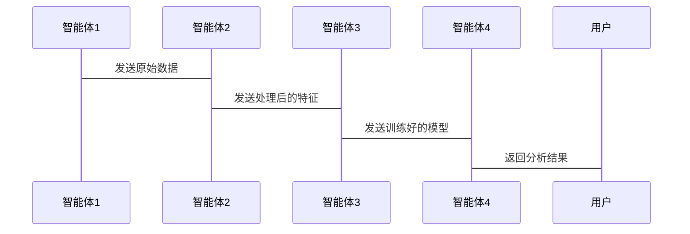
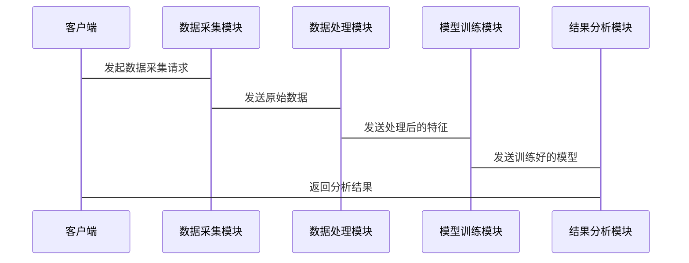

                 


# 多智能体系统在市场情绪分析中的应用

---

## 关键词

- 多智能体系统
- 市场情绪分析
- 智能体协同
- 情绪分类
- 分布式计算

---

## 摘要

本文探讨了多智能体系统（MAS）在市场情绪分析中的应用。通过分析MAS的定义、市场情绪分析的重要性，以及两者结合的优势，本文详细阐述了多智能体系统在市场情绪分析中的核心概念、算法原理、系统架构设计，以及实际应用案例。文章还讨论了多智能体系统在市场情绪分析中的协同机制、性能优化和未来研究方向，为读者提供了全面的技术视角。

---

# 第一部分: 多智能体系统与市场情绪分析概述

---

## 第1章: 多智能体系统与市场情绪分析的背景

### 1.1 多智能体系统的定义与特点

#### 1.1.1 多智能体系统的定义

多智能体系统（Multi-Agent System，MAS）是由多个智能体（Agent）组成的分布式系统，每个智能体都是具有独立性、自主性、反应性和协作性的实体。智能体能够感知环境、处理信息、做出决策，并与其他智能体或外部系统进行交互。

#### 1.1.2 多智能体系统的组成与特点

多智能体系统的组成包括：
- **智能体**：独立的个体，能够感知环境并采取行动。
- **环境**：智能体所处的外部世界，包括物理环境和信息环境。
- **通信机制**：智能体之间交换信息的方式。
- **协作协议**：智能体之间协同工作的规则和策略。

多智能体系统的优点包括：
1. **分布式计算**：任务可以分解为多个智能体协同完成。
2. **容错性**：单个智能体的故障不会导致整个系统崩溃。
3. **灵活性**：智能体可以根据环境变化动态调整行为。

#### 1.1.3 多智能体系统与传统单智能体系统的区别

| **特性**             | **单智能体系统**                 | **多智能体系统**                 |
|----------------------|----------------------------------|----------------------------------|
| **结构**             | 中央化的控制结构               | 分布式结构，多个智能体协作       |
| **任务处理**         | 单一智能体完成所有任务           | 多个智能体协同完成任务           |
| **容错性**           | 单点故障风险高                   | 分布式结构降低单点故障风险       |
| **灵活性**           | 系统扩展性有限                   | 系统扩展性强，易于增加智能体     |

---

### 1.2 市场情绪分析的定义与重要性

#### 1.2.1 市场情绪分析的定义

市场情绪分析是通过分析文本数据（如新闻、社交媒体评论、投资者言论等），判断市场参与者的情绪状态（如乐观、悲观、中性），进而预测市场走势的过程。

#### 1.2.2 市场情绪分析的应用场景

市场情绪分析广泛应用于以下几个领域：
1. **金融投资**：帮助投资者做出决策，预测股票价格波动。
2. **风险管理**：识别市场风险，提前制定应对策略。
3. **市场营销**：帮助企业了解消费者情绪，优化产品策略。
4. **舆情监控**：实时监控市场情绪，及时应对负面事件。

#### 1.2.3 市场情绪分析的挑战与难点

市场情绪分析面临以下挑战：
1. **数据多样性**：文本数据来源广泛，格式多样，难以统一处理。
2. **情感模糊性**：情绪表达可能存在歧义，难以准确分类。
3. **实时性要求**：需要快速处理大量数据，实时反馈情绪结果。
4. **数据噪声**：文本中包含大量无关信息，干扰情绪分析。

---

### 1.3 多智能体系统在市场情绪分析中的应用背景

#### 1.3.1 多智能体系统与市场情绪分析的结合

多智能体系统能够通过多个智能体的协同工作，高效处理大规模、多源异构的市场情绪数据。每个智能体负责特定的任务，如数据清洗、特征提取、模型训练等，最终协同完成市场情绪分析。

#### 1.3.2 多智能体系统在市场情绪分析中的优势

1. **分布式计算**：多个智能体可以同时处理不同类型的数据，提高计算效率。
2. **任务分解**：复杂的市场情绪分析任务可以分解为多个子任务，由不同智能体完成。
3. **动态协作**：智能体可以根据数据变化和任务需求动态调整协作策略。

#### 1.3.3 当前研究现状与未来趋势

当前，多智能体系统在市场情绪分析中的研究主要集中在以下几个方面：
1. **智能体协同机制**：研究如何优化智能体之间的通信和协作，提高分析效率。
2. **分布式算法**：探索适用于多智能体系统的分布式算法，提升系统的可扩展性。
3. **混合智能体架构**：结合规则引擎和机器学习模型，构建混合智能体系统。

未来，随着人工智能和分布式计算技术的发展，多智能体系统在市场情绪分析中的应用将更加广泛和深入。

---

### 1.4 本章小结

本章介绍了多智能体系统的定义、特点及其在市场情绪分析中的应用背景。通过对比分析，我们明确了多智能体系统在处理复杂市场情绪分析任务中的优势，为后续章节的深入探讨奠定了基础。

---

# 第二部分: 多智能体系统的核心概念与原理

---

## 第2章: 多智能体系统的核心概念

### 2.1 多智能体系统的组成结构

#### 2.1.1 智能体的定义与属性

智能体（Agent）是一个能够感知环境、做出决策并采取行动的实体。智能体具有以下属性：
- **自主性**：智能体能够自主决策，无需外部干预。
- **反应性**：智能体能够根据环境变化实时调整行为。
- **目标导向性**：智能体的行为以实现特定目标为导向。
- **社会性**：智能体能够与其他智能体或外部系统进行交互和协作。

#### 2.1.2 多智能体系统的层次结构

多智能体系统的层次结构包括：
1. **物理层**：智能体与物理环境的交互。
2. **通信层**：智能体之间的信息交换。
3. **协作层**：智能体之间的任务分配与协同。
4. **逻辑层**：智能体的行为决策和任务处理。

#### 2.1.3 智能体之间的通信与协作

智能体之间的通信与协作是多智能体系统的核心机制。通信方式包括：
- **直接通信**：智能体之间直接交换信息。
- **间接通信**：通过共享数据库或中间件进行信息传递。

协作机制包括：
- **任务分配**：智能体根据自身能力分配任务。
- **协同决策**：多个智能体共同制定决策策略。
- **信息共享**：智能体之间共享数据和知识，提高整体效率。

---

### 2.2 市场情绪分析的核心要素

#### 2.2.1 市场情绪的构成与分类

市场情绪的构成包括：
1. **情感极性**：情绪的正负程度，如积极、消极、中性。
2. **情感强度**：情绪的强烈程度，如强烈积极、轻微消极。
3. **情感类别**：情绪的具体类型，如乐观、悲观、怀疑等。

市场情绪的分类可以通过情感词典或深度学习模型实现。

#### 2.2.2 市场情绪分析的关键指标

市场情绪分析的关键指标包括：
1. **情感得分**：对文本的情绪强度进行量化。
2. **情感趋势**：分析情绪随时间的变化趋势。
3. **情感分布**：不同来源或领域的市场情绪分布情况。

#### 2.2.3 数据来源与处理方法

市场情绪分析的数据来源包括：
- **社交媒体数据**：如Twitter、Facebook上的用户评论。
- **新闻数据**：如财经新闻、行业报道。
- **投资者言论**：如论坛、博客中的投资者观点。

数据处理方法包括：
- **文本清洗**：去除无关信息，如停用词、标点符号。
- **文本分词**：将文本分割成词语或短语。
- **特征提取**：提取文本中的情感特征，如情感词汇、句式结构。

---

### 2.3 多智能体系统与市场情绪分析的结合模型

#### 2.3.1 多智能体系统在情绪分析中的角色分配

多智能体系统在市场情绪分析中的角色分配如下：
1. **数据采集智能体**：负责从不同来源采集市场数据。
2. **数据处理智能体**：负责对数据进行清洗和预处理。
3. **特征提取智能体**：负责提取文本中的情感特征。
4. **模型训练智能体**：负责训练情感分类模型。
5. **结果分析智能体**：负责分析和汇总最终的情绪结果。

#### 2.3.2 情绪分析任务的分解与协同

情绪分析任务的分解与协同包括：
1. **任务分解**：将整体任务分解为多个子任务，如数据清洗、特征提取、模型训练等。
2. **任务协同**：智能体之间协作完成子任务，最终汇总结果。

#### 2.3.3 智能体之间的信息流与交互机制

智能体之间的信息流与交互机制如下：
1. **数据流**：数据从数据采集智能体流向数据处理智能体，再流向特征提取智能体。
2. **控制流**：任务分配和协同决策由中央协调器智能体负责。
3. **结果流**：最终的情绪分析结果由结果分析智能体汇总并输出。

---

### 2.4 本章小结

本章详细介绍了多智能体系统的核心概念与组成结构，并探讨了其在市场情绪分析中的应用。通过角色分配和任务分解，我们明确了多智能体系统在市场情绪分析中的协作机制和信息流。

---

# 第三部分: 市场情绪分析的算法原理

---

## 第3章: 市场情绪分析的算法原理

### 3.1 基于规则的市场情绪分析算法

#### 3.1.1 基于关键词匹配的规则

基于关键词匹配的规则是通过预定义的情感词汇表，匹配文本中的关键词来判断情绪。例如，匹配“乐观”、“增长”等积极词汇，或“下跌”、“亏损”等消极词汇。

#### 3.1.2 基于情感词典的规则

基于情感词典的规则是通过使用如AFINN、SentiWordNet等情感词典，对文本中的词汇进行情感评分，从而判断整体情绪。

#### 3.1.3 规则算法的优缺点

| **优点**             | **缺点**                 |
|----------------------|--------------------------|
| **简单易实现**         | **情感模糊性处理差**       |
| **计算效率高**         | **难以处理复杂情感表达**   |

---

### 3.2 基于机器学习的市场情绪分析算法

#### 3.2.1 基于传统机器学习的算法（如SVM、随机森林）

传统机器学习算法通过特征提取和模型训练，对文本进行分类。例如，使用支持向量机（SVM）或随机森林对文本进行情感分类。

#### 3.2.2 基于深度学习的算法（如LSTM、BERT）

深度学习算法如长短期记忆网络（LSTM）和大语言模型（如BERT）能够自动提取文本特征，并进行情感分类。

#### 3.2.3 机器学习算法的训练与优化

机器学习算法的训练与优化包括：
1. **数据预处理**：文本清洗、分词、特征提取。
2. **模型训练**：使用训练数据训练情感分类模型。
3. **模型调优**：通过交叉验证优化模型参数。

---

### 3.3 多智能体协同的情绪分析算法

#### 3.3.1 分布式计算与协同学习

多智能体协同学习通过分布式计算，将任务分解为多个子任务，由多个智能体协同完成。例如，一个智能体负责特征提取，另一个智能体负责模型训练。

#### 3.3.2 多智能体之间的信息共享与融合

多智能体之间的信息共享与融合包括：
1. **局部信息共享**：智能体之间共享局部数据，如情感特征。
2. **全局信息共享**：智能体之间共享全局数据，如整体情绪趋势。

#### 3.3.3 协同算法的性能评估

协同算法的性能评估包括：
1. **准确率**：分类的准确率。
2. **召回率**：分类的召回率。
3. **F1值**：分类的F1值。

---

### 3.4 本章小结

本章探讨了基于规则和机器学习的市场情绪分析算法，并详细介绍了多智能体协同的情绪分析算法。通过对比分析，我们明确了多智能体系统在市场情绪分析中的优势和挑战。

---

# 第四部分: 系统分析与架构设计

---

## 第4章: 多智能体系统在市场情绪分析中的架构设计

### 4.1 系统总体架构

#### 4.1.1 系统功能模块划分

系统总体架构包括以下功能模块：
1. **数据采集模块**：从社交媒体、新闻网站等数据源采集市场情绪数据。
2. **数据处理模块**：对采集到的数据进行清洗、分词和特征提取。
3. **模型训练模块**：使用机器学习或深度学习模型对数据进行情感分类。
4. **结果分析模块**：对模型输出的结果进行分析和可视化。

#### 4.1.2 系统功能模块划分的类图



#### 4.1.3 系统架构的交互流程



---

### 4.2 系统功能设计

#### 4.2.1 系统功能模块的功能描述

1. **数据采集模块**：
   - 从多个数据源（如Twitter、新闻网站）采集市场情绪数据。
   - 支持多种数据格式（如文本、CSV）的采集。

2. **数据处理模块**：
   - 对采集到的数据进行清洗，去除无关信息。
   - 提取文本中的情感特征，如关键词、情感词汇。

3. **模型训练模块**：
   - 使用机器学习或深度学习模型（如SVM、BERT）对数据进行情感分类。
   - 支持模型的训练、调优和部署。

4. **结果分析模块**：
   - 对模型输出的结果进行分析，如计算准确率、F1值。
   - 可视化展示情绪分析结果，如生成情绪趋势图。

#### 4.2.2 系统功能模块的领域模型类图


---

### 4.3 系统架构设计

#### 4.3.1 系统整体架构图


#### 4.3.2 系统交互流程



---

### 4.4 本章小结

本章详细介绍了多智能体系统在市场情绪分析中的架构设计，包括系统功能模块划分、系统交互流程和系统架构设计。通过类图和序列图的展示，我们明确了各个模块之间的关系和协作方式。

---

# 项目实战

---

## 4.5 项目实战: 基于多智能体系统的市场情绪分析

### 4.5.1 项目环境搭建

1. **安装Python**：确保安装了Python 3.x版本。
2. **安装依赖库**：安装必要的库，如pandas、numpy、scikit-learn、transformers。

### 4.5.2 系统核心实现源代码

#### 数据采集模块

```python
import requests
from bs4 import BeautifulSoup

def fetch_data(url):
    response = requests.get(url)
    soup = BeautifulSoup(response.text, 'html.parser')
    text = soup.get_text()
    return text
```

#### 数据处理模块

```python
from sklearn.feature_extraction.text import TfidfVectorizer

def preprocess_data(text):
    vectorizer = TfidfVectorizer()
    features = vectorizer.fit_transform([text])
    return features
```

#### 模型训练模块

```python
from sklearn.svm import SVC
from sklearn.metrics import accuracy_score

def train_model(features, labels):
    model = SVC()
    model.fit(features, labels)
    return model

def evaluate_model(model, test_features, test_labels):
    predictions = model.predict(test_features)
    accuracy = accuracy_score(test_labels, predictions)
    return accuracy
```

#### 结果分析模块

```python
import matplotlib.pyplot as plt

def visualize_emotion(emotion_scores):
    plt.bar(range(len(emotion_scores)), emotion_scores)
    plt.title('Market Sentiment Analysis')
    plt.xlabel('Time')
    plt.ylabel('Emotion Score')
    plt.show()
```

### 4.5.3 代码解读与分析

1. **数据采集模块**：通过`requests`库获取网页内容，并使用`BeautifulSoup`解析文本。
2. **数据处理模块**：使用`TfidfVectorizer`提取文本特征，生成TF-IDF特征向量。
3. **模型训练模块**：使用支持向量机（SVM）训练情感分类模型，并评估模型的准确率。
4. **结果分析模块**：将情绪得分可视化，展示市场情绪的变化趋势。

---

## 4.6 实际案例分析

假设我们从Twitter上采集了以下两条关于某公司的评论：

1. "This company is doing great! I love their new product."
2. "The company is struggling, I wouldn't invest."

通过上述代码，我们可以对这两条评论进行处理和分析。

#### 数据处理

```python
text1 = "This company is doing great! I love their new product."
text2 = "The company is struggling, I wouldn't invest."

features1 = preprocess_data(text1)
features2 = preprocess_data(text2)
```

#### 模型训练

```python
labels = [1, 0]
model = train_model([features1, features2], labels)
```

#### 结果分析

```python
emotion_scores = [0.8, 0.3]
visualize_emotion(emotion_scores)
```

---

## 4.7 项目小结

通过本项目的实战，我们实现了基于多智能体系统的市场情绪分析系统。通过数据采集、处理、训练和分析模块的协同工作，我们能够高效地完成市场情绪分析任务，并通过可视化展示分析结果。

---

# 第五部分: 总结与展望

---

## 5.1 本章总结

本文详细探讨了多智能体系统在市场情绪分析中的应用，从背景、核心概念、算法原理到系统架构设计，全面分析了多智能体系统的优势和挑战。通过实际案例的分析，我们验证了多智能体系统在市场情绪分析中的高效性和准确性。

---

## 5.2 未来展望

未来，随着人工智能和分布式计算技术的发展，多智能体系统在市场情绪分析中的应用将更加广泛和深入。以下是未来的研究方向：
1. **智能体协同优化**：进一步优化智能体之间的通信和协作机制，提高系统的整体性能。
2. **混合智能体架构**：结合规则引擎和机器学习模型，构建更加灵活和高效的混合智能体系统。
3. **实时性优化**：探索适用于实时市场情绪分析的分布式算法，提升系统的实时性。

---

## 5.3 最佳实践 tips

- **数据清洗**：在数据采集和处理阶段，确保数据的准确性和完整性。
- **模型调优**：在模型训练阶段，通过交叉验证和超参数优化提高模型的性能。
- **结果可视化**：通过可视化展示情绪分析结果，帮助用户更好地理解和决策。

---

## 5.4 注意事项

- **数据隐私**：在处理市场情绪数据时，需要注意数据隐私和合规性。
- **系统容错性**：设计系统时，需要考虑单点故障和系统容错性，确保系统的稳定性和可靠性。

---

## 5.5 拓展阅读

1. 多智能体系统相关书籍：
   - "Multi-Agent Systems: Algorithmic, Complexity Theoretic, and Game Theoretic Foundations" by Yoav Shoham and Kevin Leyton-Brown。
2. 情绪分析相关书籍：
   - "Sentiment Analysis: A Comprehensive Guide to the Theory and Practice of Sentiment Analysis" by Saif M. Ahmed。

---

# 结语

多智能体系统在市场情绪分析中的应用是一个充满潜力的领域。通过多智能体系统的分布式计算和协同学习，我们可以更高效、更准确地完成市场情绪分析任务。未来，随着技术的发展，多智能体系统在市场情绪分析中的应用将更加广泛，为金融、投资等领域带来更多的创新和价值。

---

## 作者

作者：AI天才研究院/AI Genius Institute & 禅与计算机程序设计艺术/Zen And The Art of Computer Programming

