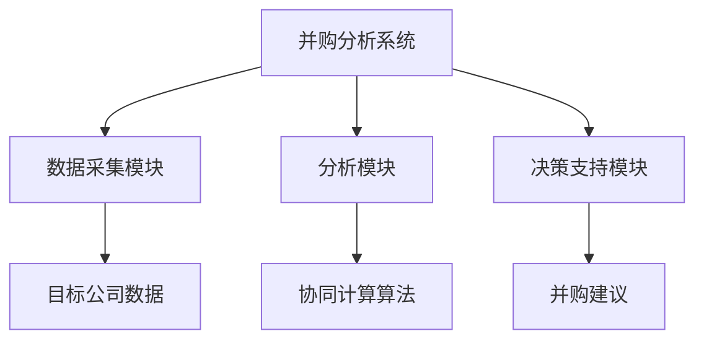
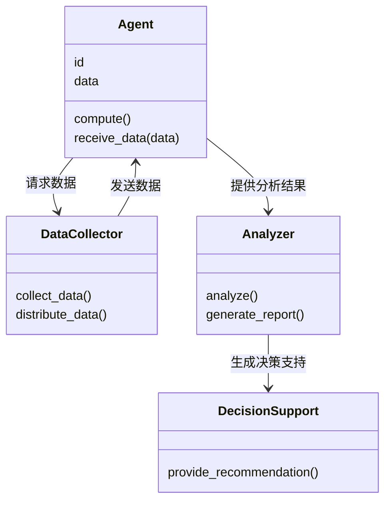

                 


# 多智能体系统在并购分析中的应用：评估长期价值创造

> 关键词：多智能体系统，并购分析，长期价值，协同计算，分布式算法，系统架构，案例分析

> 摘要：  
> 多智能体系统（Multi-Agent Systems, MAS）通过多个智能体的协同计算和分布式算法，为复杂的并购分析提供了新的解决方案。本文探讨了MAS在并购分析中的应用背景，分析了其核心概念与原理，并通过数学模型和算法实现，展示了其在评估长期价值创造中的优势。通过实际案例分析和系统设计，本文为并购分析的智能化提供了新的思路。

---

## 第一部分：并购分析的背景与挑战

### 第1章：并购分析的背景

#### 1.1 并购分析的基本概念
- **定义**：并购（Mergers and Acquisitions, M&A）是指两个或多个企业之间的合并或收购，目的是通过资源整合实现更大的市场竞争力和经济价值。
- **类型**：包括横向并购、纵向并购和混合并购，每种类型的目标和策略不同。
- **重要性**：并购是企业战略发展的重要手段，直接影响企业的长期价值和市场地位。

#### 1.2 并购分析的关键环节
- **尽职调查**：评估目标公司的财务状况、市场地位和潜在风险。
- **估值模型**：使用DCF模型、交易 comps 等方法评估目标公司的价值。
- **整合规划**：制定并购后的组织结构、业务流程和文化整合计划。

#### 1.3 并购分析的挑战
- **数据复杂性**：涉及财务数据、市场数据、管理数据等多个维度，数据量大且复杂。
- **多目标优化**：并购决策需要在财务回报、战略协同、风险控制等多个目标间找到平衡。
- **整合风险**：并购后的整合过程可能面临文化冲突、管理不善等问题，影响长期价值。

### 第2章：多智能体系统在并购分析中的应用背景

#### 2.1 多智能体系统的基本概念
- **智能体**：具备感知环境、自主决策、协同合作能力的实体。
- **多智能体系统**：由多个智能体组成的分布式系统，通过协同完成复杂任务。
- **MAS的优势**：分布式计算能力、自主性、协作性、适应性。

#### 2.2 多智能体系统与并购分析的契合点
- **分布式计算**：MAS能够处理并购分析中的多源异构数据，提高计算效率。
- **协同决策**：智能体协同完成尽职调查、估值和整合规划，优化决策质量。
- **动态适应**：MAS能够实时响应市场变化，调整并购策略。

---

## 第二部分：多智能体系统的核心概念与原理

### 第3章：多智能体系统的核心概念

#### 3.1 多智能体系统的分类
- **分布式MAS**：智能体分布在网络中，通过通信协议协同工作。
- **集中式MAS**：有一个中央控制器协调各智能体的行动。
- **混合MAS**：结合分布式和集中式的特点，适用于复杂场景。

#### 3.2 多智能体系统的协作模型
- **协作协议**：定义智能体之间的通信规则和协作流程。
- **任务分配**：智能体根据自身能力和任务需求分配工作。
- **协调机制**：通过协商和同步确保各智能体行动一致。

### 第4章：多智能体系统在并购分析中的核心原理

#### 4.1 协同计算算法
- **分布式计算**：利用MAS的分布式特性，将并购分析任务分解为多个子任务，分别由不同的智能体完成。
- **协作优化**：通过智能体间的协作，优化并购分析的效率和准确性。

#### 4.2 分布式算法实现
- **并行计算**：多个智能体同时处理不同的数据源，提高计算速度。
- **负载均衡**：动态分配任务，确保系统高效运行。

#### 4.3 数学模型与公式
- **协同计算模型**：  
  $$ f(x) = \sum_{i=1}^{n} a_i x_i $$
  其中，$a_i$ 是智能体的权重，$x_i$ 是输入数据。

---

## 第三部分：系统分析与架构设计

### 第5章：系统分析与架构设计

#### 5.1 系统功能模块
- **数据采集模块**：采集目标公司的财务数据、市场数据等。
- **分析模块**：使用MAS进行尽职调查、估值和风险评估。
- **决策支持模块**：基于分析结果，提供并购建议。

#### 5.2 系统架构图（Mermaid）



#### 5.3 系统交互流程
- 智能体协同完成数据采集、分析和决策，确保整个过程高效准确。

---

## 第四部分：项目实战与案例分析

### 第6章：项目实战

#### 6.1 环境配置
- 使用Python和相关库（如NumPy、Pandas）进行开发。
- 采用Docker部署分布式系统。

#### 6.2 核心代码实现

```python
class Agent:
    def __init__(self, id):
        self.id = id
        self.data = None

    def receive_data(self, data):
        self.data = data

    def compute(self):
        # 协同计算逻辑
        return sum(a * x for a, x in zip(self.data['weights'], self.data['inputs']))

# 初始化智能体
agents = [Agent(i) for i in range(4)]

# 分配任务
for i in range(len(agents)):
    agents[i].receive_data({
        'weights': [1, 2, 3],
        'inputs': [i+1, i+2, i+3]
    })

# 并行计算
import concurrent.futures
with concurrent.futures.ThreadPoolExecutor() as executor:
    futures = {agent.compute() for agent in agents}
    results = [f.result() for f in futures]

print(results)
```

#### 6.3 案例分析
- 以某公司为例，展示如何通过MAS进行并购分析，评估其长期价值。

---

## 第五部分：总结与展望

### 第7章：总结与展望

#### 7.1 总结
- 多智能体系统通过协同计算和分布式算法，显著提升了并购分析的效率和准确性。
- 在长期价值评估中，MAS能够帮助企业在复杂环境中做出更优决策。

#### 7.2 展望
- **智能体学习**：引入机器学习和深度学习，提升MAS的智能化水平。
- **实时分析**：开发实时监控系统，支持动态调整并购策略。
- **扩展应用**：探索MAS在其他领域的应用，如供应链优化、风险管理等。

---

## 参考文献

1. 多智能体系统相关书籍和论文。
2. 并购分析的经典文献。
3. 分布式计算和协同算法的研究成果。

---

## 附录

### 附录A：数学公式汇总

#### 协同计算公式
$$ f(x) = \sum_{i=1}^{n} a_i x_i $$

#### 优化算法公式
$$ \min_{x} \sum_{i=1}^{n} (y_i - f(x))^2 $$

### 附录B：系统架构图



---

## 作者

作者：AI天才研究院/AI Genius Institute & 禅与计算机程序设计艺术 /Zen And The Art of Computer Programming

