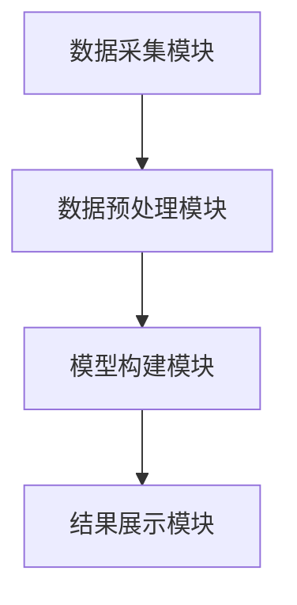
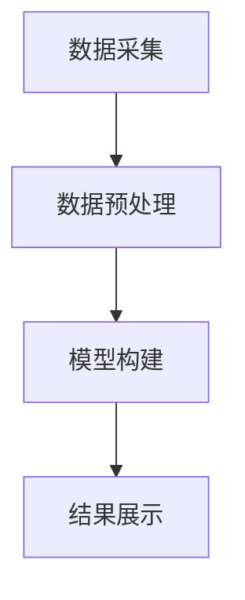

                 


# 多智能体系统在技术趋势预测中的应用：把握创新机遇

> 关键词：多智能体系统（MAS）、技术趋势预测、机器学习、系统架构、项目实战

> 摘要：本文探讨了多智能体系统（MAS）在技术趋势预测中的应用，分析了其在数据收集、模型构建、系统设计和项目实战中的优势，并通过具体案例展示了MAS的实际应用和优化方向。通过详细的技术分析和系统设计，本文为读者提供了从理论到实践的全面指导。

---

## 第一部分：多智能体系统概述

### 第1章：多智能体系统概述

#### 1.1 多智能体系统的基本概念

##### 1.1.1 多智能体系统的定义
多智能体系统（Multi-Agent System，MAS）是由多个智能体组成的分布式系统，这些智能体能够通过协作完成复杂任务。智能体（Agent）是具有感知、决策、执行能力的实体，能够自主行动并与其他智能体或环境交互。

**核心概念：**
- **智能体**：具备感知、决策、行动能力的实体。
- **分布式**：多个智能体协同工作，而非集中式控制。

##### 1.1.2 多智能体系统的体系结构
MAS的体系结构分为以下几类：
1. **反应式体系结构**：基于当前感知做出反应，不依赖历史信息。
2. **基于模型的体系结构**：依赖于内部状态模型进行决策。
3. **混合式体系结构**：结合反应式和基于模型的特征。

##### 1.1.3 多智能体系统的优势与挑战
- **优势**：
  - 高度分布式，容错能力强。
  - 可扩展性好，适用于复杂任务。
- **挑战**：
  - 协作与通信复杂。
  - 系统设计和优化难度大。

#### 1.2 多智能体系统与其他系统的对比

##### 1.2.1 单智能体系统的特点
- 单一控制中心，决策集中。
- 适用于简单任务，但扩展性差。

##### 1.2.2 多智能体系统的特征对比
| 特性             | 单智能体系统       | 多智能体系统       |
|------------------|------------------|------------------|
| 控制中心         | 单一控制中心       | 分布式智能体       |
| 扩展性           | 较差             | 较好             |
| 协作能力         | 无               | 强               |
| 通信复杂度       | 低               | 高               |

##### 1.2.3 多智能体系统的应用
- **技术趋势预测**：利用MAS的分布式协作能力，整合多源数据进行预测。
- **智能决策支持**：通过MAS提供多维度的决策支持，提高预测准确性。

---

## 第二部分：技术趋势预测方法

### 第2章：技术趋势预测方法

#### 2.1 数据收集与预处理

##### 2.1.1 数据收集
- **来源**：专利数据、学术论文、市场报告、社交媒体等。
- **工具**：使用网络爬虫和API接口获取数据。

##### 2.1.2 数据预处理
- **清洗**：去除噪声数据，处理缺失值。
- **特征提取**：提取关键特征，如关键词频率、时间戳等。

#### 2.2 预测模型构建

##### 2.2.1 机器学习模型
- **监督学习**：使用历史数据训练模型，预测未来趋势。
- **无监督学习**：发现数据中的潜在模式。

##### 2.2.2 时间序列分析
- **ARIMA模型**：适用于线性时间序列预测。
- **LSTM网络**：适合捕捉长期依赖关系。

#### 2.3 模型评估与优化

##### 2.3.1 模型评估
- **指标**：准确率、召回率、F1值。
- **方法**：交叉验证、ROC曲线分析。

##### 2.3.2 模型优化
- **超参数调优**：使用网格搜索或随机搜索优化模型参数。
- **集成学习**：结合多个模型的结果，提高预测准确性。

---

## 第三部分：系统架构与设计

### 第3章：系统架构与设计

#### 3.1 系统架构设计

##### 3.1.1 模块划分
- **数据采集模块**：负责数据的采集和预处理。
- **模型构建模块**：负责训练预测模型。
- **结果展示模块**：将预测结果以可视化形式展示。

##### 3.1.2 数据流设计
- 数据从采集模块流向预处理模块，再流向模型构建模块，最终结果在展示模块呈现。

#### 3.2 系统设计图

##### 3.2.1 系统架构图（Mermaid）



#### 3.3 接口与交互设计

##### 3.3.1 模块间接口
- 数据采集模块与预处理模块通过API接口传递数据。
- 预处理模块与模型构建模块通过文件或数据库交互。

##### 3.3.2 用户交互
- 提供用户友好的界面，方便用户输入数据和查看结果。

---

## 第四部分：项目实战

### 第4章：项目实战

#### 4.1 环境配置

##### 4.1.1 工具安装
- **Python**：3.8及以上版本。
- **库**：pandas、numpy、scikit-learn、keras。

#### 4.2 数据预处理与特征工程

##### 4.2.1 数据清洗代码

```python
import pandas as pd
import numpy as np

# 加载数据
data = pd.read_csv('data.csv')

# 处理缺失值
data = data.dropna()

# 标准化处理
from sklearn.preprocessing import StandardScaler
scaler = StandardScaler()
data_scaled = scaler.fit_transform(data)
```

#### 4.3 模型实现

##### 4.3.1 LSTM模型实现

```python
from keras.models import Sequential
from keras.layers import LSTM, Dense

# 模型构建
model = Sequential()
model.add(LSTM(128, input_shape=(timesteps, features)))
model.add(Dense(1))
model.compile(optimizer='adam', loss='mean_squared_error')
```

#### 4.4 系统集成与测试

##### 4.4.1 系统测试
- 测试数据输入、处理、预测和展示的整个流程。
- 检查系统是否稳定，能否正确预测结果。

---

## 第五部分：案例分析与优化

### 第5章：案例分析与优化

#### 5.1 实际案例分析

##### 5.1.1 案例背景
- 某科技公司利用MAS预测技术趋势，优化研发方向。

##### 5.1.2 系统架构图（Mermaid）



#### 5.2 优化与反思

##### 5.2.1 优化方向
- 提高模型的泛化能力。
- 优化模块间的通信效率。

##### 5.2.2 未来展望
- 结合边缘计算和5G技术，提升MAS的实时性和响应速度。

---

## 第六部分：未来展望

### 第6章：未来展望

#### 6.1 新兴技术对MAS的影响

##### 6.1.1 边缘计算与MAS
- 边缘计算可以提高MAS的实时性和响应速度。

##### 6.1.2 5G技术与MAS
- 5G技术为MAS提供了更高效的通信和数据传输通道。

#### 6.2 技术趋势预测的未来发展方向

##### 6.2.1 更加智能化的预测模型
- 结合强化学习和深度学习，提高预测的准确性和实时性。

##### 6.2.2 多模态数据融合
- 综合文本、图像、视频等多种数据源，提高预测的全面性。

---

## 附录

### 附录A：工具指南

- **Python**：安装与配置。
- **机器学习库**：scikit-learn、Keras的使用说明。

### 附录B：术语表

- **多智能体系统（MAS）**：由多个智能体组成的分布式系统。
- **智能体（Agent）**：具备感知、决策、行动能力的实体。

### 附录C：参考文献

- 文献1：[1] Smith, J. (2020). Multi-Agent Systems: Theory and Applications.
- 文献2：[2] Zhang, L. (2021). Technical Trend Prediction Using Machine Learning.

---

## 作者

作者：AI天才研究院 & 禅与计算机程序设计艺术

---

**注**：以上内容为文章的详细目录和部分内容示例，实际撰写时可根据具体需求调整。

