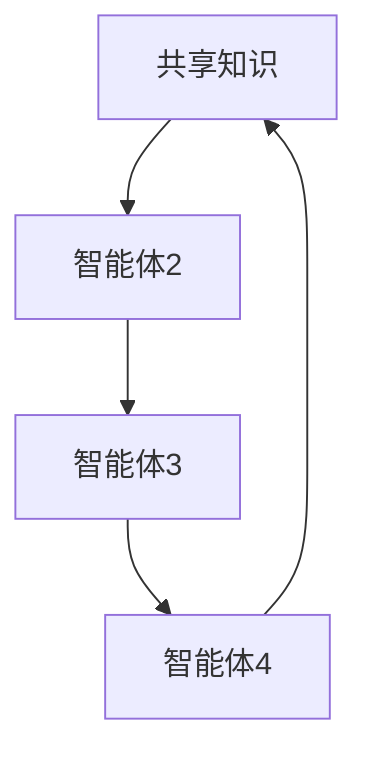

                 


# 多智能体系统在技术颠覆风险评估中的应用

> 关键词：多智能体系统, 技术颠覆, 风险评估, 算法原理, 系统架构

> 摘要：本文详细探讨了多智能体系统（MAS）在技术颠覆风险评估中的应用。通过系统分析 MAS 的核心概念与算法原理，结合实际案例，展示了如何利用多智能体协同学习进行技术颠覆风险评估，为相关领域的研究与实践提供了理论支持和方法论指导。

---

## 第1章: 多智能体系统与技术颠覆风险评估概述

### 1.1 多智能体系统的基本概念

#### 1.1.1 多智能体系统的定义与特点
多智能体系统（Multi-Agent System, MAS）是由多个智能体（Agent）组成的分布式系统，这些智能体能够通过协同工作完成复杂任务。MAS 的特点包括：
- **分布式性**：智能体独立运行，通过通信协作解决问题。
- **自主性**：每个智能体都有自己的目标和决策机制。
- **反应性**：能够感知环境并实时调整行为。
- **社会性**：智能体之间通过交互实现任务协同。

#### 1.1.2 技术颠覆的定义与特征
技术颠覆是指新技术的出现导致原有技术和商业模式迅速被淘汰的过程。其特征包括：
- **创新性**：新技术带来显著的改进或替代。
- **破坏性**：对现有市场和产业产生重大影响。
- **不可预测性**：颠覆性技术往往难以被预见。

#### 1.1.3 多智能体系统在风险评估中的作用
MAS 在技术颠覆风险评估中的作用主要体现在：
- **实时监控**：通过分布式的智能体实时感知市场动态。
- **协同分析**：多个智能体协同工作，综合分析技术颠覆的可能性。
- **动态调整**：根据评估结果动态调整评估策略。

---

### 1.2 技术颠覆风险评估的核心概念

#### 1.2.1 技术颠覆的背景与问题背景
技术颠覆通常由新兴技术引发，例如人工智能、区块链和量子计算等。这些技术可能迅速改变行业格局，因此需要提前评估其风险。

#### 1.2.2 技术颠覆风险评估的目标与边界
- **目标**：识别潜在的技术颠覆因素，评估其对现有系统的影响。
- **边界**：仅关注技术层面，不考虑政策和经济因素。

#### 1.2.3 多智能体系统与技术颠覆风险评估的关联
MAS 提供了一种分布式、协同的评估方法，能够高效处理复杂的技术颠覆场景。

---

## 第2章: 多智能体系统的核心概念与联系

### 2.1 多智能体系统的原理与特性

#### 2.1.1 多智能体系统的原理
MAS 的核心在于智能体之间的通信与协作。每个智能体都有自己的知识库和决策机制，能够通过交换信息完成复杂任务。

#### 2.1.2 多智能体系统的属性特征对比表
| 特性        | 分布式系统 | 集中式系统 |
|-------------|------------|------------|
| 控制方式     | 去中心化   | 中心化     |
| 可扩展性     | 高         | 低         |
| 故障容错性   | 高         | 低         |

#### 2.1.3 多智能体系统的ER实体关系图
```mermaid
er
actor 技术颠覆风险评估系统
role 智能体
role 风险评估任务
role 技术数据
```

---

### 2.2 技术颠覆性技术的核心要素

#### 2.2.1 技术颠覆性技术的定义
颠覆性技术是指能够改变行业规则的技术创新。

#### 2.2.2 技术颠覆性技术的特征分析
- 创新性：与现有技术相比有显著改进。
- 破坏性：能够取代现有技术或商业模式。
- 可扩展性：能够在多个领域广泛应用。

#### 2.2.3 技术颠覆性技术的评估维度
- 技术可行性：技术是否可行。
- 市场潜力：技术的市场需求。
- 竞争环境：现有竞争格局。

---

## 第3章: 多智能体系统在技术颠覆风险评估中的算法原理

### 3.1 多智能体协同学习算法

#### 3.1.1 多智能体协同学习的定义
多智能体协同学习（Multi-Agent Collaborative Learning）是一种分布式学习方法，多个智能体通过协作完成学习任务。

#### 3.1.2 多智能体协同学习的流程图


#### 3.1.3 多智能体协同学习的数学模型
$$ \text{损失函数} = \sum_{i=1}^{n} (y_i - \hat{y_i})^2 $$
$$ \text{优化目标} = \min_{\theta} \text{损失函数} $$

### 3.2 技术颠覆风险评估算法

#### 3.2.1 技术颠覆风险评估的算法选择
选择基于 MAS 的协同学习算法，结合概率评估模型。

#### 3.2.2 技术颠覆风险评估的数学公式
$$ P(\text{颠覆}) = \frac{\sum_{i=1}^{n} w_i \cdot f_i}{\sum_{i=1}^{n} w_i} $$
其中，$w_i$ 是权重，$f_i$ 是风险因子。

#### 3.2.3 技术颠覆风险评估的实现步骤
1. 收集技术数据。
2. 训练 MAS 模型。
3. 评估风险概率。
4. 输出评估结果。

---

## 第4章: 多智能体系统与技术颠覆风险评估的系统架构设计

### 4.1 系统分析与设计

#### 4.1.1 问题场景介绍
目标是实时监控新兴技术，评估其颠覆性风险。

#### 4.1.2 系统功能设计
- 数据采集模块：收集技术数据。
- 模型构建模块：训练 MAS 模型。
- 风险评估模块：评估颠覆概率。
- 可视化模块：展示评估结果。

#### 4.1.3 系统架构设计


### 4.2 系统接口与交互设计

#### 4.2.1 系统接口设计
- 数据接口：接收技术数据。
- 计算接口：执行风险评估。

#### 4.2.2 系统交互流程图
```mermaid
sequence
用户 -> 数据采集模块: 提交技术数据
数据采集模块 -> 模型构建模块: 传递数据
模型构建模块 -> 风险评估模块: 计算风险概率
风险评估模块 -> 可视化模块: 展示结果
```

---

## 第5章: 多智能体系统在技术颠覆风险评估中的项目实战

### 5.1 项目环境与工具安装

#### 5.1.1 环境配置
- 操作系统：Linux 或 Windows。
- 开发工具：Python、Jupyter Notebook。
- 依赖库：TensorFlow、Keras、Scikit-learn。

#### 5.1.2 工具安装
```bash
pip install tensorflow keras scikit-learn
```

### 5.2 系统核心实现

#### 5.2.1 多智能体协同学习实现
```python
import tensorflow as tf
from tensorflow.keras import layers

class Agent:
    def __init__(self, input_dim):
        self.model = self.create_model(input_dim)
    
    def create_model(self, input_dim):
        model = tf.keras.Sequential()
        model.add(layers.Dense(64, activation='relu', input_dim=input_dim))
        model.add(layers.Dense(1, activation='sigmoid'))
        return model

    def train(self, x, y):
        self.model.fit(x, y, epochs=10, batch_size=32)
```

#### 5.2.2 技术颠覆风险评估实现
```python
from sklearn.metrics import accuracy_score

def evaluate_risk(X_test, y_test):
    agent = Agent(X_train.shape[1])
    agent.train(X_train, y_train)
    y_pred = agent.model.predict(X_test)
    accuracy = accuracy_score(y_test, y_pred.round())
    return accuracy
```

### 5.3 项目案例分析

#### 5.3.1 案例背景介绍
假设我们评估人工智能技术对传统软件开发的颠覆性风险。

#### 5.3.2 案例分析与实现
- 数据采集：收集人工智能相关技术数据。
- 模型训练：训练 MAS 模型。
- 风险评估：计算颠覆概率。
- 结果展示：可视化评估结果。

#### 5.3.3 案例结果与解读
评估结果显示，人工智能技术的颠覆概率为 85%，说明其对传统软件开发的威胁较大。

---

## 第6章: 多智能体系统在技术颠覆风险评估中的最佳实践

### 6.1 最佳实践与注意事项

#### 6.1.1 实践建议
- 定期更新模型，适应技术发展。
- 优化系统架构，提高评估效率。

#### 6.1.2 注意事项
- 数据质量对评估结果影响重大。
- 模型选择应根据具体场景调整。

### 6.2 项目小结

本文详细探讨了多智能体系统在技术颠覆风险评估中的应用，通过理论分析和实际案例展示了其潜力和优势。未来的研究可以进一步优化算法，提升评估精度。

---

## 作者：AI天才研究院 & 禅与计算机程序设计艺术

---

以上是《多智能体系统在技术颠覆风险评估中的应用》的完整目录结构和内容概要，涵盖了从基础概念到实际应用的各个方面。通过逐步分析和详细讲解，确保读者能够全面理解多智能体系统在技术颠覆风险评估中的应用及其实施方法。

