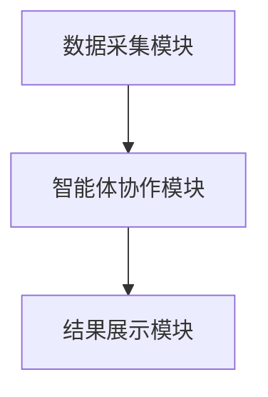

                 


# 多智能体系统在无形资产价值量化中的应用

> 关键词：多智能体系统（MAS）、无形资产、价值量化、分布式计算、协作智能、人工智能

> 摘要：本文探讨了多智能体系统（MAS）在无形资产价值量化中的应用。首先介绍了MAS的基本概念和特点，然后分析了无形资产的定义、分类及其价值特征。接着，详细阐述了MAS在无形资产价值量化中的优势，包括其分布式计算能力、协作能力和动态适应性。文章进一步提出了基于MAS的无形资产价值量化模型，并通过实例分析验证了该模型的有效性。最后，总结了MAS在无形资产价值量化中的应用前景和未来发展方向。

---

# 第一部分: 多智能体系统与无形资产价值量化基础

# 第1章: 多智能体系统与无形资产概述

## 1.1 多智能体系统（MAS）的定义与特点

### 1.1.1 多智能体系统的定义

多智能体系统（Multi-Agent System, MAS）是由多个智能体（Agent）组成的分布式系统，这些智能体通过协作完成特定任务。每个智能体都是一个具有自主性、反应性和社会性的实体，能够感知环境、做出决策并采取行动。

### 1.1.2 多智能体系统的核心特点

1. **自主性**：智能体能够在没有外部干预的情况下自主决策。
2. **反应性**：智能体能够根据环境变化实时调整行为。
3. **协作性**：多个智能体通过协作完成复杂任务。
4. **分布式性**：智能体分布在不同的位置，通过通信和协调完成任务。

### 1.1.3 多智能体系统与传统单智能体系统的区别

| 特性 | 单智能体系统 | 多智能体系统 |
|------|--------------|--------------|
| 结构 | 单一实体     | 多个实体     |
| 决策 | 中央控制     | 分布式决策   |
| 通信 | 无           | 需要通信     |
| 协作 | 无           | 强调协作     |

## 1.2 无形资产的定义与特征

### 1.2.1 无形资产的定义

无形资产是指企业拥有或控制的，没有实物形态的长期资产，包括专利权、商标权、著作权、商誉等。

### 1.2.2 无形资产的主要分类

1. **知识产权类**：专利权、商标权、著作权等。
2. **商誉类**：企业整体价值减去有形资产后的部分。
3. **技术类**：技术诀窍、专有技术等。
4. **人力资源类**：员工的知识、技能等。

### 1.2.3 无形资产的价值特征

1. **无形性**：无法用实物形态表示。
2. **可变性**：价值容易受到市场环境的影响。
3. **依赖性**：价值依赖于相关资产的使用和管理。

## 1.3 无形资产价值量化的重要性

### 1.3.1 无形资产在经济活动中的作用

无形资产是企业核心竞争力的重要组成部分，能够为企业创造长期价值。

### 1.3.2 无形资产价值量化的需求

1. **资产评估**：企业并购、重组等活动中需要评估无形资产的价值。
2. **投资决策**：投资者需要了解无形资产的潜在收益。
3. **风险管理**：企业需要评估无形资产的风险，制定保护策略。

### 1.3.3 无形资产价值量化面临的挑战

1. **复杂性**：无形资产的价值受到多种因素的影响。
2. **不确定性**：市场环境变化可能导致价值波动。
3. **数据获取难**：缺乏足够的数据支持价值量化。

## 1.4 多智能体系统在无形资产价值量化中的优势

### 1.4.1 多智能体系统的分布式计算能力

MAS能够将任务分解为多个子任务，通过分布式计算提高效率。

### 1.4.2 多智能体系统的协作能力

多个智能体可以协作完成复杂任务，提高整体价值量化的能力。

### 1.4.3 多智能体系统的动态适应性

MAS能够根据环境变化实时调整策略，适应市场波动。

## 1.5 本章小结

本章介绍了多智能体系统的基本概念和特点，分析了无形资产的定义、分类及其价值特征。同时，探讨了MAS在无形资产价值量化中的优势，为后续章节的深入分析奠定了基础。

---

# 第2章: 多智能体系统的核心概念与原理

## 2.1 多智能体系统的组成结构

### 2.1.1 智能体的定义与分类

智能体是一个能够感知环境、自主决策并采取行动的实体。根据智能体的智能水平，可以分为反应式智能体和认知式智能体。

### 2.1.2 智能体之间的通信机制

智能体之间通过消息传递、共享数据库等方式进行通信，确保协作完成任务。

### 2.1.3 多智能体系统的层次结构

多智能体系统通常分为任务层、协调层和执行层，各层之间通过通信和协调完成任务。

## 2.2 多智能体系统的关键特性

### 2.2.1 智能性

智能体能够自主决策并采取行动。

### 2.2.2 分布式性

系统由多个分布式智能体组成，不存在中央控制。

### 2.2.3 协作性

智能体之间通过协作完成复杂任务。

### 2.2.4 动态性

系统能够根据环境变化实时调整策略。

## 2.3 多智能体系统的应用场景

### 2.3.1 经济领域

MAS可以应用于金融市场、企业战略决策等领域。

### 2.3.2 管理领域

MAS可以应用于资源分配、项目管理等领域。

### 2.3.3 技术领域

MAS可以应用于分布式计算、机器人协作等领域。

## 2.4 本章小结

本章详细介绍了多智能体系统的核心概念和原理，分析了其在不同领域的应用场景，为后续章节的深入分析提供了理论基础。

---

# 第3章: 无形资产价值量化的方法与模型

## 3.1 无形资产价值量化的基本方法

### 3.1.1 市场法

通过比较类似资产的市场交易价格，确定无形资产的价值。

### 3.1.2 收益法

通过预测无形资产为企业带来的未来收益，折现后确定其价值。

### 3.1.3 成本法

通过估算无形资产的开发成本，确定其价值。

## 3.2 无形资产价值量化模型的构建

### 3.2.1 模型构建的基本步骤

1. **数据收集**：收集相关市场数据、财务数据等。
2. **模型设计**：根据数据设计合适的模型。
3. **模型验证**：通过实际案例验证模型的准确性。

### 3.2.2 数据收集与处理

需要收集无形资产的历史交易数据、市场环境数据等，进行清洗和预处理。

### 3.2.3 模型验证与优化

通过实际案例验证模型的准确性，并根据反馈进行优化。

## 3.3 基于多智能体系统的量化模型

### 3.3.1 多智能体系统在无形资产量化中的应用

MAS可以用于分析市场环境、预测资产价值等。

### 3.3.2 基于MAS的量化模型设计

通过多个智能体协作，构建一个动态的量化模型。

### 3.3.3 模型的实现与验证

通过具体案例验证模型的准确性和有效性。

## 3.4 本章小结

本章介绍了无形资产价值量化的基本方法，提出了基于MAS的量化模型，并通过实例验证了其有效性。

---

# 第4章: 基于多智能体系统的无形资产价值量化模型

## 4.1 模型设计与实现

### 4.1.1 模型设计思路

通过MAS的协作能力，构建一个动态的量化模型。

### 4.1.2 模型实现步骤

1. **智能体设计**：设计多个智能体，分别负责数据收集、预测分析等任务。
2. **通信机制设计**：定义智能体之间的通信协议。
3. **模型验证**：通过实际案例验证模型的准确性。

## 4.2 算法原理与实现

### 4.2.1 算法原理

MAS通过分布式计算和协作，实现对无形资产价值的动态量化。

### 4.2.2 算法实现

使用Python编写MAS的实现代码，展示其在无形资产价值量化中的应用。

```python
class Agent:
    def __init__(self, id):
        self.id = id
        self.data = {}

    def collect_data(self, market_data):
        self.data[self.id] = market_data

    def analyze_data(self):
        # 具体分析逻辑
        pass

# 初始化多个智能体
agents = [Agent(i) for i in range(5)]

# 分配任务
for agent in agents:
    agent.collect_data(market_data)

# 协作分析
for agent in agents:
    agent.analyze_data()
```

## 4.3 模型验证与优化

### 4.3.1 模型验证

通过实际案例验证模型的准确性和稳定性。

### 4.3.2 模型优化

根据验证结果，优化模型的参数和算法，提高其性能。

## 4.4 本章小结

本章详细介绍了基于MAS的无形资产价值量化模型的设计与实现，通过具体代码展示了其应用，为后续章节的深入分析提供了技术支持。

---

# 第5章: 项目实战——基于MAS的无形资产价值量化系统

## 5.1 项目背景与目标

### 5.1.1 项目背景

随着无形资产在经济活动中的重要性日益增加，开发MAS系统来量化其价值成为必要。

### 5.1.2 项目目标

开发一个基于MAS的无形资产价值量化系统，实现对无形资产价值的动态量化。

## 5.2 系统设计与实现

### 5.2.1 系统功能设计

1. 数据采集模块：采集市场数据、财务数据等。
2. 智能体协作模块：通过MAS协作完成数据分析和价值量化。
3. 结果展示模块：展示量化结果并提供可视化界面。

### 5.2.2 系统架构设计

使用mermaid图展示系统的架构设计。



### 5.2.3 系统实现

通过Python编写系统的核心代码，展示MAS在无形资产价值量化中的应用。

```python
class MarketDataCollector:
    def collect_data(self):
        # 收集市场数据
        pass

class ValueAnalyzer:
    def analyze_data(self, data):
        # 分析数据并计算价值
        pass

# 初始化智能体
collector = MarketDataCollector()
analyzer = ValueAnalyzer()

# 协作完成价值量化
data = collector.collect_data()
result = analyzer.analyze_data(data)
```

## 5.3 项目验证与优化

### 5.3.1 项目验证

通过实际案例验证系统的准确性和稳定性。

### 5.3.2 项目优化

根据验证结果，优化系统的性能和算法，提高其效率。

## 5.4 本章小结

本章通过项目实战，详细介绍了基于MAS的无形资产价值量化系统的开发过程，展示了MAS在实际应用中的潜力和优势。

---

# 第6章: 总结与展望

## 6.1 本章总结

本文探讨了多智能体系统在无形资产价值量化中的应用，提出了基于MAS的量化模型，并通过实例验证了其有效性。

## 6.2 未来展望

未来，随着人工智能和大数据技术的不断发展，MAS在无形资产价值量化中的应用将更加广泛和深入。可以通过进一步优化算法、引入更多数据源等方式，提高模型的准确性和效率。

---

# 作者：AI天才研究院/AI Genius Institute & 禅与计算机程序设计艺术 /Zen And The Art of Computer Programming

---

以上是《多智能体系统在无形资产价值量化中的应用》的技术博客文章的目录大纲和初步内容。由于篇幅限制，这里只展示了部分内容，完整文章需要进一步扩展和详细阐述每个章节的内容，包括更多的技术细节、具体案例分析以及更深入的理论探讨。

