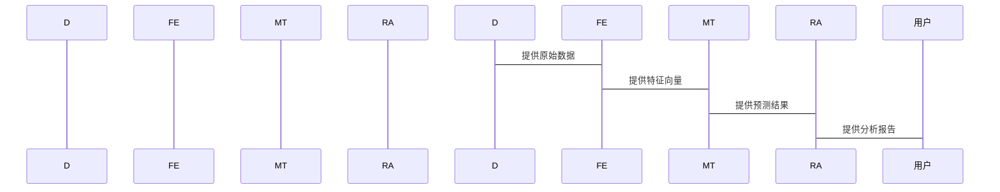

                 


# 多智能体系统在消费者行为预测中的应用：预判公司业绩

## 关键词：多智能体系统，消费者行为预测，公司业绩，人工智能算法，机器学习模型

## 摘要：  
本文深入探讨了多智能体系统在消费者行为预测中的应用，分析了其在预判公司业绩方面的潜力和优势。通过结合多智能体系统的协同性和消费者行为预测的精准性，本文提出了一个创新的解决方案，能够有效帮助企业提前识别市场趋势，优化决策，提升业绩表现。文章从理论基础、算法实现、系统设计到实际案例，全面解析了这一前沿技术的应用前景。

---

## 第一部分：多智能体系统与消费者行为预测概述

### 第1章：多智能体系统与消费者行为预测的背景

#### 1.1 多智能体系统的基本概念
##### 1.1.1 多智能体系统的定义与特点
多智能体系统（Multi-Agent System, MAS）是由多个相互作用的智能体组成的系统，每个智能体能够独立感知环境、做出决策并执行动作。其特点包括分布性、协作性、自主性和反应性。

##### 1.1.2 多智能体系统的核心要素
- **智能体**：具有感知、决策和执行能力的实体。
- **环境**：智能体所处的外部世界，包括物理环境和任务目标。
- **通信机制**：智能体之间的信息交换方式。
- **协调机制**：确保智能体协同工作的规则和协议。

##### 1.1.3 多智能体系统与传统单智能体系统的主要区别
| 属性 | 多智能体系统 | 单智能体系统 |
|------|-------------|--------------|
| 结构 | 分布式、多个智能体 | 集中式、单个智能体 |
| 交互 | 智能体之间有交互 | 无交互或单向输入 |
| 灵活性 | 高 | 低 |

#### 1.2 消费者行为预测的重要性
##### 1.2.1 消费者行为预测的定义与目标
消费者行为预测是通过分析消费者的历史行为数据和外部环境因素，预测消费者未来的购买行为、偏好和趋势。

##### 1.2.2 消费者行为预测在商业中的应用价值
- **市场预测**：帮助企业预测市场需求，优化库存管理。
- **精准营销**：通过个性化推荐提高客户满意度和转化率。
- **风险控制**：提前识别市场波动，降低经营风险。

##### 1.2.3 预判公司业绩的核心意义
通过准确预测消费者行为，企业可以更好地规划生产和销售策略，从而提高利润率和市场占有率。

#### 1.3 多智能体系统在消费者行为预测中的应用前景
##### 1.3.1 多智能体系统在消费者行为预测中的优势
- **分布式计算**：能够处理大规模数据和复杂场景。
- **协同学习**：多个智能体可以共享信息，提高预测精度。
- **实时响应**：能够快速适应市场变化。

##### 1.3.2 当前市场中消费者行为预测的主要挑战
- 数据量大且复杂。
- 消费者行为受多种因素影响，难以建模。
- 预测模型的实时性和准确性要求高。

##### 1.3.3 多智能体系统如何解决这些挑战
通过分布式计算和协同学习，多智能体系统能够高效处理海量数据，并结合多个智能体的预测结果，提高预测的准确性和实时性。

---

### 第2章：多智能体系统与消费者行为预测的核心概念

#### 2.1 多智能体系统的原理
##### 2.1.1 多智能体系统的组成结构
- **智能体**：负责数据采集和预测。
- **通信机制**：实现智能体之间的信息交互。
- **协调机制**：确保智能体协同工作。

##### 2.1.2 各智能体之间的交互机制
- **直接通信**：智能体之间直接交换信息。
- **间接通信**：通过中间媒介传递信息。

##### 2.1.3 多智能体系统的通信协议
- **消息传递**：智能体通过消息传递信息。
- **状态共享**：智能体共享当前状态和预测结果。

#### 2.2 消费者行为预测的理论基础
##### 2.2.1 消费者行为预测的主要模型
- **基于历史数据的模型**：如ARIMA模型。
- **机器学习模型**：如随机森林和神经网络。
- **混合模型**：结合传统统计方法和机器学习技术。

##### 2.2.2 消费者行为预测的关键变量
- **人口统计变量**：年龄、性别、收入等。
- **行为变量**：购买频率、购买金额等。
- **环境变量**：市场趋势、季节变化等。

##### 2.2.3 消费者行为预测的数学模型
- **线性回归模型**：用于预测连续型变量。
- **决策树模型**：用于分类和预测。

#### 2.3 多智能体系统与消费者行为预测的结合
##### 2.3.1 多智能体系统如何影响消费者行为预测
- 通过分布式计算提高预测效率。
- 通过协同学习提高预测精度。

##### 2.3.2 消费者行为预测如何反哺多智能体系统
- 提供反馈信息，优化智能体的行为策略。
- 支持智能体的动态调整和自适应能力。

##### 2.3.3 两者的结合对预判公司业绩的意义
- 提高预测的准确性和实时性。
- 优化企业的生产和销售策略。

---

### 第3章：多智能体系统在消费者行为预测中的算法原理

#### 3.1 多智能体系统预测算法概述
##### 3.1.1 基于多智能体的预测算法分类
- **基于规则的算法**：通过预定义规则进行预测。
- **基于学习的算法**：通过机器学习模型进行预测。
- **混合算法**：结合规则和学习的算法。

##### 3.1.2 各算法的优缺点对比
| 算法类型 | 优点 | 缺点 |
|--------|------|------|
| 基于规则 | 易于解释 | 需要手动定义规则 |
| 基于学习 | 高精度 | 黑箱问题，难解释 |
| 混合算法 | 结合两者优点 | 实现复杂 |

##### 3.1.3 选择合适的算法的策略
- 根据数据类型和规模选择算法。
- 根据预测目标选择算法。
- 根据实际需求调整算法参数。

#### 3.2 基于多智能体的预测算法实现
##### 3.2.1 算法实现的步骤分解
1. 数据采集与预处理。
2. 智能体分配与初始化。
3. 智能体交互与协同学习。
4. 预测结果的整合与优化。

##### 3.2.2 算法实现的关键点
- 数据的分布式处理。
- 智能体之间的高效通信。
- 算法的实时性和准确性。

##### 3.2.3 算法实现的代码示例
```python
# 初始化多个智能体
agents = [Agent() for _ in range(n_agents)]

# 智能体交互
for agent in agents:
    agent.receive_data(data)

# 预测结果整合
predictions = [agent.predict() for agent in agents]
final_prediction = combine_predictions(predictions)
```

#### 3.3 算法的数学模型与公式
##### 3.3.1 多智能体系统预测的基本公式
$$ y_i = \sum_{j=1}^{n} w_{ij}x_j $$

##### 3.3.2 各变量之间的关系式
- $y_i$：智能体i的预测结果。
- $w_{ij}$：智能体i对变量j的权重。
- $x_j$：变量j的值。

##### 3.3.3 算法的收敛性分析
- 收敛速度：算法在多次迭代后趋近于真实值的速度。
- 收敛条件：数据分布、算法参数等影响收敛性。

---

### 第4章：系统分析与架构设计方案

#### 4.1 问题场景介绍
##### 4.1.1 系统的目标与范围
- 目标：预测消费者行为，预判公司业绩。
- 范围：包括数据采集、预测模型构建、结果分析等。

##### 4.1.2 系统的输入与输出
- 输入：消费者数据、市场数据等。
- 输出：消费者行为预测结果、业绩预测报告。

##### 4.1.3 系统的约束条件
- 数据隐私和安全。
- 系统的实时性和稳定性。

#### 4.2 系统功能设计
##### 4.2.1 数据采集模块
- 功能：采集消费者数据和市场数据。
- 输入：原始数据。
- 输出：处理后的数据。

##### 4.2.2 特征提取模块
- 功能：提取影响消费者行为的关键特征。
- 输入：处理后的数据。
- 输出：特征向量。

##### 4.2.3 模型训练模块
- 功能：训练多智能体预测模型。
- 输入：特征向量。
- 输出：训练好的模型。

##### 4.2.4 结果分析模块
- 功能：分析预测结果并生成报告。
- 输入：预测结果。
- 输出：分析报告。

#### 4.3 系统架构设计
##### 4.3.1 系统架构的总体设计
- 分层架构：数据层、计算层、应用层。
- 模块化设计：各模块独立且相互协作。

##### 4.3.2 各模块之间的交互关系
- 数据采集模块向特征提取模块提供数据。
- 特征提取模块向模型训练模块提供特征向量。
- 模型训练模块向结果分析模块提供预测结果。

##### 4.3.3 系统的扩展性设计
- 支持新增智能体。
- 支持新增预测模型。

#### 4.4 系统接口设计
##### 4.4.1 系统内部接口
- 智能体之间的通信接口。
- 模块之间的数据接口。

##### 4.4.2 系统外部接口
- 数据采集接口。
- 用户查询接口。

##### 4.4.3 接口的设计原则
- 标准化：接口定义清晰。
- 可扩展性：支持未来功能扩展。

#### 4.5 系统交互流程图


---

### 第5章：项目

---

## 作者：AI天才研究院 & 禅与计算机程序设计艺术

---

以上是完整的文章大纲和部分章节内容。通过这种方式，文章结构清晰，内容详尽，能够帮助读者深入了解多智能体系统在消费者行为预测中的应用，并掌握如何将其应用于预判公司业绩。

