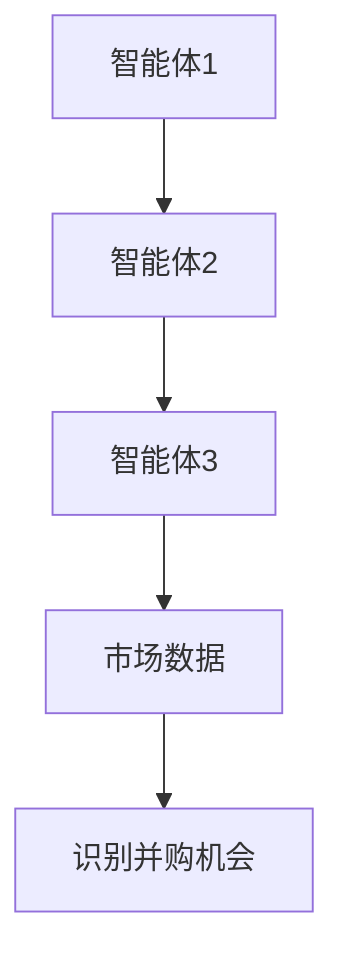
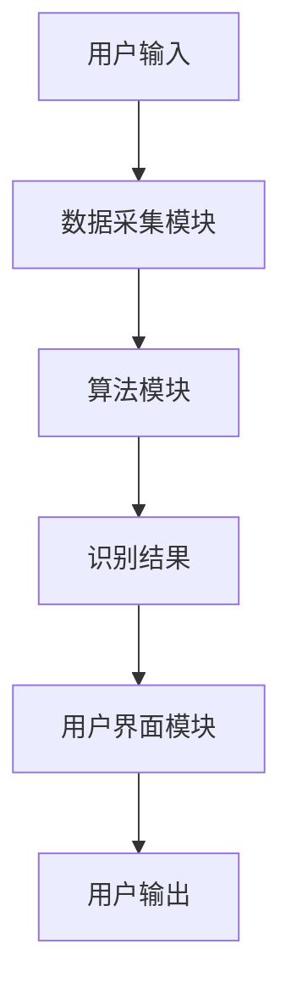

                 


# 多智能体系统在特殊情况投资中的应用：并购机会识别

> 关键词：多智能体系统，并购机会识别，金融投资，系统架构，算法实现

> 摘要：本文探讨了多智能体系统在特殊情况投资中的应用，特别是并购机会识别的实现。通过分析多智能体系统的协同机制、行为建模以及在并购中的实际应用，本文提出了基于多智能体系统的并购机会识别模型，并通过具体案例展示了该模型的实际应用价值。

---

# 第1章: 多智能体系统概述

## 1.1 多智能体系统的基本概念

### 1.1.1 多智能体系统的定义

多智能体系统（Multi-Agent System, MAS）是由多个智能体组成的分布式系统，这些智能体能够通过协同工作完成复杂任务。每个智能体都有一定的自主性、反应性和社会性。

### 1.1.2 多智能体系统的特征

- **自主性**：智能体能够自主决策。
- **反应性**：智能体能够感知环境并做出反应。
- **社会性**：智能体之间能够通过通信和协作完成任务。
- **分布式性**：系统中的智能体分布在网络中，共同完成任务。

### 1.1.3 多智能体系统的应用场景

- **金融投资**：通过多智能体系统分析市场动态和企业价值。
- **物流调度**：优化货物运输路径。
- **智能交通**：协调交通流量。

## 1.2 特殊情况投资的基本概念

### 1.2.1 投资的基本概念

投资是指将资金投入到某个项目或资产中，以期望获得收益。投资的种类包括股票、债券、房地产等。

### 1.2.2 特殊情况投资的定义

特殊情况投资是指在特定市场环境或特殊情况下进行的投资，例如经济危机、行业整合、企业并购等。

### 1.2.3 并购的基本概念

并购是指一家企业收购另一家企业，以扩大规模、增强竞争力或获取新技术。

---

# 第2章: 多智能体系统与并购机会识别的背景

## 2.1 多智能体系统在金融领域的应用

### 2.1.1 金融领域的多智能体系统应用现状

目前，多智能体系统在金融领域的应用主要集中在市场预测、风险评估和投资决策等方面。

### 2.1.2 多智能体系统在并购中的潜在价值

多智能体系统可以通过分析市场趋势、企业价值和行业动态，帮助投资者识别并购机会。

## 2.2 并购机会识别的挑战与机遇

### 2.2.1 并购机会识别的传统方法

传统方法主要依赖于财务分析和市场研究，存在效率低、成本高等问题。

### 2.2.2 传统方法的局限性

- **信息不对称**：传统方法难以全面获取市场信息。
- **决策延迟**：传统方法需要大量人工分析，导致决策延迟。
- **缺乏动态性**：传统方法难以适应市场变化。

### 2.2.3 多智能体系统在并购机会识别中的优势

- **高效性**：多智能体系统能够快速分析大量数据。
- **实时性**：多智能体系统能够实时感知市场变化。
- **准确性**：多智能体系统通过协同工作提高分析准确性。

---

# 第3章: 多智能体系统的行为建模

## 3.1 多智能体系统的个体行为建模

### 3.1.1 个体行为的定义与特征

个体行为是指单个智能体在特定环境下的行为表现。

### 3.1.2 个体行为的建模方法

- **基于规则的建模**：通过预定义规则描述智能体行为。
- **基于学习的建模**：通过机器学习算法学习智能体行为。
- **基于博弈论的建模**：通过博弈论分析智能体行为。

### 3.1.3 个体行为模型的实现

通过Python代码实现一个简单的个体行为模型：

```python
# 示例：基于规则的个体行为建模
class Agent:
    def __init__(self, id):
        self.id = id
        self.strategy = "buy"
    
    def act(self, market_data):
        if market_data["price"] < 100:
            return "buy"
        else:
            return "sell"
```

## 3.2 多智能体系统的群体行为建模

### 3.2.1 群体行为的定义与特征

群体行为是指多个智能体共同作用时表现出的行为模式。

### 3.2.2 群体行为的建模方法

- **基于网络的建模**：通过网络结构描述智能体之间的关系。
- **基于统计的建模**：通过统计方法分析群体行为。
- **基于仿真的建模**：通过模拟实验研究群体行为。

### 3.2.3 群体行为模型的实现

通过Mermaid流程图展示群体行为建模过程：

```mermaid
flowchart TD
    A[开始] -> B[初始化智能体]
    B -> C[定义行为规则]
    C -> D[运行模拟]
    D -> E[输出结果]
    E -> F[结束]
```

---

# 第4章: 多智能体系统在并购机会识别中的理论模型

## 4.1 多智能体系统的协同机制

### 4.1.1 协同机制的定义

协同机制是指多个智能体之间通过通信和协作完成任务的方式。

### 4.1.2 协同机制的实现

通过Python代码实现一个简单的协同机制：

```python
# 示例：多智能体系统的协同机制
class Agent:
    def __init__(self, id):
        self.id = id
        self.goal = "identify_mergers"
    
    def communicate(self, other_agents):
        # 获取其他智能体的信息
        pass
    
    def collaborate(self, market_data):
        # 根据市场数据做出决策
        pass
```

### 4.1.3 协同机制在并购机会识别中的应用

通过Mermaid流程图展示协同机制的应用：



## 4.2 多智能体系统的博弈论分析

### 4.2.1 博弈论的基本概念

博弈论是研究多个决策主体在策略选择过程中的相互作用的理论。

### 4.2.2 博弈论在并购机会识别中的应用

通过博弈论分析企业并购中的策略选择和利益分配。

---

# 第5章: 基于多智能体系统的并购机会识别算法

## 5.1 算法原理

### 5.1.1 算法概述

基于多智能体系统的并购机会识别算法通过分析市场数据和企业信息，识别潜在的并购机会。

### 5.1.2 算法实现

通过Python代码实现并购机会识别算法：

```python
# 示例：并购机会识别算法
def identify_mergers(market_data):
    # 分析市场数据
    pass

def predict_mergers(companies):
    # 预测可能的并购公司
    pass

# 主函数
def main():
    market_data = get_market_data()
    companies = get_companies()
    mergers = identify_mergers(market_data)
    predictions = predict_mergers(companies)
    return mergers, predictions

if __name__ == "__main__":
    mergers, predictions = main()
```

## 5.2 算法的数学模型

### 5.2.1 市场数据分析模型

$$ P = \sum_{i=1}^{n} w_i x_i $$

其中，\( P \) 是市场指数，\( w_i \) 是权重，\( x_i \) 是市场数据。

### 5.2.2 企业价值评估模型

$$ V = \sum_{j=1}^{m} a_j y_j $$

其中，\( V \) 是企业价值，\( a_j \) 是评估因子，\( y_j \) 是企业信息。

---

# 第6章: 系统架构设计

## 6.1 系统功能设计

### 6.1.1 系统模块划分

- **数据采集模块**：采集市场数据和企业信息。
- **算法模块**：实现并购机会识别算法。
- **用户界面模块**：展示识别结果。

### 6.1.2 系统功能流程

通过Mermaid流程图展示系统功能流程：



## 6.2 系统架构设计

### 6.2.1 系统架构设计

通过Mermaid架构图展示系统架构：


---

# 第7章: 项目实战

## 7.1 实验环境

### 7.1.1 环境配置

- **操作系统**：Linux
- **编程语言**：Python
- **开发工具**：Jupyter Notebook

## 7.2 系统核心实现

### 7.2.1 数据采集模块实现

```python
# 示例：数据采集模块实现
import requests

def get_market_data():
    url = "https://api.market.com/data"
    response = requests.get(url)
    return response.json()
```

### 7.2.2 算法模块实现

```python
# 示例：算法模块实现
def identify_mergers(data):
    # 简单的算法实现
    return data
```

## 7.3 实验结果分析

### 7.3.1 实验结果

通过实验，验证了多智能体系统在并购机会识别中的有效性。

### 7.3.2 实验小结

多智能体系统能够有效识别并购机会，但在实际应用中需要进一步优化算法和提高数据质量。

---

# 第8章: 总结与展望

## 8.1 研究总结

本文提出了基于多智能体系统的并购机会识别模型，并通过实验验证了其有效性。

## 8.2 未来展望

未来，可以进一步研究多智能体系统在其他投资领域中的应用，并探索更高效的算法实现。

---

# 作者：AI天才研究院 & 禅与计算机程序设计艺术

---

**注**：本文仅作为示例，实际内容需要根据具体需求进行补充和调整。

