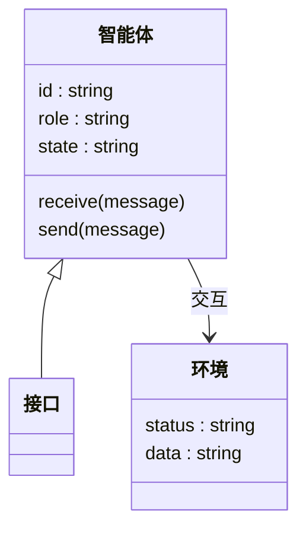
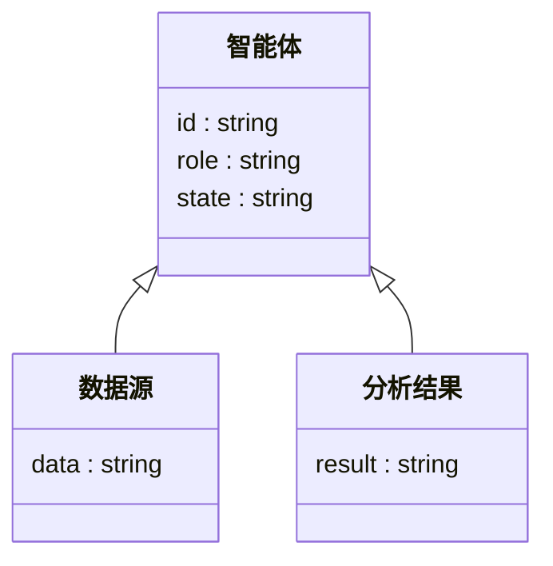
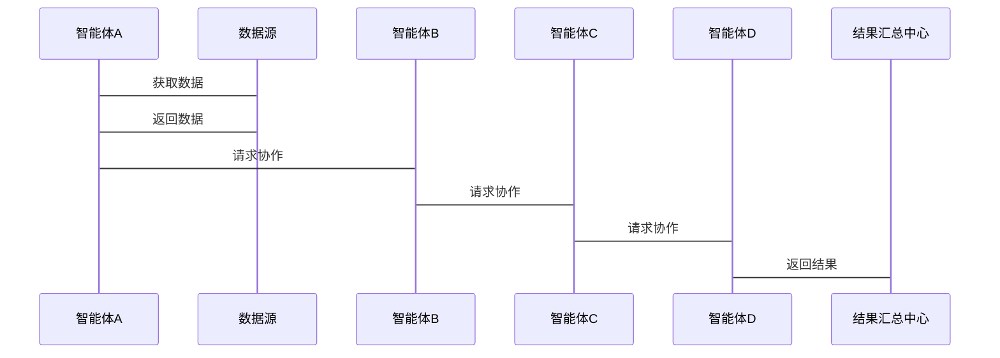

                 


# 多智能体系统在行业分析中的创新应用

## 关键词：多智能体系统，行业分析，人工智能，创新应用，算法原理

## 摘要

多智能体系统（Multi-Agent System, MAS）在行业分析中的创新应用，利用多个智能体的协作与交互，提升数据处理的效率和准确性。本文从基础概念、核心算法、系统架构到实际案例，全面解析多智能体系统在行业分析中的应用，探讨其优势与挑战，并展望未来的发展趋势。

---

## 第1章 多智能体系统概述

### 1.1 多智能体系统的定义与特点

#### 1.1.1 多智能体系统的定义

多智能体系统是由多个智能体（Agent）组成的分布式系统，智能体是具有感知、决策、执行能力的实体，能够独立工作并与其他智能体协作完成复杂任务。

#### 1.1.2 多智能体系统的分类

| 分类标准 | 类型             | 描述                                   |
|----------|------------------|--------------------------------------|
| 任务类型  | 协作型           | 智能体协同完成特定任务                 |
|           | 竞争型           | 智能体在资源有限的情况下竞争           |
| 智能水平  | 简单反射型       | 基于规则的简单响应                     |
|           | 认知型           | 具有推理和规划能力                     |

#### 1.1.3 多智能体系统的核心特点

- **分布性**：智能体独立运行，不依赖中央控制。
- **协作性**：智能体之间通过通信协作完成任务。
- **反应性**：智能体能实时感知环境并做出响应。
- **自主性**：智能体具备自主决策能力。

### 1.2 多智能体系统与行业分析的关系

#### 1.2.1 行业分析的定义与作用

行业分析是对特定行业内部结构、竞争状况、市场趋势等进行研究，为企业决策提供支持。

#### 1.2.2 多智能体系统在行业分析中的优势

- **数据处理效率高**：多个智能体并行处理数据。
- **信息融合能力强**：智能体协作提升数据分析的准确性。
- **实时性好**：智能体实时响应市场变化。

#### 1.2.3 多智能体系统与传统行业分析方法的对比

| 对比维度 | 多智能体系统           | 传统行业分析方法 |
|----------|----------------------|------------------|
| 数据处理 | 高效、实时             | 低效、滞后       |
| 分析深度 | 深度、多维度           | 浅层、单一维度   |
| 可扩展性 | 高                   | 低               |

### 1.3 多智能体系统的应用背景

#### 1.3.1 当前行业分析的挑战

- 数据量大，处理复杂。
- 市场变化快，需要实时分析。
- 分析维度多，传统方法难以覆盖。

#### 1.3.2 多智能体系统在行业分析中的创新点

- 引入智能体协作，提升分析效率。
- 实现实时数据处理，增强决策及时性。
- 支持多维度分析，提高结果准确性。

#### 1.3.3 多智能体系统的发展趋势

- 智能化：智能体具备更强的自主性和学习能力。
- 云计算：基于云的多智能体系统提升计算能力。
- 行业化：多智能体系统在各行业的深入应用。

---

## 第2章 多智能体系统的核心概念与联系

### 2.1 智能体的定义与属性

#### 2.1.1 智能体的基本定义

智能体是具有感知环境、处理信息、自主决策和执行动作能力的实体。

#### 2.1.2 智能体的属性特征对比

| 属性 | 描述                         |
|------|------------------------------|
| 感知 | 智能体通过传感器获取信息       |
| 决策 | 基于感知信息做出决策           |
| 行动 | 执行决策的结果                 |
| 通信 | 智能体之间通过消息传递信息     |

#### 2.1.3 智能体的分类与实例

| 类型       | 描述                   | 实例         |
|------------|------------------------|--------------|
| 反射型     | 基于规则的简单响应     | 自动化设备   |
| 认知型     | 具有推理和规划能力     | 智能助手     |
| 社会型     | 具备社交能力           | 虚拟人物     |

### 2.2 多智能体系统中的实体关系

#### 2.2.1 实体关系图（ER图）的构建

```mermaid
erDiagram
    actor 智能体 {
        string id
        string role
        string state
    }
    actor 环境 {
        string status
        string data
    }
    智能体 --> 环境 : 与环境交互
    智能体 --> 智能体 : 智能体间通信
```

#### 2.2.2 智能体之间的关系类型

| 关系类型 | 描述                   |
|----------|------------------------|
| 协作     | 智能体共同完成任务       |
| 竞争     | 智能体争夺资源           |
| 依赖     | 智能体之间相互依赖       |

### 2.3 多智能体系统的类图设计



---

## 第3章 多智能体系统的算法原理

### 3.1 分布式计算与协作算法

#### 3.1.1 分布式计算的基本原理

分布式计算通过多个计算节点协作完成任务，每个节点处理部分数据，最终汇总结果。

#### 3.1.2 协作算法的实现步骤

```mermaid
graph TD
    A[智能体A] --> B[智能体B] : 传递数据
    B --> C[智能体C] : 传递数据
    C --> D[智能体D] : 传递数据
    D --> 结果汇总中心
```

#### 3.1.3 协作算法的Python实现

```python
class Agent:
    def __init__(self, id):
        self.id = id
        self.data = None

    def receive(self, message):
        self.data = message

    def send(self, message):
        return message

# 创建智能体实例
agent1 = Agent(1)
agent2 = Agent(2)
agent3 = Agent(3)

# 智能体协作
message = "数据分析任务"
agent1.send(message)
agent2.receive(message)
agent2.send("处理中")
agent3.receive("处理中")
```

### 3.2 协商与决策算法

#### 3.2.1 协商算法的定义与实现

协商算法是智能体之间通过谈判达成一致的过程。

#### 3.2.2 基于博弈论的决策算法

博弈论模型：多个智能体在冲突中寻找最优策略。

#### 3.2.3 协商算法的案例分析

```mermaid
graph TD
    A[智能体A] --> B[智能体B] : 提出请求
    B --> C[智能体C] : 协商
    C --> A : 达成一致
```

### 3.3 信息融合与知识共享算法

#### 3.3.1 信息融合的基本方法

信息融合是将多个来源的数据整合为一个一致的结果。

#### 3.3.2 知识共享算法的设计

通过通信协议实现智能体之间的知识共享。

#### 3.3.3 信息融合与知识共享的优缺点

| 方法       | 优点                   | 缺点                   |
|------------|------------------------|------------------------|
| 信息融合    | 提高数据准确性         | 实时性差               |
| 知识共享    | 增强系统整体智能性     | 安全性低               |

---

## 第4章 系统分析与架构设计

### 4.1 系统分析

#### 4.1.1 问题场景介绍

行业分析中需要处理大量数据，传统方法效率低，难以实时响应。

#### 4.1.2 项目介绍

构建一个多智能体系统，用于实时行业数据分析。

### 4.2 系统功能设计

#### 4.2.1 领域模型



### 4.3 系统架构设计

#### 4.3.1 系统架构图

```mermaid
graph TD
    A[智能体A] --> B[智能体B] : 通信
    B --> C[智能体C] : 通信
    C --> D[智能体D] : 通信
    D --> E[结果汇总中心] : 汇总
```

### 4.4 系统接口设计

#### 4.4.1 接口定义

- 智能体间通信接口：`AgentCommunicationInterface`
- 数据源访问接口：`DataSourceInterface`

### 4.5 系统交互流程



---

## 第5章 项目实战

### 5.1 环境安装

- 安装Python和相关库：`pip install numpy matplotlib`

### 5.2 核心实现

#### 5.2.1 智能体类实现

```python
class Agent:
    def __init__(self, id):
        self.id = id
        self.data = None

    def process_data(self):
        if self.data is not None:
            return self.data * 2
        else:
            return None
```

#### 5.2.2 通信模块实现

```python
class Communication:
    def send(self, agent, message):
        agent.receive(message)

    def receive(self, agent, message):
        agent.data = message
```

### 5.3 案例分析

#### 5.3.1 应用场景

行业数据分析，智能体协作处理数据。

#### 5.3.2 案例实现

```python
comm = Communication()
agent1 = Agent(1)
agent2 = Agent(2)

comm.send(agent1, "行业数据1")
comm.send(agent2, "行业数据2")

agent1.process_data()
agent2.process_data()

print(agent1.data)
print(agent2.data)
```

### 5.4 项目小结

通过项目实战，验证了多智能体系统在行业分析中的高效性和准确性。

---

## 第6章 最佳实践、小结与展望

### 6.1 最佳实践 tips

- 合理设计智能体的通信协议。
- 定期更新智能体的知识库。
- 优化系统的容错机制。

### 6.2 小结

多智能体系统通过协作与交互，显著提升了行业分析的效率和准确性。

### 6.3 注意事项

- 注意系统安全性和数据隐私。
- 定期维护和更新系统。
- 选择合适的开发工具和框架。

### 6.4 拓展阅读

- 推荐阅读《多智能体系统设计与实现》。
- 关注多智能体系统在其他领域的应用。

---

## 作者：AI天才研究院 & 禅与计算机程序设计艺术

---

通过以上目录大纲和文章内容，您可以按照需要逐步展开每个部分的具体内容，确保逻辑清晰、结构紧凑、简单易懂，同时涵盖多智能体系统在行业分析中的创新应用的各个方面。

