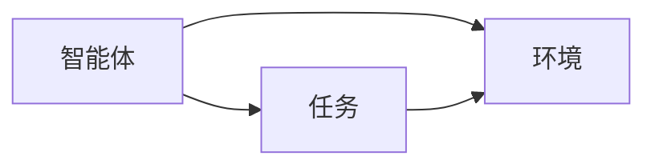
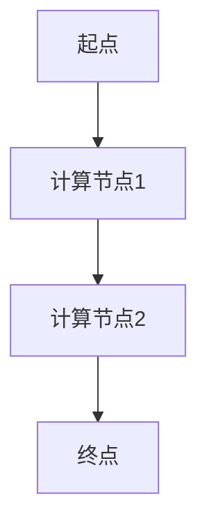
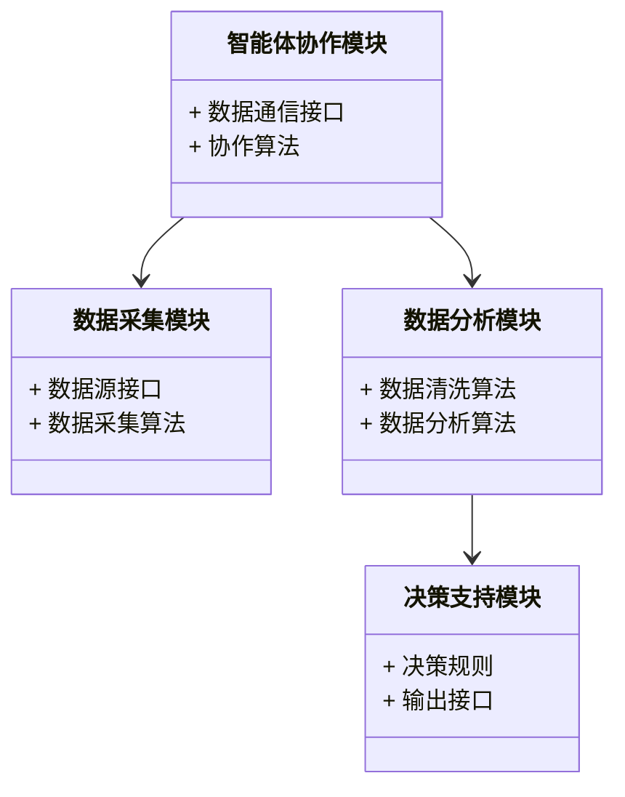
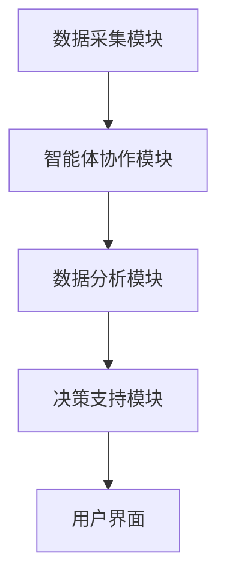
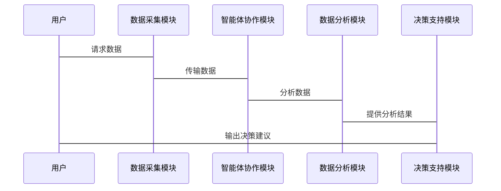

                 


# 多智能体系统在行业分析中的应用

> 关键词：多智能体系统, 行业分析, 智能体协作, 分布式计算, 人工智能, 系统架构

> 摘要：  
多智能体系统（Multi-Agent Systems，MAS）是一种由多个智能体（Agent）组成的分布式系统，这些智能体能够通过协作和竞争完成复杂任务。本文将从多智能体系统的背景与概述入手，详细探讨其核心概念、算法原理、系统架构设计、项目实战及最佳实践，结合实际案例分析，深入剖析多智能体系统在行业分析中的应用及其未来发展方向。

---

# 第一部分：多智能体系统基础

## 第1章：多智能体系统概述

### 1.1 多智能体系统的基本概念

#### 1.1.1 智能体的定义与特征

智能体（Agent）是一种能够感知环境、自主决策并采取行动的实体。其核心特征包括：

- **自主性**：智能体能够自主决策，无需外部干预。
- **反应性**：智能体能够实时感知环境变化并做出反应。
- **协作性**：智能体能够与其他智能体或系统进行协作。

#### 1.1.2 多智能体系统的定义与特点

多智能体系统（MAS）是由多个智能体组成的分布式系统，这些智能体通过协作和竞争完成复杂任务。其特点包括：

- **分布式性**：智能体分布于不同的节点，能够独立运行。
- **协作性**：智能体之间能够通过通信和协调完成共同目标。
- **动态性**：系统环境和任务需求可能动态变化，智能体需要灵活应对。

#### 1.1.3 多智能体系统与单智能体系统的区别

| 属性         | 单智能体系统                | 多智能体系统                |
|--------------|-----------------------------|-----------------------------|
| 结构         | 单一智能体                  | 多个智能体                  |
| 任务分配     | 单一智能体完成所有任务      | 多个智能体协作完成任务      |
| 通信机制     | 无需通信                   | 需要通信和协调              |

#### 1.1.4 多智能体系统的应用场景

多智能体系统广泛应用于多个领域，包括：

- **金融行业**：股票交易、风险评估。
- **物流行业**：路径优化、资源分配。
- **医疗行业**：病患诊断、治疗方案优化。

### 1.2 多智能体系统的分类

#### 1.2.1 基于任务的分类

- **协调型多智能体系统**：智能体通过协作完成共同任务。
- **竞争型多智能体系统**：智能体之间存在竞争关系，完成任务时需要考虑对手行为。
- **混合型多智能体系统**：同时包含协作和竞争两种机制。

#### 1.2.2 基于智能体类型的分类

- **反应式智能体**：根据当前感知做出反应。
- **认知式智能体**：具备推理和规划能力，能够进行复杂决策。
- **效用式智能体**：基于效用函数进行决策。

#### 1.2.3 基于通信机制的分类

- **直接通信**：智能体之间直接交换信息。
- **间接通信**：通过中间媒介进行信息传递。
- **基于消息的通信**：通过消息传递机制进行信息交换。

### 1.3 多智能体系统的应用优势

- **提高效率**：通过协作和分布式计算，能够更高效地完成任务。
- **增强鲁棒性**：多个智能体协作能够提高系统的容错性和适应性。
- **灵活性**：智能体可以根据环境变化动态调整行为。

## 第2章：多智能体系统的理论基础

### 2.1 问题背景与描述

多智能体系统的核心问题是如何在分布式环境下实现智能体之间的有效协作。这涉及到任务分配、通信机制、冲突解决等多个方面。

### 2.2 问题解决方法

#### 2.2.1 分布式计算

分布式计算通过将任务分解到多个智能体上，利用并行计算提高效率。例如，使用Dijkstra算法进行路径优化。

#### 2.2.2 协作算法

协作算法通过智能体之间的通信和协调，实现共同目标。例如，使用共识算法（如拜占庭容错）确保智能体之间达成一致。

### 2.3 系统的边界与外延

#### 2.3.1 系统边界

多智能体系统的边界包括智能体的感知范围、通信范围以及任务范围。

#### 2.3.2 系统外延

多智能体系统可以与其他系统（如数据库、外部服务）进行交互，扩展其功能。

### 2.4 核心概念与联系

#### 2.4.1 核心概念原理

智能体通过感知环境、通信和协作完成任务。例如，智能体A感知到环境变化后，通过通信将信息传递给智能体B，B根据信息做出决策。

#### 2.4.2 概念属性特征对比表格

| 概念     | 自主性 | 反应性 | 协作性 |
|----------|--------|--------|--------|
| 智能体1  | 是     | 是     | 是     |
| 智能体2  | 是     | 是     | 是     |

#### 2.4.3 ER实体关系图架构



## 第3章：多智能体系统的算法原理

### 3.1 算法原理讲解

#### 3.1.1 分布式计算算法

**Dijkstra算法**用于路径优化，适用于多智能体协作中的任务分配问题。



**Python代码实现**：

```python
import heapq

def dijkstra(graph, start, end):
    dist = {node: float('infinity') for node in graph}
    dist[start] = 0
    heap = [(0, start)]
    heapq.heapify(heap)
    
    while heap:
        current_dist, current_node = heapq.heappop(heap)
        if current_node == end:
            break
        for neighbor, weight in graph[current_node].items():
            if dist[neighbor] > current_dist + weight:
                dist[neighbor] = current_dist + weight
                heapq.heappush(heap, (dist[neighbor], neighbor))
    return dist[end]

# 示例图
graph = {
    '起点': {'计算节点1': 1},
    '计算节点1': {'计算节点2': 2},
    '计算节点2': {'终点': 3},
}

print(dijkstra(graph, '起点', '终点'))  # 输出 1+2+3=6
```

#### 3.1.2 协作算法

**共识算法**用于确保智能体之间达成一致，例如：

- **Paxos算法**：用于分布式系统中的共识问题。
- **Raft算法**：Paxos的优化版本，用于分布式系统中的领导者选举。

**Python代码实现**：

```python
class PaxosAlgorithm:
    def __init__(self, proposers):
        self.proposers = proposers
        self.learner = self.proposers[-1]
    
    def propose(self, value):
        # 提案者向所有接受者发送提案
        for acceptor in self.proposers[:-1]:
            acceptor.receive Proposal(self.learner, value)
    
    def learn(self):
        # 学习者从所有接受者中学习最终的值
        final_value = self.learner.final_value
        return final_value

# 示例场景
class Acceptor:
    def __init__(self, name):
        self.name = name
        self.value = None
    
    def receive(self, proposer, value):
        if proposer == self.name:
            self.value = value

proposers = [Acceptor('A'), Acceptor('B'), Acceptor('C')]
paxos = PaxosAlgorithm(proposers)
paxos.propose(10)
paxos.learn()  # 输出 10
```

---

### 3.2 算法优化与改进

#### 3.2.1 分布式计算中的负载均衡

通过动态任务分配算法（如轮询法、随机法）实现负载均衡，确保每个智能体的任务量均衡。

#### 3.2.2 协作算法中的冲突解决

通过仲裁机制（如基于优先级的冲突解决）或协商机制（如基于博弈论的协商）解决智能体之间的冲突。

---

### 3.3 算法的数学模型与公式推导

#### 3.3.1 分布式计算中的任务分配

任务分配问题可以建模为一个优化问题：

$$
\text{minimize} \quad \sum_{i=1}^{n} c_i \\
\text{subject to} \quad \sum_{i=1}^{n} x_i = 1 \\
$$

其中，\( c_i \) 是任务分配到智能体 \( i \) 的成本，\( x_i \) 是二进制变量（0或1），表示任务是否分配给智能体 \( i \)。

#### 3.3.2 协作算法中的共识机制

共识机制可以通过以下公式表示：

$$
\text{value} = \max_{i} (v_i) \\
$$

其中，\( v_i \) 是智能体 \( i \) 提议的值，\( \text{value} \) 是最终达成的共识值。

---

## 第4章：多智能体系统的系统分析与架构设计

### 4.1 系统分析

#### 4.1.1 问题场景介绍

在行业分析中，多智能体系统可以用于实时数据分析、预测和决策支持。例如，在金融行业，智能体可以通过实时分析市场数据，协助投资者做出决策。

#### 4.1.2 项目介绍

本项目旨在开发一个多智能体系统，用于股票市场的实时数据分析与预测。

### 4.2 系统功能设计

#### 4.2.1 功能模块设计

- **数据采集模块**：从多个数据源采集实时数据。
- **数据分析模块**：对数据进行清洗、转换和分析。
- **智能体协作模块**：实现智能体之间的通信和协作。
- **决策支持模块**：基于分析结果提供决策支持。

#### 4.2.2 领域模型设计



### 4.3 系统架构设计

#### 4.3.1 系统架构图



#### 4.3.2 系统接口设计

- **数据接口**：提供数据采集和传输的接口。
- **协作接口**：提供智能体之间通信和协作的接口。
- **决策接口**：提供决策支持和输出的接口。

### 4.4 系统交互流程



---

## 第5章：多智能体系统的项目实战

### 5.1 环境安装

#### 5.1.1 系统环境要求

- 操作系统：Linux/Windows/MacOS
- Python版本：3.6+
- 依赖库：networkx、numpy、pymongo

#### 5.1.2 安装依赖

```bash
pip install networkx numpy pymongo
```

### 5.2 系统核心实现

#### 5.2.1 智能体协作模块

```python
import networkx as nx

class Agent:
    def __init__(self, id):
        self.id = id
        self.graph = nx.Graph()
    
    def connect(self, other_agent):
        self.graph.add_edge(self.id, other_agent.id)
    
    def communicate(self, message):
        # 模拟通信机制
        return f"Agent {self.id} received message: {message}"
```

#### 5.2.2 数据分析模块

```python
import numpy as np

class DataAnalyzer:
    def __init__(self, data):
        self.data = data
    
    def analyze(self):
        return np.mean(self.data), np.std(self.data)
```

#### 5.2.3 决策支持模块

```python
class DecisionSupport:
    def __init__(self, threshold):
        self.threshold = threshold
    
    def make_decision(self, analysis_result):
        if analysis_result[0] > self.threshold:
            return "Buy"
        else:
            return "Hold"
```

### 5.3 案例分析

#### 5.3.1 金融行业应用

**案例背景**：开发一个多智能体系统，用于股票市场的实时数据分析与预测。

**实现步骤**：

1. **数据采集**：从多个股票数据源采集实时数据。
2. **智能体协作**：智能体之间通过通信模块协作分析数据。
3. **数据分析**：使用数据分析模块对数据进行清洗和分析。
4. **决策支持**：基于分析结果提供股票买卖决策建议。

**代码实现**：

```python
# 初始化智能体
agent1 = Agent(1)
agent2 = Agent(2)
agent1.connect(agent2)

# 数据采集模块
data = [100, 101, 99, 102, 100.5]
data_analyzer = DataAnalyzer(data)
mean, std = data_analyzer.analyze()

# 决策支持模块
decision_support = DecisionSupport(100.5)
decision = decision_support.make_decision((mean, std))

print(decision)  # 输出 Buy 或 Hold
```

### 5.4 项目小结

通过本项目，我们可以看到多智能体系统在行业分析中的巨大潜力。智能体之间的协作和通信能够显著提高数据分析的效率和准确性。

---

## 第6章：多智能体系统的总结与展望

### 6.1 本章小结

多智能体系统通过智能体之间的协作和通信，能够高效地完成复杂任务。本文详细探讨了多智能体系统的理论基础、算法原理、系统架构设计及实际应用案例。

### 6.2 未来展望

#### 6.2.1 研究方向

- **智能体学习**：研究智能体的自适应学习能力，使其能够更好地应对动态环境。
- **多智能体协作优化**：研究更高效的协作算法，提高系统的整体性能。
- **多智能体系统的安全性**：研究如何提高多智能体系统的安全性，防止恶意攻击。

#### 6.2.2 技术发展趋势

- **智能化**：智能体具备更强的自主学习和决策能力。
- **协作化**：智能体之间的协作更加高效和灵活。
- **分布式计算**：分布式计算技术将进一步发展，提高系统的扩展性和性能。

### 6.3 最佳实践 Tips

- **模块化设计**：将系统设计为模块化结构，便于维护和扩展。
- **通信机制**：选择合适的通信机制，确保智能体之间的高效通信。
- **算法优化**：根据具体需求优化协作算法，提高系统的性能。

### 6.4 结语

多智能体系统在行业分析中的应用前景广阔。随着人工智能和分布式计算技术的不断发展，多智能体系统将变得更加智能和协作化，为各个行业的分析和决策提供更有力的支持。

---

## 作者

**作者：AI天才研究院/AI Genius Institute & 禅与计算机程序设计艺术 /Zen And The Art of Computer Programming**

---

以上是《多智能体系统在行业分析中的应用》的完整目录和内容概要。通过系统化的分析和详细的案例讲解，本文旨在帮助读者全面理解多智能体系统的原理和应用，为实际应用提供理论和实践指导。

