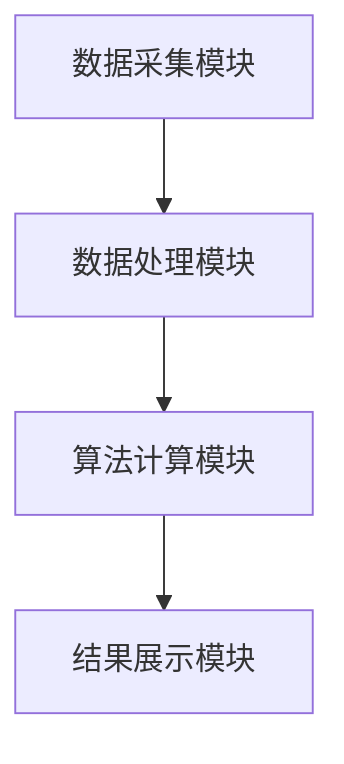
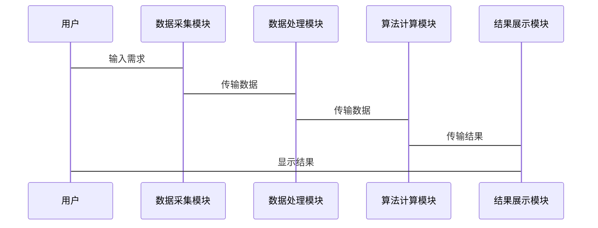

                 


# 多智能体系统在评估公司人力资本价值中的应用

---

## 关键词：
多智能体系统, 人力资本价值评估, 算法原理, 系统架构设计, 项目实战

---

## 摘要：
多智能体系统（Multi-Agent System, MAS）是一种由多个智能体组成的分布式系统，能够协同工作以实现复杂任务。在公司人力资本价值评估中，多智能体系统通过分布式计算和协作机制，能够更精准地分析员工绩效、团队协作和组织能力，从而为企业提供数据驱动的决策支持。本文从多智能体系统的定义、核心概念、算法原理、系统架构设计、项目实战等多个方面，详细探讨其在人力资本价值评估中的应用，并结合实际案例，分析其优势和挑战。

---

# 第1章: 多智能体系统与人力资本价值评估背景

## 1.1 多智能体系统的定义与特点

### 1.1.1 多智能体系统的定义
多智能体系统是由多个智能体组成的分布式系统，这些智能体能够通过协同工作，完成复杂的任务。每个智能体都有一定的自主性、目标导向性和反应能力。

### 1.1.2 多智能体系统的特征
- **自主性**：智能体能够自主决策和行动。
- **反应性**：智能体能够感知环境并做出实时反应。
- **协作性**：智能体之间能够通过通信和协作完成任务。
- **分布式性**：智能体分布在网络中，能够实现去中心化的管理。

### 1.1.3 多智能体系统与传统单智能体系统的区别
- **单智能体系统**：集中式管理，一个中心节点处理所有任务。
- **多智能体系统**：分布式架构，多个智能体协作完成任务。

---

## 1.2 多智能体系统的发展历程

### 1.2.1 多智能体系统的起源
多智能体系统的概念起源于人工智能领域，20世纪60年代开始出现相关研究。

### 1.2.2 多智能体系统的演进阶段
- **早期阶段**：研究集中在单个智能体的行为和决策。
- **发展阶段**：研究多智能体之间的协作与通信。
- **成熟阶段**：多智能体系统在多个领域得到广泛应用。

### 1.2.3 当前多智能体系统的应用现状
多智能体系统已在机器人、自动驾驶、游戏AI等领域得到广泛应用。

---

## 1.3 多智能体系统在人力资本价值评估中的应用背景

### 1.3.1 人力资本价值评估的定义
人力资本价值评估是通过对员工的能力、绩效和贡献进行量化，评估其对企业价值的过程。

### 1.3.2 传统人力资本评估方法的局限性
- **数据孤岛**：各部门数据分散，难以整合。
- **主观性**：评估结果依赖于主观判断。
- **实时性不足**：传统方法难以实时跟踪员工表现。

### 1.3.3 多智能体系统在人力资本评估中的优势
- **数据整合**：多智能体系统能够整合来自不同部门的数据。
- **实时性**：能够实时跟踪员工绩效和团队协作。
- **分布式协作**：多个智能体协同工作，提供全面评估。

---

## 1.4 相关概念与术语解释

### 1.4.1 多智能体系统的核心概念
- **智能体**：能够感知环境并采取行动的实体。
- **通信机制**：智能体之间交换信息的方式。
- **协作机制**：智能体之间协同完成任务的方式。

### 1.4.2 人力资本价值评估的关键指标
- **员工绩效**：员工的工作表现和成果。
- **团队协作**：团队内部的协作效率。
- **组织能力**：组织的整体能力。

### 1.4.3 多智能体系统与人力资本评估的关联性
多智能体系统通过分布式计算和协作机制，能够更全面地评估员工和团队的绩效。

---

## 1.5 本章小结
本章介绍了多智能体系统的定义、发展历程及其在人力资本价值评估中的应用背景，为后续章节奠定了基础。

---

# 第2章: 多智能体系统的核心概念与联系

## 2.1 多智能体系统的模型构建

### 2.1.1 多智能体系统的模型框架
多智能体系统通常由智能体、环境、通信机制和协作机制组成。

### 2.1.2 多智能体系统的组成部分
- **智能体**：独立的决策单元。
- **环境**：智能体所处的外部世界。
- **通信机制**：智能体之间的信息交换方式。
- **协作机制**：智能体之间协同工作的规则。

### 2.1.3 多智能体系统的核心要素
- **智能体的目标**：每个智能体都有明确的目标。
- **智能体的决策**：基于感知和环境信息做出决策。
- **智能体的协作**：通过通信和协作完成复杂任务。

---

## 2.2 多智能体系统的算法原理

### 2.2.1 多智能体系统中的通信机制
- **同步通信**：智能体之间同步交换信息。
- **异步通信**：智能体之间异步交换信息。

### 2.2.2 多智能体系统中的协作机制
- **任务分配**：智能体根据自身能力分配任务。
- **协调与同步**：智能体之间协调行动，确保任务完成。

### 2.2.3 多智能体系统中的决策机制
- **基于规则的决策**：根据预定义规则做出决策。
- **基于模型的决策**：基于环境模型做出决策。
- **基于学习的决策**：通过机器学习模型做出决策。

---

## 2.3 多智能体系统的架构设计

### 2.3.1 分层架构
多智能体系统可以分为管理层、协调层和执行层。

### 2.3.2 分布式架构
智能体分布在网络中，每个智能体负责一部分任务。

### 2.3.3 集中式架构
有一个中心节点负责协调和管理所有智能体。

---

## 2.4 多智能体系统与人力资本评估的核心联系

### 2.4.1 多智能体系统如何辅助人力资本评估
- **数据整合**：多智能体系统能够整合来自不同部门的数据。
- **实时跟踪**：能够实时跟踪员工的绩效和团队协作。
- **分布式协作**：多个智能体协同工作，提供全面评估。

### 2.4.2 多智能体系统在人力资本评估中的具体应用
- **员工绩效评估**：通过智能体实时跟踪员工的工作表现。
- **团队协作评估**：通过智能体分析团队内部的协作效率。
- **组织能力评估**：通过智能体评估组织的整体能力。

### 2.4.3 多智能体系统与人力资本评估的协同优化
- **数据共享与协作**：智能体之间共享数据，优化评估结果。
- **动态调整**：根据实时数据动态调整评估策略。

---

## 2.5 本章小结
本章详细介绍了多智能体系统的核心概念、算法原理和架构设计，并探讨了其在人力资本评估中的具体应用和优化策略。

---

# 第3章: 多智能体系统在人力资本价值评估中的算法原理

## 3.1 多智能体系统的核心算法

### 3.1.1 分布式算法
- **分布式任务分配算法**：智能体根据自身能力和任务需求，自动分配任务。
- **分布式协调算法**：智能体之间通过协调算法，确保任务的顺利执行。

### 3.1.2 协作算法
- **协作规划算法**：智能体之间通过协作规划，制定共同的目标和行动计划。
- **协作决策算法**：智能体之间通过协作决策，优化整体行动方案。

### 3.1.3 聚类算法
- **基于聚类的任务分配算法**：将任务聚类，智能体根据聚类结果分配任务。

---

## 3.2 多智能体系统在人力资本评估中的算法实现

### 3.2.1 算法选择与优化
- **选择适合的算法**：根据具体需求选择合适的算法。
- **算法优化**：通过优化算法参数，提高算法效率。

### 3.2.2 算法实现的步骤
1. **数据收集**：收集员工绩效、团队协作等数据。
2. **数据预处理**：清洗数据，提取特征。
3. **算法训练**：训练机器学习模型，优化算法参数。
4. **算法部署**：将算法部署到实际系统中，进行实时评估。

### 3.2.3 算法的性能评估
- **评估指标**：准确率、召回率、F1值等。
- **性能优化**：通过调优算法和优化数据预处理，提高算法性能。

---

## 3.3 算法原理的数学模型和公式

### 3.3.1 分布式任务分配算法
$$
\text{任务分配} = \argmin_{i} \text{智能体} i \text{的负载}
$$

### 3.3.2 协作规划算法
$$
\text{协作规划} = \argmax_{i} \text{智能体} i \text{的贡献}
$$

### 3.3.3 聚类算法
$$
\text{聚类结果} = k\text{means}(\text{数据})
$$

---

## 3.4 本章小结
本章详细介绍了多智能体系统在人力资本评估中的核心算法，包括分布式算法、协作算法和聚类算法，并通过数学模型和公式进行了详细讲解。

---

# 第4章: 多智能体系统在人力资本价值评估中的系统架构设计

## 4.1 系统分析与需求分析

### 4.1.1 问题场景介绍
- **员工绩效评估**：实时跟踪员工的工作表现。
- **团队协作评估**：分析团队内部的协作效率。
- **组织能力评估**：评估组织的整体能力。

### 4.1.2 项目介绍
本项目旨在利用多智能体系统，构建一个实时、全面的人力资本价值评估系统。

---

## 4.2 系统功能设计

### 4.2.1 系统功能模块
- **数据采集模块**：收集员工绩效、团队协作等数据。
- **数据处理模块**：清洗和预处理数据。
- **算法计算模块**：运行多智能体算法，生成评估结果。
- **结果展示模块**：以可视化方式展示评估结果。

### 4.2.2 系统功能流程
1. 数据采集模块收集数据。
2. 数据处理模块清洗数据。
3. 算法计算模块运行算法，生成评估结果。
4. 结果展示模块以可视化方式展示结果。

---

## 4.3 系统架构设计

### 4.3.1 系统架构设计图


### 4.3.2 系统架构设计说明
- **分层架构**：系统分为数据采集层、数据处理层、算法计算层和结果展示层。
- **分布式架构**：数据采集和处理模块分布在网络中，通过通信机制协同工作。

---

## 4.4 系统接口设计

### 4.4.1 系统接口设计
- **数据接口**：数据采集模块与数据处理模块之间的接口。
- **算法接口**：数据处理模块与算法计算模块之间的接口。
- **展示接口**：算法计算模块与结果展示模块之间的接口。

### 4.4.2 接口设计说明
- **数据接口**：支持多种数据格式，如JSON、CSV。
- **算法接口**：提供标准的API，方便调用算法。
- **展示接口**：支持多种可视化方式，如图表、仪表盘。

---

## 4.5 系统交互设计

### 4.5.1 系统交互流程
1. 用户输入需求。
2. 数据采集模块采集数据。
3. 数据处理模块清洗数据。
4. 算法计算模块运行算法，生成评估结果。
5. 结果展示模块以可视化方式展示结果。

### 4.5.2 系统交互流程图


---

## 4.6 本章小结
本章详细介绍了多智能体系统在人力资本价值评估中的系统架构设计，包括功能模块、架构设计、接口设计和交互流程。

---

# 第5章: 多智能体系统在人力资本价值评估中的项目实战

## 5.1 环境安装与配置

### 5.1.1 环境要求
- **操作系统**：Linux/Windows/MacOS
- **编程语言**：Python 3.8+
- **框架与库**：Django、Flask、NumPy、Pandas、Scikit-learn

### 5.1.2 安装步骤
1. 安装Python
2. 安装所需的库：pip install numpy pandas scikit-learn
3. 安装框架：pip install django flask

---

## 5.2 系统核心实现源代码

### 5.2.1 数据采集模块
```python
import requests

def collect_data(url):
    response = requests.get(url)
    return response.json()
```

### 5.2.2 数据处理模块
```python
import pandas as pd

def preprocess_data(data):
    df = pd.DataFrame(data)
    df.dropna(inplace=True)
    return df
```

### 5.2.3 算法计算模块
```python
from sklearn.cluster import KMeans

def evaluate_performance(data):
    model = KMeans(n_clusters=3)
    model.fit(data)
    return model.labels_
```

### 5.2.4 结果展示模块
```python
import matplotlib.pyplot as plt

def visualize_results(labels):
    plt.hist(labels)
    plt.show()
```

---

## 5.3 代码应用解读与分析

### 5.3.1 数据采集模块
- **功能**：从指定URL获取数据。
- **实现**：使用requests库发送HTTP请求，获取JSON格式的数据。

### 5.3.2 数据处理模块
- **功能**：清洗数据，去除缺失值。
- **实现**：使用pandas库对数据进行清洗和处理。

### 5.3.3 算法计算模块
- **功能**：使用K-means算法对数据进行聚类，生成评估结果。
- **实现**：使用scikit-learn库中的KMeans算法进行聚类。

### 5.3.4 结果展示模块
- **功能**：以图表形式展示评估结果。
- **实现**：使用matplotlib库绘制直方图，展示聚类结果。

---

## 5.4 实际案例分析与详细讲解剖析

### 5.4.1 案例背景
某公司希望评估员工的绩效，使用多智能体系统进行实时评估。

### 5.4.2 数据来源
- **员工绩效数据**：包括员工的工作成果、工作效率等。
- **团队协作数据**：包括团队内部的协作效率、沟通频率等。

### 5.4.3 实施步骤
1. 数据采集模块从数据库中获取数据。
2. 数据处理模块清洗数据，去除缺失值。
3. 算法计算模块运行K-means算法，生成聚类结果。
4. 结果展示模块以图表形式展示聚类结果。

---

## 5.5 项目小结
本章通过实际案例，详细讲解了多智能体系统在人力资本价值评估中的项目实战，包括环境配置、代码实现、案例分析和结果展示。

---

# 第6章: 总结与展望

## 6.1 总结

### 6.1.1 核心内容回顾
多智能体系统在人力资本价值评估中的应用，通过分布式计算和协作机制，能够实时跟踪员工绩效和团队协作，提供全面的评估结果。

### 6.1.2 实践意义
- **提高评估效率**：通过多智能体系统，能够快速、准确地完成评估。
- **优化决策**：基于实时数据和多智能体协作，优化企业的决策。

### 6.1.3 技术总结
- **优势**：实时性、分布式协作、数据整合。
- **挑战**：数据隐私、算法优化、系统安全性。

---

## 6.2 展望

### 6.2.1 未来发展方向
- **智能化**：结合AI技术，进一步提高评估的智能化水平。
- **个性化**：根据员工的个性化需求，提供定制化的评估方案。
- **实时化**：进一步提高评估的实时性，支持动态调整。

### 6.2.2 挑战与建议
- **数据隐私**：加强数据加密和隐私保护。
- **算法优化**：进一步优化算法，提高评估的准确性。
- **系统安全性**：加强系统安全防护，防止数据泄露。

---

## 6.3 本章小结
本章总结了多智能体系统在人力资本价值评估中的应用，并展望了未来的发展方向和挑战。

---

# 作者：AI天才研究院/AI Genius Institute & 禅与计算机程序设计艺术 /Zen And The Art of Computer Programming

---

**以上是完整的《多智能体系统在评估公司人力资本价值中的应用》的技术博客文章目录大纲和部分正文内容。接下来，我将根据这个大纲，逐步展开每一部分的详细内容，确保文章结构清晰、逻辑严谨、内容详实。**

