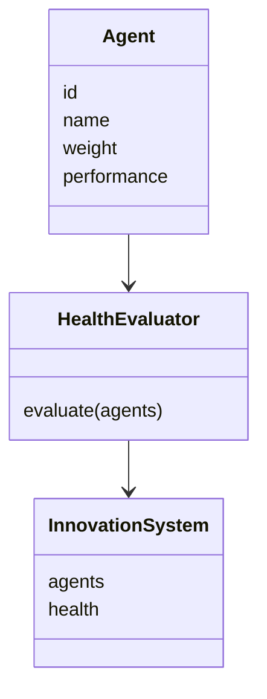
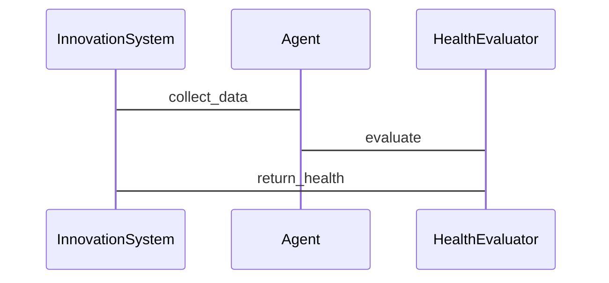

                 


# 多智能体系统在评估公司创新生态系统健康度中的应用

> 关键词：多智能体系统，创新生态系统，健康度评估，协同机制，系统架构

> 摘要：本文探讨了多智能体系统在评估公司创新生态系统健康度中的应用。通过分析多智能体系统的协同机制和创新生态系统的构成，提出了基于多智能体系统的健康度评估模型，并详细讲解了算法实现和系统架构设计。文章还通过实际案例展示了如何应用这些方法，并总结了未来的发展方向。

---

## 第一部分: 多智能体系统与创新生态系统概述

### 第1章: 多智能体系统概述

#### 1.1 多智能体系统的基本概念

##### 1.1.1 多智能体系统的定义
多智能体系统（Multi-Agent System，MAS）是由多个智能体组成的系统，这些智能体能够自主决策、协作和通信，共同完成复杂任务。智能体可以是软件程序、机器人或其他分布式实体。

##### 1.1.2 多智能体系统的特性
- **自主性**：智能体能够自主决策，无需外部干预。
- **反应性**：智能体能够感知环境并实时响应。
- **协作性**：多个智能体能够协同工作，完成复杂任务。
- **分布式性**：智能体分布在不同的位置，通过通信进行协作。

##### 1.1.3 多智能体系统的应用场景
- **分布式计算**：如分布式任务分配、负载均衡。
- **智能控制**：如自动驾驶、智能工厂。
- **社会治理**：如交通管理、环境监测。

#### 1.2 创新生态系统的基本概念

##### 1.2.1 创新生态系统的定义
创新生态系统是一个由企业、研究机构、供应商、合作伙伴、客户等组成的网络，通过协同创新，推动技术进步和产品开发。

##### 1.2.2 创新生态系统的构成要素
- **企业**：创新的核心主体。
- **研究机构**：提供技术支持。
- **供应商**：提供原材料和设备。
- **合作伙伴**：提供合作资源。
- **客户**：提供需求反馈。

##### 1.2.3 创新生态系统的重要性
- **加速创新**：通过协同创新，缩短研发周期。
- **降低成本**：共享资源，降低单个企业的研发投入。
- **提升竞争力**：通过生态系统协同，提升整体竞争力。

#### 1.3 多智能体系统与创新生态系统的结合

##### 1.3.1 多智能体系统在创新生态系统中的作用
- **资源分配**：智能体可以协调资源，优化配置。
- **信息共享**：智能体能够实时共享信息，提高决策效率。
- **协同创新**：智能体可以协同完成创新任务。

##### 1.3.2 多智能体系统与创新生态系统的关系
- **协同关系**：智能体协同创新，推动生态系统发展。
- **动态关系**：生态系统动态变化，智能体实时响应。

---

### 第2章: 创新生态系统健康度评估的背景与意义

#### 2.1 创新生态系统健康度评估的背景

##### 2.1.1 当前企业创新面临的挑战
- **竞争加剧**：企业需要快速创新以应对市场竞争。
- **资源有限**：企业需要高效利用有限资源。
- **不确定性**：创新过程充满不确定性，需要实时调整。

##### 2.1.2 创新生态系统健康度评估的必要性
- **实时监控**：需要实时了解创新生态系统的健康状况。
- **问题预警**：通过评估，提前发现潜在问题。
- **优化决策**：基于评估结果，优化创新策略。

##### 2.1.3 多智能体系统在评估中的应用前景
- **实时评估**：多智能体系统能够实时监控生态系统。
- **动态调整**：根据评估结果，动态调整策略。

#### 2.2 创新生态系统健康度评估的意义

##### 2.2.1 企业创新绩效提升
- **效率提升**：通过评估，优化创新流程。
- **质量提升**：提高创新成果的质量。

##### 2.2.2 创新资源优化配置
- **资源分配**：智能体可以根据需求动态分配资源。
- **资源利用**：最大化资源利用率。

##### 2.2.3 创新风险的早期预警
- **风险识别**：通过评估，识别潜在风险。
- **风险控制**：制定应对策略，降低风险。

---

### 第3章: 多智能体系统在创新生态系统评估中的核心概念

#### 3.1 多智能体系统的协同机制

##### 3.1.1 协同行为的定义
协同行为是指多个智能体通过协作完成共同目标的行为。

##### 3.1.2 协同机制的分类
- **任务分配**：智能体根据自身能力和资源分配任务。
- **信息共享**：智能体共享信息，提高决策效率。
- **协调与合作**：智能体通过协调完成复杂任务。

##### 3.1.3 协同机制在创新生态系统中的应用
- **任务分配**：智能体根据创新需求分配任务。
- **信息共享**：智能体共享创新资源和信息。
- **协调与合作**：智能体协同完成创新任务。

#### 3.2 创新生态系统健康度的评估指标

##### 3.2.1 创新能力评估
- **研发投入**：企业的研发投入情况。
- **创新成果**：企业的专利数量、新产品数量。

##### 3.2.2 创新资源评估
- **人力资源**：创新团队的能力和数量。
- **资金支持**：创新项目的资金投入。

##### 3.2.3 创新环境评估
- **政策支持**：政府对创新的支持力度。
- **市场环境**：市场的竞争程度和需求情况。

#### 3.3 多智能体系统与创新生态系统健康度评估的关系

##### 3.3.1 多智能体系统在评估中的角色
- **数据采集**：智能体采集创新生态系统的数据。
- **数据处理**：智能体分析数据，评估健康度。
- **决策支持**：智能体根据评估结果提供决策支持。

---

## 第四部分: 算法原理与实现

### 第4章: 多智能体系统协同算法

#### 4.1 多智能体系统协同算法概述

##### 4.1.1 算法的背景与意义
多智能体系统协同算法是实现智能体协同的核心技术，能够有效提高创新生态系统评估的效率和准确性。

#### 4.2 基于多智能体系统的健康度评估算法

##### 4.2.1 算法的实现步骤
1. 数据采集：智能体采集创新生态系统的相关数据。
2. 数据预处理：清洗和归一化数据。
3. 指标计算：计算创新能力、资源和环境指标。
4. 综合评估：基于多指标加权，计算健康度得分。
5. 结果输出：输出健康度评估结果。

##### 4.2.2 算法的数学模型
健康度评估模型：
$$
H = \sum_{i=1}^{n} w_i x_i
$$
其中，$H$ 表示健康度，$w_i$ 表示指标 $i$ 的权重，$x_i$ 表示指标 $i$ 的得分。

##### 4.2.3 算法的实现代码
```python
def calculate_health(agents):
    health = 0
    for agent in agents:
        health += agent.weight * agent.performance
    return health
```

---

## 第五部分: 系统分析与架构设计

### 第5章: 系统分析与架构设计方案

#### 5.1 问题场景介绍
创新生态系统健康度评估系统需要实时监控企业的创新活动，评估健康度，并提供决策支持。

#### 5.2 系统功能设计

##### 5.2.1 功能模块
- **数据采集模块**：采集创新生态系统的数据。
- **数据处理模块**：清洗和归一化数据。
- **评估模块**：计算健康度。
- **决策支持模块**：提供优化建议。

##### 5.2.2 系统功能设计的ER图
```mermaid
erDiagram
    class Agent {
        id : int
        name : string
        weight : float
        performance : float
    }
    class InnovationSystem {
        id : int
        name : string
        health : float
    }
    Agent -> InnovationSystem : belongs_to
```

#### 5.3 系统架构设计

##### 5.3.1 系统架构设计的类图


#### 5.4 系统接口设计

##### 5.4.1 系统接口设计的交互图


---

## 第六部分: 项目实战

### 第6章: 项目实战

#### 6.1 环境安装

##### 6.1.1 环境要求
- Python 3.8+
- Mermaid 和 PlantUML 支持工具。

#### 6.2 系统核心实现源代码

##### 6.2.1 多智能体系统协同算法实现
```python
class Agent:
    def __init__(self, id, name, weight, performance):
        self.id = id
        self.name = name
        self.weight = weight
        self.performance = performance

class HealthEvaluator:
    def evaluate(agents):
        health = 0
        for agent in agents:
            health += agent.weight * agent.performance
        return health

class InnovationSystem:
    def __init__(self, name):
        self.name = name
        self.agents = []
        self.health = 0

    def add_agent(self, agent):
        self.agents.append(agent)

    def evaluate_health(self):
        self.health = HealthEvaluator.evaluate(self.agents)
```

#### 6.3 代码应用解读与分析

##### 6.3.1 代码解读
- `Agent` 类：表示一个智能体，包含ID、名称、权重和表现。
- `HealthEvaluator` 类：提供评估健康度的方法。
- `InnovationSystem` 类：管理智能体，并评估健康度。

#### 6.4 实际案例分析

##### 6.4.1 案例分析
假设某公司有三个智能体，权重分别为0.3、0.4、0.3，表现分别为0.8、0.9、0.7。健康度计算如下：
$$
H = 0.3 \times 0.8 + 0.4 \times 0.9 + 0.3 \times 0.7 = 0.24 + 0.36 + 0.21 = 0.81
$$

##### 6.4.2 分析结果
健康度为0.81，表示创新生态系统整体健康，但仍有优化空间。

#### 6.5 项目总结

##### 6.5.1 项目小结
通过多智能体系统的协同算法，可以有效评估创新生态系统的健康度，为企业优化创新策略提供支持。

---

## 第七部分: 总结与展望

### 第7章: 总结与展望

#### 7.1 全文总结

##### 7.1.1 核心内容回顾
本文探讨了多智能体系统在评估公司创新生态系统健康度中的应用，提出了基于多智能体系统的健康度评估模型，并详细讲解了算法实现和系统架构设计。

#### 7.2 未来展望

##### 7.2.1 研究方向
- **算法优化**：进一步优化多智能体系统协同算法，提高评估精度。
- **系统扩展**：扩展系统功能，支持更大规模的创新生态系统评估。

##### 7.2.2 应用前景
- **行业应用**：在更多行业推广多智能体系统应用。
- **技术创新**：结合人工智能、大数据等技术，推动创新生态系统评估的发展。

---

## 作者

作者：AI天才研究院/AI Genius Institute & 禅与计算机程序设计艺术 /Zen And The Art of Computer Programming

