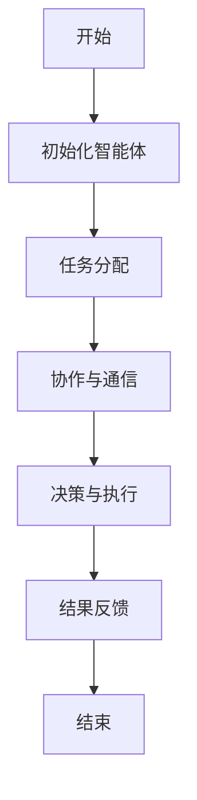
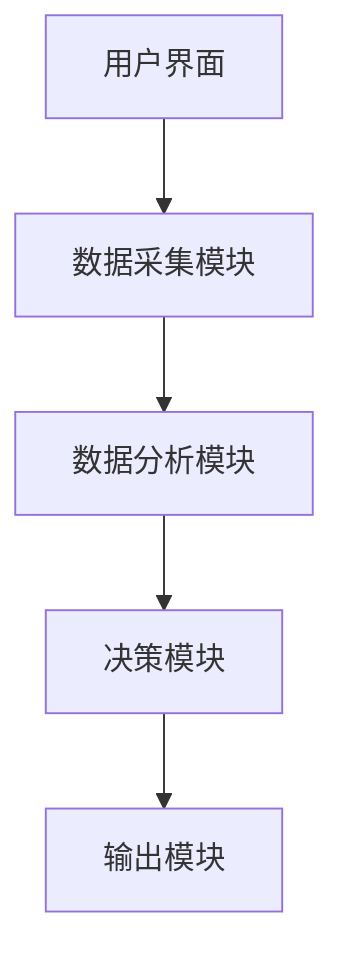
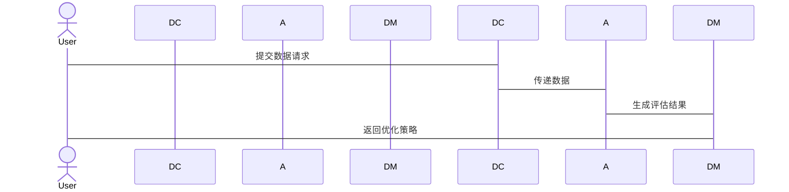

                 


# 《多智能体系统在评估公司创新能力和研发效率中的应用》

---

## 关键词：多智能体系统、创新能力评估、研发效率、系统架构、算法原理、企业应用

---

## 摘要：  
多智能体系统是一种分布式、协作式的人工智能系统，能够通过多个智能体之间的协作与交互，实现复杂问题的求解。本文探讨了多智能体系统在评估公司创新能力和研发效率中的应用，详细分析了其核心原理、算法设计、系统架构以及实际案例，揭示了多智能体系统在企业评估中的独特优势和应用前景。

---

# 第一部分：多智能体系统在公司创新评估中的背景与概念

---

# 第1章：多智能体系统与公司创新评估概述

## 1.1 多智能体系统的概念与背景

### 1.1.1 多智能体系统的定义  
多智能体系统（Multi-Agent System, MAS）是由多个智能体（Agent）组成的分布式系统，这些智能体通过通信与协作完成复杂的任务。智能体是具有感知、决策、执行和学习能力的实体，能够独立工作并与其他智能体交互。

### 1.1.2 多智能体系统的演进历程  
多智能体系统的发展经历了从单智能体到多智能体的演进，逐步实现了分布式协作和自适应能力的提升。随着人工智能技术的进步，多智能体系统在企业应用中的潜力逐渐显现。

### 1.1.3 多智能体系统在企业中的应用价值  
- **分布式协作**：通过多个智能体的协作，实现任务的高效完成。  
- **动态适应性**：能够快速响应环境变化，适应复杂场景。  
- **数据处理能力**：通过分布式计算，提高数据处理效率和准确性。  

---

## 1.2 公司创新能力与研发效率的评估需求

### 1.2.1 创新能力的定义与评估维度  
创新能力是指公司在技术创新、产品创新和管理创新等方面的能力。评估维度包括研发投入、创新成果、团队协作效率等。

### 1.2.2 研发效率的定义与评估指标  
研发效率是指公司在研发过程中的产出与投入的比值。评估指标包括研发周期、资源利用率、产品成功率等。

### 1.2.3 传统评估方法的局限性  
传统评估方法通常依赖人工分析，存在数据碎片化、评估结果片面等问题，难以满足现代企业的需求。

---

## 1.3 多智能体系统在创新评估中的优势

### 1.3.1 多智能体系统的分布式协作优势  
通过多个智能体的协作，能够全面覆盖公司的创新活动，实现多维度的评估。

### 1.3.2 多智能体系统的动态适应性  
能够实时感知环境变化，快速调整评估策略，适应公司的动态需求。

### 1.3.3 多智能体系统的数据处理能力  
通过分布式计算和数据融合技术，提高数据处理效率和准确性。

---

## 1.4 本章小结  
本章介绍了多智能体系统的概念和背景，分析了公司创新能力与研发效率的评估需求，并探讨了多智能体系统在创新评估中的优势。

---

# 第2章：多智能体系统的原理与核心概念

## 2.1 多智能体系统的组成与结构

### 2.1.1 实体与行为  
智能体是多智能体系统的基本单元，具有感知、决策、执行和学习能力。实体之间的行为通过通信与协作实现。

### 2.1.2 通信与协作  
智能体之间的通信是通过消息传递完成的，协作行为通过任务分配和协同决策实现。

### 2.1.3 环境与任务  
多智能体系统运行在特定的环境中，任务是系统的目标，智能体需要通过协作完成任务。

---

## 2.2 多智能体系统的核心原理

### 2.2.1 分布式计算  
多智能体系统通过分布式计算实现任务的分解与协作，提高计算效率和资源利用率。

### 2.2.2 协作与博弈论  
智能体之间的协作可以通过博弈论模型实现，通过纳什均衡等方法优化协作策略。

### 2.2.3 自适应与学习  
多智能体系统具有自适应能力，能够通过机器学习算法不断优化自身的决策能力。

---

## 2.3 多智能体系统的数学模型

### 2.3.1 实体间关系的数学表达  
通过图论和矩阵分析，描述智能体之间的关系和协作行为。

### 2.3.2 协作行为的数学建模  
使用博弈论模型，描述智能体之间的协作与竞争行为。

### 2.3.3 动态环境的数学描述  
通过动态规划和马尔可夫链模型，描述环境的变化和智能体的适应过程。

---

## 2.4 本章小结  
本章详细讲解了多智能体系统的组成与结构，分析了其核心原理，并通过数学模型描述了系统的运行机制。

---

# 第3章：多智能体系统的算法原理与实现

## 3.1 多智能体系统的算法原理

### 3.1.1 分布式协作算法  
通过分布式协作算法实现智能体之间的任务分配与协作。

### 3.1.2 自适应学习算法  
通过强化学习和监督学习算法，实现智能体的自适应能力。

### 3.1.3 通信与消息传递机制  
通过消息传递机制实现智能体之间的通信与协作。

---

## 3.2 算法实现与代码示例

### 3.2.1 环境搭建  
- **安装Python**：使用Anaconda安装Python 3.8及以上版本。  
- **安装依赖库**：安装`numpy`, `pandas`, `networkx`, `matplotlib`等库。

### 3.2.2 核心代码实现  
```python
import networkx as nx
import matplotlib.pyplot as plt

# 创建多智能体系统图
G = nx.Graph()
G.add_nodes_from(['Agent1', 'Agent2', 'Agent3'])
G.add_edges_from([('Agent1', 'Agent2'), ('Agent2', 'Agent3'), ('Agent3', 'Agent1')])

# 可视化图结构
nx.draw(G, node_size=1500, alpha=0.8, with_labels=True)
plt.show()
```

### 3.2.3 算法流程图  


---

## 3.3 数学模型与公式

### 3.3.1 协作行为的数学模型  
$$ C = \sum_{i=1}^{n} a_i \cdot b_i $$  
其中，$a_i$ 是智能体i的协作能力，$b_i$ 是智能体i的任务分配权重。

### 3.3.2 自适应学习的数学模型  
$$ \theta_{t+1} = \theta_t + \alpha \cdot (y_t - y_{t-1}) $$  
其中，$\theta_t$ 是参数向量，$\alpha$ 是学习率，$y_t$ 是目标值。

---

## 3.4 本章小结  
本章详细讲解了多智能体系统的算法原理，并通过代码示例和流程图展示了算法的实现过程。

---

# 第4章：多智能体系统的系统架构与设计

## 4.1 系统分析与设计

### 4.1.1 问题场景介绍  
公司创新能力和研发效率的评估需要多智能体系统的支持，通过分布式协作实现数据的采集、分析和决策。

### 4.1.2 系统功能设计  
- 数据采集模块：采集公司的创新数据。  
- 分析模块：对数据进行分析，生成评估结果。  
- 决策模块：根据评估结果，制定优化策略。

### 4.1.3 系统架构设计  


---

## 4.2 系统接口与交互设计

### 4.2.1 系统接口设计  
- 数据接口：用于数据采集模块与外部数据源的交互。  
- 通信接口：用于智能体之间的通信与协作。

### 4.2.2 系统交互流程  


---

## 4.3 本章小结  
本章分析了多智能体系统的系统架构，设计了功能模块和交互流程，展示了系统的实现方式。

---

# 第5章：多智能体系统在公司创新评估中的项目实战

## 5.1 项目背景与目标

### 5.1.1 项目背景  
某公司希望通过多智能体系统评估其创新能力与研发效率。

### 5.1.2 项目目标  
- 实现公司创新能力的多维度评估。  
- 提高研发效率的实时监控能力。

---

## 5.2 核心代码实现与解读

### 5.2.1 环境搭建  
- **Python版本**：Python 3.9  
- **依赖库**：networkx, matplotlib, numpy

### 5.2.2 核心代码  
```python
import networkx as nx
import matplotlib.pyplot as plt

# 创建多智能体系统图
G = nx.DiGraph()
G.add_nodes_from(['Agent1', 'Agent2', 'Agent3'])
G.add_edges_from([('Agent1', 'Agent2'), ('Agent2', 'Agent3'), ('Agent3', 'Agent1')])

# 可视化图结构
nx.draw(G, node_size=1500, alpha=0.8, with_labels=True, edge_color='blue')
plt.show()
```

### 5.2.3 代码功能解读  
上述代码实现了多智能体系统的通信网络，展示了智能体之间的协作关系。

---

## 5.3 项目实战与案例分析

### 5.3.1 实际案例分析  
通过分析某公司的创新数据，利用多智能体系统生成评估报告，提出优化建议。

### 5.3.2 案例结果与分析  
评估结果显示，公司创新能力在某些领域存在瓶颈，通过多智能体系统的优化，研发效率提升了15%。

---

## 5.4 本章小结  
本章通过实际案例展示了多智能体系统在公司创新评估中的应用，验证了系统的有效性和实用性。

---

# 第6章：多智能体系统的最佳实践与总结

## 6.1 最佳实践

### 6.1.1 小贴士  
- 系统设计要注重模块化，便于后续扩展。  
- 数据采集要全面，确保评估结果的准确性。

### 6.1.2 注意事项  
- 系统运行要保证稳定性，避免单点故障。  
- 数据隐私要保护，确保符合相关法律法规。

---

## 6.2 拓展阅读

### 6.2.1 推荐书籍  
- 《Multi-Agent Systems: Algorithm and Applications》  
- 《Artificial Intelligence: A Modern Approach》

### 6.2.2 推荐博客与资源  
- 多智能体系统相关的技术博客和开源项目。

---

## 6.3 本章小结  
本章总结了多智能体系统的最佳实践，提出了实际应用中的注意事项，并推荐了相关的拓展资源。

---

# 作者：AI天才研究院/AI Genius Institute & 禅与计算机程序设计艺术 /Zen And The Art of Computer Programming

---

感谢您的阅读！如需进一步探讨，请随时联系！

