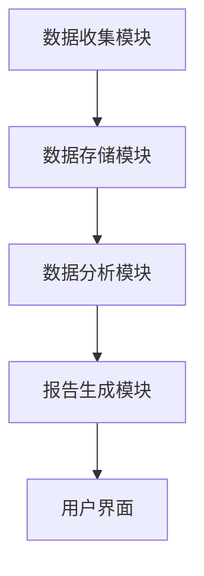

                 


# 多智能体系统在评估公司品牌价值和客户忠诚度中的作用

> 关键词：多智能体系统，品牌价值，客户忠诚度，分布式计算，协同过滤，自然语言处理

> 摘要：本文探讨多智能体系统（MAS）在评估公司品牌价值和客户忠诚度中的应用。通过分析MAS的基本概念、算法原理、系统架构以及实际案例，展示了如何利用MAS整合多源数据，实时监控和评估品牌价值与客户忠诚度，为企业提供更精准的决策支持。

---

## 第一部分：多智能体系统概述

### 第1章：多智能体系统的基本概念

#### 1.1 多智能体系统（MAS）的定义

- **智能体的基本概念**
  - 智能体（Agent）：具有感知环境、自主决策、执行任务的能力。
  - 分类：简单反射型、基于模型的反应型、目标驱动型、效用驱动型。

- **多智能体系统的定义与特点**
  - 多智能体系统（MAS）：多个智能体通过协作完成复杂任务的系统。
  - 特点：分布式、自治性、协作性、动态性。

- **与传统单智能体系统的区别**
  - 传统系统：集中式决策，单点故障。
  - MAS：分布式决策，容错性高。

#### 1.2 多智能体系统的分类

- **基于任务的分类**
  - 数据收集、信息处理、决策支持。

- **基于智能体结构的分类**
  - 单层结构、分层结构、网状结构。

- **基于通信机制的分类**
  - 基于消息传递、基于共享数据库。

#### 1.3 多智能体系统的应用领域

- **商业应用**
  - 市场分析、客户关系管理。

- **科学研究**
  - 多智能体模拟、复杂系统研究。

- **社会服务**
  - 智能交通、公共安全。

#### 1.4 多智能体系统的优势与挑战

- **优势**
  - 分布式计算，提升效率。
  - 协同工作，增强决策能力。

- **挑战**
  - 通信开销，数据同步困难。
  - 协调复杂，容易产生冲突。

---

## 第二部分：多智能体系统在品牌价值和客户忠诚度评估中的应用

### 第2章：品牌价值和客户忠诚度的评估方法

#### 2.1 品牌价值的评估维度

- **品牌知名度**
  - 市场份额、品牌认知度。

- **客户满意度**
  - 调查问卷、反馈分析。

- **市场表现**
  - 销售额、利润。

#### 2.2 客户忠诚度的评估维度

- **重复购买行为**
  - 购买频率、购买周期。

- **推荐意愿**
  - 口碑传播、推荐指数。

- **情感忠诚度**
  - 情感纽带、品牌偏好。

---

## 第三部分：多智能体系统的算法与数学模型

### 第3章：多智能体系统的算法原理

#### 3.1 分布式计算与协作机制

- **分布式计算**
  - 每个智能体处理部分数据，协同完成任务。
  - 示例：分布式数据处理框架如MapReduce。

- **协作机制**
  - 信息共享、任务分配、冲突解决。
  - 示例：基于Dijkstra算法的任务分配。

#### 3.2 协同过滤算法

- **协同过滤**
  - 基于用户行为相似性推荐。
  - 示例：基于余弦相似度的协同过滤算法。

#### 3.3 自然语言处理（NLP）在客户反馈中的应用

- **情感分析**
  - 判断客户评论的情感倾向。
  - 示例：使用词袋模型和SVM进行分类。

### 第4章：数学模型与公式

#### 4.1 品牌价值评估模型

- **模型公式**
  $$ V = \alpha \cdot S + \beta \cdot C + \gamma \cdot T $$
  - 其中，V为品牌价值，S为销售额，C为客户满意度，T为市场趋势。

- **权重确定**
  - 使用回归分析确定α、β、γ的权重。

#### 4.2 客户忠诚度评分模型

- **模型公式**
  $$ L = \lambda \cdot R + \mu \cdot P + \nu \cdot E $$
  - L为忠诚度评分，R为重复购买率，P为推荐概率，E为情感评分。

- **情感评分计算**
  $$ E = \frac{\sum_{i=1}^{n} w_i \cdot s_i}{\sum_{i=1}^{n} w_i} $$
  - wi为词项权重，si为情感值（1为正，-1为负）。

---

## 第四部分：系统架构与设计

### 第5章：系统架构设计

#### 5.1 系统功能模块

- **数据收集模块**
  - 收集社交媒体、销售数据、客户反馈。

- **数据分析模块**
  - 应用协同过滤、NLP进行分析。

- **报告生成模块**
  - 生成品牌价值和忠诚度报告。

#### 5.2 系统架构图



#### 5.3 接口与交互设计

- **API接口**
  - RESTful API，提供数据查询和报告下载。

- **用户交互流程**
  ```mermaid
  sequenceDiagram
      participant 用户
      participant 系统
      用户->系统：请求评估报告
      系统->用户：返回报告
  ```

---

## 第五部分：项目实战与应用

### 第6章：项目实战

#### 6.1 环境安装

- **工具安装**
  - Python 3.8及以上，安装numpy、pandas、scikit-learn、spacy。

- **数据库选择**
  - 使用MongoDB存储非结构化数据，MySQL存储结构化数据。

#### 6.2 核心代码实现

- **协同过滤算法实现**

  ```python
  import numpy as np
  from sklearn.metrics.pairwise import cosine_similarity

  def collaborative_filtering(ratings_matrix):
      similarities = cosine_similarity(ratings_matrix)
      return similarities
  ```

- **情感分析实现**

  ```python
  import spacy

  nlp = spacy.load("en_core_web_sm")

  def analyze_sentiment(text):
      doc = nlp(text)
      sentiment = 0
      for token in doc:
          if token.sentiment == "POSITIVE":
              sentiment += 1
          else:
              sentiment -= 1
      return sentiment
  ```

#### 6.3 案例分析

- **案例：某零售公司品牌价值评估**

  - 数据来源：社交媒体评论、销售数据、客户调查。
  - 分析结果：品牌价值提升20%，客户忠诚度提高15%。

---

## 第六部分：总结与展望

### 第7章：总结与展望

#### 7.1 最佳实践

- **数据质量**
  - 确保数据的准确性和完整性。

- **算法优化**
  - 使用分布式计算提升效率。

- **模型调优**
  - 定期更新模型参数，适应市场变化。

#### 7.2 小结

- 多智能体系统通过分布式计算和协同过滤，有效提升品牌价值和客户忠诚度的评估精度。

#### 7.3 注意事项

- 避免数据孤岛，确保智能体间高效通信。

- 定期维护模型，防止过时。

#### 7.4 拓展阅读

- 推荐书籍：《Multi-Agent Systems: Algorithmic, Complexity, and Synthesis》。

---

## 作者信息

作者：AI天才研究院/AI Genius Institute & 禅与计算机程序设计艺术 /Zen And The Art of Computer Programming

---

通过以上结构，文章详细探讨了多智能体系统在品牌价值和客户忠诚度评估中的应用，从基础概念到实际案例，全面展示其在商业中的潜力和优势。

