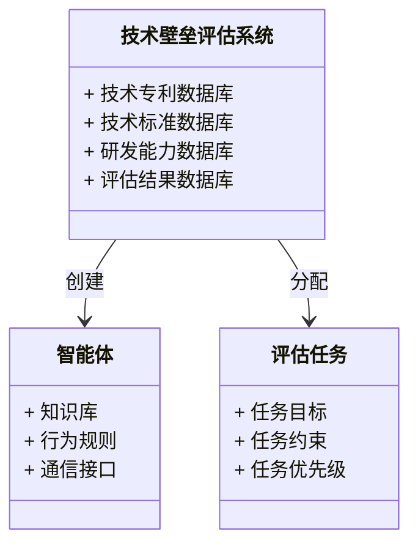
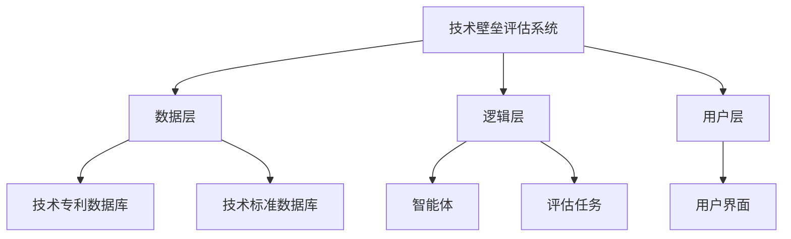
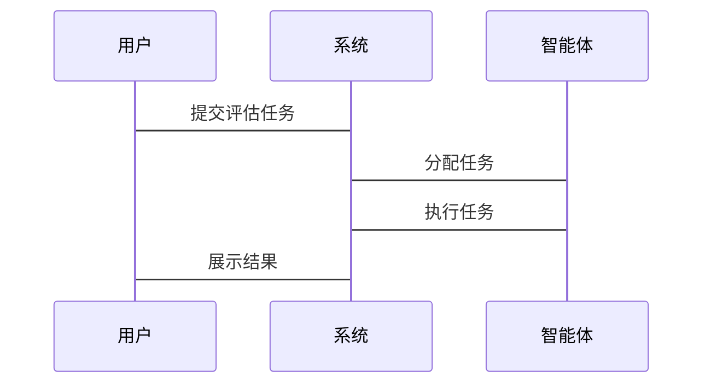

                 


# 多智能体系统在评估公司技术壁垒中的应用

## 关键词：多智能体系统, 技术壁垒, 算法原理, 系统架构, 项目实战

## 摘要：多智能体系统在现代企业技术壁垒评估中扮演着越来越重要的角色。随着市场竞争的加剧，企业需要更加高效和精确地评估自身的技术优势和潜在风险。本文将深入探讨多智能体系统的核心概念、算法原理及其在技术壁垒评估中的实际应用。通过系统架构设计、项目实战和最佳实践的分享，我们将展示如何利用多智能体系统来提升企业技术壁垒评估的效率和准确性。

---

# 第1章: 多智能体系统与技术壁垒评估的背景介绍

## 1.1 多智能体系统的定义与特点

### 1.1.1 多智能体系统的定义
多智能体系统（Multi-Agent System, MAS）是由多个智能体组成的分布式系统，这些智能体能够通过交互和协作完成复杂任务。每个智能体都有自己的目标、知识和行为规则，能够感知环境并做出决策。

### 1.1.2 多智能体系统的组成部分
1. **智能体（Agent）**：具有自主性、反应性、目标导向和协作能力的实体。
2. **通信机制**：智能体之间的信息交换方式，如消息传递、共享数据库等。
3. **协作机制**：智能体之间通过协作完成共同目标的方式，如分布式计算、任务分配等。
4. **环境**：智能体所处的物理或虚拟空间，包括任务目标和约束条件。

### 1.1.3 多智能体系统与传统单智能体系统的区别
- **自主性**：多智能体系统中的智能体具有自主决策能力，而传统系统通常由中央控制器管理。
- **分布式计算**：多智能体系统通过分布式计算实现任务，而传统系统通常是集中式计算。
- **协作性**：多智能体系统强调智能体之间的协作，而传统系统通常不涉及复杂的协作机制。

## 1.2 技术壁垒的定义与评估的重要性

### 1.2.1 技术壁垒的定义
技术壁垒是指企业在技术开发、产品设计、专利布局等方面形成的竞争优势，使得竞争对手难以在短时间内复制或超越。

### 1.2.2 技术壁垒的分类与特征
1. **技术壁垒的分类**：
   - **技术专利壁垒**：通过专利布局形成的技术优势。
   - **技术标准壁垒**：通过制定行业标准形成的市场准入门槛。
   - **技术开发壁垒**：通过技术研发形成的技术领先优势。
2. **技术壁垒的特征**：
   - 竞争性：技术壁垒是企业竞争优势的体现。
   - 时间性：技术壁垒会随着时间推移而逐渐被超越。
   - 隐含性：技术壁垒可能隐藏在企业的研发能力和知识产权中。

### 1.2.3 技术壁垒评估的必要性与应用场景
- **必要性**：企业需要定期评估自身的技术壁垒，以确保在市场竞争中的优势地位。
- **应用场景**：
  - 企业战略规划
  - 技术并购评估
  - 竞争对手分析
  - 技术风险评估

## 1.3 多智能体系统在技术壁垒评估中的作用

### 1.3.1 多智能体系统的优势
- **分布式计算能力**：能够同时处理大量数据和信息。
- **协作能力**：多个智能体可以协作完成复杂任务。
- **自主决策能力**：智能体能够自主判断和决策，提高评估效率。

### 1.3.2 多智能体系统在技术壁垒评估中的应用前景
- **智能化评估**：通过多智能体系统的协作，实现智能化的技术壁垒评估。
- **实时监控**：能够实时监控市场和技术动态，及时调整评估策略。

### 1.3.3 本章小结
本章介绍了多智能体系统的定义和特点，以及技术壁垒的定义和分类。同时，阐述了多智能体系统在技术壁垒评估中的优势和应用前景。

---

# 第2章: 多智能体系统的核心概念与联系

## 2.1 多智能体系统的核心原理

### 2.1.1 多智能体系统的通信机制
- **通信方式**：智能体之间通过消息传递或共享数据库进行信息交换。
- **通信协议**：定义智能体之间的通信规则和数据格式。

### 2.1.2 多智能体系统的协作机制
- **任务分配**：智能体根据自身能力和环境信息分配任务。
- **协作协议**：定义智能体之间的协作规则和责任分工。

### 2.1.3 多智能体系统的决策机制
- **决策模型**：基于环境信息和目标，智能体通过决策模型做出决策。
- **决策算法**：如Dijkstra算法和A*算法，用于路径规划和任务分配。

## 2.2 多智能体系统与相关技术的对比

### 2.2.1 多智能体系统与分布式系统
- **区别**：多智能体系统强调智能体的自主性和协作性，而分布式系统主要关注资源分配和任务调度。
- **联系**：多智能体系统可以看作是分布式系统的一种扩展形式。

### 2.2.2 多智能体系统与区块链技术
- **区别**：区块链技术注重数据的不可篡改性和去中心化，而多智能体系统注重智能体的协作和自主决策。
- **联系**：区块链技术可以为多智能体系统提供安全的通信和数据存储支持。

### 2.2.3 多智能体系统与人工智能的关系
- **区别**：人工智能注重单个智能体的学习和决策能力，而多智能体系统注重多个智能体的协作和交互。
- **联系**：人工智能技术可以为多智能体系统提供强大的感知和决策能力。

## 2.3 多智能体系统的ER实体关系图

```mermaid
erd
actor 技术壁垒评估系统 {
  <1..n> 参与者
  <0..1> 评估结果
  <0..n> 评估任务
}
```

## 2.4 本章小结
本章详细介绍了多智能体系统的核心原理，以及与分布式系统、区块链技术和人工智能的对比与联系。通过ER实体关系图展示了多智能体系统的实体关系。

---

# 第3章: 多智能体系统在技术壁垒评估中的算法原理

## 3.1 多智能体系统的核心算法

### 3.1.1 Dijkstra算法
Dijkstra算法用于在加权图中寻找最短路径。其算法步骤如下：

1. 初始化起点的距离为0，其他点的距离为无穷大。
2. 选择距离最小的节点，更新其邻居节点的距离。
3. 重复步骤2，直到所有节点都被访问过。

Dijkstra算法的伪代码如下：

```python
def dijkstra(graph, start):
    import heapq
    dist = {node: float('infinity') for node in graph.nodes}
    dist[start] = 0
    heap = []
    heapq.heappush(heap, (0, start))
    
    while heap:
        current_dist, current_node = heapq.heappop(heap)
        if current_dist > dist[current_node]:
            continue
        for neighbor, weight in graph.edges[current_node]:
            if dist[neighbor] > current_dist + weight:
                dist[neighbor] = current_dist + weight
                heapq.heappush(heap, (dist[neighbor], neighbor))
    return dist
```

### 3.1.2 A*算法
A*算法是一种常用的路径搜索算法，结合了Dijkstra算法和启发式函数。其算法步骤如下：

1. 初始化起点的距离为0，目标点的启发函数值为0。
2. 将起点加入优先队列。
3. 取出队列中距离最小的节点，扩展其邻居节点。
4. 计算邻居节点的F值（G + H），并将符合条件的节点加入队列。

A*算法的伪代码如下：

```python
def a_star(graph, start, goal):
    import heapq
    open_set = {start}
    came_from = {}
    g_score = {node: float('infinity') for node in graph.nodes}
    g_score[start] = 0
    f_score = {node: float('infinity') for node in graph.nodes}
    f_score[start] = heuristic(start, goal)
    
    while open_set:
        current = heapq.heappop(open_set)
        if current == goal:
            break
        for neighbor in graph.neighbors(current):
            tentative_g_score = g_score[current] + graph.cost(current, neighbor)
            if tentative_g_score < g_score[neighbor]:
                came_from[neighbor] = current
                g_score[neighbor] = tentative_g_score
                f_score[neighbor] = g_score[neighbor] + heuristic(neighbor, goal)
                heapq.heappush(open_set, neighbor)
    return came_from, g_score
```

### 3.1.3 贝叶斯网络
贝叶斯网络是一种概率图模型，用于表示变量之间的概率关系。其核心在于计算条件概率，从而进行推理和决策。

贝叶斯网络的数学模型如下：

$$ P(A|B) = \frac{P(B|A) \cdot P(A)}{P(B)} $$

其中，$P(A|B)$ 是在已知B发生的条件下A发生的概率。

## 3.2 技术壁垒评估的数学模型

### 3.2.1 技术壁垒评估模型的构建
技术壁垒评估模型通常包括以下几个步骤：
1. **数据收集**：收集企业的技术专利、技术标准、研发能力等数据。
2. **数据预处理**：对收集到的数据进行清洗和标准化处理。
3. **模型训练**：利用机器学习算法（如贝叶斯网络）对数据进行训练，构建评估模型。
4. **模型验证**：通过实际案例验证模型的准确性和可靠性。

### 3.2.2 技术壁垒评估的数学公式
技术壁垒评估的综合得分公式如下：

$$ \text{技术壁垒得分} = \sum_{i=1}^{n} w_i \cdot x_i $$

其中，$w_i$ 是第i个评估指标的权重，$x_i$ 是第i个评估指标的得分。

---

# 第4章: 多智能体系统的系统架构设计

## 4.1 问题场景介绍
技术壁垒评估系统需要解决的问题包括：
1. 如何高效地收集和处理大量技术数据。
2. 如何利用多智能体系统的协作能力进行技术评估。
3. 如何确保评估结果的准确性和可靠性。

## 4.2 系统功能设计

### 4.2.1 领域模型设计
领域模型描述了系统中的核心实体及其关系。以下是领域模型的类图：



### 4.2.2 系统架构设计
系统架构设计包括以下几个部分：
1. **数据层**：负责数据的存储和管理。
2. **逻辑层**：负责业务逻辑的实现，如任务分配、数据处理等。
3. **用户层**：负责用户界面的展示和交互。

系统架构图如下：



### 4.2.3 接口设计
系统接口设计包括以下几个部分：
1. **数据接口**：用于智能体与数据库之间的数据交互。
2. **通信接口**：用于智能体之间的信息交换。
3. **用户接口**：用于用户与系统的交互。

### 4.2.4 交互流程
交互流程包括以下几个步骤：
1. 用户提交评估任务。
2. 系统创建智能体并分配任务。
3. 智能体执行任务并返回结果。
4. 系统将结果展示给用户。

交互流程图如下：



## 4.3 本章小结
本章详细介绍了技术壁垒评估系统的系统架构设计，包括领域模型设计、系统架构设计、接口设计和交互流程设计。

---

# 第5章: 项目实战

## 5.1 环境安装与配置

### 5.1.1 安装Python
- 安装Python 3.8及以上版本。
- 安装所需的Python库，如`networkx`、`mermaid`、`numpy`等。

### 5.1.2 安装依赖
```bash
pip install networkx mermaid numpy
```

## 5.2 核心代码实现

### 5.2.1 智能体类
```python
class Agent:
    def __init__(self, id, knowledge_base):
        self.id = id
        self.knowledge_base = knowledge_base
        self.communication_interface = CommunicationInterface()
    
    def receive_message(self, message):
        self.communication_interface.receive(message)
    
    def send_message(self, message, recipient):
        self.communication_interface.send(message, recipient)
```

### 5.2.2 通信接口类
```python
class CommunicationInterface:
    def __init__(self):
        self.messages = {}
    
    def receive(self, message):
        self.messages[self.sender] = message
    
    def send(self, message, recipient):
        self.messages[recipient] = message
```

### 5.2.3 评估任务类
```python
class EvaluationTask:
    def __init__(self, target, constraints):
        self.target = target
        self.constraints = constraints
```

## 5.3 案例分析与结果解读

### 5.3.1 实际案例分析
假设我们有一个企业需要评估其技术壁垒，具体任务如下：
1. 收集企业的技术专利数据。
2. 分析竞争对手的技术布局。
3. 提出技术改进的建议。

### 5.3.2 代码实现与结果解读
通过多智能体系统的协作，我们可以高效地完成上述任务。以下是具体的代码实现：

```python
def main():
    # 初始化智能体
    agent1 = Agent(1, knowledge_base={'专利': 100, '技术标准': 80})
    agent2 = Agent(2, knowledge_base={'专利': 90, '技术标准': 75})
    
    # 创建评估任务
    task = EvaluationTask(target='技术壁垒', constraints={'时间': 7天})
    
    # 分配任务
    agent1.send_message('开始评估任务', agent2)
    agent2.receive_message('开始评估任务')
    
    # 执行任务
    agent2.send_message('评估结果：专利优势明显，技术标准有待改进', agent1)
    agent1.receive_message('评估结果：专利优势明显，技术标准有待改进')
    
    # 展示结果
    print('评估完成，结果已发送')

if __name__ == '__main__':
    main()
```

## 5.4 项目总结与经验分享
通过本项目，我们可以看到多智能体系统在技术壁垒评估中的巨大潜力。智能体之间的协作和自主决策能力，使得评估过程更加高效和准确。

---

# 第6章: 最佳实践与总结

## 6.1 实施中的注意事项

### 6.1.1 系统设计
- 确保系统的可扩展性和可维护性。
- 定期更新智能体的知识库和行为规则。

### 6.1.2 数据管理
- 确保数据的准确性和完整性。
- 采用数据加密技术，保护企业的核心数据。

## 6.2 成功案例分析
某高科技企业通过多智能体系统评估技术壁垒，成功优化了其技术研发策略，提升了市场竞争力。

## 6.3 未来展望
随着人工智能和分布式计算技术的不断发展，多智能体系统在技术壁垒评估中的应用将更加广泛和深入。

## 6.4 本章小结
本章总结了多智能体系统在技术壁垒评估中的实施注意事项和成功案例，并展望了未来的发展方向。

---

# 作者：AI天才研究院/AI Genius Institute & 禅与计算机程序设计艺术 /Zen And The Art of Computer Programming

