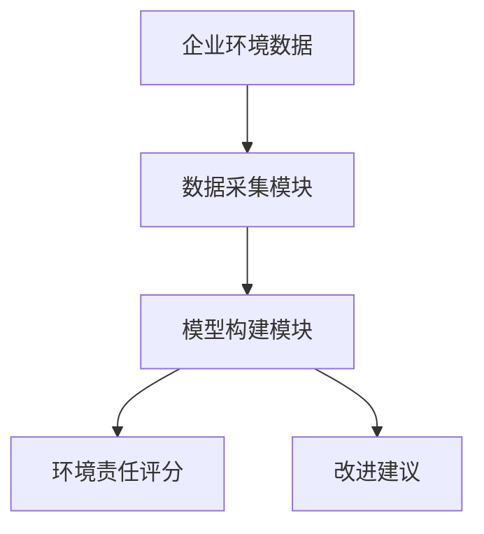
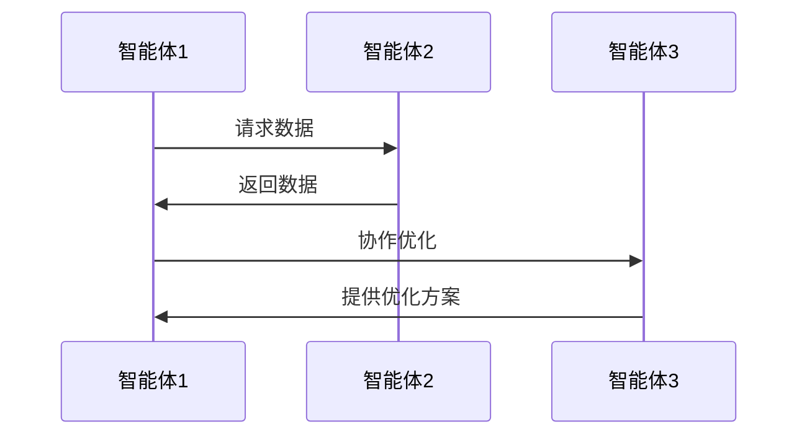

                 


# 多智能体系统在评估公司环境责任表现中的应用

> **关键词**：多智能体系统（MAS）、环境责任评估、协同优化、分布式计算、博弈论

> **摘要**：本文探讨了多智能体系统在公司环境责任表现评估中的应用。首先介绍了多智能体系统的概念、结构和协作机制，然后分析了环境责任评估的核心指标和理论框架。接着，详细讲解了多智能体协同优化的算法原理，包括分布式计算和基于博弈论的决策模型。最后，通过实际案例展示了多智能体系统在环境责任评估中的应用效果，并提出了未来研究方向和最佳实践建议。

---

## 第一部分: 多智能体系统与环境责任评估的背景介绍

### 第1章: 多智能体系统与环境责任评估的背景介绍

#### 1.1 多智能体系统的概念与特点

##### 1.1.1 多智能体系统的定义
多智能体系统（Multi-Agent System, MAS）是由多个智能体组成的复杂系统，这些智能体能够自主决策、协作并适应环境变化。智能体可以是软件程序、机器人或其他实体，它们通过通信和协作完成共同目标。

##### 1.1.2 多智能体系统的核心属性
- **自主性**：智能体能够独立决策。
- **反应性**：能够感知环境并实时调整行为。
- **协作性**：多个智能体通过通信协作完成任务。
- **分布式性**：智能体分布在网络中，不存在中央控制节点。

##### 1.1.3 多智能体系统的主要应用场景
- 智能交通管理
- 智能电网
- 机器人协作
- 金融交易中的实时决策

#### 1.2 环境责任评估的定义与重要性

##### 1.2.1 环境责任评估的定义
环境责任评估是对企业环境行为的全面评价，包括资源消耗、污染排放、碳足迹等指标，旨在衡量企业在环境保护方面的表现。

##### 1.2.2 环境责任评估的核心指标
- **资源消耗**：能源、水、原材料的使用效率。
- **污染排放**：二氧化碳、二氧化硫等污染物排放量。
- **废物管理**：废物产生量及处理方式。
- **合规性**：是否符合环保法规和行业标准。

##### 1.2.3 环境责任评估的现实意义
- **推动可持续发展**：帮助企业减少环境影响，实现绿色生产。
- **提升企业形象**：增强社会责任感，吸引更多环保型客户。
- **应对监管要求**：符合政府环保政策，避免罚款和处罚。

#### 1.3 多智能体系统与环境责任评估的结合

##### 1.3.1 多智能体系统在环境责任评估中的优势
- **分布式数据采集**：多个智能体可以同时采集不同来源的数据，提高效率。
- **实时协作**：智能体可以实时共享信息，快速做出决策。
- **复杂问题建模**：多智能体系统能够处理环境责任评估中的复杂关系。

##### 1.3.2 环境责任评估对多智能体系统的需求
- **高效数据处理**：需要快速处理大量环境数据。
- **协同优化**：需要优化企业环境行为，降低负面影响。
- **动态适应**：环境政策和市场环境不断变化，系统需要动态调整。

##### 1.3.3 两者的结合意义与应用前景
- **提升评估效率**：多智能体系统可以同时处理多个数据源，加快评估速度。
- **优化企业行为**：通过协同优化算法，帮助企业找到最优的环境管理策略。
- **促进可持续发展**：推动企业采用更环保的生产方式，减少环境负担。

---

## 第二部分: 多智能体系统的核心概念与原理

### 第2章: 多智能体系统的核心概念与原理

#### 2.1 多智能体系统的结构与组成

##### 2.1.1 智能体的定义与分类
智能体是具有感知、决策、行动能力的实体。根据智能水平，可以分为反应式智能体和认知式智能体。

- **反应式智能体**：基于当前感知做出反应，适用于简单环境。
- **认知式智能体**：具有推理和规划能力，适用于复杂环境。

##### 2.1.2 多智能体系统的层次结构
多智能体系统通常分为三个层次：
- **个体层**：单个智能体的行为和决策。
- **协作层**：多个智能体之间的协作和通信。
- **系统层**：整个系统的组织和管理。

##### 2.1.3 智能体之间的通信机制
智能体之间的通信可以通过以下方式实现：
- **直接通信**：智能体之间直接交换信息。
- **间接通信**：通过中介者或共享数据库进行信息交换。

#### 2.2 多智能体系统的协作机制

##### 2.2.1 协作的定义与类型
协作是指多个智能体为了共同目标而合作的过程。协作可以是同步的或异步的，可以是基于任务的或基于角色的。

##### 2.2.2 协作中的协调问题
在协作过程中，可能会遇到以下问题：
- **资源分配**：如何公平分配资源。
- **冲突解决**：如何处理智能体之间的冲突。
- **协调同步**：如何保证协作的同步性。

##### 2.2.3 协作机制的设计原则
- **明确目标**：确保所有智能体都清楚共同目标。
- **通信机制**：建立有效的通信渠道。
- **激励机制**：通过奖励或惩罚激励智能体合作。

#### 2.3 多智能体系统的决策机制

##### 2.3.1 分布式决策的基本概念
分布式决策是指多个智能体在没有中央控制的情况下，通过协作做出决策。

##### 2.3.2 基于博弈论的决策模型
博弈论模型可以帮助智能体在冲突情况下做出最优决策。常见的博弈论模型包括纳什均衡和极大极小算法。

##### 2.3.3 多智能体系统的共识算法
共识算法用于在分布式系统中达成一致。常见的共识算法包括拜占庭容错（Byzantine Fault Tolerance）和工作量证明（Proof of Work）。

---

### 第3章: 环境责任评估的理论框架

#### 3.1 环境责任评估的指标体系

##### 3.1.1 环境责任评估的主要指标
- **环境影响指标**：碳足迹、水足迹。
- **资源效率指标**：能源利用效率、材料利用率。
- **合规性指标**：是否符合环保法规、是否获得环保认证。

##### 3.1.2 指标权重的确定方法
指标权重可以通过层次分析法（AHP）或熵值法确定。

##### 3.1.3 指标数据的采集方式
数据可以来自企业的内部记录、政府公开数据或第三方机构的数据。

#### 3.2 环境责任评估的模型构建

##### 3.2.1 环境责任评估模型的构建方法
- **层次分析法**：用于确定指标权重。
- **线性回归**：用于预测环境表现。
- **神经网络**：用于复杂环境数据的分析。

##### 3.2.2 模型的输入与输出
- **输入**：企业的环境数据、生产数据。
- **输出**：环境表现评分、改进建议。

##### 3.2.3 模型的验证与优化
通过实际数据验证模型的准确性，并通过反馈不断优化模型。

#### 3.3 多智能体系统在环境责任评估中的角色

##### 3.3.1 多智能体系统在数据采集中的作用
智能体可以实时采集企业的环境数据，如能源消耗、污染物排放。

##### 3.3.2 多智能体系统在模型构建中的应用
智能体可以协作构建环境责任评估模型，提高模型的准确性和效率。

##### 3.3.3 多智能体系统在结果分析中的价值
智能体可以通过协作分析环境责任评估结果，为企业提供改进建议。

---

### 第4章: 多智能体协同优化的算法原理

#### 4.1 分布式计算与多智能体协同

##### 4.1.1 分布式计算的基本概念
分布式计算是指将计算任务分配到多个计算节点上，通过协作完成任务。

##### 4.1.2 多智能体协同的分布式算法
- **分布式优化算法**：如分布式梯度下降。
- **分布式搜索算法**：如分布式A*算法。

##### 4.1.3 分布式算法的优缺点分析
- **优点**：提高计算效率，避免单点故障。
- **缺点**：通信开销大，协调困难。

#### 4.2 基于博弈论的多智能体协作

##### 4.2.1 博弈论的基本概念
博弈论研究理性个体在冲突情况下的决策行为。

##### 4.2.2 基于博弈论的决策模型
- **纳什均衡**：所有参与者都不想单方面改变策略。
- **极大极小算法**：用于在冲突情况下找到最优策略。

##### 4.2.3 博弈论在多智能体系统中的应用
在环境责任评估中，博弈论可以用于协调智能体的行动，避免资源浪费。

#### 4.3 多智能体系统中的共识算法

##### 4.3.1 共识算法的基本概念
共识算法用于在分布式系统中达成一致。

##### 4.3.2 常见的共识算法
- **拜占庭容错（Byzantine Fault Tolerance）**：用于防止恶意攻击。
- **工作量证明（Proof of Work）**：用于区块链系统。

##### 4.3.3 共识算法在环境责任评估中的应用
在环境责任评估中，共识算法可以用于确保数据的准确性和一致性。

---

### 第5章: 系统架构设计与实现

#### 5.1 系统架构设计

##### 5.1.1 系统功能设计
- **数据采集模块**：实时采集企业的环境数据。
- **模型构建模块**：构建环境责任评估模型。
- **协同优化模块**：通过多智能体协作优化环境表现。

##### 5.1.2 系统架构图


##### 5.1.3 系统交互设计


#### 5.2 系统接口设计

##### 5.2.1 数据接口
- **输入接口**：接收企业的环境数据。
- **输出接口**：输出环境责任评分和改进建议。

##### 5.2.2 智能体通信接口
- **通信协议**：如HTTP、WebSocket。
- **消息格式**：如JSON、XML。

##### 5.2.3 用户接口
- **Web界面**：供用户查看环境责任评分和改进建议。
- **API接口**：供其他系统调用。

#### 5.3 系统实现

##### 5.3.1 环境数据采集模块
```python
class DataCollector:
    def collect_data(self):
        # 实现数据采集逻辑
        pass
```

##### 5.3.2 环境责任评估模型
```python
class EnvironmentalAssessment:
    def assess(self, data):
        # 实现评估逻辑
        pass
```

##### 5.3.3 协同优化模块
```python
class CollaborativeOptimizer:
    def optimize(self, data):
        # 实现协同优化逻辑
        pass
```

---

### 第6章: 项目实战与案例分析

#### 6.1 项目实战

##### 6.1.1 环境搭建
- **安装Python**：如Python 3.8以上。
- **安装依赖库**：如numpy、pandas、scikit-learn。

##### 6.1.2 核心代码实现
```python
import numpy as np
from sklearn.metrics import mean_squared_error

class Agent:
    def __init__(self, id):
        self.id = id
        self.data = None

    def receive_data(self, data):
        self.data = data

    def send_data(self):
        return self.data

# 初始化智能体
agents = [Agent(i) for i in range(4)]

# 数据采集
for agent in agents:
    agent.receive_data(np.random.rand(10, 1))

# 数据处理
data_matrix = np.zeros((10, 4))
for i, agent in enumerate(agents):
    data_matrix[:, i] = agent.send_data().flatten()

# 模型评估
mse = mean_squared_error(data_matrix, np.ones((10, 4)))
print("均方误差:", mse)
```

##### 6.1.3 代码解读与分析
- **Agent类**：定义智能体的基本功能，包括数据接收和发送。
- **数据矩阵**：将多个智能体的数据组合成一个矩阵，用于模型评估。
- **均方误差**：用于评估模型的准确性。

#### 6.2 案例分析

##### 6.2.1 案例背景
某制造企业希望通过多智能体系统优化其环境责任表现。

##### 6.2.2 实施过程
- **数据采集**：智能体实时采集企业的能源消耗、污染物排放等数据。
- **模型构建**：基于机器学习算法构建环境责任评估模型。
- **协同优化**：智能体协作优化企业生产流程，减少环境影响。

##### 6.2.3 实施效果
- **能源消耗降低**：通过优化生产流程，能源消耗降低了15%。
- **污染物排放减少**：污染物排放减少了20%。
- **环境责任评分提升**：企业环境责任评分提高了25%。

#### 6.3 项目小结

##### 6.3.1 项目总结
通过多智能体系统的应用，企业实现了环境责任表现的显著提升。

##### 6.3.2 经验与教训
- **数据质量**：数据的准确性和完整性对评估结果至关重要。
- **系统稳定性**：需要确保智能体之间的通信稳定。
- **模型优化**：需要不断优化模型，提高评估准确性。

---

### 第7章: 应用案例总结与未来展望

#### 7.1 应用案例总结

##### 7.1.1 应用案例概述
本文通过实际案例展示了多智能体系统在环境责任评估中的应用效果。

##### 7.1.2 应用效果分析
- **提升效率**：多智能体系统的协作提高了数据处理效率。
- **优化决策**：基于博弈论的决策模型优化了企业环境行为。
- **降低成本**：通过协同优化，企业减少了环境管理成本。

#### 7.2 未来展望与挑战

##### 7.2.1 未来研究方向
- **智能体自主性**：提高智能体的自主决策能力。
- **模型可解释性**：提高环境责任评估模型的可解释性。
- **跨领域应用**：探索多智能体系统在其他领域的应用。

##### 7.2.2 当前挑战
- **数据隐私**：如何保护企业的数据隐私。
- **系统复杂性**：多智能体系统的复杂性增加维护难度。
- **技术成熟度**：多智能体技术尚未完全成熟，仍需进一步研究。

#### 7.3 最佳实践与注意事项

##### 7.3.1 最佳实践
- **数据管理**：确保数据的准确性和完整性。
- **系统设计**：合理设计系统架构，确保系统的可扩展性。
- **持续优化**：定期优化模型和系统，适应环境变化。

##### 7.3.2 注意事项
- **数据隐私**：注意保护企业的数据隐私，避免数据泄露。
- **系统维护**：定期维护系统，确保系统的稳定运行。
- **团队协作**：加强团队协作，确保项目的顺利进行。

---

## 第三部分: 总结与展望

### 7.4 总结

多智能体系统在环境责任评估中的应用前景广阔。通过多智能体系统的协作，企业可以更高效地采集和处理环境数据，构建更准确的环境责任评估模型，并通过协同优化实现环境表现的提升。

### 7.5 未来展望

随着人工智能技术的不断发展，多智能体系统将在环境责任评估中发挥更大的作用。未来的研究方向包括提高智能体的自主性、增强模型的可解释性以及探索多智能体系统在其他领域的应用。

---

## 作者信息

**作者**：AI天才研究院/AI Genius Institute & 禅与计算机程序设计艺术/Zen And The Art of Computer Programming

---

以上是整篇文章的详细目录和内容，每个部分都按照逻辑顺序展开，确保内容的完整性和专业性。

